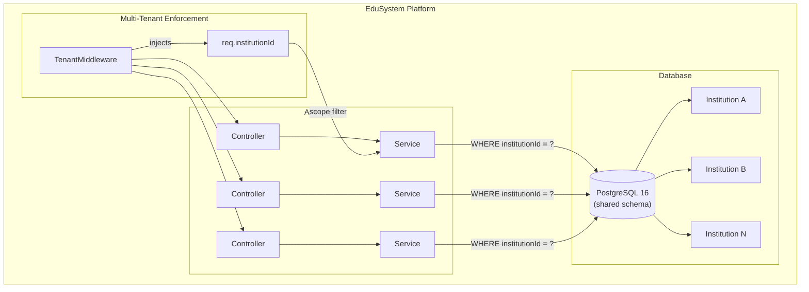
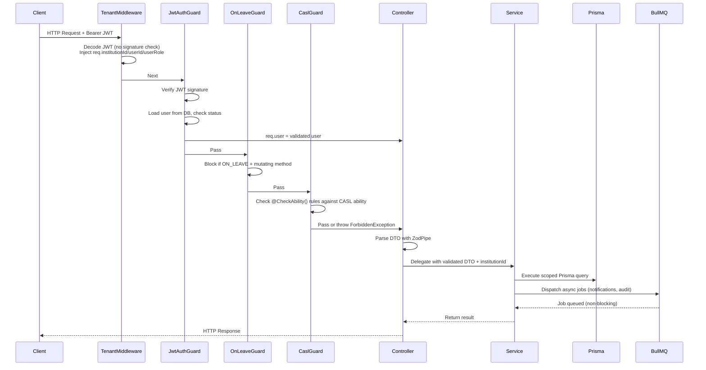

# EduSystem — AI Agent Operational Guide

> **Version:** 1.0
> **Last Updated:** 2026-05-14
> **Classification:** Internal — AI Coding Agents & Engineering Team
> **Purpose:** Primary behavioral and architectural guide for all AI-assisted development within the EduSystem repository.

---

## Table of Contents

1. [Project Overview](#1-project-overview)
2. [Technology Stack](#2-technology-stack)
3. [Repository Structure](#3-repository-structure)
4. [Architectural Principles](#4-architectural-principles)
5. [Backend Development Rules](#5-backend-development-rules)
6. [Frontend Development Rules](#6-frontend-development-rules)
7. [Database & Prisma Rules](#7-database--prisma-rules)
8. [Multi-Tenancy Rules](#8-multi-tenancy-rules)
9. [Authentication & Authorization Rules](#9-authentication--authorization-rules)
10. [Worker & Queue Rules](#10-worker--queue-rules)
11. [API Design Rules](#11-api-design-rules)
12. [Validation Rules](#12-validation-rules)
13. [Error Handling Rules](#13-error-handling-rules)
14. [Security Rules](#14-security-rules)
15. [Performance Rules](#15-performance-rules)
16. [Code Style Rules](#16-code-style-rules)
17. [File Naming Conventions](#17-file-naming-conventions)
18. [Testing Expectations](#18-testing-expectations)
19. [Logging & Observability Rules](#19-logging--observability-rules)
20. [Infrastructure Rules](#20-infrastructure-rules)
21. [AI Agent Behavioral Expectations](#21-ai-agent-behavioral-expectations)
22. [Forbidden Patterns](#22-forbidden-patterns)
23. [Preferred Patterns](#23-preferred-patterns)
24. [Development Workflow](#24-development-workflow)
25. [Pull Request Expectations](#25-pull-request-expectations)
26. [Documentation Rules](#26-documentation-rules)
27. [Scalability Expectations](#27-scalability-expectations)
28. [Future Architecture Considerations](#28-future-architecture-considerations)

---

## 1. Project Overview

### 1.1 What EduSystem Is

EduSystem is a **multi-tenant SaaS educational management platform** serving multiple educational institutions simultaneously. It provides a complete suite of tools for managing student records, academic performance, attendance, disciplinary records (convivencias), announcements, scheduling, and institutional administration.

The platform is structured as a **monorepo** with two independent deployment units:

- **Backend** (`backend/`): NestJS 10 REST API + BullMQ background workers
- **Frontend** (`frontend/`): Next.js 14 admin panel

### 1.2 Multi-Tenancy Model

EduSystem uses a **shared-database, shared-schema** multi-tenant architecture. Every institution (tenant) shares the same PostgreSQL database and Prisma schema. Isolation is enforced exclusively at the application layer through the `institutionId` foreign key — present on every tenant-scoped model.



### 1.3 Dual-Mode Runtime

The backend supports two mutually exclusive runtime modes via the `APP_MODE` environment variable:

| Mode | Container | Purpose |
|------|-----------|---------|
| `api` | `api` service | HTTP REST API — full NestJS module stack including controllers, guards, middleware |
| `worker` | `worker` service | BullMQ job processor — minimal `WorkerAppModule`, no HTTP layer |

This separation ensures that a worker crash does not degrade API availability.

### 1.4 Read These First

Before making any non-trivial change, read the relevant architectural documentation:

| Document | Covers |
|----------|--------|
| `docs/ARCHITECTURE.md` | High-level system design |
| `docs/AUTH.md` | Authentication and authorization deep-dive |
| `docs/DATABASE.md` | Prisma schema, migrations, indexes, soft delete |
| `docs/MULTITENANCY.md` | Tenant scoping, JWT propagation, TenantMiddleware, CASL |
| `docs/INFRASTRUCTURE.md` | Docker Compose, Redis, MinIO, networking, CI/CD |
| `docs/WORKERS.md` | BullMQ topology, processors, retry strategies, idempotency |

AI agents must read the appropriate documentation files before modifying any module that has architectural implications (multi-tenancy, authentication, background processing, database schema).

---

## 2. Technology Stack

### 2.1 Backend

| Layer | Technology | Version | Purpose |
|-------|-----------|---------|---------|
| Runtime | Node.js | Latest LTS | JavaScript runtime |
| Framework | NestJS | 10.x | REST API, DI, modular architecture |
| ORM | Prisma | 5.x | Type-safe database access, migrations |
| Database | PostgreSQL | 16 | Primary data store |
| Job Queue | BullMQ | Latest | Background job processing |
| Cache/Queue Broker | Redis | 7 | BullMQ backend, sessions |
| Auth | JWT (Passport) | — | Stateless authentication |
| Authorization | CASL | Latest | ABAC permission system |
| File Storage | MinIO | — | S3-compatible object storage |
| PDF Generation | Puppeteer | Latest | Server-side PDF rendering |
| Validation | Zod | Latest | Schema validation for DTOs |
| Config | Zod + `ConfigService` | — | Environment variable validation |

### 2.2 Frontend

| Layer | Technology | Version | Purpose |
|-------|-----------|---------|---------|
| Framework | Next.js | 14 | React framework, App Router |
| Auth | NextAuth | v5 | Session management |
| Server State | React Query | Latest | Async state, caching |
| UI State | React `useState` | — | Local UI state (no Zustand) |
| UI Components | shadcn/ui | Latest | Accessible React primitives |
| Styling | Tailwind CSS | Latest | Utility-first CSS |
| Forms | React Hook Form + Zod | Latest | Type-safe form handling |
| HTTP Client | Axios | Latest | REST API calls |
| Toast | sonner | Latest | User notifications |

### 2.3 Infrastructure

| Service | Image/Version | Port | Purpose |
|---------|--------------|------|---------|
| PostgreSQL | `postgres:16-alpine` | 5432 | Primary database |
| Redis | `redis:7-alpine` | 6379 | Queue broker, cache |
| MinIO | `minio/minio` | 9000 (API), 9001 (Console) | Object storage |
| Bull Board | `deadly0/bull-board` | 3001 | Queue monitoring UI |

---

## 3. Repository Structure

### 3.1 Root Structure

```
edusystem/
├── backend/
│   ├── prisma/
│   │   ├── schema.prisma       # Full database schema (42 models, 14 enums)
│   │   ├── migrations/         # Prisma migration history
│   │   └── init.sql            # Partial unique index for SUPER_ADMIN email
│   └── src/
│       ├── main.ts             # Dual-mode bootstrap (api / worker)
│       ├── app.module.ts       # API module registry
│       ├── worker-app.module.ts# Worker module registry (minimal imports)
│       ├── common/             # Shared: decorators, guards, filters, middleware, pipes, utils
│       ├── config/             # Environment schema (Zod)
│       ├── modules/            # Feature modules (27+ modules)
│       ├── prisma/            # Prisma service
│       └── queues/            # BullMQ: constants, module, processors
├── frontend/
│   └── src/
│       ├── app/               # Next.js App Router pages
│       │   ├── admin/        # ADMIN/DIRECTOR/SECRETARY/PRECEPTOR routes
│       │   ├── teacher/      # TEACHER routes
│       │   ├── superadmin/   # SUPER_ADMIN routes
│       │   └── profile/     # Shared profile page
│       ├── components/        # Shared UI components
│       │   ├── layouts/      # AppLayout, navigation, sidebar, header
│       │   └── ui/         # shadcn/ui primitives
│       └── lib/
│           ├── api.ts        # Axios client + interceptors
│           ├── auth.ts       # NextAuth v5 config
│           ├── api/          # React Query hooks per domain
│           ├── hooks/       # Custom hooks (useIsOnLeave, useAppSession)
│           └── helpers/     # Export utilities (CSV, Excel)
├── docs/                     # Architectural documentation
├── docker-compose.yml        # Full stack orchestration
├── .env.example             # All environment variables
└── AGENTS.md                 # This file
```

### 3.2 Backend Module Structure

Each feature module under `modules/` follows an identical pattern:

```
modules/[name]/
├── [name].module.ts          # Module definition
├── [name].controller.ts     # Thin HTTP endpoints
├── [name].service.ts        # Business logic, Prisma queries
└── dto/
    ├── create.[name].dto.ts  # Zod create schema + type
    ├── update.[name].dto.ts  # Zod update schema + type (all optional)
    └── query.[name].dto.ts   # Zod query schema + type (pagination, filters)
```

### 3.3 Frontend Page Structure

Pages with extensive logic are refactored into a dedicated subfolder:

```
src/app/[area]/[page]/
├── page.tsx                  # Global state orchestration (50-90 lines)
└── _components/
    ├── [page].types.ts       # Zod schemas, TypeScript interfaces, constants
    ├── component-1.tsx       # Isolated UI component
    └── component-n.tsx      # Isolated UI component
```

API hooks live in `src/lib/api/[domain].ts` — one file per domain.

---

## 4. Architectural Principles

### 4.1 Core Tenets

1. **Multi-tenancy is non-negotiable.** Every database query touching a tenant-scoped model must include an `institutionId` filter. No exceptions.
2. **Thin controllers, rich services.** Controllers handle routing, guards, and DTO parsing. All business logic lives in services.
3. **Authorization before execution.** Every mutation must pass through CASL authorization (via `@CheckAbility()`) and the `OnLeaveGuard` before executing.
4. **Async for non-critical paths.** Notifications, audit logs, PDF generation, and grade recalculations run via BullMQ. Never block the HTTP response for these operations.
5. **Validation at the boundary.** All incoming DTOs are validated with Zod schemas via `ZodPipe` before reaching the service layer. No unvalidated data enters services.
6. **Explicit typing everywhere.** No `any`. No silent type suppression. All variables, function parameters, and return types must be explicitly typed.
7. **Soft delete is the norm.** Models that represent deletable entities include a `deletedAt DateTime?` field and are filtered in the Prisma middleware.

### 4.2 Request Lifecycle



### 4.3 Role Hierarchy

Roles are strictly ordered from most to least privileged. The effective role is the highest in this hierarchy:

```
SUPER_ADMIN > ADMIN > DIRECTOR > SECRETARY > PRECEPTOR > TEACHER > GUARDIAN
```

- `SUPER_ADMIN`: Platform-wide, no institution scope, full access to all tenants
- `ADMIN`–`GUARDIAN`: Institution-scoped, filtered by `institutionId`
- `getHighestRole()` in `src/common/utils/role-hierarchy.ts` computes the effective role from `User.role` + all `UserLevelRole` entries

### 4.4 Date/Timezone Convention

All dates are stored and processed in **UTC**. For Argentina (UTC-3) display, use:

```typescript
// Display without timezone conversion (no toISOString shift)
const displayDate = date.split('T')[0].split('-').reverse().join('/'); // "2026-05-14" → "14/05/2026"

// Creation (avoid off-by-one from UTC offset)
const utcDate = new Date(Date.UTC(year, month - 1, day, 12, 0, 0));
```

This convention applies to all new code writing dates to the database and all display logic in the frontend.

---

## 5. Backend Development Rules

### 5.1 Module Creation

When creating a new feature module, follow the exact pattern of existing modules (`students`, `grades`, `courses`, etc.):

1. Create `modules/[name]/[name].module.ts`
2. Create `modules/[name]/[name].controller.ts` — thin, delegate everything to service
3. Create `modules/[name]/[name].service.ts` — injectable, inject `PrismaService`
4. Create `modules/[name]/dto/` with Zod schemas
5. Register module in `app.module.ts` (or `worker-app.module.ts` if it has processors)
6. Add `@CheckAbility()` decorators to all endpoints
7. Add `@InstitutionId()` parameter where scoped queries are needed

### 5.2 Controller Rules

Controllers in EduSystem are intentionally minimal. Every controller must follow these rules:

```typescript
// CORRECT: Thin controller pattern
@Controller('students')
@CheckAbility({ action: Action.Read, subject: 'Student' })
export class StudentsController {
  constructor(private readonly studentsService: StudentsService) {}

  @Get()
  findAll(@InstitutionId() institutionId: string) {
    return this.studentsService.findAll(institutionId);
  }

  @Post()
  @CheckAbility({ action: Action.Create, subject: 'Student' })
  create(
    @Body(new ZodPipe(CreateStudentSchema)) dto: CreateStudentDto,
    @InstitutionId() institutionId: string,
  ) {
    return this.studentsService.create(dto, institutionId);
  }
}
```

**Mandatory controller elements:**
- `@CheckAbility()` on every route (or explicitly omitted with a comment justifying it)
- `@InstitutionId()` parameter on all tenant-scoped endpoints
- `ZodPipe` on every `@Body()` for POST/PUT/PATCH
- `@CurrentUser()` parameter when the authenticated user object is needed
- `@Public()` decorator only for truly public routes (invitation acceptance, login, refresh)

### 5.3 Service Rules

Services contain all business logic. Every service must:

- Be `@Injectable()`
- Inject `PrismaService` as the first dependency
- Inject `Queue` references via `@InjectQueue()` when dispatching async jobs
- Always filter by `institutionId` on tenant-scoped Prisma queries
- Dispatch audit and notification jobs after successful mutations
- Use transactions (`prisma.$transaction()`) when a single logical operation writes to multiple models
- Never import or call guards, interceptors, or pipes directly

```typescript
// CORRECT: Service with proper scoping and queue dispatch
@Injectable()
export class GradesService {
  constructor(
    private readonly prisma: PrismaService,
    @InjectQueue(QUEUES.NOTIFICATIONS) private readonly notificationQueue: Queue,
    @InjectQueue(QUEUES.AUDIT) private readonly auditQueue: Queue,
  ) {}

  async upsert(dto: CreateGradeDto, institutionId: string, userId: string) {
    const grade = await this.prisma.grade.upsert({
      where: {
        studentId_courseSubjectId_periodId_type_date: {
          studentId: dto.studentId,
          courseSubjectId: dto.courseSubjectId,
          periodId: dto.periodId,
          type: dto.type,
          date: new Date(Date.UTC(...)),
        },
      },
      create: { ...dto, institutionId },
      update: { score: dto.score, description: dto.description },
    });

    // Async jobs — non-blocking
    await Promise.all([
      this.notificationQueue.add(JOBS.GRADE_CREATED, { gradeId: grade.id, institutionId }, JOB_OPTIONS.DEFAULT),
      this.auditQueue.add(JOBS.AUDIT_LOG, { institutionId, userId, action: 'CREATE', resource: 'Grade', resourceId: grade.id, after: grade }, JOB_OPTIONS.CRITICAL),
    ]);

    return grade;
  }
}
```

### 5.4 DTOs and Validation

All DTOs are Zod schemas with TypeScript types inferred via `z.infer<>`:

```typescript
// CORRECT: Zod-based DTO
export const CreateGradeSchema = z.object({
  studentId:       z.string().uuid(),
  courseSubjectId: z.string().uuid(),
  periodId:        z.string().uuid(),
  score:           z.number().min(0).max(10).multipleOf(0.01),
  type:            z.enum(['EXAM', 'ASSIGNMENT', 'ORAL', 'PROJECT', 'PARTICIPATION']),
  description:     z.string().max(200).optional(),
  date:            z.string().date(),
});
export type CreateGradeDto = z.infer<typeof CreateGradeSchema>;
```

- `ZodPipe` on `@Body()` automatically validates and throws `BadRequestException` on failure
- Never use class-validator decorators (`@IsString()`, `@IsEmail()`, etc.) — use Zod only
- Query DTOs use `z.coerce` for pagination parameters: `z.coerce.number().min(1)`

### 5.5 Guards

Guards are applied in a specific order enforced in `app.module.ts`:

1. `TenantMiddleware` (before guards, injects `req.institutionId`)
2. `APP_GUARD` (`JwtAuthGuard`, global — verifies JWT signature, loads user from DB)
3. `OnLeaveGuard` (global — blocks mutations for `ON_LEAVE` users)
4. Route-level guards (CaslGuard via `@CheckAbility()`)

**Do not create new global guards** without architectural review. Route-level guards are preferred.

### 5.6 Prisma Usage

- Use `PrismaService` (not `PrismaClient` directly)
- Use `prisma.$transaction()` for atomic multi-model writes
- Use `Promise.all()` for parallel independent reads
- Use `upsert` for idempotent operations (grades, etc.)
- Soft-delete models are filtered automatically by the `PrismaService` middleware
- All tenant-scoped queries must include `where: { institutionId }`
- Do not bypass the PrismaService middleware layer

### 5.7 Queue Dispatching

After every successful mutation that requires async side effects:

```typescript
// Correct pattern: dispatch after DB commit
await Promise.all([
  this.notificationQueue.add(JOBS.GRADE_CREATED, { gradeId, institutionId }, JOB_OPTIONS.DEFAULT),
  this.auditQueue.add(JOBS.AUDIT_LOG, { institutionId, userId, action: 'CREATE', resource: 'Grade', resourceId: grade.id, after: grade }, JOB_OPTIONS.CRITICAL),
]);
```

- Always pass `institutionId` in the job payload
- Use `JOB_OPTIONS.DEFAULT` for normal jobs, `JOB_OPTIONS.CRITICAL` for audit/data-integrity jobs
- Never call `FcmService` directly — always go through `NotificationQueueService`

### 5.8 File Storage

All file uploads go through MinIO. Never store files on the local filesystem.

- Use `StorageService` for all upload/download/delete operations
- Avatars: path `avatars/{userId}/{filename}`
- Institution logos: path `logos/{institutionId}/{filename}`
- Generate presigned URLs for client-side downloads
- Files are accessible only via presigned URLs — no direct MinIO bucket access from the frontend

---

## 6. Frontend Development Rules

### 6.1 Page Component Pattern

Page components (`page.tsx`) are thin state orchestrators. They must:

- Be `'use client'`
- Initialize local UI state with `useState`
- Call React Query hooks for server state
- Call `useIsOnLeave()` to conditionally disable mutation buttons
- Delegate all complex UI to child components in `_components/`

```typescript
// CORRECT: Thin page component
'use client';
import { useState } from 'react';
import { useGrades } from '@/lib/api/grades';
import { useIsOnLeave } from '@/lib/hooks/use-is-on-leave';
import { GradesTable } from './_components/grades-table';
import { CreateGradeDialog } from './_components/create-grade-dialog';

export default function GradesPage() {
  const [view, setView] = useState<'list' | 'bulk'>('list');
  const isOnLeave = useIsOnLeave();
  const { data: grades } = useGrades({});

  return (
    <div className="space-y-6">
      <div className="flex items-center justify-between">
        <h1 className="text-xl font-semibold">Notas</h1>
        {!isOnLeave && <CreateGradeDialog />}
      </div>
      <GradesTable grades={grades} />
    </div>
  );
}
```

### 6.2 React Query Usage

All server state is managed via React Query (`@tanstack/react-query`):

```typescript
// Query hook pattern
export function useGrades(filters?: GradeFilters) {
  return useQuery({
    queryKey: ['grades', filters],
    queryFn: async () => {
      const params = new URLSearchParams();
      // ... build params
      const res = await api.get<Grade[]>(`/grades${query ? `?${query}` : ''}`);
      return res.data;
    },
    enabled: !!filters?.courseId || !!filters?.studentId,
  });
}

// Mutation hook pattern
export function useCreateGrade() {
  const queryClient = useQueryClient();
  return useMutation({
    mutationFn: async (data: CreateGradeDto) => api.post<Grade>('/grades', data),
    onSuccess: () => {
      queryClient.invalidateQueries({ queryKey: ['grades'] });
      toast.success('Nota cargada exitosamente');
    },
    onError: () => toast.error('Error al cargar la nota'),
  });
}
```

- Use typed `queryKey` arrays: `['grades', filters]` enables proper cache invalidation
- Invalidate related keys on mutation success: `queryClient.invalidateQueries({ queryKey: ['grades'] })`
- Use `useQueryClient()` inside mutation hooks, not in page components
- No Zustand for server state — React Query only

### 6.3 Form Handling

All forms use React Hook Form + Zod + shadcn/ui:

```typescript
// CORRECT: Form with Zod schema
import { useForm } from 'react-hook-form';
import { zodResolver } from '@hookform/resolvers/zod';
import { createGradeSchema, CreateGradeForm } from './grades.types';

const form = useForm<CreateGradeForm>({
  resolver: zodResolver(createGradeSchema),
  defaultValues: { type: 'EXAM', date: new Date().toISOString().split('T')[0] },
});

async function onSubmit(data: CreateGradeForm) {
  await createGrade.mutateAsync(data);
  setOpen(false);
  form.reset();
}
```

- Zod schemas for validation (matching the backend DTOs)
- `z.coerce.number()` for numeric inputs that come from HTML inputs as strings
- `z.enum([...])` for select/discrete choices
- Call `form.reset()` after successful submissions

### 6.4 API Client

All HTTP calls go through the singleton `api` Axios instance from `src/lib/api.ts`:

- JWT token is injected automatically via request interceptor
- Session is cached for 5 minutes to avoid repeated `/api/auth/session` calls
- Mutations are blocked client-side if `user.status === 'ON_LEAVE'`
- 401 responses trigger automatic logout

**Never create a new Axios instance.** Always import `api` from `@/lib/api`.

### 6.5 Navigation and Layout

- All authenticated routes use `AppLayout` via route-level `layout.tsx` files
- Navigation is role-based: `getNavigation(role)` from `navigation.ts`
- Dashboard href is role-specific: `getDashboardHref(role)`
- Sidebar brand shows institution logo from presigned URL (`staleTime: 5min`)

### 6.6 CSV/Excel Export

For exports that must open in Excel with Spanish locale support:

```typescript
// CORRECT: Excel-compatible CSV export
const BOM = new Uint8Array([0xEF, 0xBB, 0xBF]);
const SEPARATOR = ';';
const rows = data.map((item) => Object.values(item).join(SEPARATOR)).join(SEPARATOR + '\n');
const csv = new TextEncoder().encode(BOM.concat(new TextEncoder().encode('sep=;\n' + rows)));
const blob = new Blob([csv], { type: 'text/csv;charset=utf-8' });
const url = URL.createObjectURL(blob);
const a = document.createElement('a'); a.href = url; a.download = 'alumnos.csv'; a.click();
URL.revokeObjectURL(url);
```

### 6.7 Date Display

Display dates without timezone conversion:

```typescript
// CORRECT: Show date as DD/MM/YYYY without UTC shift
const displayDate = date.split('T')[0].split('-').reverse().join('/');
```

---

## 7. Database & Prisma Rules

### 7.1 Schema Design

- All tenant-scoped models must include `institutionId String` as a required field
- Use `@@unique([field1, field2, ...])` for composite unique constraints
- Use `@@index([field1, field2, ...])` for frequently filtered fields
- Soft delete: add `deletedAt DateTime? @map("deleted_at")` and handle in `PrismaService` middleware
- Avoid cross-tenant relations (no `institutionId` on `AuditLog` for cross-tenant queries, but `institutionId` field exists for filtering)

### 7.2 Migrations

- Run `npx prisma migrate dev` for local development
- Run `npx prisma migrate deploy` for production (no data loss)
- Never modify existing migrations — create a new one
- Test migrations against a production-like dataset before deploying
- After schema changes, run `npx prisma generate` to regenerate the client

### 7.3 Indexing Strategy

Create indexes for:

- All foreign keys used in `where` clauses (`institutionId`, `studentId`, `courseId`, `userId`)
- Composite `where` combinations used in queries (e.g., `institutionId + documentNumber`)
- Unique constraints (enforced automatically)
- Fields used in `orderBy` clauses

### 7.4 Soft Delete

Four models have soft delete enabled: `Institution`, `User`, `Student`, `Announcement`. The `PrismaService` middleware automatically filters out deleted records from all queries. To restore a soft-deleted record, use `prisma.[model].update({ where: { id }, data: { deletedAt: null } })`.

### 7.5 Transactions

Use `prisma.$transaction()` for operations that write to multiple models atomically:

```typescript
await this.prisma.$transaction(async (tx) => {
  await tx.attendance.create({ data });
  await tx.justification.create({ data: { attendanceId: attendance.id } });
});
```

### 7.6 Key Constraints

| Model | Constraint | Notes |
|-------|-----------|-------|
| `Grade` | `@@unique([studentId, courseSubjectId, periodId, type, date])` | Use `upsert` |
| `User` | `@@unique([email, institutionId])` | Email unique within institution |
| `Student` | `@@unique([institutionId, documentNumber])` | |
| `Attendance` | `@@unique([studentId, courseId, date, sportGroupId])` | |
| `Justification` | `attendanceId @unique` | 1:1 relationship |
| `UserLevelRole` | `@@unique([userId, level, role])` | |

---

## 8. Multi-Tenancy Rules

### 8.1 institutionId Enforcement

**This is the single most critical rule in the entire codebase.**

Every Prisma query on a tenant-scoped model must include `where: { institutionId }` or `where: { institutionId: { in: [...] } }`:

```typescript
// CORRECT: Scoped query
const students = await this.prisma.student.findMany({
  where: { institutionId, deletedAt: null },
});

// WRONG: Unscoped query — NEVER do this
const students = await this.prisma.student.findMany();
```

If a service method does not receive `institutionId` as a parameter, it must derive it from `req.user.institutionId` (available on the `RequestUser` object).

### 8.2 TenantMiddleware

`TenantMiddleware` is applied globally in `app.module.ts`. It decodes the JWT from the `Authorization` header and injects `req.institutionId`, `req.userId`, `req.userRole`, and `req.userEmail`. **It does not verify the JWT signature** — that is the responsibility of `JwtAuthGuard`.

**Never remove or bypass `TenantMiddleware`.** It is the foundation of all tenant scoping.

### 8.3 Decorator Usage

Always use the `@InstitutionId()` parameter decorator to extract the tenant ID from the request:

```typescript
@Get()
findAll(@InstitutionId() institutionId: string) {  // req.institutionId injected here
  return this.studentsService.findAll(institutionId);
}
```

### 8.4 SUPER_ADMIN Handling

`SUPER_ADMIN` users have `institutionId: null` in their JWT and database record. Services must handle this case:

```typescript
async findAll(institutionId: string | null, user: RequestUser) {
  if (user.role === 'SUPER_ADMIN') {
    // SUPER_ADMIN sees all institutions — no institutionId filter
    return this.prisma.student.findMany({ where: { deletedAt: null } });
  }
  return this.prisma.student.findMany({ where: { institutionId, deletedAt: null } });
}
```

### 8.5 Queue Tenant Isolation

Every BullMQ job payload must include `institutionId`. Workers are completely stateless and tenant-agnostic — the `institutionId` in the payload is the sole tenant identifier:

```typescript
// CORRECT: institutionId in job payload
await this.notificationQueue.add(JOBS.GRADE_CREATED, {
  gradeId: grade.id,
  studentId: dto.studentId,
  institutionId,  // REQUIRED
}, JOB_OPTIONS.DEFAULT);
```

### 8.6 File Storage Isolation

MinIO paths include `institutionId` as a path prefix:

```
avatars/{institutionId}/{userId}/{filename}
logos/{institutionId}/{filename}
```

### 8.7 Cross-Tenant Leak Prevention

The following patterns constitute a **critical security violation**:

- Querying a tenant-scoped model without `institutionId` in the `where` clause
- Returning entity IDs or data from one institution in a query scoped to another
- Allowing `SUPER_ADMIN` actions without explicit role checks
- Storing cross-tenant data in module-level variables (workers are stateless)

---

## 9. Authentication & Authorization Rules

### 9.1 JWT Flow

1. User submits credentials to `POST /auth/login`
2. `AuthService` verifies credentials, checks `status !== INACTIVE/SUSPENDED`
3. `AuthService` generates `accessToken` (15m TTL) and `refreshToken` (7d TTL)
4. Access token payload: `{ sub: userId, institutionId, role, email }`
5. Refresh token is stored hashed (bcrypt) in `RefreshToken` table with expiration
6. On every request, `TenantMiddleware` decodes the JWT; `JwtAuthGuard` verifies the signature
7. On 401, frontend redirects to `/login`

### 9.2 CASL Authorization

CASL provides ABAC (Attribute-Based Access Control). All authorization is declarative via the `@CheckAbility()` decorator:

```typescript
@CheckAbility({ action: Action.Read, subject: 'Student' })
findAll() { ... }

@CheckAbility({ action: Action.Create, subject: 'Student' })
create() { ... }
```

CASL subjects registered: `Institution | User | Student | Course | Grade | Attendance | Announcement | Convivencia | Space | SpaceReservation | Sport | SportGroup | PendingSubject | all`

### 9.3 Role-Based Access Matrix

| Action | SUPER_ADMIN | ADMIN | DIRECTOR | SECRETARY | PRECEPTOR | TEACHER | GUARDIAN |
|--------|-------------|-------|----------|----------|-----------|---------|----------|
| Manage institution | ✓ | ✓ | ✓ | ✓ | ✗ | ✗ | ✗ |
| Manage users | ✓ | ✓ | ✓ | ✓ | ✗ | ✗ | ✗ |
| Manage students | ✓ | ✓ | ✓ | ✓ | ✗ | ✗ | ✗ |
| Manage grades | ✓ | ✓ | ✓ | ✗ | ✗ | ✓ | ✗ |
| Manage attendance | ✓ | ✓ | ✓ | ✓ | ✓ | ✓ | ✗ |
| Read all (own institution) | ✓ | ✓ | ✓ | ✓ | ✓ | ✓ | ✓ (own children) |
| Read own children | ✓ | ✓ | ✓ | ✓ | ✓ | ✓ | ✓ |

### 9.4 OnLeaveGuard

`OnLeaveGuard` is a global guard that blocks all mutating requests (`POST`, `PUT`, `PATCH`, `DELETE`) for users with `status === ON_LEAVE`. It reads the JWT directly from the request header (not from `req.user`) and queries the database for current status.

**Exempt paths** (no license check):
- `/auth/login`
- `/auth/logout`
- `/auth/refresh`
- `/users/:id/password`
- `/users/:id/leave`
- `/users/:id/restore`

---

## 10. Worker & Queue Rules

### 10.1 Queue Topology

| Queue | Jobs | Purpose | Retry |
|-------|------|---------|-------|
| `notifications` | `grade.created`, `attendance.recorded`, `announcement.published` | Push + in-app notifications | DEFAULT (3×, exp 2s) |
| `audit-log` | `audit.log` | Async audit persistence | CRITICAL (5×, exp 1s) |
| `grade-processing` | `grade.recalculate-average` | Grade aggregation | DEFAULT (3×, exp 2s) |
| `pdf-generation` | `pdf.generate-report` | Bulk PDF with shared Puppeteer browser | LOW_PRIORITY (2×, fixed 5s) |

### 10.2 Job Options

```typescript
export const JOB_OPTIONS = {
  DEFAULT: {
    attempts: 3,
    backoff: { type: 'exponential', delay: 2000 },
    removeOnComplete: 100,
    removeOnFail: 200,
  },
  CRITICAL: {
    attempts: 5,
    backoff: { type: 'exponential', delay: 1000 },
    removeOnComplete: 200,
    removeOnFail: 500,
  },
  LOW_PRIORITY: {
    attempts: 2,
    backoff: { type: 'fixed', delay: 5000 },
    priority: 10,
    removeOnComplete: 50,
    removeOnFail: 100,
  },
};
```

### 10.3 Idempotency

All processors must be idempotent:

```typescript
// Pattern: skip already-processed items with findFirst check
@Processor(QUEUES.NOTIFICATIONS)
export class NotificationProcessor {
  @Process(JOBS.GRADE_CREATED)
  async handleGradeCreated(job: Job<GradeCreatedPayload>) {
    const { gradeId } = job.data;
    const existing = await this.prisma.notification.findFirst({
      where: { userId: { in: guardians }, type: 'GRADE', data: { gradeId } as any },
    });
    if (existing) return;  // Already processed — idempotent guard
    // ... send notifications
  }
}
```

For bulk operations, use distributed locks or deduplication keys.

### 10.4 Horizontal Scaling

Workers scale horizontally via `docker compose up --scale worker=N`. Each worker instance is identical and stateless. Queue concurrency per worker is controlled by the `concurrency` option on each `@Process()` decorator.

### 10.5 Failure Handling

| Error Type | Handling |
|------------|----------|
| Transient (network, DB timeout) | Retry with exponential backoff |
| Non-transient (invalid data) | Fail immediately, move to failed queue |
| FCM failure | Log error, don't retry — notification remains in DB |
| PDF failure | Retry LOW_PRIORITY, max 2× |

### 10.6 Redis Persistence

Redis uses AOF persistence (`appendonly yes`, `appendfsync everysec`). This provides crash recovery for queued jobs. Do not disable AOF.

---

## 11. API Design Rules

### 11.1 RESTful Conventions

- `GET /resource` — list (paginated)
- `GET /resource/:id` — single resource
- `POST /resource` — create
- `PUT /resource/:id` — full replace
- `PATCH /resource/:id` — partial update
- `DELETE /resource/:id` — soft delete (set `deletedAt`) or hard delete with justification
- Use query parameters for filters, pagination, and sorting

### 11.2 Route Ordering

**Critical:** More specific routes must be defined before generic routes. The `GET /courses/my-subjects` endpoint must appear before `GET /courses/:id` in the controller, otherwise NestJS will match `:id` first and `my-subjects` will never be reached.

### 11.3 Pagination

All list endpoints return data directly (not wrapped in `{ data: [...] }`) and support pagination via query params:

```
GET /grades?courseId=uuid&page=1&limit=20
```

### 11.4 HTTP Status Codes

| Code | Usage |
|------|-------|
| 200 | Successful GET, PUT, PATCH |
| 201 | Successful POST (resource created) |
| 204 | Successful DELETE (no body) |
| 400 | Validation error (Zod failures) |
| 401 | Unauthorized (invalid/expired JWT) |
| 403 | Forbidden (CASL denial or ON_LEAVE) |
| 404 | Resource not found |
| 409 | Conflict (unique constraint violation) |
| 500 | Internal server error |

### 11.5 Response Format

- Single resources: return the object directly
- Lists: return the array directly (no pagination wrapper)
- Errors: `{ statusCode, message, error }` via NestJS exception filters

---

## 12. Validation Rules

### 12.1 Zod Only

Zod is the **only** validation library. Do not use:

- `class-validator` / `class-transformer`
- `joi`
- `Yup` (use Zod instead)
- Custom manual validation in controllers

### 12.2 ZodPipe

Use `ZodPipe` on every `@Body()` for POST/PUT/PATCH:

```typescript
@Post()
create(@Body(new ZodPipe(CreateStudentSchema)) dto: CreateStudentDto, ...) {
  // dto is fully typed and validated
}
```

### 12.3 Schema Guidelines

- `z.string().uuid()` for UUID fields
- `z.string().email()` for email fields
- `z.number().min(X).max(Y)` for numeric ranges
- `z.enum([...])` for discrete choices
- `z.coerce.number()` for HTML input values that arrive as strings
- `z.object({ ... }).strict()` to reject unknown fields

### 12.4 Error Messages

Include descriptive error messages in Zod schemas:

```typescript
z.string().min(1, 'Requerido')
z.string().email('Formato de email inválido')
z.number().min(0, 'La nota no puede ser negativa')
```

---

## 13. Error Handling Rules

### 13.1 NestJS Exception Filters

Use built-in NestJS exceptions or extend `BaseExceptionFilter`:

```typescript
throw new BadRequestException('Mensaje descriptivo');
throw new NotFoundException('Estudiante no encontrado');
throw new ForbiddenException('No tenés permiso para realizar esta acción');
throw new ConflictException('El estudiante ya está inscripto en este curso');
```

### 13.2 Service-Level Error Handling

- Wrap Prisma calls that may throw (unique constraints, foreign key violations) in try-catch
- Transform Prisma errors into domain-specific exceptions
- Never swallow errors silently — always log and re-throw or transform

```typescript
try {
  await this.prisma.student.create({ data });
} catch (err) {
  if (err instanceof Prisma.PrismaClientKnownRequestError && err.code === 'P2002') {
    throw new ConflictException('El estudiante con este documento ya existe');
  }
  this.logger.error('Error creating student', err);
  throw err;
}
```

### 13.3 Async Job Errors

BullMQ catches all processor exceptions and retries according to `JOB_OPTIONS`. Log errors at the point of origin:

```typescript
try {
  await this.sendPush(tokens, payload);
} catch (err) {
  this.logger.error('FCM send failed', err);
  // Don't re-throw — notification already persisted in DB
}
```

### 13.4 Frontend Error Handling

All `useMutation` hooks must define `onError`:

```typescript
onError: () => toast.error('Error al guardar los cambios'),
```

All `useQuery` hooks should show error states in the UI via React Query's `isError` flag.

---

## 14. Security Rules

### 14.1 JWT Validation

- JWTs are signed with `JWT_SECRET` (HS256)
- `JwtStrategy` (Passport) verifies the signature on every authenticated request
- `JwtAuthGuard` is applied globally — no route is publicly accessible unless marked with `@Public()`
- Token expiration is enforced at the JWT level (`exp` claim)

### 14.2 Refresh Token Rotation

- Refresh tokens are stored hashed (bcrypt) in the `RefreshToken` table
- Each token has an `expiresAt` (7 days) and `revokedAt` (null until revoked)
- Token comparison uses bcrypt hash comparison, not plaintext storage

### 14.3 Password Hashing

- Passwords are hashed with bcrypt (cost factor managed by the auth service)
- Never log or expose password hashes
- Never accept plain-text passwords in API responses

### 14.4 Input Sanitization

- All input is validated with Zod schemas before reaching the service layer
- Raw SQL is never executed — Prisma parameterization prevents SQL injection
- File uploads validate MIME types and size limits before MinIO storage
- HTML input is sanitized server-side before storage (XSS prevention)

### 14.5 Authorization Enforcement

- CASL rules are evaluated server-side only — never trust client-side role checks
- `@CheckAbility()` decorators are mandatory on all controller routes
- `OnLeaveGuard` blocks mutations for `ON_LEAVE` users at the guard level
- `SUPER_ADMIN` bypasses `institutionId` scoping — verify role checks before sensitive operations

### 14.6 Audit Logging

All significant operations dispatch an `audit.log` job:

- All `CREATE`, `UPDATE`, `DELETE` operations on academic and administrative entities
- `LOGIN` and `LOGOUT` events
- `EXPORT` operations (CSV, PDF)

### 14.7 Secrets Management

- All secrets are injected via environment variables (`.env`)
- `.env.example` documents every variable (no real values)
- No secrets in code, comments, or commit history
- MinIO credentials follow the pattern: `edusystem_access` / `edusystem_secret_key_change_me`

### 14.8 CORS

CORS is configured via `ALLOWED_ORIGINS` environment variable. Only whitelisted origins can access the API. The Next.js frontend origin must be in this list.

---

## 15. Performance Rules

### 15.1 Database

- Always add indexes on `institutionId` and foreign key fields used in `where` clauses
- Use `select` to limit returned fields when full entities are not needed
- Avoid `N+1` queries — use `include` for relations, or batch with `Promise.all()`
- Use `take` and `skip` for pagination; default limit: 100

### 15.2 BullMQ

- Never use `Promise.all()` to fire multiple BullMQ jobs in parallel from a processor
- Use `for...of` loops for sequential job processing (especially for Puppeteer PDFs)
- For bulk PDFs, use `generatePdfWithBrowser(html, browser)` which reuses a shared Puppeteer browser instance
- Set appropriate concurrency per processor (default: 1 for PDF, higher for notification/audit)

### 15.3 Frontend

- Use React Query `staleTime` to reduce unnecessary refetches
- Cache session with 5-minute TTL to avoid repeated `/api/auth/session` calls
- Use `React.memo` on expensive child components (e.g., `PeriodSection` in the temario page)
- Avoid re-mounting components on keystrokes — extract stable hooks outside the parent component

### 15.4 Caching

- Redis is used for BullMQ job queuing (not as a general-purpose cache in the API)
- Prisma query results are not cached at the service layer
- React Query is the caching layer for the frontend

---

## 16. Code Style Rules

### 16.1 TypeScript

- **No `any`**. Use `unknown` when the type is truly indeterminate, then narrow with type guards.
- **No non-null assertion operator (`!`)** unless absolutely certain.
- **No `as` casts** unless the type is verified via a type guard or Zod parse result.
- All function parameters and return types must be explicitly typed.
- Interface names: `PascalCase` (e.g., `CreateStudentDto`)
- Type names: `PascalCase` with `Dto` or `Type` suffix (e.g., `CreateStudentDto`)
- Enum values: `SCREAMING_SNAKE_CASE`

### 16.2 Naming

| Element | Convention | Example |
|---------|-----------|---------|
| Files | kebab-case | `create-grade.dto.ts` |
| Classes | PascalCase | `StudentsController` |
| Methods | camelCase | `findAll`, `createMany` |
| Constants | SCREAMING_SNAKE_CASE | `QUEUES.NOTIFICATIONS` |
| Interfaces | PascalCase | `GradeCreatedPayload` |
| Variables | camelCase | `institutionId`, `studentIds` |
| CSS classes | kebab-case (Tailwind) | `text-xl font-semibold` |

### 16.3 Imports

- Group imports: 1) Node built-ins, 2) Third-party, 3) Internal modules
- Use path aliases: `@/` for `src/` (frontend), relative for backend
- Avoid barrel exports (`index.ts`) for services — import directly

### 16.4 Comments

- **No comments unless required** — the code should be self-documenting
- Required comments: complex business logic justification, non-obvious workarounds, TODO items
- JSDoc only for public API surfaces (if any)

---

## 17. File Naming Conventions

### 17.1 Backend

```
modules/[name]/
├── [name].module.ts
├── [name].controller.ts
├── [name].service.ts
└── dto/
    ├── create.[name].dto.ts
    ├── update.[name].dto.ts
    └── query.[name].dto.ts
```

### 17.2 Frontend

```
src/app/[area]/[page]/
├── page.tsx
└── _components/
    ├── [page].types.ts
    ├── component-1.tsx
    └── component-n.tsx
```

### 17.3 Test Files

```
[name].service.spec.ts      # Unit tests
[name].controller.spec.ts  # Unit tests
[name].e2e-spec.ts        # E2E tests
```

---

## 18. Testing Expectations

### 18.1 Unit Tests

- Every service method that contains non-trivial logic should have unit tests
- Mock `PrismaService` for service unit tests (do not use a real database)
- Mock `Queue` for queue-dispatching tests
- Target: critical business logic paths (role-based filtering, upsert logic, transaction boundaries)

### 18.2 Integration Tests

- Test controller routes with actual database (use a test database with `prisma.$connect()`)
- Verify `institutionId` scoping is enforced by querying with different tenant contexts
- Test CASL authorization by calling endpoints with different roles

### 18.3 What Not to Test

- Built-in NestJS behavior (guard execution order, pipe transformation)
- Prisma client directly (use integration tests)
- Third-party library internals (FCM, MinIO, bcrypt)
- Generated types from Zod (use schema tests instead)

### 18.4 Test Database

- Use a separate PostgreSQL database for tests (`TEST_DATABASE_URL`)
- Run migrations before test suites
- Clean up data after each test (use `beforeEach` / `afterEach`)

---

## 19. Logging & Observability Rules

### 19.1 Structured Logging

Use NestJS built-in `Logger` for all logging:

```typescript
this.logger.log(`Student ${student.id} enrolled in course ${courseId}`);
this.logger.error('Failed to send FCM notification', err);
this.logger.debug('Token malformed in TenantMiddleware — ignored');
```

### 19.2 What to Log

- Operation start/end with entity IDs
- Non-recoverable errors with stack traces
- Security-relevant events (login failures, authorization denials)
- Performance metrics for slow operations (>500ms)
- **Never log:** passwords, JWT tokens, refresh tokens, personal data (PII)

### 19.3 Health Checks

The `/health` endpoint monitors:

- Database connectivity (`prisma.$connect()`)
- Redis connectivity (`redis.ping()`)
- MinIO connectivity (head bucket)

### 19.4 Queue Monitoring

Bull Board (`http://localhost:3001`) provides a web UI for monitoring:

- Job counts by state (waiting, active, completed, failed)
- Retry attempts
- Failed job errors and stack traces

Access is available in development and should be protected by ingress rules in production.

---

## 20. Infrastructure Rules

### 20.1 Docker Compose

The `docker-compose.yml` at the repo root defines the full stack:

- `postgres`: PostgreSQL 16 with init script
- `redis`: Redis 7 with AOF persistence
- `api`: NestJS API (`APP_MODE=api`)
- `worker`: NestJS Worker (`APP_MODE=worker`)
- `web`: Next.js frontend
- `minio`: MinIO S3 storage
- `bull-board`: BullMQ monitoring UI (dev only)

### 20.2 Environment Variables

All variables are validated by `env.schema.ts` (Zod). Never add new environment variables without adding them to the schema.

### 20.3 Redis Configuration

- AOF persistence enabled (`appendonly yes`, `appendfsync everysec`)
- Maxmemory: 256MB
- Eviction policy: `noeviction`
- No authentication in development; use password in production

### 20.4 MinIO

- Console: `http://localhost:9001`
- API: `http://localhost:9000`
- Buckets are created on first upload if they don't exist

### 20.5 Graceful Shutdown

Workers handle `SIGTERM` gracefully — BullMQ pauses accepting new jobs and waits for active jobs to complete (up to 30 seconds).

---

## 21. AI Agent Behavioral Expectations

### 21.1 Before Writing Code

1. **Read the relevant documentation files** — especially for multi-tenancy, workers, or DB changes
2. **Explore existing patterns** — find 2-3 similar implementations before starting
3. **Understand the constraint chain** — identify all guards, decorators, and middleware that affect the feature
4. **Plan the full change** — controller + service + DTO + module registration + CASL rules + queue dispatch + tests

### 21.2 During Implementation

- Follow existing conventions exactly — do not introduce stylistic variation
- When two valid approaches exist, prefer the one that matches the codebase's existing patterns
- If introducing a pattern that doesn't exist in the codebase, document the decision
- Never leave placeholder code (`// TODO: implement later`) — either implement it or flag it clearly
- Never skip validation, guards, or authorization for the sake of speed

### 21.3 Architectural Changes

For any change that:

- Adds or modifies `institutionId` scoping logic
- Changes authentication or authorization (CASL rules, guard behavior)
- Adds a new BullMQ queue or processor
- Modifies the Prisma schema (new model, new index, new relation)
- Introduces a new library or service dependency

**You must explain the reasoning before implementing** and wait for confirmation.

### 21.4 Preserving Consistency

- If the codebase uses a specific pattern (e.g., upsert for grades, notification dispatch after writes), apply the same pattern to new features
- Do not refactor existing working code unless explicitly asked
- When updating a service, preserve the existing method signatures and return types if they are part of a public interface

### 21.5 Incremental Changes

- Prefer small, focused PRs over large rewrites
- One new module per PR maximum
- If a change affects multiple modules, ensure each module's change is logically separate
- Breaking changes to public interfaces require a migration plan

### 21.6 Backward Compatibility

- When modifying existing endpoints, preserve query parameter and request body compatibility
- Deprecated endpoints should return `301` redirects or be marked with a deprecation header
- Database migrations must be backward-compatible (add nullable columns, never break existing reads)

---

## 22. Forbidden Patterns

The following patterns are **strictly prohibited**. Their presence in a PR review is grounds for rejection.

### 22.1 Backend

| Forbidden Pattern | Reason |
|------------------|--------|
| Business logic in controllers | Violates service-layer architecture; makes testing impossible |
| Prisma queries without `institutionId` (tenant models) | Cross-tenant data leak; critical security vulnerability |
| Calling `FcmService` directly | Circumvents `NotificationQueueService` which ensures DB persistence |
| Using `any` for typed data | Type safety violation |
| `Promise.all()` for BullMQ bulk PDFs | Causes Puppeteer browser exhaustion |
| Circular module dependencies | NestJS DI failure |
| Hardcoded secrets or credentials | Security violation |
| Silently swallowed errors | Makes debugging impossible |
| Bypassing guards with `@Public()` without justification | Authorization bypass |
| Non-idempotent queue processors | Duplicate notifications, duplicate audit logs |
| Creating a new global guard | Architectural change requiring review |
| Using `class-validator` instead of Zod | Mixed validation paradigms |

### 22.2 Frontend

| Forbidden Pattern | Reason |
|------------------|--------|
| New Axios instance instead of `api` | Breaks auth interceptors and session caching |
| Using Zustand for server state | Duplicates React Query; creates cache inconsistency |
| `any` for API response types | Type safety violation |
| Displaying dates without timezone handling | Off-by-one display errors |
| CSV export without BOM | Broken Excel compatibility |
| New global component without layout integration | Inconsistent navigation and UX |
| Bypassing `useIsOnLeave()` for mutation buttons | Allows writes by ON_LEAVE users |

### 22.3 Database

| Forbidden Pattern | Reason |
|------------------|--------|
| Modifying existing migrations | Data loss risk |
| Adding NOT NULL columns without default in migrations | Breaks existing rows |
| Removing columns without deprecation period | Breaking change |
| Queries with `ORDER BY random()` on large tables | Performance killer |
| Missing indexes on `institutionId` + foreign key combinations | Slow tenant queries |

---

## 23. Preferred Patterns

### 23.1 Backend

| Pattern | Description |
|--------|-------------|
| Thin controllers | Route definitions + DTO parsing + delegation |
| Service orchestration | Business logic, Prisma, queue dispatch |
| Zod + ZodPipe | Unified validation (no class-validator) |
| Prisma `upsert` | Idempotent create-or-update |
| `prisma.$transaction()` | Atomic multi-model writes |
| `NotificationQueueService.notify()` | Async notification (DB + FCM) |
| `JOB_OPTIONS.DEFAULT/CRITICAL/LOW_PRIORITY` | Standardized retry strategies |
| `getHighestRole()` | Effective role computation for CASL |
| Soft delete via middleware | Automatic `deletedAt` filtering |
| `@InstitutionId()` decorator | Tenant context injection |

### 23.2 Frontend

| Pattern | Description |
|--------|-------------|
| React Query for server state | Caching, invalidation, loading states |
| `useState` for local UI | Simple, predictable state |
| Zod + React Hook Form | Type-safe forms with schema validation |
| Thin `page.tsx` orchestrator | Global state only |
| Isolated child components | Encapsulated UI in `_components/` |
| `useIsOnLeave()` for mutation gating | Client-side ON_LEAVE enforcement |
| `React.memo` on expensive children | Prevents re-mount on keystrokes |
| `BOM + ';'` for CSV export | Excel Spanish locale compatibility |

### 23.3 Architecture

| Pattern | Description |
|--------|-------------|
| Dual-mode runtime (api/worker) | Independent scaling of HTTP and job processing |
| Event-driven workflows | Queue dispatch after DB writes |
| Tenant-agnostic workers | Stateless processors with `institutionId` in payload |
| Presigned MinIO URLs | Secure file access without bucket exposure |
| Shared `AppLayout` | Single layout for all roles |
| Role-based navigation | `getNavigation(role)` in `navigation.ts` |

---

## 24. Development Workflow

### 24.1 Setup

```bash
# Clone and install
git clone git@github.com:edusystem/edusystem.git
cd edusystem

# Start infrastructure
docker compose up -d postgres redis minio

# Backend setup
cd backend
cp ../.env.example .env
npx prisma migrate dev
npx prisma db seed   # Seeds admin + teachers + guardians
npm run start:dev    # APP_MODE=api by default

# Frontend setup (separate terminal)
cd frontend
cp ../.env.example .env.local
npm run dev          # http://localhost:3000
```

### 24.2 Seed Credentials

| Role | Email | Password |
|------|-------|----------|
| ADMIN | admin@sanmartin.edu.ar | Admin123! |
| TEACHER | maria.garcia@sanmartin.edu.ar | Docente123! |
| TEACHER | juan.lopez@sanmartin.edu.ar | Docente123! |
| TEACHER | ana.martinez@sanmartin.edu.ar | Docente123! |
| GUARDIAN | roberto.perez@gmail.com | Padre123! |
| GUARDIAN | laura.gonzalez@gmail.com | Padre123! |

### 24.3 Adding a New Feature

1. Read relevant `docs/*.md` files
2. Explore similar existing modules
3. Define Prisma schema changes (if any) and run migration
4. Create module scaffold: `module + controller + service + dto/`
5. Register in `app.module.ts`
6. Add CASL rules to `AbilityFactory`
7. Add queue dispatch where async operations are needed
8. Add `@CheckAbility()` decorators to controller routes
9. Add unit tests for service logic
10. Verify with `npm run lint` and `npm run typecheck`

### 24.4 Worker Development

```bash
# Run worker in development
APP_MODE=worker npm run start:dev

# Monitor queues
open http://localhost:3001  # Bull Board

# Test a job manually
await worker_QUEUE.add('job-name', { data: '...' });
```

### 24.5 Linting and Type Checking

```bash
# Backend
cd backend
npm run lint      # ESLint
npm run typecheck # tsc --noEmit

# Frontend
cd frontend
npm run lint     # ESLint
npm run typecheck # tsc --noEmit
```

Run these before submitting a PR. The CI pipeline enforces them.

---

## 25. Pull Request Expectations

### 25.1 PR Size

- **Maximum: 400 lines of changed code** (excluding generated files, migrations, and lock files)
- If a PR exceeds this, split it into smaller, logically separate PRs
- A new feature module is one PR; a refactor affecting 5 modules is one PR

### 25.2 PR Description

Every PR must include:

- **What changed**: One paragraph summarizing the change
- **Why it changed**: The business or technical reason
- **How to test**: Steps to verify the change works
- **Migration notes**: Any manual steps, DB migration commands, or breaking changes

### 25.3 Review Checklist

- [ ] All `institutionId` filters present on tenant-scoped queries
- [ ] CASL `@CheckAbility()` on every controller route
- [ ] Zod validation on all DTOs (no bare objects reaching services)
- [ ] Queue dispatch after successful mutations (notifications, audit)
- [ ] No `any` types introduced
- [ ] No `console.log` / `console.error` (use `Logger`)
- [ ] Unit tests for new service methods
- [ ] `npm run lint` and `npm run typecheck` pass locally
- [ ] New environment variables documented in `.env.example`
- [ ] Prisma migration generated (if schema changed)
- [ ] No secrets or credentials in the diff

### 25.4 Commit Style

Use conventional commits:

```
feat(grades): add upsert endpoint for grade records
fix(attendance): correct institutionId filter in findAll
docs(convivencias): add notification trigger for parent_meeting
refactor(notifications): extract getRecipientsForStudent helper
test(courses): add unit tests for exportAlumnosCsv
```

### 25.5 Merging

- Squash and merge to main
- Delete feature branch after merge
- Deploy is automated via CI/CD after merge to main

---

## 26. Documentation Rules

### 26.1 When to Update Docs

Update `docs/*.md` files when:

- A new architectural pattern is introduced (multi-tenancy, queue topology)
- A new module is added with significant public interfaces
- Database schema changes affect cross-module relationships
- Infrastructure changes affect deployment or configuration
- Security models are modified

### 26.2 What to Update

| Change Type | Required Documentation Update |
|------------|------------------------------|
| New module | Add to `CLAUDE.md` modules list + `docs/ARCHITECTURE.md` |
| New Prisma model | Add to `docs/DATABASE.md` schema section |
| New queue | Add to `docs/WORKERS.md` queue topology |
| New environment variable | Add to `.env.example` + `docs/INFRASTRUCTURE.md` |
| New CASL subject | Add to `CLAUDE.md` CASL subjects list |
| New role | Update role hierarchy table in `docs/MULTITENANCY.md` |

### 26.3 Documentation Quality

- Write for the target audience: backend engineers, DevOps, AI coding agents
- Include code snippets from the actual codebase (not pseudo-code)
- Include file paths with line references for complex implementations
- Use tables for configuration matrices and role access maps
- Use Mermaid diagrams for architecture flow descriptions
- Keep language professional and concise — no beginner explanations

### 26.4 AGENTS.md Maintenance

This file (`AGENTS.md`) is the single source of truth for AI agent behavioral rules. Update it when:

- A new forbidden or preferred pattern is identified
- Architectural rules change
- A new library is added to the stack
- Development workflow changes

---

## 27. Scalability Expectations

### 27.1 Current Scale Targets

| Dimension | Current | Target |
|-----------|---------|--------|
| Institutions | 1–10 | 100–1,000 |
| Concurrent users per institution | 50–200 | 500–2,000 |
| API RPS (peak) | 50 | 500 |
| BullMQ jobs/hour | 1,000 | 10,000 |
| Database (PostgreSQL) | ~50GB | ~500GB |

### 27.2 Scaling Triggers

| Metric | Trigger | Action |
|--------|---------|--------|
| API RPS > 200 | Add API replicas | `docker compose up --scale api=N` |
| BullMQ jobs > 5,000/hr | Add worker replicas | `docker compose up --scale worker=N` |
| Job throughput > 10,000/hr | Evaluate Kafka migration | See `docs/WORKERS.md` §26 |
| DB queries slow (>500ms p95) | Add indexes, review query plans | `EXPLAIN ANALYZE` |
| Redis memory > 200MB | Review job backlog, increase maxmemory | Update docker-compose |

### 27.3 Read Replicas

PostgreSQL read replicas can be added for read-heavy operations (reports, analytics, bulk exports). The Prisma connection URL would need to be updated to route reads to replicas. This change requires updating `DATABASE_URL` in the environment and is not currently implemented.

### 27.4 Caching Strategy

- **Redis (AOF)**: BullMQ job persistence only — do not add application-level caching without justification
- **React Query**: Frontend caching layer — use `staleTime` wisely
- **Session cache**: 5-minute TTL on NextAuth session in Axios client

### 27.5 Horizontal Scaling

The Docker Compose setup supports horizontal scaling:

```bash
docker compose up -d --scale api=3 --scale worker=2
```

API instances are stateless (JWT auth, no local state). Worker instances are also stateless and tenant-agnostic. Both scale behind the same ports.

---

## 28. Future Architecture Considerations

### 28.1 Kafka Migration

BullMQ is the correct choice at current scale. Migrate to Kafka when:

- Job throughput exceeds 10,000 jobs/hour sustained
- Per-tenant queue isolation becomes a hard requirement
- Event streaming and replay capabilities are needed
- Job lag monitoring and consumer group management are required

The migration path is documented in `docs/WORKERS.md` §26. Kafka would require:

- 3+ broker minimum (infrastructure change)
- New `KafkaProcessor` module replacing BullMQ processors
- Schema evolution for job payloads (Kafka requires schema registry or manual versioning)

### 28.2 Row-Level Security

PostgreSQL Row-Level Security (RLS) could complement application-layer tenant isolation for defense-in-depth. RLS policies would enforce `institutionId` filtering at the database level, making cross-tenant leaks impossible even if application code has bugs. Implementation requires careful planning and testing.

### 28.3 Separate Database per Tenant

At 100+ institutions with high traffic, a separate database per tenant (or per group of tenants) may become necessary. This would require:

- Connection pool per tenant (or per tenant group)
- Tenant router in the application layer
- Federated backup strategy
- Cross-tenant analytics via data warehouse (not direct queries)

### 28.4 Mobile App (React Native)

A parent-facing mobile app is a planned feature. The mobile app would:

- Use the same backend API
- Require FCM push notification support (already implemented)
- Need biometric authentication
- Require offline capability for attendance taking

### 28.5 Space Reservations Module

The `spaces` and `space-reservations` modules are partially implemented. Full implementation requires:

- Conflict detection for double-booked spaces
- Availability calendar view
- Push notifications on booking confirmation/cancellation
- Integration with the academic calendar (SchoolYear, Periods)

### 28.6 End-to-End Testing

Comprehensive E2E testing is not yet implemented. Priority test scenarios:

- Login flow with ON_LEAVE status
- Multi-tenant isolation (verifying Institution A cannot see Institution B's data)
- Grade upsert and notification delivery
- Bulk PDF generation without browser exhaustion
- Attendance marking and justification workflow

### 28.7 Testing Migration to Vitest

Vitest is the preferred test runner for NestJS projects at this scale. Migration would provide:

- Faster test execution
- Native ESM support
- Improved TypeScript integration
- Shared test config between backend and frontend

---

## Appendix A: Quick Reference

### A.1 Key Files

| File | Purpose |
|------|---------|
| `backend/src/common/middleware/tenant.middleware.ts` | Decodes JWT, injects tenant context |
| `backend/src/modules/casl/casl-ability.factory.ts` | CASL ABAC rules |
| `backend/src/common/guards/on-leave.guard.ts` | Blocks mutations for ON_LEAVE users |
| `backend/src/modules/auth/auth.service.ts` | Login, refresh, token generation |
| `backend/src/queues/queue.constants.ts` | Queue names, job names, retry options |
| `backend/src/modules/notifications/notification-queue.service.ts` | Notify helper (DB + FCM) |
| `backend/src/common/utils/role-hierarchy.ts` | Role hierarchy and `getHighestRole()` |
| `backend/src/modules/pending-subjects/pending-subjects.service.ts` | Intensification period validation, config checks |
| `backend/src/modules/pending-subjects/pending-subjects.module.ts` | PendingSubjects module registration |
| `backend/prisma/schema.prisma` | Full database schema |
| `frontend/src/lib/api.ts` | Axios client with interceptors |
| `frontend/src/components/layouts/app-layout.tsx` | Shared layout for all roles |
| `frontend/src/components/leave-banner.tsx` | Shows ON_LEAVE warning banner |
| `frontend/src/lib/hooks/use-is-on-leave.ts` | Client-side ON_LEAVE check |

### A.2 Key Decorators

| Decorator | Location | Purpose |
|----------|----------|---------|
| `@Public()` | `common/decorators/public.decorator.ts` | Skip JWT verification |
| `@InstitutionId()` | `common/decorators/institution-id.decorator.ts` | Inject `req.institutionId` |
| `@CurrentUser()` | `common/decorators/current-user.decorator.ts` | Inject `req.user` |
| `@CheckAbility({ action, subject })` | `modules/casl/decorators/check-ability.decorator.ts` | CASL authorization |
| `@SkipLeaveCheck()` | `common/guards/on-leave.guard.ts` | Skip ON_LEAVE check |

### A.3 Key Interfaces

```typescript
interface RequestUser {
  id: string;
  email: string;
  role: string;
  institutionId: string | null;
}

interface GradeCreatedPayload {
  gradeId: string;
  studentId: string;
  institutionId: string;
}

interface PendingSubjectsConfig {
  enabled: boolean;
  activeIntensificationPeriod: string;
  allowPreviousPeriodEditing: boolean;
}

interface AuditLogPayload {
  institutionId: string;
  userId: string;
  action: AuditAction;
  resource: string;
  resourceId: string;
  before?: object;
  after?: object;
  ipAddress?: string;
  userAgent?: string;
}
```

### A.4 Environment Variables (Critical)

| Variable | Purpose |
|----------|---------|
| `APP_MODE` | `api` or `worker` |
| `DATABASE_URL` | PostgreSQL connection string |
| `REDIS_HOST` / `REDIS_PORT` | Redis connection |
| `JWT_SECRET` | Access token signing key (≥32 chars) |
| `JWT_REFRESH_SECRET` | Refresh token signing key (≥32 chars) |
| `NEXTAUTH_SECRET` | NextAuth session encryption |
| `MINIO_ENDPOINT` | MinIO server address |
| `FCM_PROJECT_ID` | Firebase Cloud Messaging project |

---

*This document is the authoritative behavioral guide for all AI agents operating within the EduSystem repository. It is maintained alongside the codebase and updated whenever architectural rules change.*