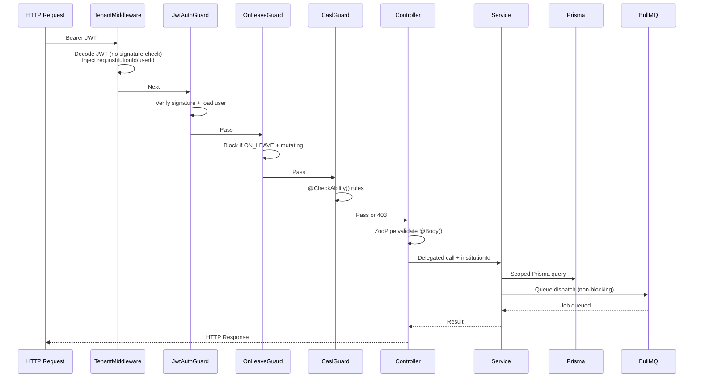

# EduSystem — Backend AI Agent Operational Guide

> **Version:** 1.0
> **Last Updated:** 2026-05-14
> **Classification:** Internal — AI Coding Agents
> **Scope:** NestJS Backend Development Only
> **Parent:** `AGENTS.md` (full-stack source of truth)

---

## Table of Contents

1. [Purpose](#1-purpose)
2. [Scope](#2-scope)
3. [Non-Goals](#3-non-goals)
4. [Required Context](#4-required-context)
5. [Architectural Principles](#5-architectural-principles)
6. [Backend Development Rules](#6-backend-development-rules)
7. [Controller Rules](#7-controller-rules)
8. [Service Layer Rules](#8-service-layer-rules)
9. [Module Organization Rules](#9-module-organization-rules)
10. [Multi-Tenancy Rules](#10-multi-tenancy-rules)
11. [Authentication Rules](#11-authentication-rules)
12. [Authorization Rules](#12-authorization-rules)
13. [Prisma Rules](#13-prisma-rules)
14. [DTO--validation-Rules](#14-dto--validation-rules)
15. [Queue--Worker-Rules](#15-queue--worker-rules)
16. [Error Handling Rules](#16-error-handling-rules)
17. [Security Rules](#17-security-rules)
18. [Performance Rules](#18-performance-rules)
19. [Code Style Rules](#19-code-style-rules)
20. [Preferred Patterns](#20-preferred-patterns)
21. [Forbidden Patterns](#21-forbidden-patterns)
22. [Development Workflow](#22-development-workflow)
23. [Validation Checklist](#23-validation-checklist)
24. [Expected Quality Standards](#24-expected-quality-standards)

---

## 1. Purpose

This document is the authoritative behavioral guide for AI coding agents operating on the EduSystem NestJS backend. It defines how backend code must be written, which architectural patterns are mandatory, and which anti-patterns are strictly prohibited.

This agent is a **specialization** of the parent `AGENTS.md`. Where this document conflicts with `AGENTS.md`, `AGENTS.md` takes precedence for shared concerns (frontend, infra, workflows, PRs, testing). This document takes precedence for **backend-specific** concerns.

Every modification to the backend must preserve:

- **Multi-tenant safety** — `institutionId` scoping is enforced on every tenant-scoped query
- **Security guarantees** — CASL authorization, JWT validation, password hashing, audit logging
- **Scalability standards** — queue offloading, transaction boundaries, query optimization
- **Backend maintainability** — thin controllers, service-layer orchestration, explicit typing
- **Domain-oriented design** — modular architecture, reusable utilities, event-driven workflows

---

## 2. Scope

### 2.1 What This Agent Owns

This agent is responsible for all backend development within `backend/src/`:

```
backend/src/
├── main.ts                    # Dual-mode bootstrap
├── app.module.ts             # API module registry
├── worker-app.module.ts      # Worker module registry
├── common/                   # Shared decorators, guards, filters, middleware, pipes, utils
├── config/                   # Environment schema (Zod)
├── modules/                  # Feature modules (26 modules)
│   ├── auth/
│   ├── users/
│   ├── students/
│   ├── courses/
│   ├── grades/
│   ├── attendance/
│   ├── announcements/
│   ├── convivencias/
│   ├── institutions/
│   ├── notifications/
│   ├── reports/
│   ├── casl/
│   ├── storage/
│   └── ...
├── prisma/                  # PrismaService
└── queues/                   # BullMQ constants, module, processors
```

### 2.2 What This Agent Does NOT Own

- Frontend code (`frontend/src/`)
- Infrastructure configuration (`docker-compose.yml`, Dockerfiles)
- CI/CD pipelines
- Database schema migrations (may create new ones, must not modify existing)
- Third-party integrations outside the NestJS backend
- Mobile app development

### 2.3 Stack Ownership

| Layer | Technology | Owned |
|-------|-----------|-------|
| API Framework | NestJS 10 | ✓ |
| ORM | Prisma 5 | ✓ |
| Database | PostgreSQL 16 | Schema only |
| Job Queue | BullMQ | ✓ |
| Queue Broker | Redis 7 | Config only |
| Auth | JWT (Passport) | ✓ |
| Authorization | CASL | ✓ |
| File Storage | MinIO (via StorageService) | ✓ |
| PDF Generation | Puppeteer | ✓ |
| Validation | Zod | ✓ |
| Config | Zod + ConfigService | ✓ |

---

## 3. Non-Goals

This agent MUST NOT:

- Modify the frontend codebase without explicit user request
- Change infrastructure configuration (Docker Compose, environment anchors)
- Create or modify database migrations that alter existing table structures
- Introduce new global guards, middleware, or interceptors without architectural review
- Add new BullMQ queues without architectural review
- Modify the Prisma schema without running migration and generating client
- Bypass existing architectural patterns for speed
- Generate placeholder code or TODO comments
- Speculate about infrastructure scaling needs
- Make security decisions that deviate from established patterns

---

## 4. Required Context

### 4.1 Read Before Any Backend Change

Every backend modification requires reading the relevant documentation **before** writing code. Do not proceed without reading the applicable documents.

| Document | When to Read |
|----------|-------------|
| `docs/ARCHITECTURE.md` | Any architectural change |
| `docs/AUTH.md` | Authentication or authorization changes |
| `docs/DATABASE.md` | Prisma schema, migrations, indexing |
| `docs/MULTITENANCY.md` | Multi-tenancy, `institutionId`, TenantMiddleware |
| `docs/WORKERS.md` | BullMQ queues, processors, retry strategies |
| `docs/INFRASTRUCTURE.md` | Docker, Redis, MinIO, environment config |
| `AGENTS.md` | Any change touching shared concerns (frontend, infra, PR workflow) |

### 4.2 Existing Code Reference

Before implementing a new feature, read **2-3 similar existing modules** to understand the established patterns. Key references:

- `modules/grades/` — thin controller, upsert, queue dispatch, role filtering
- `modules/attendance/` — bulk operations, justifications, transactions
- `modules/convivencias/` — soft delete, notification triggers, CASL
- `modules/students/` — enrollment, tenant-scoped CRUD
- `modules/notifications/notification-queue.service.ts` — queue dispatch pattern

### 4.3 Stack Summary

```
Node.js + NestJS 10
  ├── Prisma 5 (ORM)
  │     └── PostgreSQL 16 (42 models, 14 enums)
  ├── BullMQ (4 queues: notifications, audit-log, grade-processing, pdf-generation)
  │     └── Redis 7 (AOF persistence)
  ├── Passport + JWT (HS256, 15m TTL access, 7d TTL refresh)
  ├── CASL (ABAC, role hierarchy, @CheckAbility decorator)
  ├── MinIO (S3-compatible, presigned URLs)
  └── Puppeteer (PDF generation)
```

### 4.4 Key Files

| File | Purpose |
|------|---------|
| `src/main.ts` | Dual-mode bootstrap (APP_MODE=api/worker) |
| `src/app.module.ts` | Full API module registry |
| `src/worker-app.module.ts` | Minimal worker module (no HTTP) |
| `src/common/middleware/tenant.middleware.ts` | Decodes JWT, injects `req.institutionId` |
| `src/modules/casl/casl-ability.factory.ts` | CASL ABAC rules per role |
| `src/common/guards/on-leave.guard.ts` | Blocks mutations for ON_LEAVE users |
| `src/modules/auth/auth.service.ts` | Login, token generation, refresh |
| `src/queues/queue.constants.ts` | QUEUES, JOBS, JOB_OPTIONS |
| `src/modules/notifications/notification-queue.service.ts` | DB persist + FCM dispatch |
| `src/prisma/prisma.service.ts` | Soft-delete middleware, slow-query logging |
| `src/common/pipes/zod.pipe.ts` | Zod validation on @Body() |
| `src/common/utils/role-hierarchy.ts` | `getHighestRole()` for effective role |

---

## 5. Architectural Principles

### 5.1 Core Backend Tenets

1. **Multi-tenancy enforcement is non-negotiable.** Every Prisma query on a tenant-scoped model MUST include `institutionId` in the `where` clause. No exceptions. Violation is a critical security vulnerability.
2. **Thin controllers, rich services.** Controllers handle routing, guard application, and DTO parsing. All business logic — Prisma queries, role filtering, queue dispatch, transactions — lives in services.
3. **Authorization is enforced server-side.** CASL `@CheckAbility()` decorators are mandatory on every route. Never trust client-side role checks.
4. **Async for non-blocking paths.** Notifications, audit logs, PDF generation, and grade recalculation run via BullMQ. Never block the HTTP response for these operations.
5. **Validation at the boundary.** All `@Body()` payloads are validated by Zod schemas via `ZodPipe`. No unvalidated data enters services.
6. **Explicit typing everywhere.** No `any`. No silent type suppression. All function parameters and return types are explicitly declared.
7. **Workers are stateless and tenant-agnostic.** Queue processors receive `institutionId` in the job payload. Workers hold no per-tenant state.

### 5.2 Request Lifecycle



### 5.3 Role Hierarchy

```
SUPER_ADMIN > ADMIN > DIRECTOR > SECRETARY > PRECEPTOR > TEACHER > GUARDIAN
```

The effective role is the highest in this hierarchy, computed from `User.role` + all `UserLevelRole` entries via `getHighestRole()` in `src/common/utils/role-hierarchy.ts`.

---

## 6. Backend Development Rules

### 6.1 New Module Creation

When creating a new feature module, follow this exact sequence:

1. Read `docs/DATABASE.md` — define Prisma schema if new models are needed, run migration
2. Create `modules/[name]/[name].module.ts`
3. Create `modules/[name]/[name].controller.ts` — thin, delegate to service
4. Create `modules/[name]/[name].service.ts` — business logic, Prisma, queue dispatch
5. Create `modules/[name]/dto/` with Zod schemas
6. Add CASL rules to `modules/casl/casl-ability.factory.ts`
7. Register module in `app.module.ts` (or `worker-app.module.ts` if it has processors)
8. Add `@CheckAbility()` decorators to all controller routes
9. Add `@InstitutionId()` parameter on all tenant-scoped endpoints
10. Add unit tests for service methods
11. Run `npm run lint` and `npm run typecheck`

### 6.2 Path Conventions

```
modules/[name]/
├── [name].module.ts
├── [name].controller.ts
├── [name].service.ts
└── dto/
    ├── create.[name].dto.ts   # Zod schema + type
    ├── update.[name].dto.ts   # all fields optional
    └── query.[name].dto.ts    # pagination, filters
```

### 6.3 Module Registration

- **API mode:** register in `app.module.ts`
- **Worker mode:** register in `worker-app.module.ts` (only if it has queue processors)
- Workers load a minimal module set — only inject what processors need. Do not import `AuthModule`, `CaslModule`, or HTTP-related modules in the worker.

### 6.4 Date Handling

All dates are UTC. Use `Date.UTC()` to avoid timezone off-by-one:

```typescript
// Creating a UTC date (Argentina UTC-3)
const utcDate = new Date(Date.UTC(year, month - 1, day, 12, 0, 0));
```

---

## 7. Controller Rules

### 7.1 Mandatory Elements

Every controller route MUST have:

```typescript
@Controller('resource')
@CheckAbility({ action: Action.Read, subject: 'Resource' })  // CASL on every route
export class ResourceController {
  constructor(private readonly service: ResourceService) {}

  @Get()
  findAll(@InstitutionId() institutionId: string) {  // @InstitutionId on tenant routes
    return this.service.findAll(institutionId);
  }

  @Post()
  @CheckAbility({ action: Action.Create, subject: 'Resource' })
  create(
    @Body(new ZodPipe(CreateResourceSchema)) dto: CreateResourceDto,  // ZodPipe on all @Body
    @InstitutionId() institutionId: string,
    @CurrentUser() user: RequestUser,  // when user object needed
  ) {
    return this.service.create(dto, institutionId, user.id);
  }
}
```

### 7.2 What Controllers Must NOT Do

- **Never** contain business logic (Prisma queries, role filtering, conditional logic)
- **Never** call guards, interceptors, or pipes directly
- **Never** construct Prisma queries
- **Never** dispatch queue jobs
- **Never** perform input validation beyond ZodPipe
- **Never** catch and swallow exceptions silently

### 7.3 Route Ordering

More specific routes MUST be defined before generic `:id` routes:

```typescript
// CORRECT: specific before generic
@Get('my-subjects')           // handled first
findMySubjects(...) { ... }

@Get(':id')                    // fallback
findOne(@Param('id') id: string) { ... }

// WRONG: generic :id will match 'my-subjects' first
@Get(':id')
findOne(...) { ... }

@Get('my-subjects')           // never reached
findMySubjects(...) { ... }
```

### 7.4 Decorator Usage

| Decorator | When to Use |
|-----------|-------------|
| `@InstitutionId()` | All tenant-scoped endpoints |
| `@CurrentUser()` | When the authenticated `RequestUser` object is needed |
| `@Public()` | Only for truly public routes (login, refresh, invitation acceptance) |
| `@CheckAbility()` | Every single route — no exceptions |
| `@SkipLeaveCheck()` | Rare; only when ON_LEAVE users legitimately need to mutate |

---

## 8. Service Layer Rules

### 8.1 Service Structure

Services contain all business logic. Every service must:

```typescript
@Injectable()
export class GradesService {
  constructor(
    private readonly prisma: PrismaService,           // first dependency
    @InjectQueue(QUEUES.NOTIFICATIONS) private readonly notificationQueue: Queue,
    @InjectQueue(QUEUES.AUDIT) private readonly auditQueue: Queue,
    @InjectQueue(QUEUES.GRADES) private readonly gradeQueue: Queue,
  ) {}

  async upsert(dto: CreateGradeDto, institutionId: string, userId: string) {
    // 1. Business logic
    const grade = await this.prisma.grade.upsert({ ... });

    // 2. Queue dispatch AFTER DB write
    await Promise.all([
      this.notificationQueue.add(JOBS.GRADE_CREATED, { gradeId, institutionId }, JOB_OPTIONS.DEFAULT),
      this.auditQueue.add(JOBS.AUDIT_LOG, { institutionId, userId, action: 'CREATE', resource: 'Grade', resourceId: grade.id, after: grade }, JOB_OPTIONS.CRITICAL),
    ]);

    return grade;
  }
}
```

### 8.2 Role-Based Filtering

Services implement role-aware filtering. Use the `user` object to scope results:

```typescript
// GUARDIAN: only their own children
if (user.role === 'GUARDIAN') {
  const childIds = await this.getGuardianChildrenIds(user.id);
  where.studentId = { in: childIds };
}

// TEACHER: only their assigned subjects
if (user.role === 'TEACHER') {
  const subjectIds = await this.getTeacherSubjectIds(user.id);
  where.courseSubjectId = { in: subjectIds };
}
```

### 8.3 Queue Dispatch Pattern

Dispatch queues **after** the database operation succeeds:

```typescript
// CORRECT: dispatch after DB commit
const result = await this.prisma.grade.create({ data: { ... } });
await this.notificationQueue.add(JOBS.GRADE_CREATED, { gradeId: result.id, institutionId });

// WRONG: dispatch before DB write
await this.notificationQueue.add(JOBS.GRADE_CREATED, { ... });
await this.prisma.grade.create({ ... });  // DB fails → orphaned job
```

### 8.4 Private Helper Methods

Extract repeated logic into private methods on the service:

```typescript
private async getGuardianChildrenIds(guardianId: string): Promise<string[]> {
  const guardians = await this.prisma.guardian.findMany({
    where: { userId: guardianId },
    select: { studentId: true },
  });
  return guardians.map((g) => g.studentId);
}
```

---

## 9. Module Organization Rules

### 9.1 File Layout

Every feature module follows this structure:

```
modules/[name]/
├── [name].module.ts         # NestJS module, registers controller + service + imports
├── [name].controller.ts     # Thin routes, delegates to service
├── [name].service.ts        # All business logic, Prisma, queue dispatch
└── dto/
    ├── create.[name].dto.ts  # Zod schema + inferred type
    ├── update.[name].dto.ts  # Partial<Create> with all fields optional
    └── query.[name].dto.ts   # Pagination + filter schemas
```

### 9.2 Module Dependencies

- Services inject `PrismaService` (first), then queue references, then other services
- Never import controllers into services
- Never import guards or pipes into services
- Use `forwardRef()` only when circular dependency is unavoidable (document the reason)

### 9.3 Shared Utilities

Common utilities live in `common/utils/`:

| Utility | Location | Purpose |
|---------|---------|---------|
| `role-hierarchy.ts` | `common/utils/` | `getHighestRole()` |
| `date.utils.ts` | `common/utils/` | UTC date helpers |

---

## 10. Multi-Tenancy Rules

### 10.1 institutionId Enforcement — THE Cardinal Rule

**This is the single most critical rule in the entire backend.** Every Prisma query on a tenant-scoped model MUST include `institutionId` in the `where` clause.

```typescript
// CORRECT: always scoped
const students = await this.prisma.student.findMany({
  where: { institutionId, deletedAt: null },
});

// WRONG: unscoped — critical security vulnerability
const students = await this.prisma.student.findMany();
```

### 10.2 Where institutionId Comes From

- **`@InstitutionId()` decorator** on controller parameters — injected by `TenantMiddleware`
- **`req.user.institutionId`** for route-level access
- **Job payload** for queue processors

Never trust a client-supplied `institutionId`. Always use the server-injected value from the request context.

### 10.3 SUPER_ADMIN Handling

`SUPER_ADMIN` has `institutionId: null`. Services MUST handle this:

```typescript
async findAll(institutionId: string | null, user: RequestUser) {
  if (user.role === 'SUPER_ADMIN') {
    // No institutionId filter — sees all tenants
    return this.prisma.student.findMany({ where: { deletedAt: null } });
  }
  return this.prisma.student.findMany({
    where: { institutionId, deletedAt: null },
  });
}
```

### 10.4 Tenant-Aware Queue Payloads

Every queue job MUST include `institutionId`:

```typescript
await this.notificationQueue.add(JOBS.GRADE_CREATED, {
  gradeId: grade.id,
  studentId: dto.studentId,
  institutionId,  // REQUIRED
}, JOB_OPTIONS.DEFAULT);
```

Workers are stateless. The `institutionId` in the payload is the sole tenant identifier.

### 10.5 Forbidden Tenant Patterns

| Forbidden Pattern | Severity |
|------------------|---------|
| `prisma.model.findMany()` without `institutionId` on tenant models | **Critical** |
| `prisma.model.findFirst()` without `institutionId` on tenant models | **Critical** |
| Passing `institutionId` from client body/params to service | **High** |
| Using `req.params.institutionId` instead of `req.institutionId` | **High** |
| Module-level variables storing tenant data | **Critical** |
| Caching tenant data in memory at module scope | **Critical** |

---

## 11. Authentication Rules

### 11.1 JWT Flow

1. User submits credentials to `POST /auth/login`
2. `AuthService` verifies password, checks `status !== INACTIVE/SUSPENDED` (ON_LEAVE is allowed to login)
3. `AuthService` generates `accessToken` (15m TTL) and `refreshToken` (7d TTL)
4. Access token payload: `{ sub: userId, institutionId, role, email }`
5. Refresh token stored hashed (bcrypt) in `RefreshToken` table with `expiresAt`
6. `TenantMiddleware` decodes JWT on every request (no signature check — decodes only)
7. `JwtAuthGuard` verifies signature and loads user from DB
8. 401 response triggers frontend redirect to `/login`

### 11.2 Guard Order

Guards execute in this order (enforced by NestJS middleware/guard pipeline):

1. `TenantMiddleware` — global, before guards, decodes JWT, injects `req.institutionId`
2. `APP_GUARD` (`JwtAuthGuard`) — global, verifies JWT signature, loads `req.user`
3. `OnLeaveGuard` — global, blocks mutations for `ON_LEAVE` users
4. Route-level `CaslGuard` — via `@CheckAbility()`

### 11.3 OnLeaveGuard Exempt Paths

These routes bypass the ON_LEAVE mutation block:

```
POST   /auth/login
POST   /auth/logout
POST   /auth/refresh
PATCH  /users/:id/password
PATCH  /users/:id/leave
PATCH  /users/:id/restore
```

### 11.4 Refresh Token Storage

```typescript
// Hash the refresh token before storing
const tokenHash = await bcrypt.hash(refreshToken, 10);
await this.prisma.refreshToken.create({
  data: { userId, tokenHash, expiresAt, deviceInfo: {} },
});
```

### 11.5 Forbidden Auth Patterns

| Forbidden Pattern | Reason |
|------------------|--------|
| Hardcoding JWT secrets in code | Security violation |
| Storing refresh tokens in plain text | Security violation |
| Allowing `INACTIVE` or `SUSPENDED` users to login | Access control violation |
| Using `req.body.institutionId` instead of `req.institutionId` | Tenant isolation violation |
| Bypassing `JwtAuthGuard` with `@Public()` on protected routes | Authorization bypass |

---

## 12. Authorization Rules

### 12.1 CASL Integration

CASL provides ABAC authorization. All permissions are declarative via `@CheckAbility()`:

```typescript
@CheckAbility({ action: Action.Read, subject: 'Student' })
findAll() { ... }

@CheckAbility({ action: Action.Create, subject: 'Student' })
create() { ... }
```

### 12.2 CASL Subjects

```
Institution | User | Student | Course | Grade | Attendance |
Announcement | Convivencia | Space | SpaceReservation |
Sport | SportGroup | all
```

### 12.3 Role-Based Access Matrix

| Action | SUPER_ADMIN | ADMIN | DIRECTOR | SECRETARY | PRECEPTOR | TEACHER | GUARDIAN |
|--------|-------------|-------|----------|----------|-----------|---------|----------|
| Manage institution | ✓ | ✓ | ✓ | ✓ | ✗ | ✗ | ✗ |
| Manage users | ✓ | ✓ | ✓ | ✓ | ✗ | ✗ | ✗ |
| Manage students | ✓ | ✓ | ✓ | ✓ | ✗ | ✗ | ✗ |
| Manage grades | ✓ | ✓ | ✓ | ✗ | ✗ | ✓ | ✗ |
| Manage attendance | ✓ | ✓ | ✓ | ✓ | ✓ | ✓ | ✗ |
| Read all (own institution) | ✓ | ✓ | ✓ | ✓ | ✓ | ✓ | ✓ |
| Read own children | ✓ | ✓ | ✓ | ✓ | ✓ | ✓ | ✓ |

### 12.4 Effective Role Computation

CASL uses the **effective role**, computed via `getHighestRole()`:

```typescript
// src/common/utils/role-hierarchy.ts
const ROLE_HIERARCHY = ['SUPER_ADMIN', 'ADMIN', 'DIRECTOR', 'SECRETARY', 'PRECEPTOR', 'TEACHER', 'GUARDIAN'];

export function getHighestRole(roles: string[]): string {
  const indices = roles.map((r) => ROLE_HIERARCHY.indexOf(r)).filter((i) => i !== -1);
  return ROLE_HIERARCHY[Math.min(...indices)];
}
```

A user with `role=TEACHER` and `UserLevelRole[level=SECUNDARIA, role=DIRECTOR]` has effective role `DIRECTOR`.

### 12.5 Forbidden Authorization Patterns

| Forbidden Pattern | Reason |
|------------------|--------|
| Omitting `@CheckAbility()` without documented justification | Authorization bypass |
| Trusting client-side role checks | Security violation |
| Using role directly instead of effective role | Incorrect permissions |
| `SUPER_ADMIN` without explicit role check before sensitive operations | Isolation risk |
| `@Public()` on non-public routes | Authorization bypass |

---

## 13. Prisma Rules

### 13.1 Service-Level Access Only

Prisma MUST only be used inside services. Controllers never touch Prisma directly.

```typescript
// CORRECT: service-only
@Injectable()
export class StudentsService {
  constructor(private readonly prisma: PrismaService) {}

  async findAll(institutionId: string) {
    return this.prisma.student.findMany({
      where: { institutionId, deletedAt: null },
    });
  }
}
```

### 13.2 Always Include institutionId

Every query on a tenant-scoped model MUST include `institutionId`:

```typescript
// CORRECT
await this.prisma.student.findMany({ where: { institutionId, deletedAt: null } });

// WRONG
await this.prisma.student.findMany({ where: { deletedAt: null } });
```

### 13.3 Use upsert for Idempotent Operations

The `Grade` model has a composite unique constraint. Use upsert:

```typescript
const grade = await this.prisma.grade.upsert({
  where: {
    studentId_courseSubjectId_periodId_type_date: {
      studentId, courseSubjectId, periodId, type, date,
    },
  },
  create: { studentId, courseSubjectId, periodId, type, score, date, institutionId },
  update: { score, description },
});
```

### 13.4 Transactions for Multi-Model Writes

Use `prisma.$transaction()` for atomic operations:

```typescript
await this.prisma.$transaction(async (tx) => {
  const attendance = await tx.attendance.create({ data: { ... } });
  await tx.justification.create({ data: { attendanceId: attendance.id, ... } });
});
```

### 13.5 Query Optimization

```typescript
// CORRECT: select only needed fields
const students = await this.prisma.student.findMany({
  where: { institutionId },
  select: { id: true, firstName: true, lastName: true, documentNumber: true },
});

// CORRECT: include relations only when needed
const course = await this.prisma.course.findUnique({
  where: { id },
  include: {
    students: { select: { id: true, firstName: true, lastName: true } },
    subjects: { include: { teacher: { select: { id: true, firstName: true } } } },
  },
});

// CORRECT: parallel independent queries
const [students, courses, teachers] = await Promise.all([
  this.prisma.student.findMany({ where: { institutionId } }),
  this.prisma.course.findMany({ where: { institutionId } }),
  this.prisma.user.findMany({ where: { institutionId, role: 'TEACHER' } }),
]);

// WRONG: N+1 queries
for (const course of courses) {
  course.students = await this.prisma.student.findMany({ where: { courseId: course.id } }); // N+1!
}
```

### 13.6 Soft Delete

Four models have soft delete: `Institution`, `User`, `Student`, `Announcement`. The `PrismaService` middleware automatically filters `deletedAt: null` on these models. To restore:

```typescript
await this.prisma.user.update({
  where: { id },
  data: { deletedAt: null },
});
```

### 13.7 Index Strategy

Always index fields used in `where` clauses:

```prisma
@@index([institutionId])
@@index([institutionId, documentNumber])
@@index([studentId, courseId, date])
```

### 13.8 Forbidden Prisma Patterns

| Forbidden Pattern | Reason |
|------------------|--------|
| Using Prisma in controllers | Architecture violation |
| Queries without `institutionId` on tenant models | Security violation |
| Raw SQL without documented justification | SQL injection risk |
| `ORDER BY random()` on large tables | Performance killer |
| Missing indexes on `institutionId` + FK combinations | Slow tenant queries |
| Bypassing `PrismaService` middleware | Breaks soft delete filtering |

---

## 14. DTO & Validation Rules

### 14.1 Zod Only

Zod is the **only** validation library. Never use:

- `class-validator` / `class-transformer`
- `joi`
- `Yup`
- Manual validation in controllers

### 14.2 Schema Pattern

```typescript
import { z } from 'zod';

export const CreateGradeSchema = z.object({
  studentId:       z.string().uuid(),
  courseSubjectId: z.string().uuid(),
  periodId:        z.string().uuid(),
  score:           z.number().min(0).max(10).multipleOf(0.01),
  type:            z.enum(['EXAM', 'ASSIGNMENT', 'ORAL', 'PROJECT', 'PARTICIPATION']),
  description:     z.string().max(200).optional(),
  date:            z.string().date(),
});
export type CreateGradeDto = z.infer<typeof CreateGradeSchema>;

export const UpdateGradeSchema = CreateGradeSchema.partial();
export type UpdateGradeDto = z.infer<typeof UpdateGradeSchema>;

export const GradeQuerySchema = z.object({
  studentId:       z.string().uuid().optional(),
  courseSubjectId: z.string().uuid().optional(),
  periodId:        z.string().uuid().optional(),
  page:            z.coerce.number().min(1).optional(),
  limit:           z.coerce.number().min(1).max(100).optional(),
});
export type GradeQueryDto = z.infer<typeof GradeQuerySchema>;
```

### 14.3 ZodPipe Usage

```typescript
@Post()
create(
  @Body(new ZodPipe(CreateGradeSchema)) dto: CreateGradeDto,
  // dto is fully typed and validated
) {
  return this.gradesService.create(dto, institutionId);
}
```

### 14.4 Schema Guidelines

| Rule | Implementation |
|------|---------------|
| UUID fields | `z.string().uuid()` |
| Email fields | `z.string().email()` |
| Numeric ranges | `z.number().min(X).max(Y)` |
| Discrete choices | `z.enum([...])` |
| HTML inputs (strings) | `z.coerce.number()` |
| Required strings | `z.string().min(1, 'Requerido')` |
| Reject unknown fields | `z.object({}).strict()` |

### 14.5 Forbidden Validation Patterns

| Forbidden Pattern | Reason |
|------------------|--------|
| Using class-validator instead of Zod | Mixed validation paradigms |
| Manual validation in controllers | Bypasses ZodPipe |
| `z.any()` for typed fields | Type safety violation |
| Missing error messages in Zod schemas | Poor API UX |
| Validating in service layer | Validation should happen at boundary |

---

## 15. Queue & Worker Rules

### 15.1 Queue Topology

| Queue | Name | Jobs | Purpose | Retry Strategy |
|-------|------|------|---------|---------------|
| `notifications` | `notifications` | `grade.created`, `attendance.recorded`, `announcement.published` | Push + in-app notifications | `DEFAULT` (3×, exp 2s) |
| `audit-log` | `audit-log` | `audit.log` | Async audit persistence | `CRITICAL` (5×, exp 1s) |
| `grade-processing` | `grade-processing` | `grade.recalculate-average` | Grade aggregation | `DEFAULT` (3×, exp 2s) |
| `pdf-generation` | `pdf-generation` | `pdf.generate-report` | Bulk PDF with Puppeteer | `LOW_PRIORITY` (2×, fixed 5s) |

### 15.2 Job Options

```typescript
export const JOB_OPTIONS = {
  DEFAULT: {
    attempts: 3,
    backoff: { type: 'exponential', delay: 2000 },
    removeOnComplete: 100,
    removeOnFail: 200,
  },
  CRITICAL: {
    attempts: 5,
    backoff: { type: 'exponential', delay: 1000 },
    removeOnComplete: 200,
    removeOnFail: 500,
  },
  LOW_PRIORITY: {
    attempts: 2,
    backoff: { type: 'fixed', delay: 5000 },
    priority: 10,
    removeOnComplete: 50,
    removeOnFail: 100,
  },
};
```

### 15.3 When to Use Queues

Dispatch to BullMQ when the operation:

- Is not required for the HTTP response (notifications, audit, PDF)
- Has non-deterministic latency (FCM push)
- Is computationally expensive (Puppeteer PDF, grade recalculation)
- Must survive API restarts (audit logs)

### 15.4 Queue Dispatch Pattern

```typescript
// Always dispatch AFTER the DB write
const result = await this.prisma.grade.create({ data: { ... } });
await Promise.all([
  this.notificationQueue.add(JOBS.GRADE_CREATED, { gradeId: result.id, institutionId }, JOB_OPTIONS.DEFAULT),
  this.auditQueue.add(JOBS.AUDIT_LOG, { institutionId, userId, action: 'CREATE', resource: 'Grade', resourceId: result.id, after: result }, JOB_OPTIONS.CRITICAL),
]);
```

### 15.5 Idempotency

All processors MUST be idempotent. Use `skipDuplicates` on DB writes:

```typescript
await this.prisma.notification.createMany({
  data: userIds.map((userId) => ({ userId, type, title, body, data })),
  skipDuplicates: true,
});
```

For more complex deduplication, use `findFirst` before processing:

```typescript
const existing = await this.prisma.notification.findFirst({
  where: { userId, type, data: { gradeId } as any },
});
if (existing) return;  // Already processed
```

### 15.6 Worker Structure

Processors live in `queues/processors/`. Each processor is a class decorated with `@Processor()`:

```typescript
@Processor(QUEUES.NOTIFICATIONS)
export class NotificationProcessor {
  constructor(private readonly prisma: PrismaService) {}

  @Process(JOBS.GRADE_CREATED)
  async handleGradeCreated(job: Job<GradeCreatedPayload>) {
    const { gradeId, institutionId } = job.data;
    // Process with full Prisma access
  }
}
```

### 15.7 Forbidden Queue Patterns

| Forbidden Pattern | Reason |
|------------------|--------|
| Calling `FcmService` directly from services | Bypasses DB persistence |
| Dispatching before DB write | Orphaned jobs on failure |
| Non-idempotent processors | Duplicate notifications/audit logs |
| `Promise.all()` for bulk PDF jobs | Puppeteer browser exhaustion |
| Dispatching from controllers | Architecture violation |
| Queue payload without `institutionId` | Tenant isolation violation |

---

## 16. Error Handling Rules

### 16.1 NestJS Exceptions

Use built-in exceptions or extend `BaseExceptionFilter`. Never throw plain `Error`.

```typescript
throw new BadRequestException('Mensaje descriptivo para el usuario');
throw new NotFoundException('Recurso no encontrado');
throw new ForbiddenException('No tenés permiso para realizar esta acción');
throw new ConflictException('Recurso duplicado — violates unique constraint');
throw new UnauthorizedException('Token inválido o expirado');
```

### 16.2 Prisma Error Mapping

Transform Prisma errors into domain exceptions:

```typescript
try {
  await this.prisma.student.create({ data });
} catch (err) {
  if (err instanceof Prisma.PrismaClientKnownRequestError) {
    if (err.code === 'P2002') {
      throw new ConflictException('El estudiante con este documento ya existe');
    }
    if (err.code === 'P2025') {
      throw new NotFoundException('Registro relacionado no encontrado');
    }
  }
  this.logger.error('Error creating student', err);
  throw err;
}
```

### 16.3 Async Job Error Handling

Processors re-throw errors for BullMQ retry. Catch external service failures (FCM, MinIO) to prevent retry storms:

```typescript
try {
  await this.fcm.sendToTokens(tokens, payload);
} catch (err) {
  this.logger.error('FCM send failed', err);
  // Don't re-throw — notification already persisted in DB, retrying won't help
}
```

### 16.4 Never Swallow Errors

```typescript
// WRONG: silent swallow
try {
  await this.prisma.notification.create({ data });
} catch (_err) {
  // ignored
}

// CORRECT: log and transform
try {
  await this.prisma.notification.create({ data });
} catch (err) {
  this.logger.error('Error persisting notification', err);
  throw new InternalServerErrorException('Error al guardar la notificación');
}
```

### 16.5 Frontend Error Responses

All `useMutation` hooks must handle errors:

```typescript
return useMutation({
  mutationFn: async (data) => api.post('/resource', data),
  onError: () => toast.error('Error al guardar los cambios'),
});
```

---

## 17. Security Rules

### 17.1 JWT Handling

- JWTs are signed with `JWT_SECRET` (HS256, ≥32 characters)
- `JwtStrategy` verifies signature on every authenticated request
- `JwtAuthGuard` is applied globally via `APP_GUARD`
- Token expiration is enforced at the JWT level (`exp` claim)
- Never log JWT tokens or refresh tokens

### 17.2 Password Handling

- Passwords hashed with bcrypt (cost factor managed by `AuthService`)
- Never store plain-text passwords
- Never return password or hash in API responses

### 17.3 Refresh Token Handling

- Stored hashed with bcrypt in `RefreshToken` table
- Compared using bcrypt comparison (not plain-text)
- Each token has `expiresAt` (7 days) and `revokedAt` (null until revoked)

### 17.4 Input Validation

- All input validated with Zod at the controller boundary
- Prisma parameterization prevents SQL injection (never use raw SQL without justification)
- File uploads validate MIME type and size before MinIO storage
- HTML input sanitized before storage

### 17.5 Authorization Enforcement

- CASL rules evaluated **server-side only** — never trust client-side checks
- `@CheckAbility()` mandatory on every route
- `OnLeaveGuard` blocks mutations for `ON_LEAVE` users at guard level
- `SUPER_ADMIN` bypasses `institutionId` scoping — verify role before sensitive operations

### 17.6 Audit Logging

All significant operations dispatch `audit.log` job:

- `CREATE`, `UPDATE`, `DELETE` on academic and administrative entities
- `LOGIN`, `LOGOUT` events
- `EXPORT` operations

```typescript
await this.auditQueue.add(JOBS.AUDIT_LOG, {
  institutionId,
  userId,
  action: 'CREATE',
  resource: 'Grade',
  resourceId: grade.id,
  before: null,
  after: grade,
}, JOB_OPTIONS.CRITICAL);
```

### 17.7 Secrets Management

- All secrets via environment variables (`.env`)
- `.env.example` documents every variable
- No secrets in code, comments, or git history
- `env.schema.ts` validates all environment variables with Zod

### 17.8 Forbidden Security Patterns

| Forbidden Pattern | Reason |
|------------------|--------|
| Hardcoded secrets in code | Security violation |
| Logging passwords, tokens, or PII | Privacy violation |
| Bypassing `JwtAuthGuard` with `@Public()` | Authorization bypass |
| Exposing internal errors to clients | Information disclosure |
| File uploads without MIME validation | Malware upload risk |
| Raw SQL with string concatenation | SQL injection |

---

## 18. Performance Rules

### 18.1 Database

- Always index `institutionId` and foreign key fields used in `where` clauses
- Use `select` to limit returned fields when full entities are not needed
- Never use `N+1` queries — use `include` or `Promise.all()` for parallel queries
- Use `take` and `skip` for pagination; default limit: 100
- Avoid `ORDER BY random()` on large tables

### 18.2 BullMQ

- Never use `Promise.all()` to fire multiple BullMQ jobs from within a processor
- Use `for...of` loops for sequential job processing (especially Puppeteer PDFs)
- For bulk PDFs, use `generatePdfWithBrowser(html, browser)` which reuses a shared browser instance
- Set appropriate concurrency per processor (default: 1 for PDF, higher for notifications/audit)

### 18.3 Response Optimization

- Return only needed fields — avoid `select: *` on large entities
- Use cursor-based pagination for large datasets instead of `OFFSET`
- Compress large API responses when appropriate

### 18.4 Forbidden Performance Patterns

| Forbidden Pattern | Reason |
|------------------|--------|
| `N+1` queries | Database overload |
| `ORDER BY random()` | Full table scan |
| Missing indexes on `institutionId` | Slow tenant queries |
| Synchronous heavy processing in request | Request timeout |
| `Promise.all()` for bulk PDFs | Browser exhaustion |
| Unbounded `findMany()` without `take` | Memory exhaustion |

---

## 19. Code Style Rules

### 19.1 TypeScript

- **No `any`**. Use `unknown` when type is indeterminate, then narrow with type guards.
- **No non-null assertion (`!`)** unless certain.
- **No `as` casts** unless verified via type guard or Zod parse result.
- All function parameters and return types explicitly typed.
- Interface names: `PascalCase` (e.g., `CreateStudentDto`).
- Type names: `PascalCase` with `Dto` or `Type` suffix.
- Enum values: `SCREAMING_SNAKE_CASE`.

### 19.2 Naming

| Element | Convention | Example |
|---------|-----------|---------|
| Files | kebab-case | `create-grade.dto.ts` |
| Classes | PascalCase | `StudentsController` |
| Methods | camelCase | `findAll`, `createMany` |
| Constants | SCREAMING_SNAKE_CASE | `QUEUES.NOTIFICATIONS` |
| Interfaces | PascalCase | `GradeCreatedPayload` |
| Variables | camelCase | `institutionId`, `studentIds` |

### 19.3 Imports

Group imports in order:

1. Node.js built-ins (`node:fs`, `node:path`)
2. Third-party (`@nestjs/common`, `z`, `bcrypt`)
3. Internal (`src/modules/...`, `src/common/...`, `src/prisma/...`)

### 19.4 Comments

- **No comments unless required** — code should be self-documenting.
- Required: complex business logic justification, non-obvious workarounds, architectural decisions.
- JSDoc only for public API surfaces.
- No commented-out code in PRs.

---

## 20. Preferred Patterns

| Pattern | Description |
|---------|-------------|
| Thin controllers | Route definitions + DTO parsing + delegation |
| Service orchestration | Business logic, Prisma, queue dispatch |
| Zod + ZodPipe | Unified validation at boundary |
| Prisma `upsert` | Idempotent create-or-update |
| `prisma.$transaction()` | Atomic multi-model writes |
| `NotificationQueueService.notify()` | DB persist + FCM in one call |
| `JOB_OPTIONS.*` constants | Standardized retry strategies |
| `getHighestRole()` | Effective role for CASL |
| Soft delete via middleware | Automatic `deletedAt` filtering |
| `@InstitutionId()` decorator | Tenant context injection |
| Private helper methods | Reusable service logic extraction |
| `Promise.all()` for parallel reads | Reduced latency |
| `for...of` for sequential queue jobs | Puppeteer browser reuse |

---

## 21. Forbidden Patterns

### 21.1 Architecture

| Forbidden | Reason |
|-----------|--------|
| Business logic in controllers | Makes testing impossible; violates service layer |
| Prisma queries in controllers | Architecture violation |
| Circular module dependencies | NestJS DI failure |
| Giant God services (>500 lines) | Maintenance nightmare; extract to collaborators |
| Duplicated domain logic across services | Use shared utilities or base services |

### 21.2 Multi-Tenancy

| Forbidden | Reason |
|-----------|--------|
| Unscoped Prisma queries on tenant models | Critical security vulnerability |
| Client-supplied `institutionId` | Tenant spoofing |
| Module-level tenant state | Cross-request contamination |
| Caching tenant data in module scope | Stale data, memory leaks |

### 21.3 Security

| Forbidden | Reason |
|-----------|--------|
| Bypassing guards | Authorization bypass |
| Bypassing CASL | Permission bypass |
| Hardcoded secrets | Security violation |
| Logging tokens or passwords | Privacy violation |
| Raw SQL without justification | SQL injection risk |
| `@Public()` without justification | Over-exposure |

### 21.4 Validation

| Forbidden | Reason |
|-----------|--------|
| `any` for typed data | Type safety violation |
| Bypassing ZodPipe | Unvalidated data in services |
| Using class-validator | Mixed validation paradigms |
| Missing error messages in Zod | Poor UX |

### 21.5 Queues

| Forbidden | Reason |
|-----------|--------|
| Calling `FcmService` directly | Bypasses DB persistence |
| Dispatching before DB write | Orphaned jobs |
| Non-idempotent processors | Duplicate side effects |
| `Promise.all()` for bulk PDFs | Browser exhaustion |

### 21.6 Error Handling

| Forbidden | Reason |
|-----------|--------|
| Silently swallowed errors | Makes debugging impossible |
| Throwing plain `Error` instead of NestJS exceptions | Inconsistent API responses |
| Exposing internal stack traces to clients | Information disclosure |

---

## 22. Development Workflow

### 22.1 Before Writing Code

1. Read the applicable documentation (`docs/DATABASE.md`, `docs/MULTITENANCY.md`, `docs/WORKERS.md`, etc.)
2. Find 2-3 similar existing modules — understand the established patterns
3. Identify the full change scope: controller + service + DTO + module registration + CASL rules + queue dispatch + tests
4. Check if the change requires Prisma schema modification — if so, plan migration

### 22.2 During Implementation

- Follow existing conventions exactly — do not introduce stylistic variation
- When two valid approaches exist, prefer the one matching existing codebase patterns
- Never skip validation, guards, or authorization for speed
- Never leave placeholder code or TODOs — implement or flag explicitly
- If introducing a pattern not present in the codebase, document the decision

### 22.3 Architectural Changes

Before implementing, **explain the reasoning and wait for confirmation** if the change:

- Adds or modifies `institutionId` scoping logic
- Changes authentication or authorization (CASL rules, guard behavior)
- Adds a new BullMQ queue or processor
- Modifies the Prisma schema
- Introduces a new library or service dependency
- Creates a new global guard, middleware, or interceptor

### 22.4 Incremental Changes

- Prefer small, focused changes over large rewrites
- One new module per PR maximum
- One refactor per PR (do not mix features and refactors)
- Breaking changes to public interfaces require a migration plan

### 22.5 Backward Compatibility

- Preserve query parameter and request body compatibility when modifying endpoints
- Deprecated endpoints return `301` redirects or a deprecation header
- Database migrations must be backward-compatible (add nullable columns, never break existing reads)

### 22.6 Testing

- Write unit tests for service methods with non-trivial logic
- Mock `PrismaService` and `Queue` in unit tests
- Run `npm run lint` and `npm run typecheck` before finishing
- Do not commit with failing lint or typecheck

---

## 23. Validation Checklist

Run this checklist before marking a backend change complete.

### 23.1 Multi-Tenancy

- [ ] Every tenant-scoped Prisma query includes `institutionId` in `where`
- [ ] `@InstitutionId()` decorator present on all tenant-scoped controller routes
- [ ] Queue job payloads include `institutionId`
- [ ] `SUPER_ADMIN` role explicitly checked in services requiring cross-tenant access

### 23.2 Authorization

- [ ] `@CheckAbility()` decorator on every controller route
- [ ] No `@Public()` without documented justification
- [ ] Role-based filtering implemented in services (GUARDIAN, TEACHER scoping)
- [ ] `getHighestRole()` used for effective role computation in CASL

### 23.3 Validation

- [ ] Zod schema for every POST/PUT/PATCH `@Body()`
- [ ] `ZodPipe` applied on every `@Body()` in controllers
- [ ] No `any` types in DTOs or service signatures
- [ ] Error messages present in Zod schemas

### 23.4 Queues

- [ ] Queue dispatch happens AFTER successful DB write
- [ ] Queue jobs include `institutionId` in payload
- [ ] `NotificationQueueService` used (not `FcmService` directly)
- [ ] Audit log dispatched for significant mutations
- [ ] Processor idempotency implemented

### 23.5 Prisma

- [ ] `PrismaService` used (not `PrismaClient`)
- [ ] No `N+1` queries (use `include` or `Promise.all()`)
- [ ] Transactions used for multi-model writes
- [ ] Soft delete filtering handled (or `PrismaService` middleware covers it)
- [ ] No raw SQL without documented justification
- [ ] `select` used to limit returned fields when full entity not needed

### 23.6 Error Handling

- [ ] NestJS exceptions used (not plain `Error`)
- [ ] Prisma errors mapped to domain exceptions
- [ ] No silently swallowed errors
- [ ] Errors logged with `this.logger.error()`

### 23.7 TypeScript

- [ ] No `any` types introduced
- [ ] All function parameters and return types explicitly typed
- [ ] No non-null assertion (`!`) without justification
- [ ] Naming conventions followed (PascalCase classes, camelCase methods)

### 23.8 Code Organization

- [ ] Business logic in services, not controllers
- [ ] Private helper methods extracted for repeated logic
- [ ] Module registered in `app.module.ts` (or `worker-app.module.ts`)
- [ ] Route ordering correct (specific routes before `:id`)

---

## 24. Expected Quality Standards

A backend change is considered **PR-ready** when:

1. **Compiles**: `npm run typecheck` passes with zero errors
2. **Lints**: `npm run lint` passes with zero warnings
3. **Types**: No `any` introduced anywhere
4. **Tenant-safe**: Every tenant-scoped query is scoped with `institutionId`
5. **Authorized**: Every route has `@CheckAbility()` and passes role-based filtering
6. **Validated**: Every request body validated with Zod via `ZodPipe`
7. **Async**: Non-critical operations dispatched to BullMQ after DB write
8. **Audited**: Significant mutations dispatch `audit.log` job
9. **Tested**: Unit tests cover non-trivial service logic
10. **Documented**: Complex decisions explained with comments
11. **Clean**: No commented-out code, TODOs, or placeholder implementations
12. **Backward-compatible**: No breaking changes to existing API contracts

---

## Appendix A: Key File Reference

| File | Lines | Purpose |
|------|-------|---------|
| `src/common/middleware/tenant.middleware.ts` | ~70 | JWT decode, tenant context injection |
| `src/modules/casl/casl-ability.factory.ts` | ~140 | CASL rules per role |
| `src/common/guards/on-leave.guard.ts` | ~90 | ON_LEAVE mutation block |
| `src/modules/auth/auth.service.ts` | ~180 | Login, token generation, refresh |
| `src/modules/auth/strategies/jwt.strategy.ts` | ~75 | JWT signature verification |
| `src/queues/queue.constants.ts` | ~60 | QUEUES, JOBS, JOB_OPTIONS |
| `src/modules/notifications/notification-queue.service.ts` | ~130 | DB + FCM dispatch |
| `src/queues/processors/notification.processor.ts` | ~120 | Notification job handlers |
| `src/queues/processors/audit-log.processor.ts` | ~50 | Audit log persistence |
| `src/common/utils/role-hierarchy.ts` | ~15 | `getHighestRole()` |
| `src/common/pipes/zod.pipe.ts` | ~25 | Zod validation pipe |
| `src/prisma/prisma.service.ts` | ~80 | Soft-delete middleware |
| `src/modules/grades/grades.service.ts` | ~400 | Reference implementation |
| `src/modules/attendance/attendance.service.ts` | ~500 | Bulk ops, transactions |

---

## Appendix B: Queue Job Reference

| Queue | Job | Payload Keys |
|-------|-----|-------------|
| `notifications` | `grade.created` | `gradeId`, `studentId`, `institutionId` |
| `notifications` | `attendance.recorded` | `attendanceId`, `studentId`, `institutionId` |
| `notifications` | `announcement.published` | `announcementId`, `courseId`, `institutionId` |
| `audit-log` | `audit.log` | `institutionId`, `userId`, `action`, `resource`, `resourceId`, `before`, `after` |
| `grade-processing` | `grade.recalculate-average` | `studentId`, `periodId` |
| `pdf-generation` | `pdf.generate-report` | `reportType`, `params`, `institutionId`, `userId` |

---

## Appendix C: Common Prisma Error Codes

| Code | Meaning | Action |
|------|---------|--------|
| `P2002` | Unique constraint violation | Throw `ConflictException` |
| `P2025` | Record not found | Throw `NotFoundException` |
| `P2003` | Foreign key violation | Throw `BadRequestException` |
| `P2011` | Required field missing | Throw `BadRequestException` |
| `P2006` | Invalid field value type | Throw `BadRequestException` |

---

*This document is the authoritative backend behavioral guide for AI coding agents operating within the EduSystem repository. It is a specialization of `AGENTS.md` and is maintained alongside the codebase.*