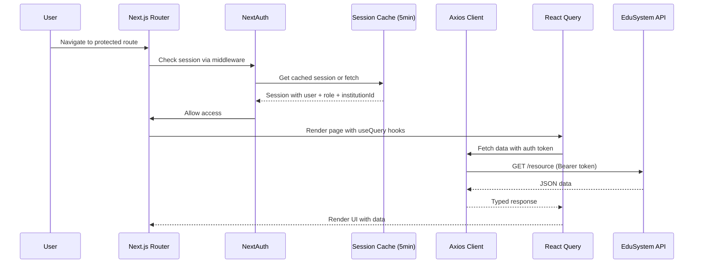

# EduSystem — Frontend AI Agent Operational Guide

> **Version:** 1.0
> **Last Updated:** 2026-05-14
> **Classification:** Internal — AI Coding Agents & Engineering Team
> **Scope:** Frontend Architecture, Next.js App Router, React Query, Zustand, Authentication-Aware UX, UI Consistency & Scalable React Development
> **Parent:** `AGENTS.md` (full-stack source of truth)

---

## Table of Contents

1. [Purpose](#1-purpose)
2. [Scope](#2-scope)
3. [Non-Goals](#3-non-goals)
4. [Required Context](#4-required-context)
5. [Frontend Architectural Principles](#5-frontend-architectural-principles)
6. [Next.js App Router Rules](#6-nextjs-app-router-rules)
7. [Server vs Client Component Rules](#7-server-vs-client-component-rules)
8. [React Query Rules](#8-react-query-rules)
9. [Zustand Rules](#9-zustand-rules)
10. [Authentication & Session Rules](#10-authentication--session-rules)
11. [Tenant-Aware Frontend Rules](#11-tenant-aware-frontend-rules)
12. [API Integration Rules](#12-api-integration-rules)
13. [UI Component Rules](#13-ui-component-rules)
14. [shadcn/ui & Radix Rules](#14-shadcnui--radix-rules)
15. [Form Handling Rules](#15-form-handling-rules)
16. [State Management Rules](#16-state-management-rules)
17. [Error & Loading State Rules](#17-error--loading-state-rules)
18. [Accessibility Rules](#18-accessibility-rules)
19. [Performance Rules](#19-performance-rules)
20. [Security Rules](#20-security-rules)
21. [Styling Rules](#21-styling-rules)
22. [File Organization Rules](#22-file-organization-rules)
23. [Preferred Patterns](#23-preferred-patterns)
24. [Forbidden Patterns](#24-forbidden-patterns)
25. [Development Workflow Expectations](#25-development-workflow-expectations)
26. [Validation Checklist](#26-validation-checklist)
27. [Expected Quality Standards](#27-expected-quality-standards)

---

## 1. Purpose

This document is the authoritative behavioral and architectural guide for AI coding agents modifying **frontend architecture, UI consistency, state management, API integration, authentication-aware UX, and scalable React development** within the EduSystem repository.

It defines the non-negotiable architectural invariants, technical constraints, and operational guarantees that every frontend code change must preserve.

Every modification to frontend architecture must preserve:

- **App Router integrity** — Server/client component boundaries, nested layouts, route protection
- **State management separation** — React Query for server state, Zustand for UI state only
- **Authentication-aware UX** — Session-aware rendering, protected routes, role-based navigation
- **Tenant-aware behavior** — Institution context from session, never trust client-provided tenant IDs
- **UI consistency** — shadcn/ui primitives, Tailwind v4 design system, accessible components

---

## 2. Scope

This guide covers all frontend code modifications within the `frontend/` directory:

- **Next.js App Router** — Page components, layouts, route handlers, middleware
- **State management** — React Query hooks (`src/lib/api/*.ts`), Zustand stores
- **Authentication** — NextAuth v5 configuration, session handling, protected routes
- **API integration** — Axios client (`src/lib/api.ts`), typed API hooks
- **UI components** — shadcn/ui primitives, feature components, layouts
- **Styling** — Tailwind v4, responsive design, design system consistency

---

## 3. Non-Goals

This document does not cover:

- Backend API design or implementation
- Database schema or Prisma changes
- Worker/queue architecture
- Infrastructure configuration (Docker, Redis, MinIO)
- Mobile app development
- Third-party external services beyond API integration

---

## 4. Required Context

Before modifying any frontend code, AI systems **MUST** read and follow these documents as authoritative architectural sources:

| Document | Purpose |
|----------|---------|
| `docs/ARCHITECTURE.md` | High-level system design, dual-mode runtime (APP_MODE) |
| `docs/AUTH.md` | Authentication flow, JWT handling, session security |
| `docs/MULTITENANCY.md` | Tenant scoping, institutionId propagation |
| `docs/INFRASTRUCTURE.md` | API endpoints, environment variables |
| `docs/WORKERS.md` | Async workflows (for notification handling) |
| `AGENTS.md` | Full-stack source of truth, parent operational guide |
| `agents/auth-agent.md` | Authentication/authorization rules |
| `agents/worker-agent.md` | Background worker patterns |

---

## 5. Frontend Architectural Principles

### 5.1 Core Tenets

1. **Server-first architecture** — Default to server components; opt-in to client components only when interactivity requires it
2. **State separation** — React Query manages server state; Zustand manages UI state only
3. **Type safety** — No `any` types; all API responses typed; Zod schemas for form validation
4. **Authentication-aware** — All UI renders based on session context; protected routes enforced at middleware level
5. **Tenant-aware** — Institution context derived from session; never trust client-provided tenant identifiers
6. **Accessible by default** — ARIA labels, keyboard navigation, semantic HTML
7. **Performance-conscious** — Code splitting, lazy loading, memoization where justified

### 5.2 Technology Stack

| Layer | Technology | Version | Purpose |
|-------|-----------|---------|---------|
| Framework | Next.js | 16.2.1 | App Router, server rendering |
| Runtime | React | 19.2.4 | UI framework |
| Language | TypeScript | 5.x | Type safety |
| Server State | React Query | 5.94.5 | Async data management |
| Client State | Zustand | 5.0.12 | UI state management |
| Styling | Tailwind CSS | 4 | Utility-first CSS |
| UI Components | shadcn/ui | 4.1.0 | Accessible React primitives |
| Icons | Lucide React | 1.14.0 | Icon library |
| Forms | React Hook Form + Zod | 7.71 + 4.3.6 | Form handling + validation |
| Auth | NextAuth | 5.0.0-beta.30 | Session management |
| HTTP Client | Axios | 1.13.6 | REST API calls |
| Notifications | sonner | 2.0.7 | Toast notifications |

### 5.3 Request Lifecycle



---

## 6. Next.js App Router Rules

### 6.1 Route Organization

Routes are organized by role-based areas:

```
src/app/
├── admin/           # ADMIN, DIRECTOR, SECRETARY, PRECEPTOR
│   ├── dashboard/
│   ├── users/
│   ├── students/
│   ├── courses/
│   └── ...
├── teacher/        # TEACHER
│   ├── dashboard/
│   ├── grades/
│   └── ...
├── profile/        # Shared profile
├── login/          # Public authentication
└── invite/         # Public invitation acceptance
```

### 6.2 Layout Usage

Every authenticated route uses a role-specific layout:

- **Admin routes** — `src/app/admin/layout.tsx` wraps with `AppLayout`
- **Teacher routes** — `src/app/teacher/layout.tsx` wraps with `AppLayout`
- **Profile route** — `src/app/profile/layout.tsx` provides minimal layout

All authenticated layouts include:
- `AppLayout` component with sidebar, header, and main content area
- Role-based navigation via `getNavigation(role)` from `navigation.ts`
- `LeaveBanner` component for users with `status === 'ON_LEAVE'`

### 6.3 Route Protection

Routes are protected at the middleware level (`src/middleware/middleware.ts`):

- Unauthenticated users redirected to `/login`
- Role-specific routes enforce proper role access
- Session expiry triggers automatic logout

### 6.4 Route Definition Patterns

Page components follow the thin orchestrator pattern:

```typescript
// src/app/admin/students/page.tsx
'use client';
import { useState } from 'react';
import { useStudents } from '@/lib/api/students';
import { StudentsTable } from './_components/students-table';
import { CreateStudentDialog } from './_components/create-student-dialog';
import { useIsOnLeave } from '@/lib/hooks/use-is-on-leave';

export default function StudentsPage() {
  const [view, setView] = useState<'list' | 'grid'>('list');
  const isOnLeave = useIsOnLeave();
  const { data: students, isLoading } = useStudents();

  return (
    <div className="space-y-6">
      <div className="flex items-center justify-between">
        <h1 className="text-xl font-semibold">Alumnos</h1>
        {!isOnLeave && <CreateStudentDialog />}
      </div>
      <StudentsTable students={students} isLoading={isLoading} />
    </div>
  );
}
```

### 6.5 Nested Routing

Use nested routes for complex features:

```
src/app/admin/courses/[id]/
├── page.tsx           # Course overview
├── _components/
│   ├── course-subject-card.tsx
│   └── course-student-card.tsx
├── students/          # Nested route for course students
│   └── page.tsx
└── grades/            # Nested route for course grades
    └── page.tsx
```

### 6.6 Forbidden Patterns

- **Never** create routes outside the established role-based structure without architectural review
- **Never** bypass the layout system — always wrap authenticated routes with appropriate layout
- **Never** mix route logic with direct API calls — use React Query hooks consistently

---

## 7. Server vs Client Component Rules

### 7.1 Server Component Default

All page and layout components default to server components. Use `'use client'` only when:

- Component uses hooks: `useState`, `useEffect`, `useRef`, `useCallback`, `useMemo`
- Component uses event handlers: `onClick`, `onChange`, `onSubmit`
- Component uses React Query hooks: `useQuery`, `useMutation`
- Component uses client-side libraries that require browser APIs
- Component renders interactive UI: accordions, dialogs, dropdowns

### 7.2 Server Component Usage

Server components handle:

- Static data rendering
- SEO-critical content
- Layout wrappers (fetching session data)
- Data transformation (server-side filtering, sorting)

```typescript
// Server component — data fetching
// src/app/admin/dashboard/page.tsx
import { getServerClient } from '@/lib/api';
import { auth } from '@/lib/auth';
import { DashboardCards } from './_components/dashboard-cards';

export default async function DashboardPage() {
  const session = await auth();
  const api = createServerClient(session.accessToken);

  const [students, courses] = await Promise.all([
    api.get('/students/count').then(r => r.data),
    api.get('/courses/count').then(r => r.data),
  ]);

  return <DashboardCards students={students} courses={courses} />;
}
```

### 7.3 Client Component Usage

Client components handle:

- Interactive UI (forms, buttons, dialogs)
- React Query hooks (data fetching, mutations)
- Local state (`useState`)
- UI-only state via Zustand

```typescript
// Client component — interactive UI
// src/app/admin/students/_components/students-table.tsx
'use client';
import { useStudents } from '@/lib/api/students';

export function StudentsTable() {
  const { data: students, isLoading } = useStudents();

  if (isLoading) return <Skeleton />;

  return (
    <Table>
      {students?.map(student => (
        <TableRow key={student.id} student={student} />
      ))}
    </Table>
  );
}
```

### 7.4 Hydration Considerations

Avoid hydration mismatches:

- **Never** render different content on server vs client based on random values or timing
- **Never** use `typeof window !== 'undefined'` for core rendering logic
- **Always** use `useEffect` for client-only logic that runs after hydration
- **Always** provide meaningful SSR fallback for client-only components (loading skeletons, static content)

### 7.5 Server Actions

Server actions are used for form submissions that require server-side validation or database mutations:

```typescript
// src/app/actions/create-student.ts
'use server';
import { auth } from '@/lib/auth';
import { createServerClient } from '@/lib/api';
import { z } from 'zod';

const createStudentSchema = z.object({
  firstName: z.string().min(1, 'Requerido'),
  lastName: z.string().min(1, 'Requerido'),
  documentNumber: z.string().min(1, 'Requerido'),
  birthDate: z.string().date(),
});

export async function createStudent(data: unknown) {
  const session = await auth();
  const api = createServerClient(session.accessToken);

  const parsed = createStudentSchema.parse(data);
  const res = await api.post('/students', parsed);
  revalidatePath('/admin/students');
  return res.data;
}
```

### 7.6 Forbidden Patterns

- **Never** use `'use client'` unnecessarily — every client boundary adds JavaScript bundle size
- **Never** put server-only logic (database queries, file I/O) in client components
- **Never** bypass the server/client boundary for data fetching — always use React Query in client components
- **Never** use browser-only APIs (`window`, `document`, `localStorage`) in server components
- **Never** create hydration mismatches — consistent rendering between server and client

---

## 8. React Query Rules

### 8.1 Server State Management

React Query manages **all server state** — data fetched from the backend API. It handles caching, invalidation, refetching, and loading states.

All React Query hooks are centralized in `src/lib/api/*.ts` files (one file per domain):

- `src/lib/api/students.ts` — Student CRUD hooks
- `src/lib/api/grades.ts` — Grade management hooks
- `src/lib/api/attendance.ts` — Attendance hooks
- `src/lib/api/courses.ts` — Course hooks
- etc.

### 8.2 Query Hook Pattern

```typescript
// src/lib/api/students.ts
export function useStudents(filters?: StudentFilters) {
  return useQuery({
    queryKey: ['students', filters],
    queryFn: async () => {
      const params = new URLSearchParams();
      if (filters?.courseId) params.set('courseId', filters.courseId);
      const res = await api.get<Student[]>(`/students?${params}`);
      return res.data;
    },
    staleTime: 5 * 60 * 1000, // 5 minutes
  });
}
```

### 8.3 Mutation Hook Pattern

```typescript
// src/lib/api/students.ts
export function useCreateStudent() {
  const queryClient = useQueryClient();
  return useMutation({
    mutationFn: async (data: CreateStudentDto) => {
      const res = await api.post<Student>('/students', data);
      return res.data;
    },
    onSuccess: () => {
      queryClient.invalidateQueries({ queryKey: ['students'] });
      toast.success('Alumno creado exitosamente');
    },
    onError: () => toast.error('Error al crear el alumno'),
  });
}
```

### 8.4 Query Key Convention

Use consistent, descriptive query keys:

- `['students']` — List all students
- `['students', studentId]` — Single student
- `['students', { courseId: 'xxx' }]` — Filtered students
- `['courses', 'my-subjects']` — Special query (teacher subjects)

**Never** use dynamic keys that change per render — this causes infinite refetching.

### 8.5 Stale Time Configuration

Configure appropriate stale times per data type:

| Data Type | Stale Time | Rationale |
|----------|-----------|-----------|
| User session | 5 minutes | Session cache in axios |
| Reference data (courses, subjects) | 10 minutes | Infrequently changing |
| Student list | 5 minutes | May change during day |
| Grades, attendance | 2 minutes | Frequently updated |
| Real-time (notifications) | 30 seconds | Near real-time updates |

### 8.6 Invalidation Strategy

Invalidate related queries after mutations:

```typescript
// After creating a student, invalidate all student-related queries
queryClient.invalidateQueries({ queryKey: ['students'] });

// After recording attendance, invalidate attendance queries
queryClient.invalidateQueries({ queryKey: ['attendance'] });
queryClient.invalidateQueries({ queryKey: ['attendance', courseId] });
```

### 8.7 Optimistic Updates

Use optimistic updates for better UX on frequently updated data:

```typescript
export function useUpdateGrade() {
  const queryClient = useQueryClient();
  return useMutation({
    mutationFn: updateGrade,
    onMutate: async (newGrade) => {
      await queryClient.cancelQueries({ queryKey: ['grades'] });
      const previous = queryClient.getQueryData(['grades']);
      queryClient.setQueryData(['grades'], (old) =>
        old.map(g => g.id === newGrade.id ? { ...g, ...newGrade } : g)
      );
      return { previous };
    },
    onError: (err, newGrade, context) => {
      queryClient.setQueryData(['grades'], context.previous);
    },
    onSettled: () => {
      queryClient.invalidateQueries({ queryKey: ['grades'] });
    },
  });
}
```

### 8.8 Loading & Error States

Always handle loading and error states in UI:

```typescript
const { data, isLoading, isError, error } = useStudents();

if (isLoading) return <StudentsSkeleton />;
if (isError) return <ErrorDisplay message={getErrorMessage(error)} />;
```

### 8.9 Parallel Queries

Use `Promise.all` for parallel independent queries:

```typescript
const [students, courses, periods] = await Promise.all([
  api.get('/students').then(r => r.data),
  api.get('/courses').then(r => r.data),
  api.get('/periods').then(r => r.data),
]);
```

### 8.10 Disabled Queries

Use `enabled` option to conditionally fetch:

```typescript
export function useCourseStudents(courseId: string) {
  return useQuery({
    queryKey: ['courses', courseId, 'students'],
    queryFn: async () => {
      const res = await api.get<Student[]>(`/courses/${courseId}/students`);
      return res.data;
    },
    enabled: !!courseId, // Only fetch if courseId exists
  });
}
```

### 8.11 Forbidden Patterns

- **Never** use `fetch` or axios directly in components — always use React Query hooks
- **Never** duplicate query logic across components — create reusable hooks in `src/lib/api/*.ts`
- **Never** use inconsistent query keys — broken caching results
- **Never** skip loading/error states — poor UX
- **Never** store server data in Zustand — duplication, cache inconsistency
- **Never** use `useEffect` for data fetching — React Query handles this

---

## 9. Zustand Rules

### 9.1 Client State Only

Zustand manages **only client-side UI state** — state that exists only in the browser and doesn't need server synchronization:

- Modal open/close state
- Sidebar toggle state
- Active tab state
- Form draft state (unsaved)
- UI theme preferences

### 9.2 Example: UI Store

```typescript
// src/lib/stores/ui-store.ts
import { create } from 'zustand';

interface UIState {
  sidebarOpen: boolean;
  toggleSidebar: () => void;
  setSidebarOpen: (open: boolean) => void;
}

export const useUIStore = create<UIState>((set) => ({
  sidebarOpen: false,
  toggleSidebar: () => set((state) => ({ sidebarOpen: !state.sidebarOpen })),
  setSidebarOpen: (open) => set({ sidebarOpen: open }),
}));
```

### 9.3 Store Structure

Keep stores small and focused:

- **One store per concern** — don't create monolithic stores
- **Minimal state** — only UI state, never duplicate server data
- **Actions co-located** — define actions in the same file as state

### 9.4 Forbidden Patterns

- **Never** store server-state in Zustand — use React Query for this
- **Never** duplicate React Query cache in Zustand — cache inconsistency
- **Never** create oversized global stores — hard to maintain
- **Never** use Zustand for data that should come from API — broken caching
- **Never** store sensitive data (tokens, passwords) in Zustand — use session
- **Never** use Zustand for state that should be server-synchronized

---

## 10. Authentication & Session Rules

### 10.1 NextAuth v5 Configuration

NextAuth is configured in `src/lib/auth.ts`:

```typescript
// src/lib/auth.ts
export const config: NextAuthConfig = {
  providers: [
    Credentials({
      async authorize(credentials) {
        const res = await axios.post(`${BASE_URL}/auth/login`, {
          email: credentials.email,
          password: credentials.password,
        });
        const { accessToken, refreshToken, user } = res.data;
        return {
          id: user.id,
          email: user.email,
          name: `${user.firstName} ${user.lastName}`,
          role: user.role,
          institutionId: user.institutionId,
          status: user.status,
          leaveStartDate: user.leaveStartDate,
          accessToken,
          refreshToken,
        };
      },
    }),
  ],
  callbacks: {
    async jwt({ token, user }) {
      if (user) Object.assign(token, user);
      return token;
    },
    async session({ session, token }) {
      session.user.id = token.id as string;
      session.user.role = token.role as string;
      session.user.institutionId = token.institutionId as string | null;
      session.user.status = token.status as string;
      session.user.leaveStartDate = token.leaveStartDate as string | null;
      session.accessToken = token.accessToken as string;
      return session;
    },
  },
  pages: { signIn: '/login' },
  secret: process.env.NEXTAUTH_SECRET,
};
```

### 10.2 Session Access

Use `useAppSession` hook for session access in client components:

```typescript
// src/lib/hooks/use-app-session.ts
import { useSession } from 'next-auth/react';

export function useAppSession() {
  return useSession();
}
```

For server components, use `auth()`:

```typescript
import { auth } from '@/lib/auth';

export default async function Page() {
  const session = await auth();
  const role = session?.user?.role;
  // ...
}
```

### 10.3 Session Caching

Axios client caches session for 5 minutes to avoid repeated `/api/auth/session` calls:

```typescript
// src/lib/api.ts
const CACHE_TTL_MS = 5 * 60 * 1000; // 5 minutos
let cachedSession = null;
let cacheExpiresAt = 0;

async function getCachedSession() {
  if (cachedSession && Date.now() < cacheExpiresAt) {
    return cachedSession;
  }
  cachedSession = await getSession();
  cacheExpiresAt = Date.now() + CACHE_TTL_MS;
  return cachedSession;
}
```

Invalidate cache on login/logout:

```typescript
export function invalidateSessionCache() {
  cachedSession = null;
  cacheExpiresAt = 0;
}
```

### 10.4 Protected Routes

Middleware enforces authentication:

```typescript
// src/middleware/middleware.ts
export { auth as middleware } from '@/lib/auth';

export const config = {
  matcher: ['/((?!login|invite|api|_next/static|_next/image|favicon.ico).*)'],
};
```

### 10.5 Role-Based Navigation

Navigation is **config-driven and domain-grouped** — items are defined once per role in `src/components/layouts/navigation/config.ts` and rendered by a single `AppSidebar` using shadcn Sidebar primitives. Groups represent functional domains (e.g., "GESTIÓN DOCENTE"), not user roles.

```typescript
// src/components/layouts/navigation/config.ts
export const navigationByRole: Record<string, NavigationConfig> = {
  ADMIN: adminNav,
  DIRECTOR: adminNav,
  SECRETARY: adminNav,
  PRECEPTOR: preceptorNav,
  TEACHER: teacherNav,
  GUARDIAN: guardianNav,
  SUPER_ADMIN: superadminNav,
};

// Navigation is resolved via helpers
export function getNavConfig(role: string | undefined): NavigationConfig {
  return navigationByRole[role ?? ''] ?? teacherNav;
}
```

**Structure:** Each config contains a standalone `dashboard` item and an array of domain `groups`, each with typed `NavItem` entries. See `docs/frontend/sidebar-navigation-architecture.md` for full documentation.

### 10.6 ON_LEAVE Handling

Users with `status === 'ON_LEAVE'` are blocked from mutations both at API level (guard) and client level:

```typescript
// src/lib/api.ts — axios request interceptor
const MUTATING_METHODS = ['post', 'put', 'patch', 'delete'];
const status = (session?.user as any)?.status;
if (status === 'ON_LEAVE' && MUTATING_METHODS.includes(config.method ?? '')) {
  toast.error('Tu cuenta está en licencia. No podés realizar cambios.');
  const controller = new AbortController();
  controller.abort();
  config.signal = controller.signal;
}
```

Client-side check via hook:

```typescript
// src/lib/hooks/use-is-on-leave.ts
export function useIsOnLeave(): boolean {
  const { data: session } = useAppSession();
  return (session?.user as any)?.status === 'ON_LEAVE';
}
```

Usage in UI:

```typescript
const isOnLeave = useIsOnLeave();
// Disable mutation buttons
<Button disabled={isOnLeave}>Guardar</Button>
```

### 10.7 Auto-Logout on 401

Axios interceptor handles 401 responses:

```typescript
// src/lib/api.ts
api.interceptors.response.use(
  (response) => response,
  async (error: AxiosError) => {
    if (error.response?.status === 401) {
      invalidateSessionCache();
      await signOut({ callbackUrl: '/login' });
    }
    return Promise.reject(error);
  },
);
```

### 10.8 Forbidden Patterns

- **Never** trust client-side authorization alone — server enforces permissions
- **Never** expose access tokens in URLs or logs
- **Never** store tokens in localStorage — session handles this
- **Never** assume session exists without checking — always use `useAppSession()`
- **Never** bypass ON_LEAVE checks in UI — enforce at both client and server

---

## 11. Tenant-Aware Frontend Rules

### 11.1 Institution Context

The frontend operates within a single tenant context — the logged-in user's institution:

- `session.user.institutionId` — Current tenant identifier
- All API requests include `institutionId` via backend middleware (not sent from frontend)
- Frontend never sends `institutionId` in request body or params

### 11.2 Tenant Isolation

Frontend respects tenant boundaries:

- Users only see data from their institution (backend enforces this)
- Navigation shows only institution-relevant features
- API responses are already filtered by backend (via `institutionId` in JWT)

### 11.3 Forbidden Patterns

- **Never** allow frontend to override tenant context — backend enforces
- **Never** trust client-provided `institutionId` — always derive from session
- **Never** create cross-tenant queries in frontend — backend handles isolation
- **Never** cache data across tenant contexts — tenant-specific caches

---

## 12. API Integration Rules

### 12.1 Axios Singleton

All API calls go through the singleton `api` instance from `src/lib/api.ts`:

```typescript
// src/lib/api.ts
const BASE_URL = process.env.NEXT_PUBLIC_API_URL ?? 'http://localhost:4000/api/v1';

export const api: AxiosInstance = axios.create({
  baseURL: BASE_URL,
  headers: { 'Content-Type': 'application/json' },
  timeout: 15000,
});
```

**Never** create new axios instances — always import `api` from `@/lib/api`.

### 12.2 Request Interceptor

The request interceptor:

- Injects `Authorization: Bearer {accessToken}` header
- Blocks mutating requests for `ON_LEAVE` users
- Handles session caching

### 12.3 Response Interceptor

The response interceptor:

- Handles 401 → auto-logout
- Handles 403 with license message → show toast
- Passes errors to calling code

### 12.4 Typed Responses

All API calls use typed responses:

```typescript
const res = await api.get<Student[]>('/students');
const students: Student[] = res.data;

const res = await api.post<CreateStudentResponse>('/students', data);
const created: CreateStudentResponse = res.data;
```

### 12.5 Error Handling

Use centralized error handling:

```typescript
// src/lib/api.ts
export interface ApiError {
  statusCode: number;
  error: string;
  message: string | string[];
  timestamp: string;
  path: string;
}

export function getErrorMessage(error: unknown): string {
  if (axios.isAxiosError(error)) {
    const data = error.response?.data as ApiError | undefined;
    if (data?.message) {
      return Array.isArray(data.message)
        ? data.message.join(', ')
        : data.message;
    }
  }
  return 'Ocurrió un error inesperado';
}
```

### 12.6 Server Client for Server Components

For server components, use the server client:

```typescript
// src/lib/api.ts
export function createServerClient(token: string) {
  return axios.create({
    baseURL: BASE_URL,
    headers: {
      'Content-Type': 'application/json',
      Authorization: `Bearer ${token}`,
    },
    timeout: 15000,
  });
}
```

### 12.7 Pagination

Handle pagination consistently:

```typescript
// Query params
GET /students?page=1&limit=20

// Response is array directly (not wrapped)
Student[]
```

### 12.8 Forbidden Patterns

- **Never** create new axios instances — breaks auth interceptors and session caching
- **Never** use `fetch` for API calls — use axios with interceptors
- **Never** skip error handling — always use `getErrorMessage()` for user feedback
- **Never** use `any` for API response types — break type safety

---

## 13. UI Component Rules

### 13.1 Component Types

Components are organized by responsibility:

| Type | Location | Purpose |
|------|----------|---------|
| Page orchestrators | `src/app/[area]/[page]/page.tsx` | Global state, hook calls |
| Feature components | `src/app/[area]/[page]/_components/` | Isolated UI logic |
| Shared UI | `src/components/ui/` | shadcn/ui primitives |
| Layouts | `src/components/layouts/` | App shell, navigation |
| Hooks | `src/lib/hooks/` | Reusable logic |

### 13.2 Page Component Pattern

Pages are thin orchestrators:

```typescript
// src/app/admin/students/page.tsx
'use client';
import { useState } from 'react';
import { useStudents } from '@/lib/api/students';
import { StudentsTable } from './_components/students-table';
import { CreateStudentDialog } from './_components/create-student-dialog';
import { useIsOnLeave } from '@/lib/hooks/use-is-on-leave';

export default function StudentsPage() {
  const [view, setView] = useState<'list' | 'grid'>('list');
  const isOnLeave = useIsOnLeave();
  const { data: students, isLoading } = useStudents();

  return (
    <div className="space-y-6">
      <div className="flex items-center justify-between">
        <h1 className="text-xl font-semibold">Alumnos</h1>
        {!isOnLeave && <CreateStudentDialog />}
      </div>
      <StudentsTable students={students} isLoading={isLoading} />
    </div>
  );
}
```

### 13.3 Feature Components

Complex features are split into isolated components:

```
src/app/admin/grades/
├── page.tsx                  # Page orchestrator
└── _components/
    ├── grades.types.ts       # Zod schemas, types, constants
    ├── grades-table.tsx      # Table component
    ├── create-grade-dialog.tsx # Create form dialog
    ├── bulk-grades-entry.tsx  # Bulk entry component
    └── grade-filters.tsx      # Filter controls
```

### 13.4 Reusable Component Design

Components should be:

- **Composable** — Accept props for customization
- **Isolated** — No coupling to parent page logic
- **Focused** — Single responsibility
- **Testable** — Props drive rendering

### 13.5 Forbidden Patterns

- **Never** create giant monolithic components — split into focused sub-components
- **Never** duplicate UI logic — extract to shared component
- **Never** deeply nest component trees (>5 levels) — refactor
- **Never** tightly couple feature components — use props for communication

---

## 14. shadcn/ui & Radix Rules

### 14.1 Component Library

shadcn/ui provides accessible, composable components built on Radix UI primitives:

| Component | Radix Primitive | Purpose |
|-----------|----------------|---------|
| Button | - | Action buttons |
| Dialog | Dialog | Modal dialogs |
| DropdownMenu | DropdownMenu | Dropdown menus |
| Select | Select | Selection inputs |
| Tabs | Tabs | Tab navigation |
| Table | - | Data tables |
| Form | - | Form field wrappers |
| Input | - | Text inputs |
| Textarea | - | Multi-line text |
| Avatar | - | User avatars |
| Badge | - | Status badges |
| Card | - | Content containers |
| Sheet | Sheet | Slide-out panels |
| Popover | Popover | Popover containers |
| Tooltip | Tooltip | Tooltip hints |
| AlertDialog | AlertDialog | Confirmation dialogs |
| ScrollArea | ScrollArea | Scrollable areas |
| Separator | - | Visual dividers |
| Skeleton | - | Loading placeholders |

### 14.2 Usage Pattern

Import from `@/components/ui/[component]`:

```typescript
import { Button } from '@/components/ui/button';
import { Dialog, DialogTrigger, DialogContent } from '@/components/ui/dialog';
import { Table, TableHeader, TableRow, TableCell } from '@/components/ui/table';
```

### 14.3 Composition Example

```typescript
<Dialog>
  <DialogTrigger asChild>
    <Button>Crear Alumno</Button>
  </DialogTrigger>
  <DialogContent>
    <DialogHeader>
      <DialogTitle>Nuevo Alumno</DialogTitle>
      <DialogDescription>
        Complete los datos del nuevo alumno
      </DialogDescription>
    </DialogHeader>
    <CreateStudentForm />
  </DialogContent>
</Dialog>
```

### 14.4 Accessibility

All shadcn/ui components are accessible by default:

- Keyboard navigation
- ARIA attributes
- Focus management
- Screen reader support

**Never** build custom accessible components when shadcn/ui provides one — use the primitive.

### 14.5 Customization

Customize via Tailwind classes on component props:

```typescript
<Button className="bg-primary hover:bg-primary/90">
  Custom Button
</Button>

<DialogContent className="max-w-md">
  Custom Dialog
</DialogContent>
```

### 14.6 Forbidden Patterns

- **Never** create custom accessible components when shadcn/ui has them
- **Never** skip accessibility when extending shadcn/ui components
- **Never** use non-Radix alternatives — shadcn/ui is the standard
- **Never** break accessibility when customizing — maintain ARIA

---

## 15. Form Handling Rules

### 15.1 React Hook Form + Zod

All forms use React Hook Form with Zod validation:

```typescript
// src/app/admin/students/_components/create-student-dialog.tsx
import { useForm } from 'react-hook-form';
import { zodResolver } from '@hookform/resolvers/zod';
import { createStudentSchema, CreateStudentForm } from './students.types';

const form = useForm<CreateStudentForm>({
  resolver: zodResolver(createStudentSchema),
  defaultValues: {
    firstName: '',
    lastName: '',
    documentNumber: '',
    birthDate: '',
  },
});

async function onSubmit(data: CreateStudentForm) {
  await createStudent.mutateAsync(data);
  setOpen(false);
  form.reset();
}
```

### 15.2 Schema Definition

Define Zod schemas in types file:

```typescript
// src/app/admin/students/_components/students.types.ts
import { z } from 'zod';

export const createStudentSchema = z.object({
  firstName: z.string().min(1, 'Requerido').max(50),
  lastName: z.string().min(1, 'Requerido').max(50),
  documentNumber: z.string().min(1, 'Requerido').max(20),
  birthDate: z.string().date('Fecha inválida'),
  bloodType: z.string().optional(),
  medicalNotes: z.string().max(500).optional(),
});

export type CreateStudentForm = z.infer<typeof createStudentSchema>;
```

### 15.3 Form UI Components

Use shadcn/ui form components:

```typescript
import { Form, FormField, FormItem, FormLabel, FormControl, FormMessage } from '@/components/ui/form';
import { Input } from '@/components/ui/input';

<FormField
  control={form.control}
  name="firstName"
  render={({ field }) => (
    <FormItem>
      <FormLabel>Nombre</FormLabel>
      <FormControl>
        <Input placeholder="Juan" {...field} />
      </FormControl>
      <FormMessage />
    </FormItem>
  )}
/>
```

### 15.4 Loading State

Handle form submission loading:

```typescript
<Button type="submit" disabled={form.formState.isSubmitting}>
  {form.formState.isSubmitting ? 'Guardando...' : 'Guardar'}
</Button>
```

### 15.5 Error Display

Use `FormMessage` for error display — automatically shows validation errors.

### 15.6 Forbidden Patterns

- **Never** use uncontrolled forms — use React Hook Form
- **Never** skip Zod validation — inconsistent validation experience
- **Never** skip loading state during submission — poor UX
- **Never** skip form reset after successful submission — stale data remains

---

## 16. State Management Rules

### 16.1 Server vs Client State

| State Type | Management | Examples |
|------------|------------|----------|
| Server state | React Query | Students, grades, courses, attendance |
| Client UI state | Zustand | Modal open/close, sidebar toggle |
| Form state | React Hook Form | Form input values, validation |
| Session state | NextAuth | User, role, token, institutionId |

### 16.2 State Ownership

Each state type has a single source of truth:

- **React Query** — caches server data, handles invalidation
- **Zustand** — UI-only state, no server sync
- **React Hook Form** — form-specific state
- **NextAuth** — authentication state

### 16.3 Forbidden Patterns

- **Never** duplicate server state in Zustand — cache inconsistency
- **Never** mix state types — unclear ownership
- **Never** use localStorage for state — not React-aware
- **Never** use context for everything — Zustand for global UI state

---

## 17. Error & Loading State Rules

### 17.1 Loading States

Always show loading state during data fetch:

```typescript
const { data, isLoading } = useStudents();

if (isLoading) return <StudentsSkeleton />;
```

Use shadcn/ui Skeleton component:

```typescript
// src/components/ui/skeleton.tsx
<Skeleton className="h-4 w-[250px]" />
```

### 17.2 Error States

Show error states gracefully:

```typescript
const { data, isError, error } = useStudents();

if (isError) return (
  <Alert variant="destructive">
    <AlertCircleIcon />
    <AlertTitle>Error</AlertTitle>
    <AlertDescription>{getErrorMessage(error)}</AlertDescription>
  </Alert>
);
```

### 17.3 Empty States

Show meaningful empty states:

```typescript
if (!students?.length) return (
  <div className="text-center py-8">
    <UsersIcon className="mx-auto h-12 w-12 text-muted" />
    <p className="mt-2 text-muted">No hay alumnos registrados</p>
  </div>
);
```

### 17.4 Retry UX

For transient errors, provide retry:

```typescript
<Button onClick={() => refetch()}>Reintentar</Button>
```

### 17.5 Toast Notifications

Use sonner for user feedback:

```typescript
import { toast } from 'sonner';

toast.success('Alumno creado exitosamente');
toast.error('Error al crear el alumno');
toast.info('Asistencia guardada');
```

### 17.6 Forbidden Patterns

- **Never** show no feedback during loading — spinner or skeleton required
- **Never** show raw error messages — use `getErrorMessage()` for user-friendly text
- **Never** skip empty states — users need feedback when data is absent

---

## 18. Accessibility Rules

### 18.1 Semantic HTML

Use proper HTML elements:

- **Never** use `<div>` for interactive elements — use `<button>` or `<a>`
- **Never** skip heading hierarchy — use `<h1>` → `<h2>` → `<h3>`
- **Never** use non-semantic containers — use `<section>`, `<nav>`, `<main>`

### 18.2 Keyboard Navigation

All interactive elements must be keyboard-accessible:

- **Always** use shadcn/ui components — they handle keyboard navigation
- **Never** trap keyboard focus — no infinite focus loops
- **Always** provide visible focus indicators

### 18.3 ARIA Labels

Provide accessible labels:

```typescript
// For icon-only buttons
<Button aria-label="Cerrar sesión">
  <LogOutIcon />
</Button>

// For form inputs
<FormField
  aria-label="Nombre del alumno"
/>
```

### 18.4 Focus Management

Manage focus for dialogs and modals:

- Focus moves to dialog on open
- Focus returns to trigger on close
- Focus trapped within dialog while open

(shadcn/ui Dialog handles this automatically)

### 18.5 Screen Reader Support

Use accessible UI patterns:

- **Always** use shadcn/ui — Radix provides ARIA
- **Never** hide content from screen readers unless intentional
- **Always** provide alt text for images

### 18.6 Color Contrast

Ensure sufficient color contrast (WCAG AA):

- Text: 4.5:1 contrast ratio minimum
- Large text: 3:1 contrast ratio minimum
- UI elements: 3:1 contrast ratio minimum

### 18.7 Forbidden Patterns

- **Never** create custom accessible patterns when shadcn/ui provides them
- **Never** break accessibility with custom styling
- **Never** skip keyboard navigation testing
- **Never** use color alone for information — add text or icons

---

## 19. Performance Rules

### 19.1 Code Splitting

Next.js automatically code-splits by route. For large route bundles, use dynamic imports:

```typescript
import dynamic from 'next/dynamic';

const HeavyChart = dynamic(() => import('./components/heavy-chart'), {
  loading: () => <Skeleton />,
  ssr: false, // No SSR for client-only components
});
```

### 19.2 Lazy Loading

Lazy load non-critical components:

```typescript
const PDFViewer = dynamic(() => import('./pdf-viewer'), {
  loading: () => <PDFSkeleton />,
});
```

### 19.3 React Query Optimization

Optimize React Query usage:

- **Use staleTime** — reduce refetching
- **Use enabled** — conditional fetching
- **Use select** — transform data without extra render
- **Use placeholderData** — keep previous data while loading

```typescript
useQuery({
  queryKey: ['students'],
  queryFn: fetchStudents,
  staleTime: 5 * 60 * 1000,
  placeholderData: keepPreviousData,
});
```

### 19.4 Memoization

Use `React.memo` for expensive components:

```typescript
const ExpensiveTable = React.memo(function ExpensiveTable({ data }) {
  return <Table data={data} />;
});
```

Use `useCallback` and `useMemo` judiciously:

```typescript
const handleSort = useCallback((column: string) => {
  setSortBy(column);
}, []);

const sortedData = useMemo(() => {
  return data.sort((a, b) => compare(a[sortBy], b[sortBy]));
}, [data, sortBy]);
```

### 19.5 Bundle Size Awareness

Monitor bundle size:

- **Avoid** large dependencies
- **Use** tree-shaking capable libraries
- **Lazy load** features not immediately needed

### 19.6 Server vs Client Rendering

Choose rendering strategy:

- **Static (SSG)** — For pages that never change (rare in EduSystem)
- **Server (SSR)** — For authenticated pages needing session
- **Client (CSR)** — For highly interactive components
- **Incremental (ISR)** — Not currently used

### 19.7 Forbidden Patterns

- **Never** render unnecessary re-renders — memoize expensive components
- **Never** fetch data in useEffect — use React Query
- **Never** skip staleTime configuration — causes excessive refetching
- **Never** create large bundle sizes — code splitting required

---

## 20. Security Rules

### 20.1 Client-Side Security

- **Never** expose sensitive data in URLs or logs
- **Never** store tokens in localStorage — use session
- **Never** trust client-side authorization — server enforces

### 20.2 XSS Prevention

- **Never** use `dangerouslySetInnerHTML` — unless sanitized
- **Always** escape user input in custom components
- **Never** render HTML from API responses without sanitization

### 20.3 Secure API Calls

- **Always** use axios with auth interceptor
- **Never** send credentials in URL params
- **Always** use HTTPS in production

### 20.4 CORS

Frontend works with backend CORS configuration. The backend `ALLOWED_ORIGINS` env var controls which frontend origins can access the API.

### 20.5 Environment Variables

- **Never** expose secrets in frontend code
- **Use** `NEXT_PUBLIC_` prefix only for public config
- **Keep** API URL, auth secrets in environment

### 20.6 File Handling

- **Never** store files locally — use MinIO presigned URLs
- **Validate** file types before upload
- **Use** backend for file operations (upload, download, delete)

### 20.7 Defensive UI

- **Always** validate session before rendering protected content
- **Always** handle 401/403 responses gracefully
- **Never** assume authentication state — check before rendering

### 20.8 Forbidden Patterns

- **Never** expose JWT in console or logs
- **Never** store tokens in localStorage or cookies (except via NextAuth)
- **Never** bypass auth checks in UI
- **Never** trust client-side permissions alone

---

## 21. Styling Rules

### 21.1 Tailwind CSS v4

All styling uses Tailwind CSS v4:

```typescript
<div className="flex items-center justify-between p-4 bg-card rounded-lg border">
  <h1 className="text-xl font-semibold">Alumnos</h1>
  <Button variant="outline">Exportar</Button>
</div>
```

### 21.2 Utility Composition

Compose utilities for consistent design:

```typescript
// Common patterns
className="flex items-center justify-between"
className="space-y-4"
className="grid grid-cols-1 md:grid-cols-2 gap-4"
```

### 21.3 Responsive Design

Use responsive prefixes:

```typescript
className="hidden md:block"          // Show on md+
className="md:grid-cols-2 lg:grid-cols-3"  // Responsive columns
className="text-sm md:text-base"      // Responsive text
```

### 21.4 Design Tokens

Use design tokens from shadcn/ui:

- **Colors** — `bg-primary`, `text-muted-foreground`, `border-input`
- **Spacing** — `p-4`, `m-2`, `gap-4`
- **Typography** — `text-sm`, `font-medium`, `leading-none`
- **Radius** — `rounded-md`, `rounded-lg`
- **Shadows** — `shadow-sm`, `shadow-md`

### 21.5 Consistency

- **Use** consistent spacing (multiples of 4px)
- **Use** consistent typography scale
- **Use** consistent border radius
- **Use** consistent colors across the app

### 21.6 Forbidden Patterns

- **Never** use arbitrary inline styles — use Tailwind
- **Never** duplicate utility patterns — extract to component
- **Never** use inconsistent spacing or typography
- **Never** hardcode colors — use design tokens

---

## 22. File Organization Rules

### 22.1 Directory Structure

```
frontend/src/
├── app/                    # Next.js App Router pages
│   ├── admin/              # Role-based area
│   │   ├── [page]/
│   │   │   ├── page.tsx    # Page orchestrator
│   │   │   └── _components/
│   │   │       ├── [feature].types.ts  # Zod schemas, types
│   │   │       └── [component].tsx     # Feature components
│   │   └── layout.tsx      # Role layout
│   ├── teacher/
│   ├── profile/
│   └── login/
├── components/
│   ├── layouts/            # AppLayout, Sidebar, Header
│   │   ├── navigation/     # Nav config, types, helpers
│   │   │   ├── config.ts
│   │   │   ├── types.ts
│   │   │   └── helpers.ts
│   │   └── components/
│   │       ├── sidebar.tsx
│   │       ├── sidebar-brand.tsx
│   │       ├── sidebar-user.tsx
│   │       └── app-header.tsx
│   ├── ui/                 # shadcn/ui primitives
│   └── [shared]/          # Shared feature components
├── lib/
│   ├── api/                # React Query hooks (per domain)
│   │   ├── students.ts
│   │   ├── grades.ts
│   │   └── ...
│   ├── hooks/              # Custom hooks
│   │   ├── use-app-session.ts
│   │   └── use-is-on-leave.ts
│   ├── stores/             # Zustand stores
│   ├── helpers/            # Export utilities
│   ├── api.ts              # Axios singleton
│   ├── auth.ts             # NextAuth config
│   └── utils.ts            # Utility functions
├── types/                  # Global TypeScript types
└── middleware/             # Next.js middleware
```

### 22.2 Naming Conventions

| Type | Convention | Example |
|------|-----------|---------|
| Files | kebab-case | `create-student-dialog.tsx` |
| Components | PascalCase | `StudentsTable` |
| Hooks | camelCase | `useStudents` |
| Types/Interfaces | PascalCase | `CreateStudentDto` |
| Constants | SCREAMING_SNAKE_CASE | `QUERY_KEYS.STUDENTS` |

### 22.3 Import Organization

Group imports consistently:

```typescript
// 1. React/Next.js
import { useState } from 'react';
import { useRouter } from 'next/navigation';

// 2. External libraries
import { useQuery, useMutation } from '@tanstack/react-query';
import { toast } from 'sonner';

// 3. Internal - UI components
import { Button } from '@/components/ui/button';
import { Dialog } from '@/components/ui/dialog';

// 4. Internal - API hooks
import { useStudents } from '@/lib/api/students';

// 5. Internal - custom hooks
import { useIsOnLeave } from '@/lib/hooks/use-is-on-leave';

// 6. Internal - utils
import { cn } from '@/lib/utils';
```

### 22.4 File Responsibilities

| File | Responsibility |
|------|----------------|
| `page.tsx` | Global state orchestration, hook calls |
| `_components/*.types.ts` | Zod schemas, TypeScript interfaces |
| `_components/[component].tsx` | Isolated UI logic |
| `lib/api/[domain].ts` | React Query hooks for domain |
| `lib/hooks/*.ts` | Reusable logic |
| `components/ui/*.tsx` | shadcn/ui primitives |

### 22.5 Forbidden Patterns

- **Never** create files outside established structure without review
- **Never** mix concerns in single file — separate appropriately
- **Never** create deep folder nesting (>4 levels)
- **Never** duplicate code across files

---

## 23. Preferred Patterns

### 23.1 Server Components

- Use server components for data fetching in page.tsx
- Use server components for static content
- Use server components for layout wrappers

### 23.2 Client Components

- Use client components for interactive UI
- Use client components for React Query hooks
- Use client components for forms

### 23.3 React Query

- Centralize hooks in `src/lib/api/[domain].ts`
- Use consistent query keys
- Configure appropriate staleTime
- Invalidate related queries on mutations

### 23.4 Zustand

- Use for UI state only (modals, sidebar, tabs)
- Keep stores small and focused
- Never duplicate server data

### 23.5 API Integration

- Use axios singleton with interceptors
- Type all API responses
- Handle errors centrally with `getErrorMessage()`

### 23.6 Forms

- React Hook Form + Zod for all forms
- Define schemas in `.types.ts` files
- Reset form after successful submission

### 23.7 UI Components

- Use shadcn/ui primitives exclusively
- Compose components for features
- Keep components focused and reusable

### 23.8 Authentication

- Use NextAuth for session management
- Use `useAppSession()` for client session access
- Use `auth()` for server session access
- Handle 401 responses with auto-logout

### 23.9 Accessibility

- Use semantic HTML
- Use shadcn/ui for keyboard navigation
- Test with keyboard only

### 23.10 Performance

- Use staleTime to reduce refetching
- Memoize expensive components
- Lazy load non-critical features

### 23.11 State Separation

- React Query for server state
- Zustand for UI state
- React Hook Form for form state
- NextAuth for session state

---

## 24. Forbidden Patterns

### 24.1 Server/Client Components

| Forbidden | Reason |
|-----------|--------|
| Unnecessary `'use client'` | Increases bundle size |
| Server-side data fetching in client components | Use React Query |
| Browser APIs in server components | Breaks SSR |
| Hydration mismatches | Causes bugs |

### 24.2 React Query

| Forbidden | Reason |
|-----------|--------|
| Manual fetch in useEffect | Use React Query |
| Duplicate query logic | Create reusable hooks |
| Inconsistent query keys | Breaks caching |
| Skipping loading/error states | Poor UX |
| Storing server data in Zustand | Cache inconsistency |

### 24.3 Zustand

| Forbidden | Reason |
|-----------|--------|
| Server state in Zustand | Duplicates React Query |
| Monolithic stores | Hard to maintain |
| Storing sensitive data | Security risk |

### 24.4 API Integration

| Forbidden | Reason |
|-----------|--------|
| New axios instances | Breaks interceptors |
| Untyped API responses | Type safety violation |
| Skipping error handling | Poor UX |

### 24.5 Forms

| Forbidden | Reason |
|-----------|--------|
| Uncontrolled forms | Hard to validate |
| No loading state | Poor UX |
| No form reset | Stale data |

### 24.6 Authentication

| Forbidden | Reason |
|-----------|--------|
| Trusting client-side auth alone | Server enforces |
| Exposing tokens | Security violation |
| Bypassing ON_LEAVE checks | License enforcement |

### 24.7 UI Components

| Forbidden | Reason |
|-----------|--------|
| Giant monolithic components | Hard to maintain |
| Duplicated UI logic | Code duplication |
| Deep nesting | Complexity |

### 24.8 Accessibility

| Forbidden | Reason |
|-----------|--------|
| Missing keyboard navigation | Accessibility violation |
| Missing ARIA labels | Screen reader issues |
| Color-only information | Accessibility violation |

### 24.9 Performance

| Forbidden | Reason |
|-----------|--------|
| No staleTime | Excessive refetching |
| Missing memoization | Unnecessary re-renders |
| Large bundle sizes | Slow loading |

### 24.10 Navigation System

| Forbidden | Reason |
|-----------|--------|
| Hardcoded sidebar items in components | Breaks config-driven architecture |
| String separators as section labels | Use `SidebarGroupLabel` |
| Chat in sidebar | Access exists via header icon |
| Custom sidebar implementations | Must use shadcn `Sidebar` primitives |
| Role-specific sidebar components | One `AppSidebar` with config-driven `getNavConfig()` |
| Making groups collapsible/accordion | Groups are always visible |

---

## 25. Development Workflow Expectations

### 25.1 Before Writing Code

1. **Read relevant documentation** — Start with AGENTS.md, then specific agent guides
2. **Explore existing patterns** — Find 2-3 similar implementations before starting
3. **Understand the component hierarchy** — Identify server/client boundaries
4. **Plan the full change** — Page + components + hooks + API integration + types

### 25.2 During Implementation

- Follow existing conventions exactly — do not introduce stylistic variation
- When two valid approaches exist, prefer the one matching codebase patterns
- If introducing a new pattern not in codebase, document the decision
- Never leave placeholder code — implement properly or flag clearly
- Never skip accessibility, error handling, or loading states

### 25.3 Architectural Changes

For any change that:

- Changes App Router structure (new routes, layouts)
- Modifies state management approach (new patterns)
- Adds new UI library or component approach
- Changes authentication flow
- Modifies API integration layer

**Explain the reasoning before implementing** and wait for confirmation.

### 25.4 Preserving Consistency

- If codebase uses specific patterns (React Query hooks in `lib/api/`, shadcn/ui), apply same to new features
- Do not refactor existing working code unless explicitly asked
- When updating features, preserve existing patterns

### 25.5 Incremental Changes

- Prefer small, focused changes over large rewrites
- One new feature area per PR maximum
- If change affects multiple areas, ensure each change is logically separate

### 25.6 Linting and Type Checking

Run before submitting changes:

```bash
cd frontend
npm run lint
npm run typecheck
```

---

## 26. Validation Checklist

Before submitting any frontend change, verify:

### Server/Client Components
- [ ] Server components used where possible (no unnecessary client boundaries)
- [ ] Client components correctly marked with `'use client'`
- [ ] No hydration mismatch risks

### React Query
- [ ] Query hooks centralized in `src/lib/api/*.ts`
- [ ] Query keys consistent and descriptive
- [ ] Loading/error states implemented
- [ ] staleTime configured appropriately
- [ ] Invalidation strategy correct on mutations
- [ ] No server data stored in Zustand

### Zustand
- [ ] Only used for UI state (modals, sidebar, tabs)
- [ ] Stores are small and focused
- [ ] No server state duplication

### Authentication
- [ ] Session access via `useAppSession()` or `auth()`
- [ ] Protected routes use appropriate layout
- [ ] ON_LEAVE check implemented for mutation buttons
- [ ] 401 handling triggers auto-logout

### API Integration
- [ ] Uses axios singleton from `@/lib/api`
- [ ] All responses typed (no `any`)
- [ ] Error handling uses `getErrorMessage()`

### Forms
- [ ] React Hook Form + Zod validation
- [ ] Loading state during submission
- [ ] Form reset after successful submit
- [ ] Error messages displayed

### Accessibility
- [ ] Semantic HTML used
- [ ] Keyboard navigation works
- [ ] ARIA labels where needed
- [ ] shadcn/ui components for accessible primitives

### UI Components
- [ ] shadcn/ui primitives used where available
- [ ] Components focused and composable
- [ ] No giant monolithic components
- [ ] Reusable design

### Styling
- [ ] Tailwind CSS used consistently
- [ ] Design tokens used (not hardcoded values)
- [ ] Responsive design implemented
- [ ] Consistent spacing and typography

### File Organization
- [ ] Files follow directory structure conventions
- [ ] Imports organized correctly
- [ ] Types in `.types.ts` files

### Security
- [ ] No tokens in logs or URLs
- [ ] No client-side auth assumption alone
- [ ] XSS-safe rendering

---

## 27. Expected Quality Standards

### 27.1 Zero-Tolerance Violations

The following violations are grounds for immediate rejection:

- **Server/client boundary violations** — Unnecessary client components, hydration mismatches
- **State management violations** — Server data in Zustand, duplicate data stores
- **Authentication violations** — Client-side auth assumption, token exposure
- **Type safety violations** — `any` types in API responses
- **Accessibility violations** — Missing keyboard navigation, no ARIA labels
- **API integration violations** — New axios instances, missing error handling

### 27.2 Quality Expectations

| Area | Expectation |
|------|-------------|
| TypeScript | All types explicit, no `any` |
| React Query | Proper caching, invalidation |
| Zustand | UI state only |
| Forms | Validation, loading, reset |
| Accessibility | Keyboard navigation, ARIA |
| Performance | Memoization, lazy loading |
| Error handling | User-friendly messages |
| Loading states | Skeletons or spinners |
| Code organization | Follow file structure |

### 27.3 Review Criteria

Every PR must meet:

- [ ] All validation checklist items pass
- [ ] `npm run lint` passes
- [ ] `npm run typecheck` passes
- [ ] No breaking changes to existing patterns
- [ ] New features follow established conventions

---

## Appendix A: Key Files Reference

| File | Purpose |
|------|---------|
| `src/lib/api.ts` | Axios singleton with interceptors, error handling |
| `src/lib/auth.ts` | NextAuth v5 configuration |
| `src/lib/hooks/use-app-session.ts` | Client session access |
| `src/lib/hooks/use-is-on-leave.ts` | ON_LEAVE status check |
| `src/lib/api/students.ts` | React Query hooks for students |
| `src/lib/api/grades.ts` | React Query hooks for grades |
| `src/components/layouts/app-layout.tsx` | Main app layout |
| `src/components/layouts/navigation/config.ts` | Role-based navigation config |
| `src/components/layouts/navigation/types.ts` | Navigation type definitions |
| `src/components/layouts/navigation/helpers.ts` | Navigation helper utilities |
| `src/components/layouts/components/sidebar.tsx` | shadcn Sidebar rendering |
| `src/components/layouts/components/sidebar-user.tsx` | Sidebar footer user menu |
| `src/middleware/middleware.ts` | Route protection |
| `src/app/admin/layout.tsx` | Admin role layout |
| `src/app/teacher/layout.tsx` | Teacher role layout |

## Appendix B: Environment Variables

| Variable | Purpose |
|----------|---------|
| `NEXT_PUBLIC_API_URL` | Backend API base URL |
| `NEXTAUTH_SECRET` | NextAuth session encryption |
| `NEXTAUTH_URL` | NextAuth base URL |

---

*This document is the authoritative behavioral guide for all AI agents operating within the EduSystem frontend. It is maintained alongside the codebase and updated whenever frontend architectural rules change.*