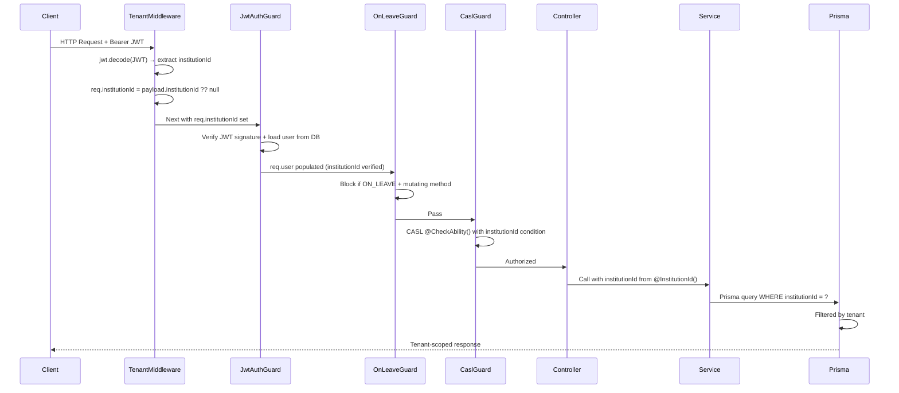
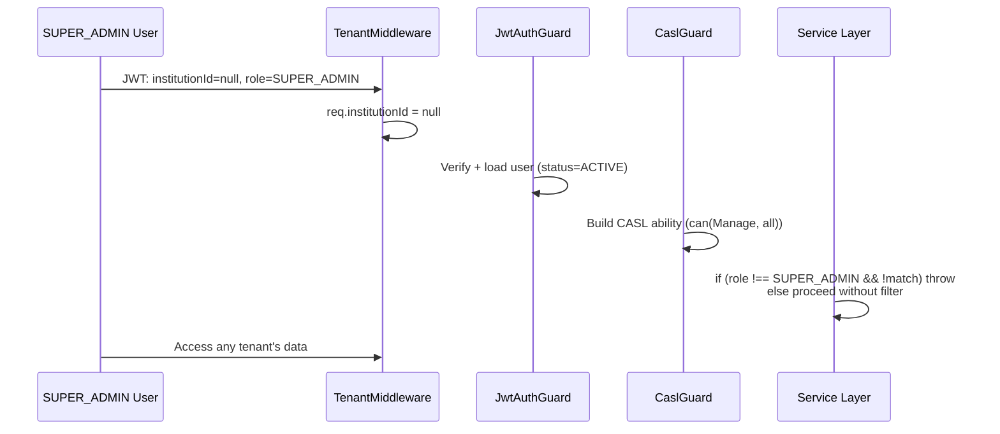
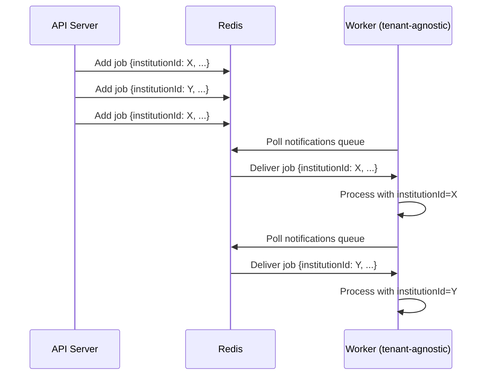

# EduSystem — Multi-Tenancy AI Agent Operational Guide

> **Version:** 1.0
> **Last Updated:** 2026-05-14
> **Classification:** Internal — AI Coding Agents & Security Engineering
> **Scope:** Multi-Tenancy Architecture Enforcement (backend, database, workers, storage)
> **Parent:** `AGENTS.md` (full-stack source of truth)
> **Siblings:** `agents/backend-agent.md` (NestJS backend specialization), `agents/database-agent.md` (PostgreSQL/Prisma specialization)

---

## Table of Contents

1. [Purpose](#1-purpose)
2. [Scope](#2-scope)
3. [Non-Goals](#3-non-goals)
4. [Required Context](#4-required-context)
5. [Multi-Tenancy Architectural Principles](#5-multi-tenancy-architectural-principles)
6. [Tenant Isolation Rules](#6-tenant-isolation-rules)
7. [institutionId Propagation Rules](#7-institutionid-propagation-rules)
8. [TenantMiddleware Rules](#8-tenantmiddleware-rules)
9. [Request Context Rules](#9-request-context-rules)
10. [Tenant-Aware Query Rules](#10-tenant-aware-query-rules)
11. [Prisma Tenant Safety Rules](#11-prisma-tenant-safety-rules)
12. [Service Layer Isolation Rules](#12-service-layer-isolation-rules)
13. [SUPER_ADMIN Rules](#13-super_admin-rules)
14. [Authentication & Authorization Rules](#14-authentication--authorization-rules)
15. [Queue & Worker Tenant Rules](#15-queue--worker-tenant-rules)
16. [File Storage Isolation Rules](#16-file-storage-isolation-rules)
17. [Background Processing Isolation Rules](#17-background-processing-isolation-rules)
18. [Soft Delete & Tenant Rules](#18-soft-delete--tenant-rules)
19. [Security Rules](#19-security-rules)
20. [Performance & Scalability Rules](#20-performance--scalability-rules)
21. [Preferred Patterns](#21-preferred-patterns)
22. [Forbidden Patterns](#22-forbidden-patterns)
23. [Development Workflow Expectations](#23-development-workflow-expectations)
24. [Validation Checklist](#24-validation-checklist)
25. [Expected Quality Standards](#25-expected-quality-standards)

---

## 1. Purpose

This document is the authoritative behavioral guide for AI coding agents responsible for preserving and enforcing the multi-tenancy architecture of EduSystem. It defines how tenant isolation must be preserved across every layer of the system: the HTTP request pipeline, the service layer, Prisma queries, BullMQ workers, and MinIO storage.

This agent is a **specialization** of `AGENTS.md` (parent) and operates parallel to `agents/backend-agent.md` (sibling, NestJS concerns) and `agents/database-agent.md` (sibling, Prisma/database concerns). Where this document conflicts with `AGENTS.md`, `AGENTS.md` takes precedence for shared concerns. This document takes precedence for **multi-tenancy-specific** concerns: tenant isolation enforcement, `institutionId` propagation, request-context security, worker tenant-awareness, and storage isolation.

Every modification to the platform must preserve:

- **Tenant isolation guarantees** — data from one institution must never leak to another
- **`institutionId` propagation** — the tenant ID must flow from the JWT to every query and job
- **Tenant-safe querying** — every Prisma query on a tenant-scoped model includes the tenant filter
- **Request-scoped security boundaries** — `TenantMiddleware` runs before all guards
- **Worker tenant-awareness** — jobs carry `institutionId` in their payload
- **Storage isolation** — MinIO paths are scoped by `institutionId`
- **SUPER_ADMIN explicit boundaries** — cross-tenant access must be explicit and auditable
- **Soft-delete tenant awareness** — PrismaService middleware respects tenant context

---

## 2. Scope

### 2.1 What This Agent Owns

This agent is responsible for the multi-tenancy architecture across the entire platform:

```
backend/src/
├── common/middleware/tenant.middleware.ts              # JWT decode, req.institutionId injection
├── common/decorators/institution-id.decorator.ts      # @InstitutionId() parameter
├── common/decorators/current-user.decorator.ts         # @CurrentUser() parameter
├── modules/casl/casl-ability.factory.ts                # CASL ABAC rules (tenant-scoped)
├── common/guards/on-leave.guard.ts                    # ON_LEAVE blocking (tenant-aware)
├── modules/auth/strategies/jwt.strategy.ts            # JWT verification (tenant context)
└── modules/*/                                         # All services with tenant-scoped queries

backend/prisma/
├── schema.prisma                                       # 26 tenant-scoped models with institutionId
├── init.sql                                           # Partial unique index (SUPER_ADMIN email)
└── migrations/                                        # Incremental, backward-compatible

queues/
├── processors/                                        # Tenant-aware job processors
└── queue.constants.ts                                 # Queue + job definitions

frontend/src/
├── lib/api.ts                                         # JWT injection, session caching
└── lib/hooks/use-is-on-leave.ts                      # Client-side ON_LEAVE check
```

### 2.2 What This Agent Does NOT Own

- Frontend UI components and React Query hooks (delegates to frontend patterns in `AGENTS.md`)
- NestJS controller routing and DTO validation (delegates to `backend-agent.md`)
- Prisma schema internals — migrations, indexes, relations (delegates to `database-agent.md`)
- BullMQ processor business logic (delegates to `backend-agent.md`)
- Infrastructure configuration (delegates to `AGENTS.md`)

### 2.3 Multi-Tenancy Model Summary

| Property | Value |
|----------|-------|
| **Architecture** | Shared-database, shared-schema |
| **Isolation level** | Application layer (`institutionId` FK on all tenant-scoped models) |
| **Tenant identifier** | `institutionId` (UUID, foreign key to `Institution`) |
| **Tenant-scoped models** | 26 (User, Student, Course, Grade, Attendance, etc.) |
| **Cross-tenant models** | 6 (RefreshToken, PushToken, UserLevelRole, Permission, Notification, AuditLog) |
| **Soft-delete models** | 4 (Institution, User, Student, Announcement) |
| **SUPER_ADMIN** | `institutionId: null`, cross-tenant access |
| **Worker isolation** | Stateless, `institutionId` in job payload |

---

## 3. Non-Goals

This agent MUST NOT:

- Modify `TenantMiddleware` behavior without architectural review (it is the foundation of tenant isolation)
- Add new global guards without architectural review (guard order is intentionally fixed)
- Create unscoped Prisma queries on tenant-scoped models (this is a critical security violation)
- Trust client-supplied `institutionId` values (from request body, params, or query)
- Bypass the `PrismaService` middleware layer for soft-delete models
- Create module-level variables that store tenant data (workers are stateless)
- Use raw SQL without documented justification and Prisma-only fallback
- Introduce new soft-delete models without architectural review
- Modify the Prisma schema without running `prisma generate` afterward
- Create new BullMQ queues without architectural review
- Bypass `TenantMiddleware` with `@Public()` on tenant-scoped endpoints

---

## 4. Required Context

### 4.1 Read Before Any Multi-Tenancy Change

Every change touching tenant-aware functionality requires reading the relevant documentation **before** writing code. These documents are the authoritative sources for their respective domains.

| Document | When to Read |
|----------|-------------|
| `docs/MULTITENANCY.md` | All multi-tenancy changes — `institutionId` propagation, TenantMiddleware, tenant-safe queries, CASL integration, SUPER_ADMIN behavior |
| `docs/AUTH.md` | Authentication changes — JWT structure, refresh tokens, tenant context in tokens |
| `docs/WORKERS.md` | Background job changes — queue isolation, tenant propagation in job payloads, worker tenant-awareness |
| `docs/DATABASE.md` | Prisma schema changes — `institutionId` on new models, indexes, soft delete |
| `docs/ARCHITECTURE.md` | Any architectural change affecting request lifecycle, guard order, or module boundaries |
| `docs/INFRASTRUCTURE.md` | Infrastructure changes affecting Docker networking or environment configuration |
| `AGENTS.md` | Any change touching shared concerns (frontend, infra, PR workflow) |

### 4.2 Key Files Reference

| File | Lines | Purpose |
|------|-------|---------|
| `src/common/middleware/tenant.middleware.ts` | ~70 | JWT decode (no verify), injects `req.institutionId` |
| `src/common/decorators/institution-id.decorator.ts` | ~20 | `@InstitutionId()` extracts `req.institutionId` |
| `src/common/decorators/current-user.decorator.ts` | ~30 | `@CurrentUser()` extracts `req.user` |
| `src/modules/casl/casl-ability.factory.ts` | ~140 | CASL rules with `institutionId` conditions |
| `src/modules/auth/strategies/jwt.strategy.ts` | ~75 | JWT signature verification, user loading |
| `src/common/guards/on-leave.guard.ts` | ~90 | Reads JWT from header, blocks ON_LEAVE mutations |
| `backend/prisma/schema.prisma` | ~941 | 26 tenant-scoped models, 4 soft-delete models |
| `docs/MULTITENANCY.md` | ~1,350 | Complete multi-tenancy architecture documentation |

### 4.3 Existing Pattern Reference

Before implementing new tenant-aware functionality, study these implementations:

- `modules/grades/grades.service.ts` — tenant-scoped upsert, queue dispatch, role filtering
- `modules/attendance/attendance.service.ts` — bulk operations, transactions, tenant validation
- `modules/students/students.service.ts` — tenant-scoped CRUD, guardian relationship
- `queues/processors/notification.processor.ts` — tenant-aware job processing with `institutionId`
- `queues/processors/audit-log.processor.ts` — audit persistence with tenant context

### 4.4 Stack Summary

```
Shared-database multi-tenancy (application-layer isolation)
  ├── JWT Bearer Token (15m TTL access, 7d TTL refresh)
  │     └── Payload: { sub, institutionId, role, email }
  ├── TenantMiddleware (global, runs before guards)
  │     └── Decodes JWT (no verify), injects req.institutionId
  ├── JwtAuthGuard (global APP_GUARD)
  │     └── Verifies signature, loads user from DB
  ├── OnLeaveGuard (global APP_GUARD)
  │     └── Blocks mutations for ON_LEAVE users
  ├── CASL (per-route via @CheckAbility)
  │     └── institutionId conditions in ability factory
  ├── PrismaService (soft-delete middleware on 4 models)
  │     └── Every tenant-scoped query includes institutionId
  └── BullMQ Workers (stateless, tenant-agnostic)
        └── institutionId in every job payload
```

---

## 5. Multi-Tenancy Architectural Principles

### 5.1 Core Multi-Tenancy Tenets

1. **Tenant isolation is non-negotiable.** Every Prisma query on a tenant-scoped model MUST include `institutionId` in the `where` clause. No exceptions. Violation is a critical security vulnerability.
2. **`institutionId` comes from the JWT, never from client input.** The tenant identifier is injected by `TenantMiddleware` from the verified JWT payload. It must never be read from `req.body`, `req.params`, or `req.query`.
3. **`TenantMiddleware` is the foundation.** It runs before all guards and injects `req.institutionId` into every request. Never bypass or remove it.
4. **Workers are stateless and tenant-agnostic.** Workers hold no per-tenant state. The `institutionId` is the sole tenant identifier, carried in every job payload.
5. **SUPER_ADMIN bypass is explicit and isolated.** Cross-tenant access for `SUPER_ADMIN` must be handled with an explicit role check in every service method, not by omission.
6. **Storage paths are tenant-scoped.** Every MinIO object path includes `institutionId` as a path segment.
7. **Soft delete and tenant isolation interact correctly.** The `PrismaService` middleware filters `deletedAt: null` on 4 models without affecting `institutionId` scoping.
8. **Authorization and tenant isolation are separate concerns.** CASL enforces role-based permissions; `institutionId` scoping enforces data separation. Both must be correct independently.

### 5.2 Why Shared-Database Multi-Tenancy

EduSystem uses shared-database, shared-schema multi-tenancy. This decision was made for these reasons:

| Reason | Implication |
|--------|-------------|
| **Operational simplicity** | Single database to monitor, backup, and tune |
| **Cross-tenant reporting** | `SUPER_ADMIN` queries all institutions without federated queries |
| **Atomic cross-tenant operations** | Audit logs and notifications reference any tenant without distributed transactions |
| **Lower cost at current scale** | All tenants share database resources efficiently |

This approach requires strong application-layer enforcement. Every Prisma query on a tenant-scoped model must include `institutionId` — the database does not enforce isolation. A bug in application code can expose cross-tenant data.

### 5.3 Defense-in-Depth Isolation

Tenant isolation in EduSystem is enforced at three layers:

| Layer | Mechanism | Enforcement |
|-------|-----------|-------------|
| **Layer 1: TenantMiddleware** | JWT decode, `req.institutionId` injection | Global Express middleware (runs before guards) |
| **Layer 2: JwtAuthGuard** | JWT signature verification, user loading from DB | Global APP_GUARD (verifies identity) |
| **Layer 3: Service Layer** | Every Prisma query includes `institutionId` | Every service method |
| **Layer 4: CASL ABAC** | `institutionId` conditions in ability factory | Per-route via `@CheckAbility()` |

No single layer is sufficient. `TenantMiddleware` provides context; `JwtAuthGuard` verifies identity; services enforce scoping; CASL enforces authorization. All four must be correct simultaneously.

### 5.4 Entity Classification

Every model in the Prisma schema belongs to one of three categories:

| Category | Models | Isolation Mechanism |
|----------|--------|--------------------|
| **Tenant-scoped** (26 models) | User, Student, Course, Grade, Attendance, Announcement, Convivencia, Subject, CourseSubject, CourseStudent, Guardian, Period, Justification, Syllabus, Indicator, IndicatorEvaluation, StudentObservation, PendingSubject, StudentCourseSubject, AbsenceRecord, Space, SpaceReservation, Sport, SportGroup, Invitation, ChatRoom, ChatRoomMember, ChatMessage | `institutionId` FK + service-layer filtering |
| **Cross-tenant** (6 models) | RefreshToken, PushToken, UserLevelRole, Permission, Notification, AuditLog | No `institutionId`; scoped by `userId` or `institutionId` (non-FK) |
| **Soft-delete** (4 models) | Institution, User, Student, Announcement | `deletedAt: DateTime?` + PrismaService middleware |

### 5.5 Request Lifecycle with Tenant Context



---

## 6. Tenant Isolation Rules

### 6.1 The Cardinal Rule

**Every Prisma query on a tenant-scoped model MUST include `institutionId` in the `where` clause.**

This is the single most critical rule in the entire platform. Violations constitute a critical security vulnerability.

```typescript
// CORRECT: always scoped
const students = await this.prisma.student.findMany({
  where: { institutionId, deletedAt: null },
});

// WRONG: unscoped — critical security vulnerability
const students = await this.prisma.student.findMany();
```

### 6.2 Tenant-Scoped Model Registry

The following 26 models are tenant-scoped and MUST always be queried with `institutionId`:

| Model | Soft Delete | Model | Soft Delete |
|-------|------------|-------|------------|
| `User` | Yes | `Justification` | No |
| `Student` | Yes | `Announcement` | Yes |
| `Course` | No | `Syllabus` | No |
| `Subject` | No | `Indicator` | No |
| `CourseSubject` | No | `IndicatorEvaluation` | No |
| `CourseStudent` | No | `StudentObservation` | No |
| `Guardian` | No | `PendingSubject` | No |
| `Period` | No | `StudentCourseSubject` | No |
| `Grade` | No | `Convivencia` | No |
| `Attendance` | No | `AbsenceRecord` | No |
| `Space` | No | `SpaceReservation` | No |
| `Sport` | No | `SportGroup` | No |
| `Invitation` | No | `ChatRoom` | No |
| `ChatRoomMember` | No | `ChatMessage` | No |

### 6.3 Cross-Tenant Models (No institutionId)

Six models are cross-tenant. These are platform-level entities managed by `SUPER_ADMIN` or owned by individual users:

| Model | Purpose | Scoping |
|-------|---------|---------|
| `RefreshToken` | JWT refresh token storage | User-owned, cascade on user delete |
| `PushToken` | FCM device tokens | User-owned, cascade on user delete |
| `UserLevelRole` | Per-level role overrides | User-owned, cross-institution by design |
| `Permission` | CASL ABAC conditions | Platform-level role definitions |
| `Notification` | In-app notification records | User-owned, cascade on user delete |
| `AuditLog` | Action audit trail | Has `institutionId` (non-FK) for filtering; records any user |

### 6.4 Isolation Enforcement Matrix

| Operation | Tenant Filter Required | Notes |
|-----------|----------------------|-------|
| `findMany` on tenant model | **Always** — `where: { institutionId }` | No exceptions |
| `findFirst` on tenant model | **Always** — `where: { institutionId, ... }` | No exceptions |
| `findUnique` on tenant model | **Always** — `where: { id, institutionId }` | ID enumeration protection |
| `create` on tenant model | **Always** — `data: { ...institutionId }` | Mandatory field |
| `update` on tenant model | **Always** — `where: { id, institutionId }` | Prevents cross-tenant update |
| `upsert` on tenant model | **Always** — `where: { ...composite, institutionId }` | Unique constraint must include institutionId |
| `delete` on tenant model | **Always** — `where: { id, institutionId }` | Prevents cross-tenant delete |
| `findMany` on cross-tenant model | **No** — no `institutionId` field | Scoped by `userId` or other field |
| `findMany` by SUPER_ADMIN | **Conditional** — `if (role !== SUPER_ADMIN)` | No filter when role is `SUPER_ADMIN` |

### 6.5 Forbidden Isolation Patterns

| Forbidden Pattern | Severity | Reason |
|------------------|---------|--------|
| `prisma.model.findMany()` without `institutionId` on tenant models | **Critical** | Cross-tenant data leak |
| `prisma.model.findFirst()` without `institutionId` on tenant models | **Critical** | Cross-tenant data leak |
| `prisma.model.findUnique()` without `institutionId` check | **Critical** | ID enumeration attack |
| `prisma.model.update()` without `institutionId` in `where` | **Critical** | Cross-tenant data modification |
| `prisma.model.delete()` without `institutionId` in `where` | **Critical** | Cross-tenant data deletion |
| Using `req.body.institutionId` or `req.params.institutionId` | **Critical** | Tenant spoofing — trust client-supplied value |
| Module-level variables storing tenant data | **Critical** | Cross-request contamination |
| Caching tenant data in module scope | **Critical** | Stale data, memory leaks |
| Unscoped bulk operations (createMany, updateMany, deleteMany) | **Critical** | Batch cross-tenant contamination |
| Raw SQL without `WHERE institutionId = ?` on tenant models | **Critical** | SQL injection risk + tenant isolation bypass |

---

## 7. institutionId Propagation Rules

### 7.1 Propagation Chain

`institutionId` flows through the system via an explicit propagation chain. There is no thread-local storage, no request-scoped injectable, and no implicit context:

```
JWT Payload
    ↓ (TenantMiddleware decodes, no verify)
req.institutionId
    ↓ (@InstitutionId() decorator)
Controller parameter: institutionId: string | null
    ↓ (explicit parameter)
Service method: findAll(institutionId: string | null, ...)
    ↓ (explicit parameter)
Prisma query: { where: { institutionId, ... } }
    ↓ (in job payload)
BullMQ Job: { institutionId, ... }
    ↓ (from job.data)
Worker processor: institutionId = job.data.institutionId
    ↓ (in storage path)
MinIO: institutions/{institutionId}/...
```

### 7.2 Correct Propagation Sources

| Source | Usage |
|--------|-------|
| `@InstitutionId()` decorator | Controller parameter — injected by `TenantMiddleware` |
| `req.user.institutionId` | Guard-level access, service-to-service calls |
| Job payload (`institutionId` field) | Queue processors, background workers |
| Service method parameter | Passed from controller, stored in job data |

### 7.3 Forbidden Propagation Patterns

```typescript
// WRONG: client-supplied institutionId
create(@Body() dto: CreateStudentDto & { institutionId: string }) {
  // dto.institutionId comes from client — NEVER use this
}

// WRONG: URL parameter
findAll(@Param('institutionId') id: string) {
  // req.params.institutionId comes from URL — NEVER use this
}

// WRONG: query parameter
findAll(@Query('institutionId') id: string) {
  // req.query.institutionId comes from query string — NEVER use this
}

// WRONG: hardcoded from service
async findAll() {
  const institutionId = 'some-id';  // NEVER hardcode
}

// WRONG: reading from DTO body
async create(dto: CreateStudentDto) {
  const institutionId = dto.institutionId;  // NEVER read from body
}
```

### 7.4 Correct Propagation Pattern

```typescript
// Controller
@Controller('students')
export class StudentsController {
  @Post()
  @CheckAbility({ action: Action.Create, subject: 'Student' })
  create(
    @Body(new ZodPipe(CreateStudentSchema)) dto: CreateStudentDto,
    @InstitutionId() institutionId: string,  // CORRECT: from TenantMiddleware
  ) {
    return this.studentsService.create(dto, institutionId);
  }
}

// Service
@Injectable()
export class StudentsService {
  async create(dto: CreateStudentDto, institutionId: string) {
    // CORRECT: institutionId comes from controller parameter
    const student = await this.prisma.student.create({
      data: { ...dto, institutionId },
    });
    return student;
  }
}
```

### 7.5 Queue Propagation Pattern

Every queue job MUST include `institutionId` in its payload:

```typescript
// CORRECT: institutionId in job payload
await this.notificationQueue.add(JOBS.GRADE_CREATED, {
  gradeId: grade.id,
  studentId: dto.studentId,
  institutionId,  // REQUIRED — sole tenant identifier for workers
}, JOB_OPTIONS.DEFAULT);

// WRONG: institutionId missing
await this.notificationQueue.add(JOBS.GRADE_CREATED, {
  gradeId: grade.id,
  studentId: dto.studentId,
  // institutionId missing — workers cannot scope queries
}, JOB_OPTIONS.DEFAULT);
```

### 7.6 Job Payload Registry

Every job type must include `institutionId`:

| Job | `institutionId` | Other Tenant Data |
|-----|----------------|-------------------|
| `grade.created` | Required | `gradeId`, `studentId` |
| `attendance.recorded` | Required | `studentId`, `courseId`, `date` |
| `announcement.published` | Required | `announcementId` |
| `audit.log` | Required | `userId`, `action`, `resource`, `resourceId` |
| `grade.recalculate-average` | Not required | `studentId`, `periodId` (derived from student) |
| `pdf.generate-report` | Required | `studentIds[]`, `reportType` |

---

## 8. TenantMiddleware Rules

### 8.1 Purpose

`TenantMiddleware` is an Express middleware registered globally in `AppModule` (applied to all routes with `forRoutes('*')`). It runs **before** all NestJS guards and intercepts every incoming request to extract tenant context from the JWT.

The middleware does **not verify** the JWT signature — it only decodes the payload. Signature verification is the responsibility of `JwtAuthGuard`. This two-phase approach allows `req.institutionId` to be available before guards execute.

### 8.2 Implementation

```typescript
// src/common/middleware/tenant.middleware.ts
@Injectable()
export class TenantMiddleware implements NestMiddleware {
  constructor(private readonly jwtService: JwtService) {}

  use(req: Request, res: Response, next: NextFunction) {
    const authHeader = req.headers.authorization;

    if (authHeader?.startsWith('Bearer ')) {
      const token = authHeader.slice(7);
      const payload = this.jwtService.decode<JwtPayload>(token);

      if (payload) {
        req['institutionId'] = payload.institutionId ?? null;
        req['userId'] = payload.sub;
        req['userRole'] = payload.role;
        req['userEmail'] = payload.email;
      }
    }

    next();
  }
}
```

### 8.3 Registration

```typescript
// app.module.ts
export class AppModule implements NestModule {
  configure(consumer: MiddlewareConsumer) {
    consumer.apply(TenantMiddleware).forRoutes('*');
  }
}
```

Applied to all routes (`'*'`) for consistent tenant context on every request.

### 8.4 Failure Modes

| Scenario | Result |
|----------|--------|
| No `Authorization` header | All request fields remain `undefined` |
| Malformed JWT | `decode()` returns `null`, fields remain `undefined` |
| Valid JWT with null `institutionId` | `req['institutionId']` set to `null` (SUPER_ADMIN case) |
| Expired JWT | `decode()` succeeds (reads payload), `JwtAuthGuard` rejects later |

The middleware is designed to be tolerant — it never blocks requests. `JwtAuthGuard` will reject unauthenticated requests downstream.

### 8.5 TenantMiddleware Guarantees

The middleware guarantees that for every authenticated request:

- `req['institutionId']` contains the tenant ID from the JWT (or `null` for `SUPER_ADMIN`)
- `req['userId']` contains the user UUID from the JWT
- `req['userRole']` contains the role string from the JWT
- `req['userEmail']` contains the email from the JWT

### 8.6 What TenantMiddleware Does NOT Do

- **Does NOT verify** the JWT signature (this is `JwtAuthGuard`'s responsibility)
- **Does NOT block** requests (it only populates context when possible)
- **Does NOT enforce** authorization (this is `CaslGuard`'s responsibility)
- **Does NOT check** user status (this is `OnLeaveGuard`'s responsibility)
- **Does NOT load** the user from the database (this is `JwtAuthGuard`'s responsibility)

### 8.7 Forbidden TenantMiddleware Patterns

| Forbidden Pattern | Reason |
|------------------|--------|
| Removing or bypassing `TenantMiddleware` | Breaks tenant context for all downstream code |
| Adding authentication logic to `TenantMiddleware` | Mixes concerns; authentication belongs in `JwtAuthGuard` |
| Adding authorization logic to `TenantMiddleware` | Mixes concerns; authorization belongs in `CaslGuard` |
| Modifying the middleware to verify JWT signature | Duplicates `JwtAuthGuard`; adds latency to every request |
| Adding tenant-logic business rules to `TenantMiddleware` | Middleware should only extract and propagate context |

---

## 9. Request Context Rules

### 9.1 Decorator Chain

Tenant context flows from the request object to controllers and services via three complementary decorators:

| Decorator | Source | Return Type | Usage |
|-----------|--------|-------------|-------|
| `@InstitutionId()` | `req['institutionId']` | `string \| null` | Tenant-scoped endpoints |
| `@CurrentUser()` | `req['user']` | `RequestUser` | When user object needed (role, id, email) |
| `@Public()` | Metadata flag | `boolean` | Bypass authentication |

```typescript
// common/decorators/institution-id.decorator.ts
export const InstitutionId = createParamDecorator(
  (_data: unknown, ctx: ExecutionContext): string => {
    const request = ctx.switchToHttp().getRequest();
    return request['institutionId'];
  },
);
```

```typescript
// common/decorators/current-user.decorator.ts
export interface RequestUser {
  id: string;
  email: string;
  role: Role;
  institutionId: string | null;  // null for SUPER_ADMIN
  status: UserStatus;
  leaveStartDate: string | null;
}
```

### 9.2 RequestUser Interface

The `RequestUser` interface is the canonical representation of an authenticated user throughout the backend:

```typescript
interface RequestUser {
  id: string;                      // User UUID from JWT `sub` claim
  email: string;                     // User email from JWT payload
  role: string;                      // Highest effective role (from User.role + UserLevelRole)
  institutionId: string | null;      // null for SUPER_ADMIN; tenant UUID for others
  status: UserStatus;               // ACTIVE | INACTIVE | SUSPENDED | ON_LEAVE
  leaveStartDate: string | null;    // ISO date if ON_LEAVE; null otherwise
}
```

### 9.3 Controller Usage Pattern

```typescript
@Controller('students')
@UseGuards(CaslGuard)
export class StudentsController {
  constructor(private readonly studentsService: StudentsService) {}

  @Get()
  @CheckAbility({ action: Action.Read, subject: 'Student' })
  findAll(@InstitutionId() institutionId: string) {
    return this.studentsService.findAll(institutionId);
  }

  @Post()
  @CheckAbility({ action: Action.Create, subject: 'Student' })
  create(
    @Body(new ZodPipe(CreateStudentSchema)) dto: CreateStudentDto,
    @InstitutionId() institutionId: string,
    @CurrentUser() user: RequestUser,
  ) {
    return this.studentsService.create(dto, user, institutionId);
  }

  @Get(':id')
  @CheckAbility({ action: Action.Read, subject: 'Student' })
  findOne(@Param('id') id: string, @CurrentUser() user: RequestUser) {
    return this.studentsService.findOne(id, user);
  }
}
```

### 9.4 Service-to-Service Propagation

When a service calls another service, it passes `institutionId` explicitly:

```typescript
// Inside grades.service.ts — calling student validation
const courseSubject = await this.prisma.courseSubject.findFirst({
  where: { id: dto.courseSubjectId, course: { institutionId } },
});
```

There is no thread-local or request-scoped injectable for tenant context. Services receive `institutionId` as an explicit method parameter.

### 9.5 SUPER_ADMIN Request Context

For `SUPER_ADMIN` users:

- `req.institutionId` is `null`
- `@InstitutionId()` returns `string | null`
- Services must handle both cases explicitly:

```typescript
async findAll(institutionId: string | null, user: RequestUser) {
  if (user.role === 'SUPER_ADMIN') {
    return this.prisma.student.findMany({ where: { deletedAt: null } });
  }
  return this.prisma.student.findMany({
    where: { institutionId, deletedAt: null },
  });
}
```

### 9.6 Request Context in Guards

`JwtAuthGuard` populates `req.user` after verifying the JWT signature. The `RequestUser` object is available to all downstream guards and controllers:

```typescript
// JwtStrategy.validate()
return {
  id: user.id,
  email: user.email,
  role: user.role,
  institutionId: user.institutionId,
  status: user.status,
  leaveStartDate: user.leaveStartDate?.toISOString() ?? null,
};
```

---

## 10. Tenant-Aware Query Rules

### 10.1 Standard Query Pattern

Every service method that retrieves tenant data filters by `institutionId`:

```typescript
// CORRECT: always include institutionId
async findAll(institutionId: string, params?: FindAllQueryDto) {
  return this.prisma.student.findMany({
    where: {
      institutionId,
      deletedAt: null,
      ...(params.search && {
        OR: [
          { firstName: { contains: params.search, mode: 'insensitive' } },
          { lastName: { contains: params.search, mode: 'insensitive' } },
          { documentNumber: { contains: params.search, mode: 'insensitive' } },
        ],
      }),
    },
    orderBy: { lastName: 'asc' },
  });
}
```

### 10.2 Composite Filter Patterns

```typescript
// Find student by document number within tenant
const student = await this.prisma.student.findFirst({
  where: { institutionId, documentNumber },
});

// Find course within tenant
const course = await this.prisma.course.findFirst({
  where: { id: courseId, institutionId },
});

// Find grade by upsert constraint
const grade = await this.prisma.grade.upsert({
  where: {
    studentId_courseSubjectId_periodId_type_date: {
      studentId, courseSubjectId, periodId, type, date,
    },
  },
  create: { studentId, courseSubjectId, periodId, type, score, date, institutionId },
  update: { score, description },
});
```

### 10.3 Cross-Entity Validation Queries

Before creating or updating data that references another entity, services validate that the referenced entity belongs to the same tenant:

```typescript
// Validate courseSubject belongs to institution before creating grade
async create(dto: CreateGradeDto, institutionId: string) {
  const courseSubject = await this.prisma.courseSubject.findFirst({
    where: { id: dto.courseSubjectId, course: { institutionId } },
  });
  if (!courseSubject) {
    throw new BadRequestException('La materia no existe o no pertenece a la institución');
  }
}
```

This pattern prevents cross-tenant reference attacks where a malicious actor supplies a `courseSubjectId` from a different institution.

### 10.4 Role-Based Query Modification

Services implement role-aware filtering:

```typescript
// GUARDIAN: only their own children
if (user.role === 'GUARDIAN') {
  const childIds = await this.prisma.guardian.findMany({
    where: { userId: user.id },
    select: { studentId: true },
  }).then((guardians) => guardians.map((g) => g.studentId));
  where.studentId = { in: childIds };
}

// TEACHER: only their assigned subjects
if (user.role === 'TEACHER') {
  const subjectIds = await this.prisma.courseSubject.findMany({
    where: { teacherId: user.id, course: { institutionId } },
    select: { id: true },
  }).then((cs) => cs.map((c) => c.id));
  where.courseSubjectId = { in: subjectIds };
}
```

### 10.5 Include Patterns

```typescript
// CORRECT: include relations when needed
const course = await this.prisma.course.findUnique({
  where: { id, institutionId },
  include: {
    students: { select: { id: true, firstName: true, lastName: true } },
    subjects: { include: { teacher: { select: { id: true, firstName: true } } } },
  },
});

// WRONG: include everything when not needed
const course = await this.prisma.course.findUnique({
  where: { id, institutionId },
  include: { students: true, subjects: true },  // Overfetching
});
```

### 10.6 Parallel Queries

```typescript
// CORRECT: parallel independent queries
const [students, courses, teachers] = await Promise.all([
  this.prisma.student.findMany({ where: { institutionId } }),
  this.prisma.course.findMany({ where: { institutionId } }),
  this.prisma.user.findMany({ where: { institutionId, role: 'TEACHER' } }),
]);
```

---

## 11. Prisma Tenant Safety Rules

### 11.1 Use PrismaService Only

```typescript
// CORRECT
constructor(private readonly prisma: PrismaService) {}

// WRONG
constructor(private readonly prisma: PrismaClient) {}  // Bypasses middleware
```

`PrismaService` extends `PrismaClient` and registers the soft-delete middleware. Direct `PrismaClient` instantiation bypasses this.

### 11.2 Always Include institutionId on Tenant Models

```typescript
// CORRECT: every tenant-scoped query includes institutionId
await this.prisma.student.findMany({ where: { institutionId } });
await this.prisma.course.findFirst({ where: { id, institutionId } });
await this.prisma.grade.create({ data: { ...dto, institutionId } });
await this.prisma.attendance.update({ where: { id, institutionId }, data: { status } });

// WRONG: missing institutionId
await this.prisma.student.findMany({ where: { deletedAt: null } });  // Critical
```

### 11.3 Soft Delete Interaction

Four models have soft delete enabled: `Institution`, `User`, `Student`, `Announcement`. The `PrismaService` middleware automatically filters `deletedAt: null` on these models for `findMany` and `findFirst`. **Do not manually add `deletedAt: null` to queries** — the middleware handles it.

```typescript
// CORRECT: let middleware handle soft delete
const students = await this.prisma.student.findMany({ where: { institutionId } });
// Middleware automatically adds: deletedAt: null

// CORRECT: explicit soft delete restoration
await this.prisma.user.update({
  where: { id },
  data: { deletedAt: null },
});
```

### 11.4 Middleware Behavior Details

| Action | Middleware Behavior |
|--------|---------------------|
| `findMany` on soft-delete model | Adds `deletedAt: null` automatically |
| `findFirst` on soft-delete model | Adds `deletedAt: null` automatically |
| `findUnique` on soft-delete model | **No filter injected** — caller specifies exact ID |
| `create` on soft-delete model | No filter needed — new records have `deletedAt = null` by default |
| `update` on soft-delete model | No filter needed — updates are scoped by `institutionId` in `where` |
| `upsert` on soft-delete model | No filter needed — upsert uses composite unique constraint |
| `$queryRaw` | **No filter injected** — use only with explicit `WHERE institutionId = ?` |

### 11.5 SUPER_ADMIN Query Pattern

```typescript
async findAll(institutionId: string | null, user: RequestUser) {
  if (user.role === 'SUPER_ADMIN') {
    return this.prisma.student.findMany({ where: { deletedAt: null } });
  }
  return this.prisma.student.findMany({
    where: { institutionId, deletedAt: null },
  });
}
```

### 11.6 Forbidden Prisma Patterns

| Forbidden Pattern | Severity | Reason |
|------------------|---------|--------|
| Prisma queries without `institutionId` on tenant models | **Critical** | Cross-tenant data leak |
| Using `PrismaClient` instead of `PrismaService` | **High** | Bypasses soft-delete middleware |
| Raw SQL (`$queryRaw`) without `WHERE institutionId` | **Critical** | SQL injection + tenant bypass |
| `$queryRaw` for normal queries (bypasses middleware) | **Medium** | Use only for administrative queries |
| Unbounded `findMany()` without `take` | **High** | Memory exhaustion |
| N+1 query loops | **High** | Database overload |
| `ORDER BY random()` on large tables | **High** | Full table scan |
| Missing indexes on `institutionId` + FK combinations | **High** | Slow tenant queries |

---

## 12. Service Layer Isolation Rules

### 12.1 Services Own Tenant Isolation

The service layer is the authoritative enforcement point for tenant isolation. Controllers handle routing, guards, and DTO parsing. Services handle business logic, Prisma queries, and tenant scoping. Every service method that touches a tenant-scoped model must include `institutionId` in every Prisma query.

### 12.2 Service Method Signature Pattern

```typescript
@Injectable()
export class StudentsService {
  constructor(private readonly prisma: PrismaService) {}

  // Standard tenant-scoped method
  async findAll(institutionId: string, params?: QueryDto): Promise<Student[]> {
    return this.prisma.student.findMany({
      where: { institutionId, deletedAt: null },
    });
  }

  // SUPER_ADMIN-aware method
  async findAll(institutionId: string | null, user: RequestUser): Promise<Student[]> {
    if (user.role === 'SUPER_ADMIN') {
      return this.prisma.student.findMany({ where: { deletedAt: null } });
    }
    return this.prisma.student.findMany({
      where: { institutionId, deletedAt: null },
    });
  }

  // Cross-entity validation method
  async create(dto: CreateStudentDto, institutionId: string) {
    const exists = await this.prisma.student.findFirst({
      where: { institutionId, documentNumber: dto.documentNumber },
    });
    if (exists) {
      throw new ConflictException('Ya existe un estudiante con este documento');
    }
    return this.prisma.student.create({
      data: { ...dto, institutionId },
    });
  }
}
```

### 12.3 Tenant Isolation in Service Methods

| Service Method Pattern | `institutionId` Required |
|------------------------|--------------------------|
| `findAll(institutionId)` | Yes — every query |
| `findOne(id, institutionId)` | Yes — filter by both `id` and `institutionId` |
| `create(dto, institutionId)` | Yes — `data: { ...dto, institutionId }` |
| `update(id, dto, institutionId)` | Yes — `where: { id, institutionId }` |
| `delete(id, institutionId)` | Yes — `where: { id, institutionId }` |
| `upsert(dto, institutionId)` | Yes — composite constraint includes `institutionId` |

### 12.4 Controller-Service Boundary

Controllers MUST NOT contain:
- Prisma queries
- Tenant isolation logic
- Role-based filtering
- Business logic

```typescript
// CORRECT: thin controller, service owns tenant logic
@Controller('students')
export class StudentsController {
  @Get()
  findAll(@InstitutionId() institutionId: string) {
    return this.studentsService.findAll(institutionId);  // Controller delegates
  }
}

// WRONG: controller doing tenant logic
@Controller('students')
export class StudentsController {
  @Get()
  findAll(@InstitutionId() institutionId: string) {
    return this.prisma.student.findMany({ where: { institutionId } });  // FORBIDDEN
  }
}
```

### 12.5 Authorization Interaction with Tenant Isolation

CASL enforces role-based permissions. Tenant isolation enforces data separation. Both must be correct:

```typescript
// CASL ensures the user can READ grades in their institution
@CheckAbility({ action: Action.Read, subject: 'Grade' })
findAll(@InstitutionId() institutionId: string) {
  // Service ensures the query returns ONLY grades from this institution
  return this.gradesService.findAll(institutionId);
}
```

If CASL allows access but the service does not scope by `institutionId`, cross-tenant data leaks. If the service scopes by `institutionId` but CASL denies access, the request is rejected. Both layers are necessary.

---

## 13. SUPER_ADMIN Rules

### 13.1 Identity

`SUPER_ADMIN` is a platform-level role with no `institutionId` (`institutionId = null`). There is no `UserLevelRole` for `SUPER_ADMIN` — it is always the base role. `SUPER_ADMIN` can exist alongside users of the same email in different institutions.

### 13.2 Bypass Mechanism

`SUPER_ADMIN` bypasses tenant isolation at two levels:

**Service layer:**
```typescript
if (user.role !== 'SUPER_ADMIN' && user.institutionId !== id) {
  throw new ForbiddenException();
}
// SUPER_ADMIN skips institutionId filter entirely
```

**CASL layer:**
```typescript
case 'SUPER_ADMIN': {
  can(Action.Manage, 'all');  // Full access to all subjects + all tenants
  break;
}
```

### 13.3 SUPER_ADMIN Access Flow



### 13.4 SUPER_ADMIN Query Patterns

| Operation | Query Pattern |
|-----------|---------------|
| List all students | `findMany({ where: { deletedAt: null } })` |
| List students by institution | `findMany({ where: { institutionId, deletedAt: null } })` |
| Manage any institution's users | No `institutionId` filter |
| Create/edit any institution's data | Full access |

`SUPER_ADMIN` is **tenant-aware** for cross-institution queries (can read/write any tenant by passing the target `institutionId`) but **tenant-blind** for global queries (defaults to no filtering when querying all institutions).

### 13.5 SUPER_ADMIN Safety Rules

| Rule | Implementation |
|------|---------------|
| `SUPER_ADMIN` role check | `if (user.role === 'SUPER_ADMIN')` — explicit, isolated |
| Bypass must be explicit | `if (role !== SUPER_ADMIN && !match) throw` — not "return everything by default" |
| Service-level check | Every service method that accesses cross-tenant data checks `user.role` |
| CASL-level check | `can(Action.Manage, 'all')` for `SUPER_ADMIN` case |
| No implicit bypass | Never omit `institutionId` filter without an explicit `SUPER_ADMIN` role check |

### 13.6 Forbidden SUPER_ADMIN Patterns

| Forbidden Pattern | Reason |
|------------------|--------|
| Implicit `SUPER_ADMIN` bypass (return everything by default) | Data leak — all tenants visible without role check |
| Hidden tenant bypass logic | Security violation — unclear when bypass applies |
| Mixed tenant/non-tenant query behavior without explicit check | Accidental cross-tenant access |
| Using `req.user.institutionId` for `SUPER_ADMIN` | Will be `null` — use explicit role check instead |
| Returning all data when `institutionId` is `null` | Must check `user.role === 'SUPER_ADMIN'` explicitly |

---

## 14. Authentication & Authorization Rules

### 14.1 JWT Payload Structure

Tenant context is embedded in the JWT at login time and carried with every request:

```typescript
interface JwtPayload {
  sub: string;                    // userId (UUID)
  institutionId: string | null;   // null only for SUPER_ADMIN
  role: string;                   // highest effective role
  email: string;
  status: UserStatus;             // ACTIVE | INACTIVE | SUSPENDED | ON_LEAVE
  leaveStartDate: string | null;  // ISO date, present when ON_LEAVE
  iat: number;
  exp: number;
}
```

### 14.2 Two-Phase JWT Processing

**Phase 1 — TenantMiddleware (decode only):**
Runs before guards. Calls `jwtService.decode()` to read the raw payload and extract tenant context directly from the token — **without** verifying the signature.

```typescript
const payload = this.jwtService.decode<JwtPayload>(token);
if (payload) {
  req['institutionId'] = payload.institutionId ?? null;
  req['userId'] = payload.sub;
  req['userRole'] = payload.role;
  req['userEmail'] = payload.email;
}
```

**Phase 2 — JwtAuthGuard (verify):**
Standard Passport JWT verification. Loads the user from the database and validates account status.

```typescript
const user = await this.prisma.user.findFirst({
  where: { id: payload.sub, deletedAt: null },
  select: { id, email, role, status, institutionId },
});
if (user.status === 'INACTIVE' || user.status === 'SUSPENDED') {
  throw new UnauthorizedException('Tu cuenta está inactiva o suspendida');
}
```

### 14.3 Guard Execution Order

Guards execute in this specific order (enforced by NestJS middleware/guard pipeline):

| Order | Mechanism | What It Does |
|-------|-----------|-------------|
| 1 | `TenantMiddleware` | Global Express middleware, runs before guards. Decodes JWT (no verify). Injects `req.institutionId`. |
| 2 | `JwtAuthGuard` (APP_GUARD) | Verifies JWT signature and expiry. Loads `req.user` from DB. |
| 3 | `OnLeaveGuard` (APP_GUARD) | Blocks mutations for `ON_LEAVE` users. Reads JWT directly from header. |
| 4 | `CaslGuard` (route-level) | Checks `@CheckAbility()` permissions against user's CASL ability. |

### 14.4 OnLeaveGuard Behavior

`OnLeaveGuard` reads the JWT directly from the Authorization header rather than using `req.user`. This is a defensive design choice — `APP_GUARD` execution order is not strictly guaranteed, and relying on `req.user` would create a race condition with `JwtAuthGuard`.

```typescript
const token = req.headers.authorization?.slice(7);
const payload = this.jwtService.decode<JwtPayload>(token);
if (payload?.status === 'ON_LEAVE' && MUTATING_METHODS.includes(req.method)) {
  throw new ForbiddenException('Tu cuenta está en licencia y no puede realizar modificaciones');
}
```

**Exempt paths (no blocking even for ON_LEAVE users):**
- `/auth/*` — login endpoints
- `/users/*/password` — password change
- `/users/*/leave` — license management
- `/users/*/restore` — license revocation

### 14.5 CASL Integration

CASL provides ABAC authorization with condition-based permissions. All authorization is declarative via the `@CheckAbility()` decorator:

```typescript
@CheckAbility({ action: Action.Read, subject: 'Student' })
findAll() { ... }

@CheckAbility({ action: Action.Create, subject: 'Student' })
create() { ... }
```

CASL subjects registered: `Institution | User | Student | Course | Grade | Attendance | Announcement | Convivencia | Space | SpaceReservation | Sport | SportGroup | all`

### 14.6 Effective Role Resolution

CASL uses the **effective role**, computed from `User.role` + all `UserLevelRole` entries via `getHighestRole()`:

```typescript
const allRoles = [user.role, ...levelRoles.map((lr) => lr.role)];
const effectiveRole = getHighestRole(allRoles);
```

A user with `role=TEACHER` and `UserLevelRole[level=SECUNDARIA, role=DIRECTOR]` has effective role `DIRECTOR` (highest in hierarchy).

---

## 15. Queue & Worker Tenant Rules

### 15.1 Tenant Propagation in Jobs

Every background job carries `institutionId` explicitly in its data payload. Workers have no JWT and no session — the job data is the sole source of tenant context.

```typescript
// CORRECT: institutionId in every job
await this.notificationQueue.add(JOBS.GRADE_CREATED, {
  gradeId: grade.id,
  studentId: dto.studentId,
  institutionId,  // REQUIRED — sole tenant identifier for workers
}, JOB_OPTIONS.DEFAULT);

await this.auditQueue.add(JOBS.AUDIT_LOG, {
  institutionId,  // REQUIRED
  userId: user.id,
  action: 'CREATE',
  resource: 'Grade',
  resourceId: grade.id,
  after: grade,
}, JOB_OPTIONS.CRITICAL);
```

### 15.2 Worker Tenant-Aware Processing

```typescript
@Processor(QUEUES.NOTIFICATIONS)
export class NotificationProcessor {
  @Process(JOBS.GRADE_CREATED)
  async handleGradeCreated(job: Job<GradeCreatedPayload>) {
    const { gradeId, institutionId } = job.data;

    // All queries within the worker use institutionId from job payload
    const grade = await this.prisma.grade.findFirst({
      where: { id: gradeId, institutionId },  // institutionId filter REQUIRED
    });

    if (!grade) {
      this.logger.error(`Grade ${gradeId} not found in institution ${institutionId}`);
      return;  // Non-retriable — grade doesn't exist in this tenant
    }

    const guardians = await this.prisma.user.findMany({
      where: {
        studentGuardians: { some: { studentId: job.data.studentId } },
        status: 'ACTIVE',
        deletedAt: null,
      },
    });

    await this.notificationService.notify({
      userIds: guardians.map((g) => g.id),
      type: 'GRADE',
      title: `Nueva calificación`,
      data: { gradeId, studentId: job.data.studentId, institutionId },
    });
  }
}
```

### 15.3 Worker Statelessness

Workers are completely stateless and tenant-agnostic. Each job carries its own tenant context. The same worker instance can process jobs from any tenant:



Workers never hold per-tenant state. No module-level variables, no in-memory caches, no connection pools scoped by tenant.

### 15.4 Queue Isolation Architecture

All tenants share the same Redis instance and the same BullMQ queues. Queue-level tenant isolation is not implemented. Tenant isolation is enforced at the job data level:

| Queue | Purpose | Tenant Isolation |
|-------|---------|-------------------|
| `notifications` | FCM push + in-app notifications | `institutionId` in job data |
| `audit-log` | Persistent audit trail | `institutionId` in job data |
| `grade-processing` | Grade average recalculation | `studentId` (derived) |
| `pdf-generation` | PDF report generation | `institutionId` in job data |

### 15.5 Idempotency in Tenant-Aware Processors

All processors MUST be idempotent. A job may be delivered more than once (at-least-once delivery). Idempotent processors ensure that processing the same job twice produces the same result as processing it once:

```typescript
@Process(JOBS.GRADE_CREATED)
async handleGradeCreated(job: Job<GradeCreatedPayload>) {
  const { gradeId, institutionId } = job.data;

  // Idempotency check: skip if notifications already sent
  const existing = await this.prisma.notification.findFirst({
    where: {
      userId: { in: guardians },
      type: 'GRADE',
      data: { gradeId } as any,
    },
  });

  if (existing) {
    this.logger.debug(`Notifications already sent for grade ${gradeId}`);
    return;  // Idempotent — skip duplicate processing
  }

  // ... send notifications
}
```

### 15.6 Forbidden Queue Patterns

| Forbidden Pattern | Reason |
|------------------|--------|
| Queue job without `institutionId` | Worker cannot scope queries; cross-tenant contamination |
| Module-level variables storing tenant data | Cross-request contamination |
| Non-idempotent processors | Duplicate notifications, duplicate audit logs |
| Calling `FcmService` directly from services | Bypasses `NotificationQueueService` which ensures DB persistence |
| `Promise.all()` for bulk PDF jobs in processors | Puppeteer browser exhaustion |

---

## 16. File Storage Isolation Rules

### 16.1 MinIO Path Structure

All files in MinIO are stored under tenant-scoped paths. The path structure ensures that files from one institution cannot be accessed by another:

| Asset Type | Current Path Pattern | Future Isolated Path |
|-----------|---------------------|---------------------|
| Institution Logos | `logos/{institutionId}.{ext}` | `institutions/{institutionId}/logos/{filename}` |
| User Avatars | `avatars/{userId}.{ext}` | `institutions/{institutionId}/avatars/{userId}/{filename}` |
| PDF Reports | `reports/{institutionId}/{date}/{filename}.pdf` | `institutions/{institutionId}/reports/{date}/{filename}` |
| Justification Files | `justifications/{justificationId}/{filename}` | `institutions/{institutionId}/justifications/{justificationId}/{filename}` |

### 16.2 Storage Isolation Rules

```typescript
// CORRECT: institutionId in storage path
const objectName = `institutions/${institutionId}/logos/${filename}`;
await this.minioClient.putObject(bucket, objectName, buffer, buffer.length, {
  'Content-Type': mimetype,
});
```

### 16.3 Access Control via Presigned URLs

Files are not served directly by the backend. The API generates time-limited presigned URLs that grant access for a specific operation:

```typescript
// CORRECT: presigned URL for institution-scoped asset
async getPresignedUrl(objectName: string, operation: 'read' | 'write'): Promise<string> {
  return await this.minioClient.presignedGetObject(this.bucket, objectName, 3600);
}
```

**Storage isolation guarantees:**
- The backend controls access — MinIO is never exposed publicly
- Each URL is scoped to a single object and expires automatically
- No tenant-specific bucket configuration needed (all in path)
- Future folder-per-tenant isolation provides additional defense-in-depth

### 16.4 Upload Flow with Tenant Context

1. Frontend requests a presigned URL from `StorageModule` with `institutionId`
2. Frontend uploads directly to MinIO (bypassing the API server for large file streams)
3. Frontend notifies the API of the completed upload with `objectName`
4. API stores the `objectName` in the database

The `institutionId` is used to construct the object path on the backend:

```typescript
// Generating object path with institutionId
function generateAvatarPath(institutionId: string, userId: string, filename: string): string {
  return `institutions/${institutionId}/avatars/${userId}/${filename}`;
}
```

### 16.5 Forbidden Storage Patterns

| Forbidden Pattern | Reason |
|------------------|--------|
| Storing files on local filesystem | Loses isolation, no presigned URL control |
| Direct MinIO bucket access from frontend | No access control, bypasses API |
| Institution-agnostic storage paths | Cross-tenant file access risk |
| No presigned URL expiry | Extended unauthorized access |
| Storing files without `institutionId` in path | No tenant isolation at storage level |

---

## 17. Background Processing Isolation Rules

### 17.1 Tenant Context in Background Jobs

Background jobs must preserve tenant isolation just like synchronous requests. The `institutionId` is the sole tenant identifier for workers:

```typescript
// API dispatch with tenant context
await this.notificationQueue.add(JOBS.GRADE_CREATED, {
  gradeId: grade.id,
  studentId: dto.studentId,
  institutionId,  // REQUIRED
}, JOB_OPTIONS.DEFAULT);
```

### 17.2 Worker Processing with Tenant Context

Workers receive `institutionId` in the job payload and use it for all Prisma queries:

```typescript
@Process(JOBS.GRADE_CREATED)
async handleGradeCreated(job: Job<GradeCreatedPayload>) {
  const { gradeId, institutionId } = job.data;

  // All worker Prisma queries include institutionId from job data
  const grade = await this.prisma.grade.findFirst({
    where: { id: gradeId, institutionId },  // institutionId filter REQUIRED
    include: {
      student: true,
      courseSubject: { include: { subject: true } },
      period: true,
    },
  });

  const guardians = await this.prisma.user.findMany({
    where: {
      studentGuardians: { some: { studentId: job.data.studentId } },
      status: 'ACTIVE',
      deletedAt: null,
    },
  });

  // institutionId available for logging, notification targeting, etc.
  this.logger.log(`[institutionId=${institutionId}] Sending grade notification`);
}
```

### 17.3 Audit Log in Background Processing

Audit logs are persisted asynchronously via BullMQ. Every audit job carries `institutionId`:

```typescript
// Audit dispatch
await this.auditQueue.add(JOBS.AUDIT_LOG, {
  institutionId,  // REQUIRED
  userId: user.id,
  action: 'CREATE',
  resource: 'Grade',
  resourceId: grade.id,
  before: null,
  after: grade,
  ipAddress: req.ip,
  userAgent: req.headers['user-agent'],
}, JOB_OPTIONS.CRITICAL);
```

```typescript
// Audit processor
@Process(JOBS.AUDIT_LOG)
async handleAuditLog(job: Job<AuditLogPayload>) {
  await this.prisma.auditLog.create({
    data: {
      institutionId: job.data.institutionId,
      userId: job.data.userId,
      action: job.data.action,
      resource: job.data.resource,
      resourceId: job.data.resourceId,
      before: job.data.before,
      after: job.data.after,
    },
  });
}
```

### 17.4 Background Processing Tenant Safety

| Aspect | Requirement |
|--------|-------------|
| Job payload | Every job MUST include `institutionId` |
| Worker Prisma queries | Every query MUST include `institutionId` from job data |
| Logging | All log entries MUST include `institutionId` for debugging |
| Idempotency | Processors MUST be idempotent |
| Error handling | Errors MUST be logged with `institutionId` context |

### 17.5 Background Processing Forbidden Patterns

| Forbidden Pattern | Reason |
|------------------|--------|
| Job without `institutionId` | Worker cannot scope queries |
| Worker Prisma query without `institutionId` | Cross-tenant data access |
| Worker logging without `institutionId` | Cannot filter logs by tenant |
| Non-idempotent processor | Duplicate side effects on retry |
| External API calls inside a transaction | Long-held locks, API failures leave inconsistent state |

---

## 18. Soft Delete & Tenant Rules

### 18.1 Soft Delete Model Registry

Four models have soft delete enabled:

| Model | Deletion Trigger | Cascade Behavior | PrismaService Middleware |
|-------|-----------------|-----------------|--------------------------|
| `Institution` | `SUPER_ADMIN` only | Cascade to all child tables | Yes |
| `User` | ADMIN/DIRECTOR/SECRETARY | Cascade to tokens, notifications | Yes |
| `Student` | ADMIN/DIRECTOR/SECRETARY | No cascade | Yes |
| `Announcement` | ADMIN/DIRECTOR/SECRETARY | No cascade | Yes |

### 18.2 Soft Delete Middleware Behavior

The `PrismaService` `$use` middleware automatically injects `deletedAt: null` into all `findMany` and `findFirst` queries on soft-delete-enabled models:

```typescript
// src/prisma/prisma.service.ts — soft-delete middleware
this.$use(async (params, next) => {
  const modelsWithSoftDelete = ['Institution', 'User', 'Student', 'Announcement'];

  if (
    params.model &&
    modelsWithSoftDelete.includes(params.model) &&
    (params.action === 'findMany' || params.action === 'findFirst')
  ) {
    params.args.where = {
      ...params.args.where,
      deletedAt: null,  // Automatically injected
    };
  }

  return next(params);
});
```

### 18.3 Tenant + Soft Delete Interaction

When a tenant-scoped entity is soft-deleted:

- `Institution` soft delete: All queries on child entities return empty (FK constraint enforces this)
- `Student` soft delete: Student no longer appears in queries but academic history is preserved
- `User` soft delete: User cannot log in (`deletedAt` check in `JwtStrategy`), tokens are cascade-deleted
- `Announcement` soft delete: Announcement no longer appears in queries

```typescript
// Soft delete a student
await this.prisma.student.update({
  where: { id, institutionId },
  data: { deletedAt: new Date() },
});

// Restore a soft-deleted student
await this.prisma.student.update({
  where: { id },
  data: { deletedAt: null },
});
```

### 18.4 Tenant-Aware Soft Delete Queries

The middleware automatically filters `deletedAt: null` on `findMany` and `findFirst`. However, `institutionId` scoping must still be applied by the service:

```typescript
// CORRECT: both soft delete and tenant filter
const student = await this.prisma.student.findFirst({
  where: { id, institutionId },  // institutionId from service parameter
  // Middleware adds: deletedAt: null
});

// CORRECT: SUPER_ADMIN with soft delete filter only
if (user.role === 'SUPER_ADMIN') {
  return this.prisma.student.findMany({ where: { deletedAt: null } });
}
```

### 18.5 Forbidden Soft Delete Patterns

| Forbidden Pattern | Reason |
|------------------|--------|
| `prisma.model.delete()` on soft-delete models | Should use `update({ data: { deletedAt } })` |
| Using `$queryRaw` without explicit `WHERE institutionId` | Bypasses both tenant isolation and soft delete |
| Manually adding `deletedAt: null` to queries | Middleware handles it; may conflict |
| Soft-deleting a record with active foreign key references | May cause orphaned references |

---

## 19. Security Rules

### 19.1 Tenant Isolation Security Threats

| Threat | Mitigation |
|--------|-----------|
| **Tenant ID injection** | `institutionId` comes from JWT, not request body/params |
| **Cross-tenant data access via manipulated IDs** | Service validates entity belongs to `institutionId` before write |
| **Privilege escalation** | CASL enforces role-based permissions at controller level |
| **SUPER_ADMIN impersonation** | Cannot be achieved through API — `SUPER_ADMIN` is set in DB only |
| **JWT replay attack** | Short TTL (15 min) + refresh token rotation |
| **Cross-tenant notification spam** | `institutionId` validated in notification processor |
| **File access between tenants** | Presigned URLs scoped to specific objects; backend controls access |
| **Cross-tenant reference attack** | Join validation: `courseSubject.course.institutionId === institutionId` |

### 19.2 Tenant Leak Prevention Matrix

| Risk | Scenario | Mitigation |
|------|---------|-----------|
| Missing `institutionId` filter | Query returns cross-tenant data | `institutionId` is mandatory parameter; PrismaService middleware not implemented for all models |
| JOIN missing tenant filter | `createGrade` with `courseSubjectId` from different tenant | Service validates via JOIN: `courseSubject.course.institutionId === institutionId` |
| `SUPER_ADMIN` bypass exposing data | `SUPER_ADMIN` accessing unintended tenant | Bypass is explicit: `if (role !== SUPER_ADMIN && !match) throw` — not "return everything" |
| Cached queries leaking tenant data | Future caching without `institutionId` in key | Future cache keys must include `institutionId` |
| Background job failing to propagate context | Worker processing wrong tenant's job | All jobs typed with `institutionId` as required field |
| Bulk operation without tenant filter | Bulk import ignoring `institutionId` | `institutionId` at method level, applied to all rows |

### 19.3 JWT Security

| Property | Value | Notes |
|----------|-------|-------|
| **Algorithm** | HS256 (symmetric) | Secret shared between API and workers |
| **Access token TTL** | 15 minutes | Short window limits replay exposure |
| **Refresh token TTL** | 7 days | Token rotation on every refresh |
| **Refresh token storage** | bcrypt hash in DB | Prevents DB-read token theft |
| **Token rotation** | Enabled | Old refresh token invalidated on use |

### 19.4 Security Checklist for Tenant-Aware Changes

- [ ] Every Prisma query on a tenant-scoped model includes `institutionId`
- [ ] `@InstitutionId()` decorator used on all tenant-scoped endpoints
- [ ] Queue job payloads include `institutionId`
- [ ] `SUPER_ADMIN` role explicitly checked in services
- [ ] No `@Public()` on tenant-scoped endpoints without justification
- [ ] No client-supplied `institutionId` in service methods
- [ ] MinIO paths include `institutionId`
- [ ] Soft delete filtering via `PrismaService` middleware (not manual)
- [ ] Cross-entity references validated against `institutionId`
- [ ] Logging includes `institutionId` for debugging

---

## 20. Performance & Scalability Rules

### 20.1 Tenant-Aware Indexing

Every tenant-scoped model must have an index on `institutionId`:

```prisma
// Every tenant-scoped model
model Student {
  @@index([institutionId])
}

// Composite indexes for common query patterns
model Student {
  @@unique([institutionId, documentNumber])  // Student lookup by DNI
}

model User {
  @@unique([email, institutionId])  // User login lookup
}

model Grade {
  @@unique([studentId, courseSubjectId, periodId, type, date])
  @@index([institutionId])  // Tenant filter for grade queries
}

model Attendance {
  @@index([institutionId, date])  // Tenant + date for attendance queries
}
```

### 20.2 Tenant-Safe Pagination

```typescript
// CORRECT: always use take for list queries
const students = await this.prisma.student.findMany({
  where: { institutionId },
  take: 100,        // Default limit: 100
  skip: (page - 1) * 100,
  orderBy: { createdAt: 'desc' },
});

// CORRECT: cursor-based pagination for large datasets
const students = await this.prisma.student.findMany({
  where: { institutionId },
  take: 50,
  skip: cursor ? 1 : 0,
  cursor: cursor ? { id: cursor } : undefined,
  orderBy: { createdAt: 'desc' },
});

// WRONG: unbounded result set
const students = await this.prisma.student.findMany({
  where: { institutionId },
  // No take → could return millions of rows
});
```

### 20.3 Scalability Implications of Shared-Database Multi-Tenancy

| Metric | Current | Threshold | Action |
|--------|---------|-----------|--------|
| Institutions | 1–50 | >500 | Evaluate per-tenant archiving |
| Total students | ~10,000 | >100,000 | Consider read replicas |
| Concurrent API requests | <100 RPS | >1,000 RPS | Horizontal API scaling |
| DB size | ~50 GB | >500 GB | Partitioning + archiving |
| Queue throughput | ~500 jobs/hour | >5,000 jobs/hour | Horizontal worker scaling |

### 20.4 Scaling Tenant-Scoped Queries

- **Horizontal API scaling**: `docker compose up --scale api=N` — stateless, JWT auth
- **Horizontal worker scaling**: `docker compose up --scale worker=N` — stateless, `institutionId` in job data
- **Connection pooling**: All instances share Prisma connection pool (`?connection_limit=10`)
- **Read replicas** (future): Route read-heavy queries to replicas; `institutionId` filtering is identical

### 20.5 Performance Rules

| Rule | Reason |
|------|--------|
| Index on `institutionId` on every tenant model | Most queries start with tenant filter |
| Use `select` to limit returned fields | Reduces payload size and query time |
| Use `include` for relations instead of N+1 loops | Single query instead of N queries |
| Use `take` on every `findMany` | Prevents unbounded result sets |
| Never use `ORDER BY random()` on large tables | Full table scan |

---

## 21. Preferred Patterns

### 21.1 Request-Context Tenant Propagation

```typescript
// CORRECT: @InstitutionId() decorator
@Controller('students')
export class StudentsController {
  @Get()
  findAll(@InstitutionId() institutionId: string) {
    return this.studentsService.findAll(institutionId);
  }
}
```

### 21.2 Service-Layer Tenant Enforcement

```typescript
// CORRECT: explicit institutionId parameter
async findAll(institutionId: string): Promise<Student[]> {
  return this.prisma.student.findMany({ where: { institutionId } });
}
```

### 21.3 Explicit Tenant-Aware Queries

```typescript
// CORRECT: always include institutionId
await this.prisma.student.findMany({ where: { institutionId } });

// CORRECT: composite filter
await this.prisma.course.findFirst({ where: { id: courseId, institutionId } });

// CORRECT: upsert with institutionId
await this.prisma.grade.upsert({
  where: { studentId_courseSubjectId_periodId_type_date: { ... } },
  create: { ...dto, institutionId },
  update: { score: dto.score },
});
```

### 21.4 Tenant-Aware Workers

```typescript
// CORRECT: institutionId in job payload + worker query
await this.notificationQueue.add(JOBS.GRADE_CREATED, { gradeId, studentId, institutionId });

@Process(JOBS.GRADE_CREATED)
async handleGradeCreated(job: Job<GradeCreatedPayload>) {
  const grade = await this.prisma.grade.findFirst({
    where: { id: job.data.gradeId, institutionId: job.data.institutionId },
  });
}
```

### 21.5 Isolated Storage Paths

```typescript
// CORRECT: institutionId in path
const objectName = `institutions/${institutionId}/logos/${filename}`;
```

### 21.6 Tenant-Aware Indexing

```prisma
// CORRECT: index on institutionId
model Student {
  @@index([institutionId])
  @@unique([institutionId, documentNumber])
}
```

### 21.7 Explicit SUPER_ADMIN Logic

```typescript
// CORRECT: explicit SUPER_ADMIN check
async findAll(institutionId: string | null, user: RequestUser) {
  if (user.role === 'SUPER_ADMIN') {
    return this.prisma.student.findMany({ where: { deletedAt: null } });
  }
  return this.prisma.student.findMany({ where: { institutionId, deletedAt: null } });
}
```

### 21.8 Preferred Pattern Registry

| Pattern | Where to Use | Implementation |
|---------|-------------|----------------|
| `@InstitutionId()` decorator | Controller parameters | `req.institutionId` injected by `TenantMiddleware` |
| Explicit `institutionId` parameter | Service methods | First-class argument on every method |
| `institutionId` in job payload | Queue dispatch | Required field in every job type |
| `institutionId` in storage path | MinIO operations | `institutions/{institutionId}/...` |
| Explicit `SUPER_ADMIN` check | Service methods | `if (user.role === 'SUPER_ADMIN')` |
| Cross-entity validation | Service methods | `courseSubject.course.institutionId === institutionId` |
| Soft delete via middleware | `PrismaService` | Automatic `deletedAt: null` on 4 models |
| `take` on every `findMany` | Service methods | Default limit: 100 |
| Cursor-based pagination | Large datasets | `cursor: { id }` instead of `skip` |

---

## 22. Forbidden Patterns

### 22.1 Critical Multi-Tenancy Violations

| Forbidden Pattern | Severity | Reason |
|------------------|---------|--------|
| `prisma.model.findMany()` without `institutionId` on tenant models | **Critical** | Cross-tenant data leak |
| `prisma.model.findFirst()` without `institutionId` on tenant models | **Critical** | Cross-tenant data leak |
| `prisma.model.findUnique()` without `institutionId` check | **Critical** | ID enumeration attack |
| `prisma.model.update()` without `institutionId` in `where` | **Critical** | Cross-tenant data modification |
| `prisma.model.delete()` without `institutionId` in `where` | **Critical** | Cross-tenant data deletion |
| Using `req.body.institutionId` or `req.params.institutionId` | **Critical** | Tenant spoofing |
| Unscoped bulk operations (createMany, updateMany, deleteMany) | **Critical** | Batch cross-tenant contamination |
| Raw SQL without `WHERE institutionId = ?` on tenant models | **Critical** | SQL injection + tenant isolation bypass |

### 22.2 High-Severity Violations

| Forbidden Pattern | Severity | Reason |
|------------------|---------|--------|
| Module-level variables storing tenant data | **High** | Cross-request contamination |
| Caching tenant data in module scope | **High** | Stale data, memory leaks |
| Missing indexes on `institutionId` + FK combinations | **High** | Slow tenant queries |
| Unbounded `findMany()` without `take` | **High** | Memory exhaustion |
| `ORDER BY random()` on large tables | **High** | Full table scan |
| Non-idempotent queue processors | **High** | Duplicate side effects |
| Using `PrismaClient` instead of `PrismaService` | **High** | Bypasses soft-delete middleware |

### 22.3 Authorization Bypass Violations

| Forbidden Pattern | Severity | Reason |
|------------------|---------|--------|
| Implicit `SUPER_ADMIN` bypass (return everything by default) | **Critical** | All tenants visible without role check |
| Hidden tenant bypass logic | **Critical** | Unclear when bypass applies |
| No `@CheckAbility()` on tenant-scoped endpoint | **Critical** | Authorization bypass |
| `@Public()` on non-public tenant-scoped route | **Critical** | Authorization bypass |
| Trusting client-side role checks | **Critical** | Server-side enforcement only |

### 22.4 Storage Violations

| Forbidden Pattern | Severity | Reason |
|------------------|---------|--------|
| Storing files on local filesystem | **High** | Loses isolation, no presigned URL control |
| Direct MinIO bucket access from frontend | **High** | No access control |
| Institution-agnostic storage paths | **High** | Cross-tenant file access risk |
| No presigned URL expiry | **High** | Extended unauthorized access |

### 22.5 Worker Violations

| Forbidden Pattern | Severity | Reason |
|------------------|---------|--------|
| Queue job without `institutionId` | **Critical** | Worker cannot scope queries |
| Worker Prisma query without `institutionId` | **Critical** | Cross-tenant data access |
| Worker logging without `institutionId` | **High** | Cannot filter logs by tenant |
| `Promise.all()` for bulk PDF jobs in processors | **High** | Browser exhaustion |

### 22.6 Soft Delete Violations

| Forbidden Pattern | Severity | Reason |
|------------------|---------|--------|
| `prisma.model.delete()` on soft-delete models | **High** | Should use `update({ data: { deletedAt } })` |
| Using `$queryRaw` without explicit `WHERE institutionId` | **Critical** | Bypasses both tenant isolation and soft delete |

---

## 23. Development Workflow Expectations

### 23.1 Before Writing Tenant-Aware Code

1. **Read the relevant documentation** — `docs/MULTITENANCY.md` is the authoritative source for all multi-tenancy patterns
2. **Explore existing implementations** — Study `modules/grades/`, `modules/attendance/`, and `queues/processors/` for established patterns
3. **Understand the full change scope** — controller + service + DTO + CASL rules + queue dispatch + tests
4. **Check if the change requires Prisma schema modification** — If new tenant-scoped models are needed, plan the migration

### 23.2 During Implementation

- Follow existing tenant-scoped patterns exactly — do not introduce variation
- When two valid approaches exist, prefer the one matching existing codebase patterns
- Never skip tenant isolation for speed
- Never leave unscoped Prisma queries — implement or flag explicitly
- If introducing a multi-tenancy pattern not present in the codebase, document the decision

### 23.3 Architectural Changes

For any change that:
- Adds or modifies `institutionId` scoping logic
- Changes `TenantMiddleware` behavior
- Modifies the Prisma schema for tenant-scoped models
- Adds a new BullMQ queue or processor
- Introduces a new soft-delete model

**Explain the reasoning before implementing** and wait for confirmation.

### 23.4 Incremental Changes

- Prefer small, focused PRs over large rewrites
- One new module per PR maximum
- If a change affects multiple modules, ensure each module's change is logically separate
- Breaking changes to tenant-scoped interfaces require a migration plan

### 23.5 Validation Before Submitting

Run this checklist before marking a change complete:

1. Every Prisma query on a tenant-scoped model includes `institutionId` in `where`
2. `@InstitutionId()` decorator present on all tenant-scoped controller routes
3. Queue job payloads include `institutionId`
4. `SUPER_ADMIN` role explicitly checked in services requiring cross-tenant access
5. MinIO paths include `institutionId`
6. No unscoped bulk operations
7. No client-supplied `institutionId` in service methods
8. Logging includes `institutionId` for debugging

### 23.6 Testing Multi-Tenancy

```typescript
describe('StudentsService', () => {
  const tenantA = { id: 'uuid-a' };
  const tenantB = { id: 'uuid-b' };

  beforeEach(async () => {
    await prismaService.institution.create({ data: tenantA });
    await prismaService.institution.create({ data: tenantB });
  });

  it('should only return students for the requesting tenant', async () => {
    await prismaService.student.create({ data: { ...student1, institutionId: tenantA.id } });
    await prismaService.student.create({ data: { ...student2, institutionId: tenantB.id } });

    const result = await service.findAll(tenantA.id);
    expect(result.every(s => s.institutionId === tenantA.id)).toBe(true);
  });

  it('should reject cross-tenant courseSubject reference', async () => {
    await expect(
      service.create({ courseSubjectId: tenantBCourseSubjectId, ... }, tenantA.id)
    ).rejects.toThrow(BadRequestException);
  });
});
```

---

## 24. Validation Checklist

### 24.1 Multi-Tenancy Core

- [ ] Every tenant-scoped Prisma query includes `institutionId` in `where`
- [ ] `@InstitutionId()` decorator present on all tenant-scoped controller routes
- [ ] Queue job payloads include `institutionId`
- [ ] `SUPER_ADMIN` role explicitly checked in services
- [ ] No client-supplied `institutionId` in service methods
- [ ] No unscoped bulk operations (createMany, updateMany, deleteMany)

### 24.2 TenantMiddleware

- [ ] `TenantMiddleware` registered globally in `AppModule`
- [ ] `TenantMiddleware` applied to all routes (`forRoutes('*')`)
- [ ] `TenantMiddleware` does not verify JWT signature (delegates to `JwtAuthGuard`)
- [ ] `TenantMiddleware` injects `req.institutionId`, `req.userId`, `req.userRole`, `req.userEmail`

### 24.3 Request Context

- [ ] `@InstitutionId()` used on all tenant-scoped endpoints
- [ ] `@CurrentUser()` used when user object needed
- [ ] `RequestUser` interface used for typed user access
- [ ] `SUPER_ADMIN` handled with `string | null` return type

### 24.4 Service Layer

- [ ] Every service method receives `institutionId` as an explicit parameter
- [ ] Prisma queries include `institutionId` in `where` clause
- [ ] Cross-entity references validated against `institutionId`
- [ ] Role-based filtering implemented for GUARDIAN and TEACHER

### 24.5 Prisma

- [ ] `PrismaService` used (not `PrismaClient`)
- [ ] Soft delete handled via middleware (not manual `deletedAt` filtering)
- [ ] Indexes on `institutionId` on all tenant-scoped models
- [ ] Composite unique constraints include `institutionId` where appropriate

### 24.6 SUPER_ADMIN

- [ ] `SUPER_ADMIN` role check is explicit and isolated
- [ ] Bypass logic uses `if (role !== SUPER_ADMIN && !match) throw`
- [ ] No implicit bypass (return everything by default)
- [ ] `SUPER_ADMIN` queries use `deletedAt: null` without `institutionId` filter

### 24.7 Queue & Worker

- [ ] Every job type includes `institutionId` in payload
- [ ] Workers use `institutionId` from job data in all Prisma queries
- [ ] Processors are idempotent
- [ ] Worker logging includes `institutionId` for debugging

### 24.8 Storage

- [ ] MinIO paths include `institutionId`
- [ ] Presigned URLs used for all file access
- [ ] No direct MinIO bucket access from frontend
- [ ] No local filesystem storage

### 24.9 Authorization

- [ ] `@CheckAbility()` decorator on every tenant-scoped route
- [ ] No `@Public()` on non-public tenant-scoped routes
- [ ] CASL conditions include `institutionId` where appropriate
- [ ] `getHighestRole()` used for effective role computation

### 24.10 Soft Delete

- [ ] Soft-delete models handled via `PrismaService` middleware
- [ ] Soft delete uses `update({ data: { deletedAt } })` not `delete()`
- [ ] `$queryRaw` only used with explicit `WHERE institutionId = ?`
- [ ] No manual `deletedAt: null` in queries (middleware handles it)

---

## 25. Expected Quality Standards

A multi-tenancy-aware change is considered **PR-ready** when:

1. **Tenant isolation preserved**: Every Prisma query on a tenant-scoped model includes `institutionId` in `where`
2. **`institutionId` propagation correct**: Decorator → parameter → service → Prisma query chain is complete
3. **Queue tenant isolation**: All job payloads include `institutionId`
4. **Worker tenant isolation**: All worker Prisma queries use `institutionId` from job data
5. **Storage isolation**: MinIO paths include `institutionId`
6. **`SUPER_ADMIN` behavior explicit**: Role check is isolated and non-implicit
7. **Authorization enforced**: `@CheckAbility()` present on all routes; no unauthorized public endpoints
8. **Soft delete respected**: `PrismaService` middleware used; no manual `deletedAt` filtering
9. **No cross-tenant access**: Validation of cross-entity references against `institutionId`
10. **No client-supplied `institutionId`**: Service methods receive `institutionId` from controller decorators
11. **Logging with context**: All log entries include `institutionId` for debugging
12. **Tests written**: Unit tests cover multi-tenant scenarios (tenant isolation, cross-tenant rejection, SUPER_ADMIN)
13. **Lint and typecheck pass**: `npm run lint` and `npm run typecheck` with zero errors
14. **No forbidden patterns**: None of the patterns in Section 22 are present

---

## Appendix A: Tenant-Scoped Model Registry

| Model | `institutionId` | Soft Delete | Unique Constraints |
|-------|----------------|------------|-------------------|
| `User` | Yes | Yes | `@@unique([email, institutionId])` |
| `Student` | Yes | Yes | `@@unique([institutionId, documentNumber])` |
| `Course` | Yes | No | `@@unique([institutionId, name, schoolYearId])` |
| `Subject` | Yes | No | `@@unique([institutionId, code])` |
| `CourseSubject` | Yes | No | `@@unique([courseId, subjectId])` |
| `CourseStudent` | Yes | No | `@@unique([courseId, studentId])` |
| `Guardian` | Yes | No | `@@unique([userId, studentId])` |
| `Period` | Yes | No | `@@unique([schoolYearId, name])` |
| `Grade` | Yes | No | `@@unique([studentId, courseSubjectId, periodId, type, date])` |
| `Attendance` | Yes | No | `@@unique([studentId, courseId, date, sportGroupId])` |
| `Justification` | Yes | No | `attendanceId @unique` |
| `Announcement` | Yes | Yes | `@@unique([institutionId, title, schoolYearId])` |
| `Syllabus` | Yes | No | `@@unique([courseSubjectId, periodId])` |
| `Indicator` | Yes | No | `@@unique([institutionId, name])` |
| `IndicatorEvaluation` | Yes | No | `@@unique([indicatorId, studentId, periodId])` |
| `StudentObservation` | Yes | No | `@@unique([studentId, periodId, courseId])` |
| `PendingSubject` | Yes | No | `@@unique([studentId, courseSubjectId, schoolYearId])` |
| `StudentCourseSubject` | Yes | No | `@@unique([studentId, courseSubjectId, schoolYearId])` |
| `Convivencia` | Yes | No | `@@unique([studentId, date, description])` |
| `AbsenceRecord` | Yes | No | `@@unique([studentId, courseId, periodId, reason])` |
| `Space` | Yes | No | `@@unique([institutionId, name])` |
| `SpaceReservation` | Yes | No | `@@unique([spaceId, startTime, endTime])` |
| `Sport` | Yes | No | `@@unique([institutionId, name])` |
| `SportGroup` | Yes | No | `@@unique([sportId, schoolYearId, level])` |
| `Invitation` | Yes | No | `@@unique([email, institutionId])` |
| `ChatRoom` | Yes | No | `@@unique([institutionId, name])` |
| `ChatRoomMember` | Yes | No | `@@unique([roomId, userId])` |
| `ChatMessage` | Yes | No | `@@index([roomId, sentAt])` |

---

## Appendix B: PrismaService Middleware Reference

**Location:** `backend/src/prisma/prisma.service.ts`

**Soft-delete middleware behavior:**

| Model | `findMany` | `findFirst` | `findUnique` | `create/update/upsert` |
|-------|-----------|------------|--------------|----------------------|
| `Institution` | `deletedAt: null` injected | `deletedAt: null` injected | No filter | — |
| `User` | `deletedAt: null` injected | `deletedAt: null` injected | No filter | — |
| `Student` | `deletedAt: null` injected | `deletedAt: null` injected | No filter | — |
| `Announcement` | `deletedAt: null` injected | `deletedAt: null` injected | No filter | — |

**Key behaviors:**
- Middleware only affects `findMany` and `findFirst`
- `findUnique` is not affected (caller specifies exact ID)
- `$queryRaw` bypasses middleware entirely
- All other models are not affected by the middleware

---

## Appendix C: JWT Payload Reference

**Generated at login and stored in NextAuth session:**

```typescript
interface JwtPayload {
  sub: string;                    // userId (UUID)
  institutionId: string | null;   // null only for SUPER_ADMIN
  role: string;                   // highest effective role
  email: string;
  status: 'ACTIVE' | 'INACTIVE' | 'SUSPENDED' | 'ON_LEAVE';
  leaveStartDate: string | null;  // ISO date if ON_LEAVE
  iat: number;                   // issued at
  exp: number;                   // expires (15m TTL)
}
```

**Decoded by `TenantMiddleware` (no verify) → injected into `req`**
**Verified by `JwtAuthGuard` → loaded from DB → populated into `req.user`**

---

## Appendix D: Document Relationship Map

```
AGENTS.md (parent — full-stack source of truth, 28 sections)
├── agents/backend-agent.md (sibling — NestJS backend specialization, 24 sections)
│     └── Multi-tenancy rules (section 10)
├── agents/database-agent.md (sibling — PostgreSQL/Prisma specialization, 25 sections)
│     └── Multi-tenancy rules (section 8)
└── agents/multitenancy-agent.md (this document — multi-tenancy enforcement, 25 sections)
      └── Parent: AGENTS.md, section 8 (Multi-Tenancy Rules)
      └── Siblings: backend-agent.md (NestJS), database-agent.md (Prisma/DB)
```

**Conflict resolution:**
- If `multitenancy-agent.md` conflicts with `AGENTS.md` on shared concerns → `AGENTS.md` takes precedence
- If `multitenancy-agent.md` conflicts with `backend-agent.md` on NestJS concerns → `backend-agent.md` takes precedence
- If `multitenancy-agent.md` conflicts with `database-agent.md` on Prisma concerns → `database-agent.md` takes precedence
- `multitenancy-agent.md` takes precedence on multi-tenancy-specific enforcement

---

*This document is the authoritative multi-tenancy behavioral guide for AI coding agents operating within the EduSystem repository. It is a specialization of `AGENTS.md` and is maintained alongside the codebase.*