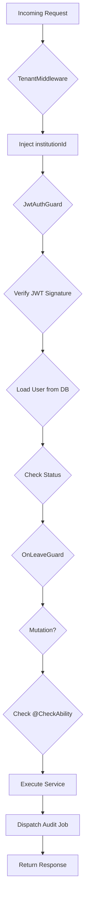

# EduSystem — Security AI Agent Operational Guide

> **Version:** 1.0
> **Last Updated:** 2026-05-14
> **Classification:** Internal — AI Coding Agents & Security Engineering
> **Scope:** Application Security, Tenant Isolation, Authentication, Authorization, API Protection, Secure Coding & Infrastructure Security
> **Parent:** `AGENTS.md` (full-stack source of truth)

---

## Table of Contents

1. [Purpose](#1-purpose)
2. [Scope](#2-scope)
3. [Non-Goals](#3-non-goals)
4. [Required Context](#4-required-context)
5. [Security Architectural Principles](#5-security-architectural-principles)
6. [Authentication Security Rules](#6-authentication-security-rules)
7. [Authorization Security Rules](#7-authorization-security-rules)
8. [Multi-Tenancy Security Rules](#8-multi-tenancy-security-rules)
9. [API Security Rules](#9-api-security-rules)
10. [Input Validation Rules](#10-input-validation-rules)
11. [Secure Coding Rules](#11-secure-coding-rules)
12. [Sensitive Data Handling Rules](#12-sensitive-data-handling-rules)
13. [Database Security Rules](#13-database-security-rules)
14. [Queue & Worker Security Rules](#14-queue--worker-security-rules)
15. [File Upload & Storage Security Rules](#15-file-upload--storage-security-rules)
16. [Frontend Security Rules](#16-frontend-security-rules)
17. [Infrastructure Security Rules](#17-infrastructure-security-rules)
18. [Logging & Audit Security Rules](#18-logging--audit-security-rules)
19. [Error Exposure Rules](#19-error-exposure-rules)
20. [Dependency & Package Security Rules](#20-dependency--package-security-rules)
21. [Performance vs Security Considerations](#21-performance-vs-security-considerations)
22. [Preferred Patterns](#22-preferred-patterns)
23. [Forbidden Patterns](#23-forbidden-patterns)
24. [Development Workflow Expectations](#24-development-workflow-expectations)
25. [Security Validation Checklist](#25-security-validation-checklist)
26. [Expected Quality Standards](#26-expected-quality-standards)

---

## 1. Purpose

This document is the authoritative security and architecture guide for AI coding agents modifying **application security, tenant isolation, authentication, authorization, API protection, secure coding practices, and defensive architecture** within the EduSystem repository.

It defines the non-negotiable security guarantees, architectural invariants, and operational constraints that every security-sensitive code change must preserve.

Every modification to security-sensitive functionality must preserve:

- **Tenant isolation** — No cross-tenant data access, institutionId enforcement on all queries
- **Authentication integrity** — JWT validation, refresh token rotation, credential safety
- **Authorization consistency** — CASL enforcement, role-based access, least privilege
- **API security** — Validation-first, DTO schemas, auth-aware endpoints
- **Secure data handling** — Password hashing, token protection, audit logging
- **Infrastructure security** — Docker awareness, env var handling, internal isolation

---

## 2. Scope

This guide covers all security-sensitive code modifications within the EduSystem repository:

- **Backend (`backend/`)** — NestJS API, Prisma ORM, BullMQ workers, authentication, authorization
- **Frontend (`frontend/`)** — Next.js app, NextAuth, React Query, UI components
- **Infrastructure (`docker-compose.yml`, `docs/`)** — Docker services, environment configuration

---

## 3. Non-Goals

This document does not cover:

- Physical security of data centers
- Network-level firewall configuration (handled by infrastructure team)
- Third-party penetration testing
- Security compliance certifications (ISO 27001, SOC 2)
- Incident response procedures (handled by security team)

---

## 4. Required Context

Before modifying any security-sensitive code, AI systems **MUST** read and follow these documents as authoritative architectural sources:

| Document | Purpose |
|----------|---------|
| `docs/ARCHITECTURE.md` | High-level system design, dual-mode runtime |
| `docs/AUTH.md` | Authentication flow, JWT handling, refresh tokens |
| `docs/DATABASE.md` | Prisma schema, migrations, soft delete, indexes |
| `docs/MULTITENANCY.md` | Tenant scoping, institutionId propagation, isolation |
| `docs/WORKERS.md` | BullMQ topology, job processing, async workflows |
| `docs/INFRASTRUCTURE.md` | Docker Compose, Redis, MinIO, environment variables |
| `AGENTS.md` | Full-stack source of truth, parent operational guide |
| `agents/auth-agent.md` | Authentication/authorization operational rules |
| `agents/worker-agent.md` | Background worker security patterns |
| `agents/frontend-agent.md` | Frontend security considerations |

---

## 5. Security Architectural Principles

### 5.1 Core Tenets

1. **Defense in depth** — Multiple security layers; no single point of failure
2. **Least privilege** — Grant minimum permissions required; deny by default
3. **Secure defaults** — Safe configurations out-of-the-box; opt-in for risk
4. **Fail securely** — Safe error handling; no sensitive data on failure
5. **Separation of concerns** — Auth boundaries; tenant isolation; role separation
6. **Audit awareness** — Log security-relevant events; maintain traceability
7. **Explicit over implicit** — Clear authorization; no hidden permissions

### 5.2 Security Layers

| Layer | Protection Mechanism |
|-------|---------------------|
| Network | Docker internal networking, CORS, allowed origins |
| Application | JWT validation, CASL authorization, tenant filters |
| Database | institutionId scoping, soft delete, parameterized queries |
| Queue | Tenant-agnostic workers, institutionId in payloads |
| Storage | MinIO with presigned URLs, tenant-prefixed paths |
| Frontend | Session handling, protected routes, auth-aware rendering |

### 5.3 Threat Model

| Threat | Mitigation |
|--------|-----------|
| Cross-tenant data access | institutionId filter on all tenant-scoped queries |
| Privilege escalation | CASL enforcement, role hierarchy validation |
| Token theft | Short-lived JWT (15min), refresh rotation, bcrypt hashed tokens |
| SQL injection | Prisma parameterized queries, no raw SQL |
| XSS | React auto-escaping, no dangerouslySetInnerHTML |
| File upload abuse | MIME validation, file-type restrictions, MinIO paths |
| Credential exposure | bcrypt hashing, no plaintext tokens in logs |

### 5.4 Security Decision Flow



---

## 6. Authentication Security Rules

### 6.1 JWT Handling

Access tokens are short-lived JWTs:

- **TTL:** 15 minutes
- **Algorithm:** HS256
- **Secret:** JWT_SECRET environment variable (≥32 characters)
- **Payload:** `{ sub: userId, institutionId, role, email }`

```typescript
// backend/src/modules/auth/auth.service.ts
async generateAccessToken(user: User): Promise<string> {
  return this.jwtService.signAsync(
    {
      sub: user.id,
      institutionId: user.institutionId,
      role: user.role,
      email: user.email,
    },
    { expiresIn: '15m' }
  );
}
```

### 6.2 Refresh Token Rotation

Refresh tokens provide long-lived sessions:

- **TTL:** 7 days
- **Storage:** Hashed in database (bcrypt)
- **Rotation:** New token issued on each use, old token revoked
- **Revocation:** Single token revocation supported

```typescript
// backend/src/modules/auth/auth.service.ts
async refreshToken(token: string, fingerprint: string): Promise<AuthResponse> {
  const stored = await this.prisma.refreshToken.findFirst({
    where: { token: hash(token), revokedAt: null },
  });
  if (!stored || stored.expiresAt < new Date()) {
    throw new UnauthorizedException('Token inválido o expirado');
  }
  // Revoke old token, issue new one
  await this.prisma.refreshToken.update({ where: { id: stored.id }, data: { revokedAt: new Date() } });
  return this.generateAuthResponse(stored.userId, fingerprint);
}
```

### 6.3 Guard Enforcement

Authentication enforced via guards applied in this order:

1. **TenantMiddleware** — Decodes JWT, injects tenant context (no signature verification)
2. **JwtAuthGuard** — Verifies JWT signature, loads user from DB
3. **OnLeaveGuard** — Blocks mutations for users with status === 'ON_LEAVE'

```typescript
// backend/src/app.module.ts
export class AppModule {
  configure(consumer: MiddlewareConsumer) {
    consumer.apply(TenantMiddleware).forRoutes('*');
  }
}
```

### 6.4 Credential Handling

Password security:

- **Hashing:** bcrypt with cost factor 10
- **Never:** Store plaintext, return in responses, log
- **Validation:** Minimum 8 characters, complexity requirements

```typescript
// backend/src/modules/auth/auth.service.ts
async validateCredentials(email: string, password: string): Promise<User> {
  const user = await this.prisma.user.findUnique({ where: { email } });
  if (!user || !await bcrypt.compare(password, user.password)) {
    throw new UnauthorizedException('Credenciales inválidas');
  }
  if (user.status === 'INACTIVE' || user.status === 'SUSPENDED') {
    throw new ForbiddenException('Cuenta inactiva o suspendida');
  }
  return user;
}
```

### 6.5 Forbidden Patterns

- **Never** store plaintext tokens — use bcrypt for refresh tokens
- **Never** expose tokens in URLs — tokens belong in headers only
- **Never** trust client-provided roles — derive from JWT payload
- **Never** bypass JwtAuthGuard — all authenticated routes protected
- **Never** store credentials in logs — sensitive data exposure
- **Never** allow long-lived access tokens — 15-minute maximum

---

## 7. Authorization Security Rules

### 7.1 CASL ABAC

Authorization uses CASL for attribute-based access control:

```typescript
// backend/src/modules/casl/casl-ability.factory.ts
export class CaslAbilityFactory {
  createForUser(user: RequestUser) {
    const builder = new AbilityBuilder(Ability);
    
    // Role-based rules
    switch (user.role) {
      case 'SUPER_ADMIN':
        builder.can(Action.Manage, 'all');
        break;
      case 'ADMIN':
        builder.can(Action.Manage, 'Institution');
        builder.can(Action.Manage, 'User');
        builder.can(Action.Manage, 'Student');
        // ...
        break;
      case 'TEACHER':
        builder.can(Action.Read, 'Course');
        builder.can(Action.Read, 'Grade');
        builder.can(Action.Create, 'Grade');
        // ...
        break;
    }
    return builder.build();
  }
}
```

### 7.2 Decorator Enforcement

All mutations require `@CheckAbility()` decorator:

```typescript
@CheckAbility({ action: Action.Create, subject: 'Student' })
@Post()
async create(@Body(new ZodPipe(CreateStudentSchema)) dto: CreateStudentDto) {
  return this.studentsService.create(dto, institutionId);
}
```

### 7.3 Role Hierarchy

Effective role determined via `getHighestRole()`:

```
SUPER_ADMIN > ADMIN > DIRECTOR > SECRETARY > PRECEPTOR > TEACHER > GUARDIAN
```

### 7.4 Tenant-Scoped Authorization

Authorization checks include institutionId:

```typescript
// Super admin sees all; others see only their institution
async findAll(institutionId: string | null, user: RequestUser) {
  if (user.role === 'SUPER_ADMIN') {
    return this.prisma.student.findMany({ where: { deletedAt: null } });
  }
  return this.prisma.student.findMany({ where: { institutionId, deletedAt: null } });
}
```

### 7.5 Guard Ordering

Guards execute in specific order:

1. TenantMiddleware (injects institutionId)
2. JwtAuthGuard (verifies JWT, loads user)
3. OnLeaveGuard (blocks mutations for ON_LEAVE)
4. CaslGuard (via @CheckAbility())

### 7.6 Forbidden Patterns

- **Never** bypass @CheckAbility() on mutations
- **Never** assume implicit permissions — explicit rules only
- **Never** trust frontend authorization — server enforces
- **Never** create hidden privilege escalation paths
- **Never** use role checks alone — combine with CASL
- **Never** allow SUPER_ADMIN without explicit role verification

---

## 8. Multi-Tenancy Security Rules

### 8.1 Tenant Isolation Model

Shared-database, shared-schema multi-tenancy:

- **Isolation:** Application-layer only via institutionId
- **Database:** Single PostgreSQL instance, single schema
- **Enforcement:** Prisma queries include institutionId filter

### 8.2 institutionId Enforcement

**Critical:** Every tenant-scoped query must include institutionId filter:

```typescript
// CORRECT: Scoped query
const students = await this.prisma.student.findMany({
  where: { institutionId, deletedAt: null },
});

// WRONG: Unscoped query — NEVER DO THIS
const students = await this.prisma.student.findMany();
```

### 8.3 TenantMiddleware

Tenant context injected via middleware:

```typescript
// backend/src/common/middleware/tenant.middleware.ts
export class TenantMiddleware implements NestMiddleware {
  use(req: Request, res: Response, next: NextFunction) {
    const authHeader = req.headers.authorization;
    if (authHeader?.startsWith('Bearer ')) {
      const token = authHeader.substring(7);
      const decoded = this.jwtService.verify(token);
      req.institutionId = decoded.institutionId;
      req.userId = decoded.sub;
      req.userRole = decoded.role;
      req.userEmail = decoded.email;
    }
    next();
  }
}
```

### 8.4 Tenant-Aware API Design

All tenant-scoped endpoints receive institutionId:

- Via `@InstitutionId()` decorator (injects req.institutionId)
- Derived from JWT for SUPER_ADMIN handling

```typescript
@Get()
findAll(@InstitutionId() institutionId: string) {
  return this.studentsService.findAll(institutionId);
}
```

### 8.5 Tenant-Aware Workers

Workers are tenant-agnostic; institutionId in job payload:

```typescript
// Queue payload MUST include institutionId
await this.notificationQueue.add(JOBS.GRADE_CREATED, {
  gradeId: grade.id,
  studentId: dto.studentId,
  institutionId, // REQUIRED for tenant isolation
}, JOB_OPTIONS.DEFAULT);
```

### 8.6 Tenant-Aware Storage

MinIO paths include institutionId prefix:

```
avatars/{institutionId}/{userId}/{filename}
logos/{institutionId}/{filename}
```

### 8.7 Cross-Tenant Prevention

The following constitute **critical security violations**:

- Querying tenant-scoped model without institutionId filter
- Returning entity from one tenant in another tenant's query
- Allowing SUPER_ADMIN actions without role verification
- Storing cross-tenant data in module-level variables
- Trusting client-provided institutionId values

### 8.8 Forbidden Patterns

- **Never** bypass institutionId filtering
- **Never** allow cross-tenant queries
- **Never** queue tenant-unaware jobs
- **Never** trust client-provided institutionId
- **Never** create tenant-agnostic storage paths

---

## 9. API Security Rules

### 9.1 Validation-First Architecture

All inputs validated via Zod schemas before service execution:

```typescript
@Post()
create(@Body(new ZodPipe(CreateStudentSchema)) dto: CreateStudentDto) {
  // dto fully validated before reaching service
  return this.studentsService.create(dto, institutionId);
}
```

### 9.2 DTO Schema Guidelines

- **UUID validation:** z.string().uuid()
- **Email validation:** z.string().email()
- **Numeric ranges:** z.number().min(X).max(Y)
- **Enum validation:** z.enum([...])
- **Strict objects:** z.object({}).strict()

### 9.3 Auth-Aware Endpoints

- Public routes marked with @Public() decorator
- All other routes require JWT (JwtAuthGuard global)
- Sensitive endpoints require specific @CheckAbility()

### 9.4 Response Serialization

- **Never** return full ORM objects — select only needed fields
- **Never** return passwords, tokens, or sensitive data
- **Always** use DTOs for response types

```typescript
// Return typed DTO, not raw Prisma object
return {
  id: student.id,
  firstName: student.firstName,
  lastName: student.lastName,
  // Explicit fields only
};
```

### 9.5 Pagination Safety

- Default limit: 100 items
- Maximum limit: 1000 (enforced)
- Always use skip/take for pagination

### 9.6 Mass Assignment Prevention

- Explicit DTO fields only
- .strict() on Zod schemas to reject unknown fields
- No entity passthrough to database

### 9.7 Rate Limiting Awareness

- Consider rate limiting for sensitive endpoints
- Use BullMQ for async processing of bulk operations
- Implement retry limits on client side

### 9.8 Forbidden Patterns

- **Never** expose internal implementation details in responses
- **Never** return sensitive data unnecessarily
- **Never** allow mass assignment via passthrough
- **Never** skip validation on any endpoint

---

## 10. Input Validation Rules

### 10.1 Validation-First Principle

All external input validated before any processing:

- HTTP request bodies via Zod + ZodPipe
- Query parameters via DTOs
- Route parameters validated
- File uploads validated for type and size

### 10.2 Schema Requirements

Every mutation requires explicit schema:

```typescript
export const CreateStudentSchema = z.object({
  firstName: z.string().min(1, 'Requerido').max(50),
  lastName: z.string().min(1, 'Requerido').max(50),
  documentNumber: z.string().min(1, 'Requerido').max(20),
  birthDate: z.string().date('Fecha inválida'),
  bloodType: z.string().optional(),
  medicalNotes: z.string().max(500).optional(),
}).strict();
```

### 10.3 Sanitization

- No HTML in text fields (sanitize server-side)
- No SQL in string fields (Prisma prevents this)
- File uploads validated for MIME type

### 10.4 Forbidden Patterns

- **Never** trust raw user input
- **Never** bypass ZodPipe validation
- **Never** use eval() or dynamic execution
- **Never** allow unsafe object merging

---

## 11. Secure Coding Rules

### 11.1 Defensive Programming

- Assume all input is malicious until validated
- Fail securely — deny by default
- Validate at boundary — never trust caller

### 11.2 Explicit Security Boundaries

- Clear separation between authenticated and public routes
- Explicit role checks, no implicit permissions
- Tenant isolation enforced at every layer

### 11.3 Secure Defaults

- Initialize with safe defaults
- Deny access by default, grant explicitly
- Use strict types, avoid any

### 11.4 Predictable Failure

- Consistent error responses
- No sensitive data in error messages
- Log errors securely

### 11.5 Type Safety

- No any types for security-relevant code
- Explicit types for all function parameters
- TypeScript strict mode enabled

### 11.6 Forbidden Patterns

- **Never** hardcode secrets in source code
- **Never** use eval() or dynamic code execution
- **Never** fail silently — always log or throw
- **Never** use insecure fallback logic
- **Never** assume implicit trust between components

---

## 12. Sensitive Data Handling Rules

### 12.1 Password Handling

- **Hashing:** bcrypt with cost factor 10
- **Validation:** Minimum complexity requirements
- **Never:** Return password in any response
- **Never:** Log password hashes

### 12.2 Token Handling

- Access tokens: Short-lived (15min), JWT
- Refresh tokens: Long-lived (7d), bcrypt hashed
- **Never:** Store tokens in plaintext
- **Never:** Return tokens in GET responses

### 12.3 Credential Protection

- Credentials validated, not stored in memory longer than needed
- Clear sensitive data after use
- No debugging logs of credentials

### 12.4 PII Handling

Personal data handled per privacy requirements:

- Document numbers: Masked in logs
- Medical notes: Access limited to authorized roles
- Contact information: Not exposed unnecessarily

### 12.5 Audit-Sensitive Data

Log security-relevant events:

- Authentication attempts (success/failure)
- Authorization denials
- Tenant context changes
- Sensitive operations (delete, export)

### 12.6 Forbidden Patterns

- **Never** log passwords or tokens
- **Never** expose credentials in responses
- **Never** store sensitive data insecurely
- **Never** log PII unnecessarily

---

## 13. Database Security Rules

### 13.1 Tenant-Scoped Queries

All queries on tenant-scoped models include institutionId:

```typescript
// Always include institutionId filter
await this.prisma.student.findMany({
  where: { institutionId, deletedAt: null },
});
```

### 13.2 Parameterized Queries

Prisma prevents SQL injection via parameterized queries:

- **Never** use raw SQL for user input
- **Never** concatenate user input into queries
- **Always** use Prisma's query builder

### 13.3 Transaction Safety

Multi-model writes use transactions:

```typescript
await this.prisma.$transaction(async (tx) => {
  await tx.attendance.create({ data });
  await tx.justification.create({ data: { attendanceId: attendance.id } });
});
```

### 13.4 Soft Delete Awareness

Soft-deleted records filtered by PrismaService middleware:

- Queries automatically exclude deletedAt records
- Restore via update with deletedAt: null

### 13.5 Index Security

Indexes on institutionId + foreign key combinations:

- Ensures tenant-scoped query performance
- Prevents cross-tenant enumeration via timing

### 13.6 Forbidden Patterns

- **Never** use raw SQL with user input
- **Never** create unbounded queries (always use limit)
- **Never** perform destructive operations without validation
- **Never** bypass tenant filters in queries

---

## 14. Queue & Worker Security Rules

### 14.1 Tenant-Aware Jobs

All job payloads include institutionId:

```typescript
await this.notificationQueue.add(JOBS.GRADE_CREATED, {
  gradeId: grade.id,
  studentId: dto.studentId,
  institutionId: institutionId, // REQUIRED
}, JOB_OPTIONS.DEFAULT);
```

### 14.2 Secure Payloads

- **Never** queue plaintext credentials
- **Never** queue raw JWTs or refresh tokens
- **Never** queue sensitive PII unnecessarily

### 14.3 Worker Isolation

- Workers are tenant-agnostic
- institutionId in payload provides isolation
- No cross-tenant job processing

### 14.4 Retry Safety

- Idempotent processors for at-least-once delivery
- Limited retry attempts (JOB_OPTIONS configuration)
- Dead letter queue for non-recoverable failures

### 14.5 Audit Logging

All security-relevant jobs dispatch audit:

```typescript
await this.auditQueue.add(JOBS.AUDIT_LOG, {
  institutionId,
  userId,
  action: 'CREATE',
  resource: 'Grade',
  resourceId: grade.id,
  after: grade,
}, JOB_OPTIONS.CRITICAL);
```

### 14.6 Forbidden Patterns

- **Never** queue plaintext credentials in job payloads
- **Never** queue raw tokens in job data
- **Never** create tenant-unaware background jobs

---

## 15. File Upload & Storage Security Rules

### 15.1 Tenant-Aware Storage Paths

All files stored with institutionId prefix:

```
avatars/{institutionId}/{userId}/{filename}
logos/{institutionId}/{filename}
```

### 15.2 Upload Validation

- **MIME type validation:** Only allowed types
- **File size limits:** Maximum size enforced
- **Extension validation:** Match MIME type

### 15.3 Secure Access

- Files accessed via presigned URLs only
- No direct MinIO bucket access from frontend
- URL expiration times enforced

### 15.4 File Type Restrictions

Allowed file types for avatars: image/jpeg, image/png, image/webp
Allowed file types for documents: application/pdf

### 15.5 Virus Scanning

Consider integration with ClamAV for document uploads in production.

### 15.6 Forbidden Patterns

- **Never** allow unrestricted uploads
- **Never** execute uploaded files
- **Never** allow global public access to MinIO buckets
- **Never** create tenant-unaware storage paths

---

## 16. Frontend Security Rules

### 16.1 Auth-Aware Rendering

- Session-based rendering with NextAuth
- Protected routes enforced via middleware
- Role-based UI rendering

### 16.2 XSS Prevention

- React auto-escapes by default
- **Never** use dangerouslySetInnerHTML
- **Never** render HTML from API responses

### 16.3 Secure Session Handling

- Tokens stored via NextAuth (HTTP-only cookies)
- Session caching (5 minute TTL) in axios
- Auto-logout on 401 responses

### 16.4 Client-Side Storage

- **Never** store tokens in localStorage
- **Never** store sensitive data in cookies
- Use session storage only for non-sensitive UI state

### 16.5 API Consumption

- Use axios singleton with auth interceptor
- No token exposure in URLs
- Typed responses, no any types

### 16.6 Forbidden Patterns

- **Never** trust frontend-only authorization
- **Never** render unsafe HTML
- **Never** store tokens in localStorage
- **Never** expose sensitive auth state in client

---

## 17. Infrastructure Security Rules

### 17.1 Docker Security

- Services communicate via internal network
- No service exposed externally except api/web
- Secrets passed via environment variables

### 17.2 Environment Variable Handling

- Secrets in .env files (not committed)
- Variables validated via Zod schema
- No hardcoded secrets in source

```typescript
// backend/src/config/env.schema.ts
export const envSchema = z.object({
  JWT_SECRET: z.string().min(32),
  DATABASE_URL: z.string().url(),
  REDIS_HOST: z.string(),
  // ...
});
```

### 17.3 Redis Security

- Used for BullMQ job queue and session caching
- AOF persistence enabled
- Production: password-protected

### 17.4 PostgreSQL Security

- Single database, shared schema (multi-tenant)
- Connection via Prisma
- Soft delete via middleware

### 17.5 MinIO Security

- S3-compatible, internal network only
- Presigned URLs for file access
- Bucket policies restrict access

### 17.6 Internal Network

- Docker Compose defines internal network
- Services not exposed externally unless needed
- CORS configured via ALLOWED_ORIGINS

### 17.7 Forbidden Patterns

- **Never** hardcode secrets in source code
- **Never** handle environment variables insecurely
- **Never** expose services unnecessarily
- **Never** use insecure container defaults

---

## 18. Logging & Audit Security Rules

### 18.1 Structured Logging

Use NestJS Logger for all logging:

```typescript
this.logger.log(`Student ${student.id} enrolled in course ${courseId}`);
this.logger.error('Failed to send FCM notification', err);
```

### 18.2 Security Event Logging

Log security-relevant events:

- Authentication successes/failures
- Authorization denials (@CheckAbility failures)
- Tenant context anomalies
- Sensitive operations (delete, bulk export)
- Rate limiting triggers

### 18.3 Sensitive Data Redaction

**Never log:**

- Passwords or password hashes
- JWT access tokens
- Refresh tokens
- API keys or secrets
- PII (document numbers, medical notes)
- Full request/response bodies

**Redact in logs:**

- Document numbers: `****1234`
- Emails: `u***@domain.com`

### 18.4 Audit Logging

Dispatch audit jobs for all mutations:

```typescript
await this.auditQueue.add(JOBS.AUDIT_LOG, {
  institutionId,
  userId,
  action: 'CREATE',
  resource: 'Student',
  resourceId: student.id,
  after: sanitizedStudent,
}, JOB_OPTIONS.CRITICAL);
```

### 18.5 Tenant-Aware Observability

- Logs include institutionId for filtering
- Audit queries filtered by institutionId
- No cross-tenant log exposure

### 18.6 Forbidden Patterns

- **Never** log credentials or tokens
- **Never** log sensitive PII unnecessarily
- **Never** expose tenant data in logs

---

## 19. Error Exposure Rules

### 19.1 Production Error Handling

Production errors must be safe:

```typescript
// Development: full error details
// Production: sanitized message only
throw new InternalServerErrorException(
  process.env.NODE_ENV === 'development' ? err.message : 'Error interno'
);
```

### 19.2 Stack Trace Protection

- **Never** expose stack traces in production
- **Never** expose internal file paths
- **Never** expose library versions

### 19.3 Internal Detail Protection

Error responses must not expose:

- Database schema details
- Internal API paths
- Library versions
- Infrastructure details
- Auth implementation details

### 19.4 Exception Filters

Use NestJS exception filters for consistent error handling:

```typescript
@Catch()
export class AllExceptionsFilter extends BaseExceptionFilter {
  catch(exception: unknown, host: ArgumentsHost) {
    // Sanitize error for production
    super.catch(sanitizeError(exception), host);
  }
}
```

### 19.5 User-Friendly Messages

Show user-friendly messages, not internal details:

| Internal Error | User Message |
|----------------|-------------|
| Prisma error: relation not found | "Operación no válida" |
| JWT expired | "Sesión expirada, inicie sesión nuevamente" |
| Rate limit exceeded | "Demasiadas solicitudes, intente más tarde" |

### 19.6 Forbidden Patterns

- **Never** expose stack traces in production
- **Never** leak infrastructure details
- **Never** leak database internals
- **Never** leak auth implementation details

---

## 20. Dependency & Package Security Rules

### 20.1 Dependency Minimization

- Install only necessary packages
- Avoid adding libraries without clear justification
- Prefer built-in solutions over third-party

### 20.2 Package Vetting

- Review package maintainers, download counts, audit history
- Avoid packages with known vulnerabilities
- Use npm audit for scanning

### 20.3 Dependency Updates

- Regularly update dependencies
- Monitor security advisories
- Test after updates

### 20.4 Type Safety

- Prefer TypeScript-typed packages
- Avoid packages without type definitions
- No any types for security code

### 20.5 Forbidden Patterns

- **Never** introduce packages with known CVEs
- **Never** add libraries without justification
- **Never** use insecure package configurations

---

## 21. Performance vs Security Considerations

### 21.1 Security-First Tradeoffs

When security and performance conflict, security wins:

- Accept performance cost for proper validation
- Accept latency for audit logging
- Accept overhead for tenant isolation

### 21.2 Secure Caching

Caching must not compromise security:

- Don't cache sensitive data
- Invalidate cache on security events
- Use tenant-scoped cache keys

### 21.3 Scalable Auth

- JWT for stateless authentication (scales horizontally)
- Refresh token rotation limits session hijacking risk
- Short-lived tokens reduce attack window

### 21.4 Tenant-Aware Performance

- Indexes on institutionId + foreign keys
- Query pagination prevents resource exhaustion
- Async processing for non-critical operations

### 21.5 Async Security

- Queue-based async maintains security boundaries
- Idempotent processors prevent duplicate operations
- Audit logging async to not block response

---

## 22. Preferred Patterns

### 22.1 Authentication

- JWT with 15-minute expiration
- Refresh token rotation (7-day TTL)
- bcrypt hashing for passwords (cost factor 10)
- Global JwtAuthGuard on all routes

### 22.2 Authorization

- CASL for ABAC authorization
- @CheckAbility() on all mutations
- Role hierarchy via getHighestRole()
- Explicit permission grants

### 22.3 Tenant Isolation

- institutionId filter on all tenant-scoped queries
- TenantMiddleware for context injection
- Tenant-aware storage paths
- Tenant-agnostic workers with institutionId in payload

### 22.4 API Security

- Zod + ZodPipe for validation-first
- Explicit DTOs for request/response
- Pagination with limits
- No mass assignment

### 22.5 Secure Coding

- TypeScript strict mode
- No any types in security code
- Explicit over implicit
- Fail securely

### 22.6 Logging

- Structured logging via NestJS Logger
- Security event logging
- No sensitive data in logs
- Audit logging for mutations

---

## 23. Forbidden Patterns

### 23.1 Authentication

| Forbidden | Reason |
|-----------|--------|
| Plaintext token storage | Credential exposure |
| Long-lived access tokens (>15min) | Extended attack window |
| Bypassing JwtAuthGuard | Authentication bypass |
| Trusting client-provided roles | Privilege escalation |

### 23.2 Authorization

| Forbidden | Reason |
|-----------|--------|
| Bypassing @CheckAbility() | Authorization bypass |
| Implicit permissions | Access control failure |
| Trusting frontend authorization | Authorization bypass |
| Hidden privilege paths | Privilege escalation |

### 23.3 Multi-Tenancy

| Forbidden | Reason |
|-----------|--------|
| Queries without institutionId filter | Cross-tenant data leak |
| Cross-tenant queries | Critical security violation |
| Tenant-unaware jobs | Isolation failure |
| Trusting client-provided institutionId | Tenant spoofing |

### 23.4 API & Input

| Forbidden | Reason |
|-----------|--------|
| Skipping Zod validation | Injection risk |
| Mass assignment | Over-privileged mutations |
| Unbounded queries | DoS vector |
| Raw SQL with user input | SQL injection |

### 23.5 Data Handling

| Forbidden | Reason |
|-----------|--------|
| Logging passwords/tokens | Credential exposure |
| Exposing credentials in responses | Data exposure |
| Storing sensitive data insecurely | Data breach |
| Storing tokens in localStorage | XSS token theft |

### 23.6 Async Processing

| Forbidden | Reason |
|-----------|--------|
| Queuing plaintext credentials | Credential exposure |
| Queuing raw JWTs in payloads | Token exposure |
| Non-idempotent processors | Duplicate operations |
| Tenant-unaware queue jobs | Isolation failure |

### 23.7 Error Handling

| Forbidden | Reason |
|-----------|--------|
| Exposing stack traces in production | Information disclosure |
| Leaking infrastructure details | Reconnaissance aid |
| Exposing database internals | Information disclosure |

---

## 24. Development Workflow Expectations

### 24.1 Before Writing Security Code

1. **Read security documentation** — Start with AGENTS.md, then this guide
2. **Analyze threat model** — Identify what could go wrong
3. **Review existing patterns** — Find similar secure implementations
4. **Plan security boundaries** — Define trust boundaries clearly

### 24.2 During Implementation

- Follow security patterns exactly — do not innovate on security
- When two approaches exist, choose the more secure one
- If introducing new security pattern, document and get review
- Never skip security controls for convenience

### 24.3 Security Review Triggers

**Get explicit review for changes that:**

- Modify authentication flow
- Change authorization model
- Add new tenant-scoped model
- Modify tenant isolation logic
- Add new file upload endpoint
- Change token handling
- Modify sensitive data handling

### 24.4 Preserving Security

- Do not refactor security code unless necessary
- Preserve existing security guarantees
- Don't introduce new attack surfaces
- Maintain audit logging coverage

### 24.5 Linting & Type Checking

Run before submitting changes:

```bash
cd backend && npm run lint && npm run typecheck
cd frontend && npm run lint && npm run typecheck
```

---

## 25. Security Validation Checklist

Before submitting any security-sensitive change, verify:

### Authentication
- [ ] JWT validation via JwtAuthGuard on all authenticated routes
- [ ] Refresh tokens stored hashed (bcrypt)
- [ ] Passwords hashed with bcrypt, never returned in responses
- [ ] No plaintext tokens in logs

### Authorization
- [ ] @CheckAbility() on all mutation endpoints
- [ ] CASL rules correctly enforce permissions
- [ ] Role checks combined with tenant context
- [ ] No implicit permissions or hidden paths

### Multi-Tenancy
- [ ] All tenant-scoped queries include institutionId filter
- [ ] TenantMiddleware applies to all routes
- [ ] Queue jobs include institutionId in payload
- [ ] Storage paths include institutionId prefix
- [ ] No cross-tenant queries possible

### API Security
- [ ] All inputs validated via Zod schemas
- [ ] DTOs used for request/response types
- [ ] No mass assignment possible
- [ ] Pagination with limits enforced

### Sensitive Data
- [ ] No credentials in logs
- [ ] No tokens in logs
- [ ] Passwords not returned in responses
- [ ] PII handled appropriately

### Async Security
- [ ] No credentials in queue payloads
- [ ] No raw JWTs in job data
- [ ] Processors are idempotent
- [ ] Audit jobs dispatched for mutations

### Error Handling
- [ ] No stack traces in production
- [ ] No internal implementation details exposed
- [ ] User-friendly error messages

### Frontend Security
- [ ] No localStorage for tokens
- [ ] No dangerous HTML rendering
- [ ] Protected routes via middleware

### Infrastructure
- [ ] No hardcoded secrets
- [ ] Environment variables used for secrets
- [ ] Docker internal network isolation

---

## 26. Expected Quality Standards

### 26.1 Zero-Tolerance Violations

The following violations are grounds for immediate rejection:

- **Cross-tenant data access** — Query without institutionId filter
- **Authentication bypass** — Missing JwtAuthGuard on protected routes
- **Authorization bypass** — Missing @CheckAbility() on mutations
- **Credential exposure** — Tokens or passwords in logs
- **Token handling violations** — Plaintext storage, long-lived tokens
- **Input validation bypass** — Skipping Zod validation
- **Stack trace exposure** — In production error responses
- **Hardcoded secrets** — In source code

### 26.2 Review Criteria

Every PR must meet:

- [ ] All security validation checklist items pass
- [ ] `npm run lint` passes
- [ ] `npm run typecheck` passes
- [ ] No security regression from existing patterns
- [ ] New features follow established security patterns

### 26.3 Security Expectations

| Area | Expectation |
|------|-------------|
| Authentication | JWT validation, token rotation, secure storage |
| Authorization | CASL enforcement, explicit permissions |
| Multi-tenancy | Strict tenant isolation, no cross-tenant access |
| API | Validation-first, typed DTOs, no mass assignment |
| Data | Secure handling, no sensitive data in logs |
| Async | Idempotent, audit logging, secure payloads |
| Error | Safe production errors, no internal details |

---

## Appendix A: Key Security Files

| File | Purpose |
|------|---------|
| `backend/src/common/guards/jwt-auth.guard.ts` | JWT verification |
| `backend/src/common/guards/on-leave.guard.ts` | Blocks mutations for ON_LEAVE |
| `backend/src/common/middleware/tenant.middleware.ts` | Tenant context injection |
| `backend/src/modules/casl/casl-ability.factory.ts` | CASL authorization rules |
| `backend/src/modules/auth/auth.service.ts` | Token generation, refresh handling |
| `backend/src/modules/auth/strategies/jwt.strategy.ts` | Passport JWT strategy |
| `backend/src/config/env.schema.ts` | Environment validation |
| `frontend/src/lib/api.ts` | Axios with auth interceptor |
| `frontend/src/middleware/middleware.ts` | Route protection |
| `frontend/src/lib/auth.ts` | NextAuth configuration |

## Appendix B: Security Configuration

| Configuration | Value |
|---------------|-------|
| JWT Access Token TTL | 15 minutes |
| Refresh Token TTL | 7 days |
| Refresh Token Storage | bcrypt hashed |
| Password Hashing | bcrypt (cost factor 10) |
| Default Query Limit | 100 items |
| Max Query Limit | 1000 items |

## Appendix C: Environment Variables

| Variable | Purpose |
|----------|---------|
| JWT_SECRET | Access token signing key (≥32 chars) |
| JWT_REFRESH_SECRET | Refresh token signing key (≥32 chars) |
| DATABASE_URL | PostgreSQL connection string |
| REDIS_HOST / REDIS_PORT | Redis connection |
| NEXTAUTH_SECRET | NextAuth session encryption |
| ALLOWED_ORIGINS | CORS allowed origins |

---

*This document is the authoritative security guide for all AI agents operating within the EduSystem repository. It is maintained alongside the codebase and updated whenever security architectural rules change.*