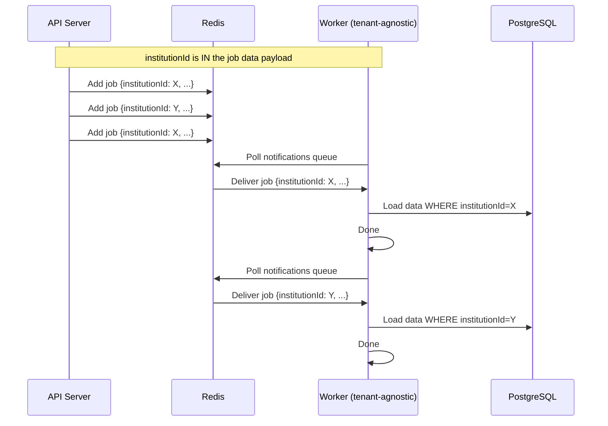
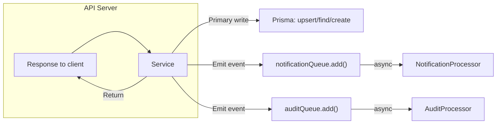

# EduSystem — Background Worker AI Agent Operational Guide

> **Version:** 1.0
> **Last Updated:** 2026-05-14
> **Classification:** Internal — AI Coding Agents & Engineering Team
> **Scope:** Background Workers, BullMQ Queues, Async Processing, Distributed Job Execution & Event-Driven Architecture
> **Parent:** `AGENTS.md` (full-stack source of truth)

---

## Table of Contents

1. [Purpose](#1-purpose)
2. [Scope](#2-scope)
3. [Non-Goals](#3-non-goals)
4. [Required Context](#4-required-context)
5. [Worker Architectural Principles](#5-worker-architectural-principles)
6. [Queue Architecture Rules](#6-queue-architecture-rules)
7. [BullMQ Rules](#7-bullmq-rules)
8. [Processor Rules](#8-processor-rules)
9. [Job Design Rules](#9-job-design-rules)
10. [Idempotency Rules](#10-idempotency-rules)
11. [Retry & Failure Handling Rules](#11-retry--failure-handling-rules)
12. [Multi-Tenancy Rules](#12-multi-tenancy-rules)
13. [Tenant Context Propagation Rules](#13-tenant-context-propagation-rules)
14. [Async Consistency Rules](#14-async-consistency-rules)
15. [Event-Driven Workflow Rules](#15-event-driven-workflow-rules)
16. [Database Interaction Rules](#16-database-interaction-rules)
17. [Transaction Rules](#17-transaction-rules)
18. [Queue Payload Rules](#18-queue-payload-rules)
19. [Authentication & Authorization Rules](#19-authentication--authorization-rules)
20. [Security Rules](#20-security-rules)
21. [Performance & Scalability Rules](#21-performance--scalability-rules)
22. [Monitoring & Observability Rules](#22-monitoring--observability-rules)
23. [Preferred Patterns](#23-preferred-patterns)
24. [Forbidden Patterns](#24-forbidden-patterns)
25. [Development Workflow Expectations](#25-development-workflow-expectations)
26. [Validation Checklist](#26-validation-checklist)
27. [Expected Quality Standards](#27-expected-quality-standards)

---

## 1. Purpose

This document is the authoritative behavioral and architectural guide for AI coding agents modifying **background workers, BullMQ queues, asynchronous processing, event-driven workflows, and distributed job execution** within the EduSystem repository.

It defines the non-negotiable operational guarantees, architectural invariants, and technical constraints that every worker-related code change must preserve.

Every modification to worker infrastructure, queue processing, or async workflows must preserve:

- **Async processing consistency** — Jobs execute reliably with correct retry semantics
- **Tenant-safe background execution** — Every job carries explicit `institutionId` context
- **Queue reliability** — Jobs persist across worker restarts via Redis AOF
- **Idempotent job processing** — At-least-once delivery produces deterministic results
- **Scalability** — Workers scale horizontally without coupling to API pods
- **Retry safety** — Exponential backoff prevents retry storms
- **Distributed processing integrity** — Multiple workers process jobs safely
- **Event-driven architecture consistency** — Choreography pattern maintained

This guide is designed to ensure AI systems understand how async workflows operate in EduSystem, how BullMQ should be used correctly, how workers process jobs safely, and how to evolve async infrastructure without breaking existing guarantees.

---

## 2. Scope

### 2.1 What This Guide Covers

This guide applies to all changes affecting the worker execution layer:

- **Queue infrastructure** — Queue definitions, job constants, naming conventions
- **Processors** — `@Processor` classes, `@Process` methods, concurrency settings
- **Job dispatching** — Service-level `queue.add()` calls, payload construction
- **Retry strategies** — Job options, backoff configuration, failure handling
- **Worker runtime** — `WorkerAppModule`, worker-only modules, dual-mode bootstrap
- **Async workflows** — Event-driven patterns, workflow chains, background processing
- **Tenant-aware processing** — `institutionId` propagation, tenant-scoped queries
- **Monitoring** — BullBoard, logging, observability, health checks

### 2.2 Related Architectural Documents

This guide references and treats as authoritative:

| Document | Purpose |
|----------|---------|
| `docs/WORKERS.md` | BullMQ topology, processor implementations, retry strategies, idempotency patterns |
| `docs/ARCHITECTURE.md` | System-level design, dual-mode runtime, service boundaries |
| `docs/AUTH.md` | Authentication architecture, JWT structure |
| `docs/DATABASE.md` | Prisma schema, audit logging, soft delete |
| `docs/MULTITENANCY.md` | Tenant scoping, JWT propagation, SUPER_ADMIN behavior |
| `docs/INFRASTRUCTURE.md` | Redis, Docker Compose, deployment |
| `AGENTS.md` | Parent operational guide, full-stack source of truth |

AI agents must read the appropriate documentation before modifying worker-related code. Do not modify BullMQ infrastructure, queue processors, or async workflows without understanding the existing patterns documented in `docs/WORKERS.md`.

---

## 3. Non-Goals

This guide explicitly does not cover:

- **HTTP request handling** — Controllers, guards, middleware, request parsing
- **Real-time communication** — WebSockets, Server-Sent Events, push streaming
- **Kafka migration planning** — Future event streaming architecture
- **Service mesh** — gRPC, service discovery, inter-service communication
- **Frontend async operations** — React Query, client-side state management

These areas are covered by other agent guides or the parent `AGENTS.md`.

---

## 4. Required Context

### 4.1 Pre-Requisite Reading

Before modifying any worker-related code, AI agents must read and understand:

1. **`docs/WORKERS.md`** — Primary reference for BullMQ architecture, queue topology, processor implementations, retry strategies, idempotency patterns, tenant-aware processing, and scalability considerations. This document contains the canonical patterns that worker code must follow.

2. **`docs/ARCHITECTURE.md`** — System-level design including dual-mode runtime (`APP_MODE=api` vs `APP_MODE=worker`), module separation, and service boundaries.

3. **`docs/MULTITENANCY.md`** — Tenant identification, `institutionId` propagation, SUPER_ADMIN behavior, and cross-tenant leak prevention.

4. **`docs/DATABASE.md`** — Prisma schema, `AuditLog` model, soft delete behavior, and transaction patterns.

5. **`docs/INFRASTRUCTURE.md`** — Redis configuration (AOF persistence), Docker Compose, worker deployment.

6. **`AGENTS.md`** — Parent operational guide covering development workflow, testing expectations, and code style.

### 4.2 Key Architectural Decisions

The following decisions are authoritative and not subject to modification without architectural review:

| Decision | Rationale |
|---------|-----------|
| BullMQ over Kafka | Current scale (<10K jobs/hour) makes BullMQ pragmatic. Kafka would be correct at 10× scale. |
| Redis AOF persistence | Jobs survive Redis restarts. Non-negotiable for reliability. |
| At-least-once delivery | Idempotent processors handle retries safely. Exactly-once requires transactional outbox (not implemented). |
| Tenant-agnostic workers | Workers process jobs from any tenant. Each job carries its own `institutionId`. |
| Choreography pattern | Services emit events after primary write. No central orchestrator. |
| Exponential backoff | Prevents retry storms, allows downstream recovery. |

---

## 5. Worker Architectural Principles

### 5.1 Dual-Mode Runtime

EduSystem supports two mutually exclusive runtime modes via `APP_MODE`:

| Mode | Command | Purpose |
|------|---------|---------|
| `api` | `npm run start:dev` | HTTP REST API with full NestJS module stack |
| `worker` | `APP_MODE=worker npm run start:dev` | Isolated BullMQ job processor with minimal module set |

```typescript
// main.ts — dual-mode bootstrap
if (mode === 'worker') {
  const app = await NestFactory.create(WorkerAppModule, { bufferLogs: true });
  await app.init();
  logger.log('Worker BullMQ iniciado');

  process.on('SIGTERM', async () => {
    logger.log('Worker deteniendo...');
    await app.close();  // BullMQ drains active jobs before exiting
  });
  return;
}
```

This separation ensures that worker crashes do not degrade API availability.

### 5.2 WorkerAppModule Design

`WorkerAppModule` is a stripped-down NestJS module excluding all HTTP components:

| Module | API Mode | Worker Mode | Reason |
|--------|----------|-------------|--------|
| `AppConfigModule` | Yes | Yes | Shared environment config |
| `PrismaModule` | Yes | Yes | Database access |
| `QueuesModule` | Yes | Yes | Queue definitions |
| `WorkersModule` | No | Yes | Processors only |
| `NotificationsModule` | Yes | Yes | FCM service |
| `AuthModule` | No | No | No HTTP auth in workers |
| `HealthModule` | No | No | No health endpoint in workers |
| Feature Modules | Yes | No | No controllers/guards |

```typescript
// worker-app.module.ts
@Module({
  imports: [
    AppConfigModule,
    PrismaModule,
    QueuesModule,
    WorkersModule,
    NotificationsModule,
  ],
})
export class WorkerAppModule {}
```

### 5.3 Why This Separation Exists

| Reason | Explanation |
|--------|-------------|
| **Memory footprint** | Workers load only required modules, reducing memory per instance |
| **Startup time** | Worker starts faster, skips HTTP controller initialization |
| **Security surface** | Workers expose no HTTP endpoints |
| **Crash isolation** | Worker crash doesn't affect API availability |
| **Independent scaling** | Workers scale horizontally without coupling to API pods |
| **Shared codebase** | Both modes use same Prisma schema, services, business logic |

### 5.4 Queue Decoupling Principle

Every operation that does not require immediate client feedback must be decoupled to a background queue:

| Operation | Trigger | Why Background |
|-----------|---------|---------------|
| Push notifications (grades) | Grade create/update | FCM is external, non-deterministic latency |
| Push notifications (attendance) | Attendance marked ABSENT | FCM latency, batch-friendly |
| Push notifications (announcements) | Announcement publish | Batch notify all guardians |
| Audit log persistence | Every write operation | Must not block request |
| Grade average recalculation | Grade create/update | Non-critical, can be deferred |
| PDF report generation | Report download request | Puppeteer 30+ second startup |

This decoupling keeps API response times low and predictable.

---

## 6. Queue Architecture Rules

### 6.1 Queue Definitions

Queues are defined as constants and must follow naming conventions:

```typescript
// queues/queue.constants.ts
export const QUEUES = {
  NOTIFICATIONS:  'notifications',
  AUDIT:          'audit-log',
  GRADES:         'grade-processing',
  PDF:            'pdf-generation',
} as const;

export const JOBS = {
  GRADE_CREATED:          'grade.created',
  ATTENDANCE_RECORDED:    'attendance.recorded',
  ANNOUNCEMENT_PUBLISHED: 'announcement.published',
  AUDIT_LOG:              'audit.log',
  RECALCULATE_AVERAGE:    'grade.recalculate-average',
  GENERATE_REPORT:        'pdf.generate-report',
} as const;
```

### 6.2 Queue Purpose Matrix

| Queue | Purpose | Consumer | Isolation |
|-------|---------|----------|-----------|
| `notifications` | FCM push + in-app notifications | `NotificationProcessor` | `institutionId` in job data |
| `audit-log` | Persistent audit trail | `AuditProcessor` | `institutionId` in job data |
| `grade-processing` | Grade average recalculation | `GradeProcessor` | `studentId` in job data |
| `pdf-generation` | PDF report generation | (not yet wired) | Not implemented |

### 6.3 Queue Isolation Principle

Each queue handles a distinct domain. Do not mix job types across queues:

- **Notifications** — All notification-type jobs (grade, attendance, announcement)
- **Audit** — All persistent audit log entries
- **Grade-processing** — Grade calculation jobs only
- **PDF-generation** — Report generation jobs only

### 6.4 Queue Scalability Triggers

| Queue | Current Load | Scaling Trigger | Action |
|-------|-------------|----------------|--------|
| `notifications` | ~100 jobs/hour | >500 jobs/hour sustained | Add 1 worker instance |
| `audit-log` | ~500 jobs/hour | >2,000 jobs/hour | Add 1 worker instance |
| `grade-processing` | ~50 jobs/hour | >500 jobs/hour | Add 1 worker instance |
| `pdf-generation` | ~20 jobs/hour | >200 jobs/hour | Add 1 worker instance |

---

## 7. BullMQ Rules

### 7.1 Why BullMQ

BullMQ was chosen over alternatives for:

| Criterion | BullMQ | Alternative |
|-----------|--------|------------|
| **Redis-native** | First-class Redis support | Kafka: requires ZooKeeper; RabbitMQ: separate infra |
| **NestJS integration** | `@nestjs/bull` first-party module | Kafka: requires custom wrapper |
| **Job persistence** | Redis AOF for durability | RabbitMQ: durable queues |
| **Retry semantics** | Built-in exponential/fixed backoff | Kafka: manual consumer logic |
| **Delayed jobs** | Native support via `delay` option | Kafka: timestamp header |
| **Priority queues** | Native support (0-9) | Kafka: partitions per priority |

### 7.2 Global BullMQ Configuration

```typescript
// queues/queues.module.ts
BullModule.forRootAsync({
  inject: [ConfigService],
  useFactory: (config: ConfigService<EnvConfig>) => ({
    redis: {
      host:     config.get('REDIS_HOST'),
      port:     config.get('REDIS_PORT'),
      password: config.get('REDIS_PASSWORD') || undefined,
    },
    defaultJobOptions: {
      attempts: 3,
      backoff: { type: 'exponential', delay: 2000 },
      removeOnComplete: 100,
      removeOnFail: 200,
    },
  }),
}),
```

### 7.3 Job Lifecycle

| State | Description | Redis Key |
|-------|-------------|-----------|
| `waiting` | Job queued, not yet picked up | `bull:queue:wait` (sorted set) |
| `delayed` | Job scheduled for future | `bull:queue:delayed` (sorted set) |
| `active` | Worker processing the job | `bull:queue:active` (sorted set) |
| `completed` | Processed successfully | `bull:queue:completed` (sorted set) |
| `failed` | Exhausted all retries | `bull:queue:failed` (sorted set) |

### 7.4 Redis Key Patterns

BullMQ uses these Redis key patterns:

```
bull:notifications:{jobId}     # Job hash (data, progress, attempts)
bull:notifications:wait        # Sorted set of pending jobs
bull:notifications:active      # Sorted set of currently processing jobs
bull:notifications:completed   # Sorted set of completed jobs
bull:notifications:failed      # Sorted set of failed jobs
```

### 7.5 Redis Configuration (Non-Negotiable)

```yaml
# docker-compose.yml - Redis must have AOF enabled
redis:
  image: redis:7-alpine
  command: >
    redis-server
    --appendonly yes          # AOF persistence (REQUIRED)
    --appendfsync everysec   # Persist every 1 second
    --maxmemory 256mb        # Prevent unbounded growth
    --maxmemory-policy noeviction
```

---

## 8. Processor Rules

### 8.1 Processor Structure

Processors are NestJS-decorated classes that consume jobs from queues:

```typescript
// queues/processors/notification.processor.ts
@Processor(QUEUES.NOTIFICATIONS)
export class NotificationProcessor {
  constructor(private readonly prisma: PrismaService) {}

  @Process(JOBS.GRADE_CREATED)
  async handleGradeCreated(job: Job<GradeCreatedPayload>) {
    const { gradeId, studentId, institutionId } = job.data;
    // ... process job
  }
}
```

### 8.2 Processor Requirements

Every processor MUST:

- Be decorated with `@Processor(queueName)`
- Have at least one `@Process(jobName)` method
- Inject `PrismaService` for database access
- Use typed `Job<T>` parameters
- Log failures with tenant context
- Handle non-retriable errors gracefully (return without throwing)
- Throw errors for retriable failures (triggers retry)

### 8.3 Concurrency Settings

Processors can specify concurrency to control parallel processing:

```typescript
@Processor(QUEUES.NOTIFICATIONS, {
  concurrency: 5,  // Process 5 jobs simultaneously
})
export class NotificationProcessor {
  @Process(JOBS.GRADE_CREATED)
  async handleGradeCreated(job: Job<GradeCreatedPayload>) { ... }
}
```

**Recommended concurrency:**

| Queue | Concurrency | Reason |
|-------|-------------|--------|
| `notifications` | 5-10 | FCM calls are async I/O |
| `audit-log` | 10-20 | Simple DB insert, very fast |
| `grade-processing` | 3-5 | Database aggregation queries |
| `pdf-generation` | 1-2 | Puppeteer is CPU + memory intensive |

### 8.4 Processor Isolation

Processors must be stateless and isolated:

- No shared mutable state between jobs
- No class-level variables storing job data
- No assumptions about execution order
- Each job execution is independent

### 8.5 Current Processors

| Processor | Queue | Jobs Handled |
|-----------|-------|--------------|
| `NotificationProcessor` | `notifications` | `grade.created`, `attendance.recorded`, `announcement.published` |
| `AuditProcessor` | `audit-log` | `audit.log` |
| `GradeProcessor` | `grade-processing` | `grade.recalculate-average` |

---

## 9. Job Design Rules

### 9.1 Job Data Schemas

All job data must be typed with explicit TypeScript interfaces:

```typescript
// Grade created notification
interface GradeCreatedPayload {
  gradeId:       string;
  studentId:     string;
  institutionId: string;
}

// Attendance recorded
interface AttendanceRecordedPayload {
  studentId:    string;
  courseId:     string;
  date:         string;
  status:       'PRESENT' | 'ABSENT' | 'JUSTIFIED';
  institutionId: string;
}

// Audit log entry
interface AuditLogPayload {
  institutionId: string;
  userId:        string;
  action:        'CREATE' | 'UPDATE' | 'DELETE' | 'LOGIN' | 'LOGOUT' | 'EXPORT';
  resource:      string;
  resourceId:    string;
  before?:       object;
  after?:        object;
  ipAddress?:    string;
  userAgent?:    string;
}
```

### 9.2 Payload Minimization

Jobs should carry minimal data sufficient to reconstruct the necessary context:

- **Prefer IDs over objects** — Pass `gradeId`, not the full grade object
- **Prefer minimal metadata** — Only what's needed to process the job
- **Avoid serialization of ORM entities** — This bloats payloads and creates coupling

```typescript
// CORRECT: Minimal payload with IDs
await notificationQueue.add(JOBS.GRADE_CREATED, {
  gradeId: grade.id,
  studentId: dto.studentId,
  institutionId,
});

// FORBIDDEN: Serialized ORM entity (bloat)
await notificationQueue.add(JOBS.GRADE_CREATED, {
  grade: fullGradeObject,  // NEVER
});
```

### 9.3 Job Naming Conventions

Job names must follow the pattern: `<action>.<resource>` or `<operation>.<resource>`:

```typescript
// CORRECT
JOBS.GRADE_CREATED = 'grade.created'
JOBS.ATTENDANCE_RECORDED = 'attendance.recorded'
JOBS.AUDIT_LOG = 'audit.log'

// FORBIDDEN
JOBS.NOTIFY = 'notify'  // Too generic
JOBS.PROCESS = 'process'  // Ambiguous
```

### 9.4 Job Dispatching Pattern

Services dispatch jobs via `@InjectQueue()` and typed payloads:

```typescript
constructor(
  @InjectQueue(QUEUES.NOTIFICATIONS) private readonly notificationQueue: Queue,
  @InjectQueue(QUEUES.AUDIT)         private readonly auditQueue: Queue,
  @InjectQueue(QUEUES.GRADES)        private readonly gradeQueue: Queue,
) {}

async create(dto: CreateGradeDto, user: RequestUser, institutionId: string) {
  const grade = await this.prisma.grade.upsert({ ... });

  await Promise.all([
    this.notificationQueue.add(JOBS.GRADE_CREATED, {
      gradeId: grade.id,
      studentId: dto.studentId,
      institutionId,
    }, JOB_OPTIONS.DEFAULT),

    this.auditQueue.add(JOBS.AUDIT_LOG, {
      institutionId,
      userId: user.id,
      action: 'CREATE',
      resource: 'Grade',
      resourceId: grade.id,
      after: grade,
    }, JOB_OPTIONS.CRITICAL),

    this.gradeQueue.add(JOBS.RECALCULATE_AVERAGE, {
      studentId: dto.studentId,
      periodId: dto.periodId,
    }, JOB_OPTIONS.DEFAULT),
  ]);

  return grade;
}
```

---

## 10. Idempotency Rules

### 10.1 Why Idempotency Matters

In distributed systems, at-least-once delivery means a job may be delivered more than once:

- **Retry**: A job fails, is retried, and succeeds — but the original attempt also succeeded
- **Worker crash**: A job is marked active, worker crashes before acknowledging, BullMQ reassigns it
- **Timeout**: Job times out from BullMQ's perspective, but actually succeeded

Idempotent processors ensure that processing the same job twice produces the same result as processing it once.

### 10.2 Idempotency Patterns in EduSystem

| Pattern | Location | Mechanism |
|---------|----------|-----------|
| **Notification deduplication** | `NotificationQueueService.notify()` | `createMany({ skipDuplicates: true })` |
| **Grade upsert** | `grades.service.ts` | Unique constraint on composite key |
| **Absence record** | `justifications.service.ts` | Check `findFirst` before `create` |
| **Push token deduplication** | `fcm.service.ts` | Deactivate invalid tokens |

### 10.3 Processor Idempotency Example

```typescript
@Process(JOBS.GRADE_CREATED)
async handleGradeCreated(job: Job<GradeCreatedPayload>) {
  // Idempotent guard: check if already processed
  const existing = await this.prisma.notification.findFirst({
    where: {
      data: { path: ['gradeId'], equals: job.data.gradeId },
      type: 'GRADE',
    },
  });

  if (existing) {
    this.logger.debug(`Notifications already sent for grade ${job.data.gradeId}`);
    return;  // Idempotent — skip duplicate processing
  }

  // ... send notifications
}
```

### 10.4 Distributed Lock Pattern (Optional)

For stronger guarantees, use Redis distributed locks:

```typescript
@Process(JOBS.GRADE_CREATED)
async handleGradeCreated(job: Job<GradeCreatedPayload>) {
  const lockKey = `lock:grade:${job.data.gradeId}`;
  const acquired = await this.redis.set(lockKey, '1', 'EX', 3600, 'NX');

  if (!acquired) return;  // Another worker already processing

  try {
    // ... process
  } finally {
    // Lock auto-expires after 1 hour
  }
}
```

### 10.5 At-Least-Once vs Exactly-Once

| Semantics | Guarantee | Implementation Cost | EduSystem Decision |
|-----------|-----------|--------------------|-------------------|
| **Exactly-once** | Job processed exactly once | Requires 2PC or transactional outbox | Not implemented |
| **At-least-once** | Job processed at least once, may be duplicated | Idempotency checks in processors | **Implemented** |
| **At-most-once** | Job processed at most once (no retries) | No retry mechanism | Not suitable |

EduSystem uses **at-least-once with idempotent processors**. This is the standard production pattern for job queues.

---

## 11. Retry & Failure Handling Rules

### 11.1 Job Options Configuration

```typescript
export const JOB_OPTIONS = {
  DEFAULT: {
    attempts: 3,
    backoff: { type: 'exponential', delay: 2000 },
    removeOnComplete: 100,
    removeOnFail: 200,
  },
  CRITICAL: {
    attempts: 5,
    backoff: { type: 'exponential', delay: 1000 },
    removeOnComplete: 500,
    removeOnFail: 1000,
  },
  LOW_PRIORITY: {
    attempts: 2,
    backoff: { type: 'fixed', delay: 5000 },
    removeOnComplete: 50,
    removeOnFail: 100,
    priority: 10,
  },
} as const;
```

### 11.2 Retry Strategy Matrix

| Strategy | Jobs | Attempts | Backoff | Use Case |
|----------|------|----------|---------|---------|
| `DEFAULT` | Notifications (grade, attendance, announcement) | 3 | Exponential (2s, 4s, 8s) | Standard async operations |
| `CRITICAL` | Audit logs | 5 | Exponential (1s, 2s, 4s, 8s, 16s) | Audit persistence, must not lose |
| `LOW_PRIORITY` | PDF generation | 2 | Fixed (5s, 5s) | Bulk operations, best-effort |

### 11.3 Retry Timing

| Attempt | DEFAULT (exp, 2s) | CRITICAL (exp, 1s) | LOW (fixed, 5s) |
|---------|-------------------|-------------------|-----------------|
| 1 | 2s | 1s | 5s |
| 2 | 4s | 2s | 5s |
| 3 | 8s | 4s | — (exhausted) |
| 4 | — | 8s | — |
| 5 | — | 16s | — |

Total time to exhaustion: DEFAULT ~14s, CRITICAL ~31s, LOW_PRIORITY ~10s.

### 11.4 Failure Classification

| Error Type | Example | Handling | Retry |
|-----------|---------|---------|-------|
| **Transient (database)** | Connection timeout, deadlock | Log + re-throw | Yes |
| **Transient (FCM)** | Rate limit, temporary unavailability | Log + re-throw | Yes |
| **Non-transient (business)** | Grade deleted before processing | Log + return | No |
| **Non-transient (payload)** | Malformed job data | Log + return | No |
| **Permanent (infra)** | Redis connection lost | Worker crashes, restart recovers | BullMQ reassigns |
| **Permanent (code bug)** | NullPointerException, TypeError | Log + re-throw | Yes (up to limit) |

### 11.5 Processor Error Pattern

```typescript
@Process(JOBS.GRADE_CREATED)
async handleGradeCreated(job: Job<GradeCreatedPayload>) {
  try {
    const { gradeId, studentId, institutionId } = job.data;
    const grade = await this.prisma.grade.findUnique({ where: { id: gradeId }, ... });

    if (!grade) {
      this.logger.error(`Grade ${gradeId} not found — skipping`);
      return;  // Non-retriable — grade was deleted
    }

    // ... process
  } catch (err) {
    this.logger.error(`Error processing grade.created: ${gradeId}`, err);
    throw err;  // Re-throw to trigger BullMQ retry
  }
}
```

### 11.6 Failure Logging

Every failure must include tenant context for debugging:

```typescript
this.logger.error(
  `Failed to process [institutionId=${institutionId}] [jobId=${job.id}] [attempt=${job.attemptsMade}]`,
  err instanceof Error ? err.stack : String(err),
);
```

---

## 12. Multi-Tenancy Rules

### 12.1 Tenant-Aware Background Processing

Workers are completely stateless and tenant-agnostic. Each job carries its own tenant context:



### 12.2 Tenant Context in Logging

All processor logs must include `institutionId` for filtering:

```typescript
const logger = this.logger.child({ institutionId: job.data.institutionId });
logger.info('Processing job', { jobId: job.id, attempt: job.attemptsMade });
```

### 12.3 Tenant Scoping in Queries

Processors scope database queries to the tenant context from the job:

```typescript
const guardians = await this.prisma.user.findMany({
  where: {
    studentGuardians: { some: { studentId: job.data.studentId } },
    status: 'ACTIVE',
    deletedAt: null,
  },
});
// Institution scoping happens via student's institutionId (enforced via FK)
```

### 12.4 Tenant Isolation Enforcement

Every job payload MUST include `institutionId`. Workers do not have access to request-scoped tenant context.

---

## 13. Tenant Context Propagation Rules

### 13.1 API → Queue → Worker Flow

Tenant context propagates through the job payload at dispatch time:

```typescript
// CORRECT: Explicit institutionId in payload
await notificationQueue.add(JOBS.GRADE_CREATED, {
  gradeId: grade.id,
  studentId: dto.studentId,
  institutionId,  // REQUIRED
});

await auditQueue.add(JOBS.AUDIT_LOG, {
  institutionId,  // REQUIRED
  userId: user.id,
  action: 'CREATE',
  resource: 'Grade',
  resourceId: grade.id,
}, JOB_OPTIONS.CRITICAL);

// FORBIDDEN: Missing institutionId
await notificationQueue.add(JOBS.GRADE_CREATED, {
  gradeId: grade.id,
  studentId: dto.studentId,
  // institutionId MISSING — VIOLATION
});
```

### 13.2 Worker Tenant Context Restoration

Workers restore tenant context from job data. There is no JWT or session in worker mode:

```typescript
@Process(JOBS.GRADE_CREATED)
async handleGradeCreated(job: Job<GradeCreatedPayload>) {
  const { institutionId } = job.data;  // Tenant context from job payload
  // Use institutionId for any tenant-scoped queries
}
```

### 13.3 Super Admin Jobs

SUPER_ADMIN actions may generate jobs with `institutionId: null`. Processors must handle this:

```typescript
if (!job.data.institutionId) {
  // SUPER_ADMIN operation — query without institution filter
  // Only for system-wide operations
}
```

---

## 14. Async Consistency Rules

### 14.1 Eventual Consistency Model

Async processing introduces eventual consistency:

| Operation | Consistency | Expected Delay |
|-----------|-------------|----------------|
| Push notification sent | Eventual | 0-10 seconds |
| Audit log persisted | Eventual | 0-5 seconds |
| Grade average recalculated | Eventual | 0-30 seconds |
| PDF generated | Eventual | 10-60 seconds |

Clients must not expect immediate consistency for async operations.

### 14.2 Async Write Implications

When dispatching jobs after a primary write:

```typescript
async create(dto: CreateGradeDto, user: RequestUser, institutionId: string) {
  // Primary write is synchronous
  const grade = await this.prisma.grade.upsert({ ... });

  // Jobs are dispatched AFTER the primary write succeeds
  // but processing happens ASYNCHRONOUSLY
  await Promise.all([
    this.notificationQueue.add(...),
    this.auditQueue.add(...),
    this.gradeQueue.add(...),
  ]);

  // Client receives response BEFORE async jobs complete
  return grade;
}
```

### 14.3 Retry-Aware Architecture

Design jobs assuming retries will occur:

- Idempotent operations only
- No side effects that accumulate across retries
- Check prerequisites before executing
- Log but don't fail on duplicate processing

### 14.4 Distributed Workflow Timing

Events may arrive out of order or with delays. Processors must handle:

- Stale data (resource modified after job was queued)
- Duplicate events (previous attempt succeeded)
- Missing context (related entity deleted)

---

## 15. Event-Driven Workflow Rules

### 15.1 Choreography Pattern

Event-driven workflows use **choreography** (services emit events) rather than **orchestration** (central coordinator):



### 15.2 Workflow Chain: Grade Creation

```
POST /grades → Grade upserted in DB
    │
    ├──► notificationQueue.add(grade.created) ──► NotificationProcessor
    │                                              │ Load student
    │                                              │ Load guardians
    │                                              │ Persist notifications
    │                                              │ Send FCM push
    │
    ├──► auditQueue.add(audit.log) ─────────────► AuditProcessor
    │                                              │ Persist AuditLog
    │
    └──► gradeQueue.add(recalculate-average) ──► GradeProcessor
                                                         │ Calculate + log average
```

### 15.3 Workflow Chain: Announcement Publish

```
POST /announcements/:id/publish → Update announcement in DB
    │
    └──► notificationQueue.add(announcement.published) ──► NotificationProcessor
                                                                      │ Load announcement
                                                                      │ + course + students
                                                                      │ Deduplicate guardians
                                                                      │ Persist + push
```

### 15.4 Workflow Chain: Absence Threshold

```
POST /attendance/bulk → Bulk attendance created
    │
    └──► Check thresholds per student per course
              │
              └──► If threshold exceeded and no record exists:
                   ├──► Create AbsenceRecord (idempotent)
                   └──► NotificationQueueService.notify() (sync)
                            ├──► Directivos + preceptores + guardians
                            └──► Persist + FCM push
```

Absence notifications bypass BullMQ and use `NotificationQueueService` directly because threshold checking occurs synchronously within the request.

---

## 16. Database Interaction Rules

### 16.1 Tenant-Scoped Queries

All processor database queries must be tenant-scoped:

```typescript
// CORRECT: Tenant-scoped
const guardians = await this.prisma.user.findMany({
  where: {
    studentGuardians: { some: { studentId: job.data.studentId } },
    // Student has institutionId via FK → tenant isolation preserved
    status: 'ACTIVE',
    deletedAt: null,
  },
});

// FORBIDDEN: Unscoped query
const allStudents = await this.prisma.student.findMany();
// Violates tenant isolation
```

### 16.2 Avoid N+1 Queries

Processors loading related entities in loops should batch queries:

```typescript
// CORRECT: Batch with include
const grades = await this.prisma.grade.findMany({
  where: { studentId, periodId, deletedAt: null },
  include: {
    courseSubject: { include: { subject: true } },
    period: true,
  },
});

// FORBIDDEN: N+1 loop
for (const gradeId of gradeIds) {
  const grade = await this.prisma.grade.findUnique({ where: { id: gradeId } });
}
```

### 16.3 Soft Delete Awareness

Processors must filter `deletedAt: null` for tenant-scoped models with soft delete:

```typescript
const grades = await this.prisma.grade.findMany({
  where: {
    studentId,
    periodId,
    deletedAt: null,  // REQUIRED for soft delete models
  },
});
```

### 16.4 PrismaService Middleware

The PrismaService includes middleware that automatically filters `deletedAt` for soft delete models. Processors should rely on this behavior but include explicit `deletedAt: null` in where clauses for clarity.

---

## 17. Transaction Rules

### 17.1 Short Transactions Only

Processors must use short, fast transactions:

- No long-running operations in a transaction
- No external API calls within transactions
- No user-visible delays

### 17.2 When to Use Transactions

Transactions are appropriate for:

- Multiple related inserts that must succeed together
- Atomic read-modify-write operations
- Idempotent upserts

```typescript
// CORRECT: Short transaction for related writes
await this.prisma.$transaction(async (tx) => {
  await tx.notification.create({ data: notificationData });
  await tx.auditLog.create({ data: auditData });
});
```

### 17.3 What to Avoid in Processors

- Long-running transactions (>5 seconds)
- Complex joins within transactions
- Locking rows for extended periods

### 17.4 Batch Operations

For bulk operations, use `createMany` instead of loops:

```typescript
// CORRECT: Batch insert
await this.prisma.notification.createMany({
  data: notifications.map(n => ({ ... })),
  skipDuplicates: true,
});
```

---

## 18. Queue Payload Rules

### 18.1 Payload Minimization

Jobs should contain only the IDs needed to process, not full objects:

| Good | Bad |
|------|-----|
| `{ gradeId: "uuid" }` | `{ grade: { fullObject } }` |
| `{ studentId: "uuid" }` | `{ student: { fullObject } }` |
| `{ institutionId: "uuid" }` | `{ institution: { fullObject } }` |

### 18.2 Serialization Awareness

BullMQ serializes job data to JSON in Redis. Large payloads increase:

- Redis memory usage
- Network transfer time
- Deserialization overhead

**Target**: Job payloads under 1KB. Maximum 10KB.

### 18.3 Sensitive Data Prohibition

Jobs must NOT contain:

- Raw JWT tokens
- Passwords or credentials
- API keys or secrets
- PII that doesn't need to be in the job

```typescript
// FORBIDDEN
await queue.add('job', {
  userId: user.id,
  token: accessToken,  // NEVER
  password: user.password,  // NEVER
});
```

### 18.4 Typed Payloads

All payloads must be explicitly typed via TypeScript interfaces:

```typescript
interface GradeCreatedPayload {
  gradeId:       string;
  studentId:     string;
  institutionId: string;
}

// Use in processor
@Process(JOBS.GRADE_CREATED)
async handleGradeCreated(job: Job<GradeCreatedPayload>) {
  const { gradeId, studentId, institutionId } = job.data;
}
```

---

## 19. Authentication & Authorization Rules

### 19.1 Workers Outside HTTP Lifecycle

Workers operate outside the HTTP request lifecycle:

- No JWT verification in worker mode
- No session context
- No request-scoped guards

### 19.2 Authorization-Sensitive Jobs

For authorization-sensitive operations, jobs must include explicit metadata:

```typescript
// CORRECT: Explicit user context for audit
await auditQueue.add(JOBS.AUDIT_LOG, {
  institutionId,
  userId: user.id,  // Explicit user ID
  action: 'DELETE',
  resource: 'Student',
  resourceId: studentId,
}, JOB_OPTIONS.CRITICAL);

// FORBIDDEN: No user context
await auditQueue.add(JOBS.AUDIT_LOG, {
  institutionId,
  // userId MISSING — cannot track who performed action
});
```

### 19.3 Tenant Context Must Remain Explicit

Workers have no JWT, so tenant context must be explicit in every job:

```typescript
// CORRECT: Explicit institutionId
await notificationQueue.add(JOBS.GRADE_CREATED, {
  gradeId: grade.id,
  studentId: dto.studentId,
  institutionId,
});

// FORBIDDEN: Missing tenant context
await notificationQueue.add(JOBS.GRADE_CREATED, {
  gradeId: grade.id,
  studentId: dto.studentId,
  // institutionId MISSING
});
```

### 19.4 FCM Dry-Run Mode

FCM service supports dry-run mode when credentials are not configured:

```typescript
async sendToTokens(tokens: string[], payload: PushPayload): Promise<void> {
  if (this.isDryRun) {
    this.logger.debug(`[DRY-RUN] Push to ${tokens.length} tokens...`);
    return;
  }
  // ... send actual push
}
```

This enables development without Firebase credentials.

---

## 20. Security Rules

### 20.1 Tenant Isolation

Every processor must enforce tenant isolation via the job's `institutionId`:

```typescript
@Process(JOBS.GRADE_CREATED)
async handleGradeCreated(job: Job<GradeCreatedPayload>) {
  const { institutionId, gradeId, studentId } = job.data;

  // Query uses student's FK → tenant isolation via database
  const grade = await this.prisma.grade.findUnique({
    where: { id: gradeId },
    include: { student: true },
  });

  // If grade's institution doesn't match job's institutionId, reject
  if (grade && grade.student.institutionId !== institutionId) {
    this.logger.error(`Tenant mismatch: job institutionId=${institutionId}, grade institutionId=${grade.student.institutionId}`);
    return;
  }
}
```

### 20.2 Secure Payload Handling

- No credentials in job data
- No secrets in logs
- No sensitive data in error messages

### 20.3 Audit Logging Awareness

All processor operations that modify data must trigger audit log jobs:

```typescript
// Every processor write should dispatch an audit job
await this.auditQueue.add(JOBS.AUDIT_LOG, {
  institutionId,
  userId: job.data.userId ?? 'system',
  action: 'CREATE',
  resource: 'Notification',
  resourceId: notification.id,
  after: notification,
}, JOB_OPTIONS.CRITICAL);
```

### 20.4 Least Privilege

Processors should only access data needed for their specific job:

```typescript
// CORRECT: Select only needed fields
const guardians = await this.prisma.user.findMany({
  where: { ... },
  select: { id: true, pushTokens: true },  // Only what's needed
});

// FORBIDDEN: Select all fields unnecessarily
const guardians = await this.prisma.user.findMany({
  where: { ... },  // Fetches all columns
});
```

### 20.5 Safe Async Execution

Processors must not block on external services:

```typescript
// CORRECT: Async FCM call
await this.fcm.sendToTokens(tokens, payload);

// FORBIDDEN: Synchronous blocking call
// await synchronousExternalCall();  — never do this
```

---

## 21. Performance & Scalability Rules

### 21.1 Horizontal Worker Scaling

Workers scale horizontally by adding more instances:

```bash
docker compose up --scale worker=5
```

Workers are stateless and can be scaled to any number of parallel instances sharing the same Redis.

### 21.2 Concurrency vs Parallelism

BullMQ concurrency is **preemptive parallelism** — jobs interleave at I/O wait points:

| Mode | Jobs Simultaneous | CPU Cores Used |
|------|-----------------|---------------|
| **BullMQ concurrency (5)** | 5 jobs interleaved | 1 core (preemptive) |
| **Process cluster (4)** | 4 true parallel | 4 cores |
| **Worker scaling (4)** | 4× concurrency | 4 cores total |

For CPU-bound workloads (PDF), consider multiple worker processes:

```bash
node worker.js --instances 4
```

### 21.3 Performance Targets

| Metric | Target | Alert Threshold |
|--------|--------|-----------------|
| Job processing time (p95) | <2 seconds | >5 seconds |
| Job processing time (p99) | <5 seconds | >10 seconds |
| Queue depth | <50 jobs | >200 jobs |
| Worker CPU | <70% | >90% |
| Redis memory | <80% maxmemory | >90% |

### 21.4 Database Performance

Workers share the PostgreSQL connection pool with API:

- Avoid N+1 queries (use `include`)
- Monitor connection usage
- PrismaService logs queries >1 second
- `institutionId` columns are already indexed

### 21.5 Redis Performance

BullMQ key operations:

- **Enqueue**: `ZADD bull:queue:wait` — O(log N)
- **Poll**: `BLPOP bull:queue:wait 0` — O(1) blocking
- **Complete**: `ZREM + ZADD` — O(log N)

Monitor Redis `info` for `used_memory_human`, `connected_clients`, `keyspace_hits/misses`.

### 21.6 FCM Performance

FCM `sendEachForMulticast` sends to up to 500 tokens per call. Batch large notifications:

```typescript
const BATCH_SIZE = 500;
for (let i = 0; i < tokens.length; i += BATCH_SIZE) {
  const batch = tokens.slice(i, i + BATCH_SIZE);
  promises.push(this.fcm.sendToTokens(batch, payload));
}
await Promise.all(promises);
```

---

## 22. Monitoring & Observability Rules

### 22.1 Key Metrics to Monitor

| Category | Metric | Source | Alert |
|----------|--------|--------|-------|
| **Queue depth** | `bull:{queue}:waiting` count | Redis or BullMQ API | >100 sustained |
| **Failed jobs** | `bull:{queue}:failed` count | BullMQ API | >10 in 1 hour |
| **Processing time** | Job duration (p95/p99) | Custom instrumentation | >5s p95 |
| **Worker health** | Active worker count | Docker/K8s health | <1 worker |
| **Redis health** | Redis `PING` response | Redis healthcheck | Connection failed |
| **Job backlog age** | Oldest waiting job age | BullMQ API | >10 minutes |
| **Retry rate** | Retries / total jobs | BullMQ API | >20% retry rate |

### 22.2 BullBoard Dashboard

BullBoard provides queue inspection UI at `/admin/queues` for SUPER_ADMIN:

```typescript
BullBoardModule.forRoot([{
  queue: notificationQueue,
  name: QUEUES.NOTIFICATIONS,
}]);
```

### 22.3 Structured Logging

All processor logs must include structured context:

```typescript
// CORRECT: Structured log with context
this.logger.log({
  msg: 'Notification sent',
  institutionId: job.data.institutionId,
  jobId: job.id,
  jobName: job.name,
  recipients: guardians.length,
  duration_ms: Date.now() - start,
});

// FORBIDDEN: Unstructured string log
this.logger.log(`Sent notification for grade ${gradeId}`);
```

### 22.4 Log Levels

| Level | Use Case | Example |
|-------|----------|---------|
| `debug` | Dry-run FCM, non-critical details | `[DRY-RUN] Skipping FCM push` |
| `info` | Job started/completed, normal flow | `Job ${jobId} completed` |
| `warn` | Non-critical failures, degraded mode | `Push token invalid` |
| `error` | Failures that triggered retry | `Grade ${gradeId} not found` |

### 22.5 Tenant-Filtered Logging

All logs should be filterable by `institutionId` for per-tenant debugging:

```typescript
const logger = this.logger.child({ institutionId: job.data.institutionId });
logger.info('Processing job', { jobId: job.id, attempt: job.attemptsMade });
```

### 22.6 Distributed Tracing (Optional)

For cross-service debugging, include trace IDs:

```typescript
const jobData = {
  ...payload,
  traceId: req.headers['x-trace-id'] ?? uuid(),
};

await notificationQueue.add(JOBS.GRADE_CREATED, jobData);
```

---

## 23. Preferred Patterns

AI agents must follow these patterns when implementing worker functionality:

### 23.1 Idempotent Processors

Always check for existing operations before executing:

```typescript
const existing = await this.prisma.notification.findFirst({
  where: { data: { path: ['gradeId'], equals: job.data.gradeId }, type: 'GRADE' },
});
if (existing) return;  // Already processed
```

### 23.2 Lightweight Payloads

Pass IDs, not objects:

```typescript
// CORRECT
{ gradeId, studentId, institutionId }

// FORBIDDEN
{ grade: fullObject }
```

### 23.3 Event-Driven Workflows

Emit jobs after primary write succeeds:

```typescript
const grade = await this.prisma.grade.upsert({ ... });
await this.notificationQueue.add(JOBS.GRADE_CREATED, { ... });
```

### 23.4 Queue Isolation by Domain

Separate queues for separate concerns:

- `notifications` — All notification jobs
- `audit-log` — All audit jobs
- `grade-processing` — Grade calculation
- `pdf-generation` — Report generation

### 23.5 Retry-Safe Processing

Design for retries:

- Check prerequisites before executing
- Return (don't throw) for non-retriable errors
- Throw for retriable errors

### 23.6 Tenant-Aware Jobs

Always include `institutionId`:

```typescript
await queue.add('job', { ..., institutionId });
```

### 23.7 Explicit Metadata

Include user context for audit:

```typescript
await auditQueue.add(JOBS.AUDIT_LOG, {
  institutionId,
  userId: user.id,
  action: 'DELETE',
  ...
});
```

### 23.8 Composable Async Orchestration

Chain jobs for complex workflows:

```typescript
// After grade upsert
await Promise.all([
  notificationQueue.add(JOBS.GRADE_CREATED, { ... }),
  auditQueue.add(JOBS.AUDIT_LOG, { ... }),
  gradeQueue.add(JOBS.RECALCULATE_AVERAGE, { ... }),
]);
```

### 23.9 Transactional Consistency Awareness

- Use transactions for related writes
- Keep transactions short
- Avoid long-running operations

### 23.10 Structured Logging

Include tenant context in all logs:

```typescript
this.logger.log({ msg: '...', institutionId: job.data.institutionId, ... });
```

---

## 24. Forbidden Patterns

The following patterns are strictly prohibited. Their presence in a PR review is grounds for rejection.

### 24.1 Processing Anti-Patterns

| Pattern | Reason |
|---------|--------|
| **Blocking HTTP requests in processors** | Violates async decoupling, causes worker starvation |
| **Synchronous heavy processing in API** | Blocks client response, defeats queue purpose |
| **Non-idempotent processors** | At-least-once delivery causes duplicate side effects |
| **Shared mutable processor state** | Concurrent job processing creates race conditions |
| **Swallowed worker exceptions** | Makes debugging impossible, hides failures |
| **No idempotency checks** | Duplicated notifications, duplicate audit logs |

### 24.2 Payload Anti-Patterns

| Pattern | Reason |
|---------|--------|
| **Giant serialized payloads (>10KB)** | Bloats Redis memory, slow serialization |
| **Raw JWT propagation in job data** | Security risk, unnecessary exposure |
| **Credentials/passwords in payloads** | Security violation |
| **Serialized ORM entities** | Couples code, bloats payloads |
| **No institutionId in payload** | Tenant isolation violation |

### 24.3 Retry Anti-Patterns

| Pattern | Reason |
|---------|--------|
| **Unbounded retries** | Infinite retry loops, resource exhaustion |
| **Infinite backoff** | Jobs never recover |
| **No retry limit** | Jobs retry forever |
| **Retry-unsafe writes** | Duplicate database entries on retry |

### 24.4 Queue Anti-Patterns

| Pattern | Reason |
|---------|--------|
| **Queue misuse as synchronous RPC** | Defeats async purpose, adds latency |
| **Mixing job types in queues** | Violates queue isolation |
| **No typed job payloads** | No compile-time safety |
| **Generic job names** | No clarity on job purpose |

### 24.5 Tenant Anti-Patterns

| Pattern | Reason |
|---------|--------|
| **Tenant-unaware jobs** | Cross-tenant data leak risk |
| **Missing institutionId propagation** | Cannot enforce isolation |
| **Cross-tenant background queries** | Critical security violation |
| **Global unrestricted worker queries** | Exposes all tenant data |

### 24.6 Database Anti-Patterns

| Pattern | Reason |
|---------|--------|
| **N+1 queries in processors** | Performance killer |
| **Long-running transactions** | Blocks connection pool |
| **Missing deletedAt filter** | Returns soft-deleted data |
| **Unscoped queries** | Tenant isolation violation |

### 24.7 Security Anti-Patterns

| Pattern | Reason |
|---------|--------|
| **Logging sensitive data** | PII exposure, credential leak |
| **No audit dispatch** | No traceability for operations |
| **Missing tenant context in logs** | Can't filter by tenant |

---

## 25. Development Workflow Expectations

### 25.1 Pre-Implementation Requirements

Before writing worker code:

1. **Read `docs/WORKERS.md`** — Understand BullMQ topology, processor patterns, retry strategies
2. **Explore existing processors** — Find similar implementations to follow
3. **Analyze queue patterns** — Understand how jobs are dispatched and processed
4. **Understand tenant context** — Know how `institutionId` flows from API to worker

### 25.2 Implementation Checklist

- [ ] Define typed job payload interface
- [ ] Add job constant to `JOBS` enum
- [ ] Create processor method with `@Process` decorator
- [ ] Implement idempotency check if needed
- [ ] Add tenant context to all logs
- [ ] Dispatch audit log job after successful write
- [ ] Use appropriate `JOB_OPTIONS` strategy
- [ ] Handle both retriable and non-retriable errors

### 25.3 Testing Requirements

- [ ] Unit test processor with mocked PrismaService
- [ ] Test idempotency logic
- [ ] Test error handling for retriable vs non-retriable errors
- [ ] Verify tenant context in logs

### 25.4 Architectural Changes

For any change that:

- Adds or modifies queue topology
- Changes retry strategy or job options
- Introduces new processor concurrency settings
- Modifies tenant context propagation
- Adds new BullMQ queue

**You must explain the reasoning before implementing** and wait for confirmation.

### 25.5 Preserving Consistency

- Follow existing processor patterns exactly
- Don't refactor working processor code unless explicitly asked
- Maintain idempotency guarantees
- Preserve retry behavior

### 25.6 Backward Compatibility

- Queue naming must remain consistent (or documented migration)
- Job payload structure changes require versioning
- Processor logic changes must remain idempotent

---

## 26. Validation Checklist

Every worker-related PR must pass this checklist:

### 26.1 Queue & Job Validation

- [ ] New job has typed payload interface
- [ ] Job constant added to `JOBS` enum
- [ ] Job dispatched after primary write succeeds
- [ ] Appropriate `JOB_OPTIONS` strategy used (DEFAULT/CRITICAL/LOW_PRIORITY)
- [ ] Queue isolation by domain preserved

### 26.2 Processor Validation

- [ ] Processor decorated with `@Processor(queueName)`
- [ ] Method decorated with `@Process(jobName)`
- [ ] Typed `Job<T>` parameter used
- [ ] Idempotency check implemented for write operations
- [ ] Non-retriable errors return without throwing
- [ ] Retriable errors throw to trigger retry
- [ ] Tenant context (`institutionId`) in all logs

### 26.3 Tenant Awareness Validation

- [ ] Every job payload includes `institutionId`
- [ ] Worker queries scoped via FK relationships
- [ ] No cross-tenant queries
- [ ] SUPER_ADMIN jobs handle null `institutionId`

### 26.4 Security Validation

- [ ] No credentials in job data
- [ ] No raw JWT in payloads
- [ ] Sensitive data not logged
- [ ] Audit log job dispatched for data modifications

### 26.5 Performance Validation

- [ ] No N+1 queries (use `include` or batch)
- [ ] No long-running transactions
- [ ] Concurrency settings appropriate for job type
- [ ] Payload size under 10KB

### 26.6 Observability Validation

- [ ] Structured logging with tenant context
- [ ] Job start/complete/error logging
- [ ] Failure logging includes `institutionId`, `jobId`, `attempt`

### 26.7 Retry Safety Validation

- [ ] Idempotent write operations
- [ ] No side effects that accumulate on retry
- [ ] Non-transient errors handled gracefully

### 26.8 Architectural Integrity Validation

- [ ] No new queue added without justification
- [ ] No architectural drift from BullMQ to other system
- [ ] Follows choreography pattern (no orchestration)
- [ ] Dual-mode runtime (api/worker) preserved

---

## 27. Expected Quality Standards

### 27.1 Zero-Tolerance Violations

The following constitute **immediate PR rejection** and must be fixed before merge:

- Cross-tenant data leak in processor queries
- Missing `institutionId` in job payload
- Non-idempotent processor causing duplicate writes
- Unbounded retry loop
- Credentials or secrets in job data
- Synchronous blocking operation in processor

### 27.2 Quality Gates

| Gate | Standard |
|------|----------|
| **Type safety** | All job payloads typed. No `any`. All DTOs have Zod schemas. |
| **Idempotency** | All write operations have idempotency checks |
| **Tenant isolation** | Every query respects tenant boundaries via FK |
| **Observability** | All logs include `institutionId`, job context |
| **Testing** | Unit tests for processor logic, idempotency, error handling |
| **Security** | No credentials, no secrets, no sensitive data in logs |

### 27.3 Review Requirements

Every worker-related PR must be reviewed with attention to:

1. **Async invariants** — Is the decoupling purpose preserved?
2. **Tenant isolation** — Does the change respect institution boundaries?
3. **Idempotency** — Will retries cause duplicate side effects?
4. **Retry safety** — Are errors classified correctly (retriable vs non-retriable)?
5. **Observability** — Can operators debug by tenant?
6. **Performance** — No N+1, appropriate concurrency, bounded payloads

### 27.4 Documentation Requirements

- New job types documented in `docs/WORKERS.md`
- Job payload schemas added to queue documentation
- Breaking changes to job format require migration plan

---

*This document is the authoritative operational guide for AI agents modifying background workers, BullMQ queues, and asynchronous processing within the EduSystem repository. It is maintained alongside the codebase and updated whenever worker architecture rules change.*