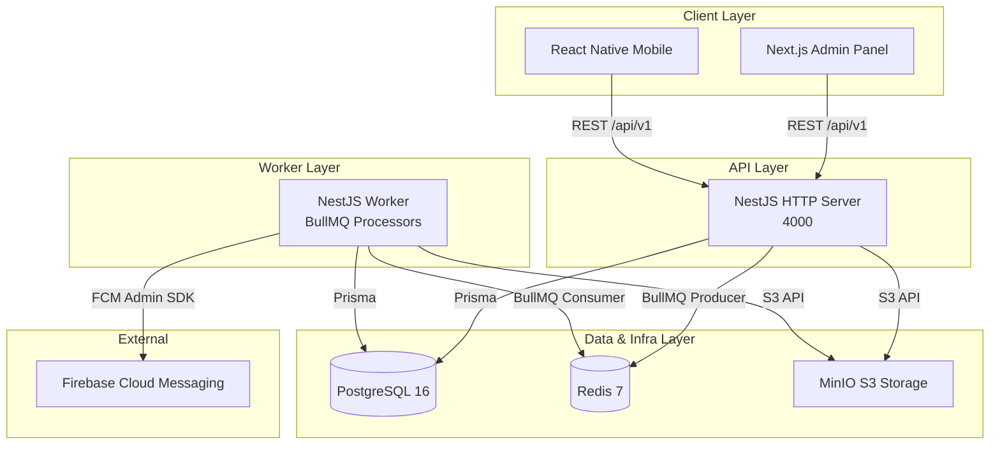
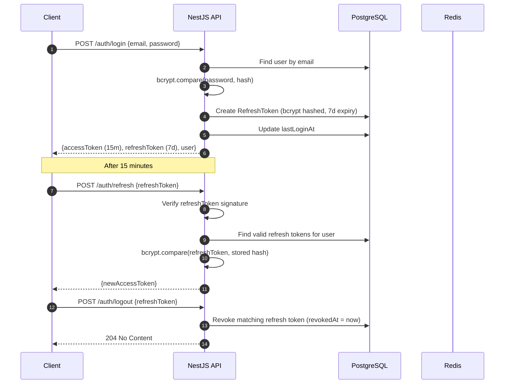
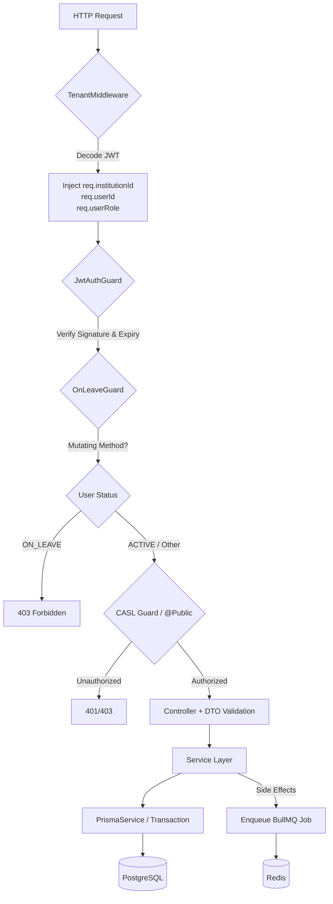
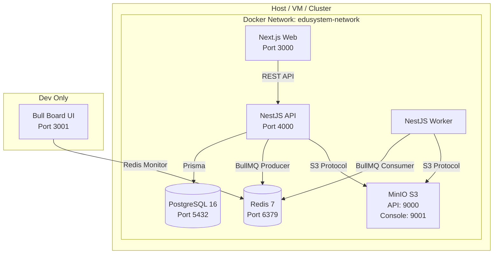

# EduSystem Architecture

> **Version:** 2.1  
> **Last Updated:** 2026-05-14  
> **Classification:** Internal Technical Documentation  
> **Audience:** Senior Engineers, Architects, DevOps, Technical Onboarding

---

## 1. Executive Overview

EduSystem is a **multi-tenant SaaS educational management platform** (ERP/SIS) serving K-12 institutions. The platform provides academic management (grades, attendance, courses), institutional administration (staff, students, guardians), real-time communications (announcements, chat), automated reporting (PDF generation), and operational tooling (space reservations, sports groups, convivencias/discipline tracking).

The system is architected as a **Dockerized monorepo** with a clear service boundary: a NestJS backend providing a REST API and background job workers, a Next.js frontend admin panel, and a planned React Native mobile application for guardians. All state is persisted in PostgreSQL; Redis serves as the BullMQ broker, cache layer, and Socket.io adapter.

**Key Architectural Decisions:**

| Decision | Rationale |
|---|---|
| Dual-mode backend (API + Worker) | Eliminates the need for separate worker deployments while maintaining independent horizontal scaling. |
| JWT-based tenant extraction | Avoids subdomain or path-based multi-tenancy complexity; tenant is embedded in the JWT payload. |
| BullMQ + Redis for async work | Decouples latency-sensitive API paths from slow operations (FCM push, PDF rendering, audit logging). |
| Prisma ORM with soft-delete middleware | Centralizes tenant scoping and soft-delete logic, preventing accidental data leakage. |
| CASL + Role Hierarchy | Combines RBAC coarse roles with ABAC fine-grained conditions (e.g., "teacher can only edit their own course subjects"). |
| MinIO (S3-compatible) self-hosted | Eliminates external cloud storage dependency for small-to-medium deployments. |

---

## 2. System Architecture

EduSystem follows a **layered monolithic architecture** with clear internal module boundaries. The backend is not decomposed into microservices; instead, it uses **vertical slice modules** (one module per domain) within a single NestJS process. This provides operational simplicity while maintaining code modularity.



**Architectural Style:** Modular Monolith (Backend) + Server-Side Rendered SPA (Frontend).

---

## 3. Monorepo Structure

```
edusystem/
├── backend/
│   ├── prisma/              # Schema, migrations, seed script
│   ├── src/
│   │   ├── config/          # Environment validation (Zod)
│   │   ├── prisma/          # PrismaModule (global) + PrismaService
│   │   ├── queues/          # BullMQ configuration, processors, constants
│   │   ├── common/          # Guards, filters, middleware, decorators, utils
│   │   └── modules/         # Domain modules (one per bounded context)
│   ├── test/                # E2E tests (auth, ABAC, grades)
│   └── templates/           # Handlebars/Puppeteer PDF templates
├── frontend/
│   └── src/
│       ├── app/             # Next.js App Router
│       ├── components/      # UI primitives (Radix + Tailwind), layouts
│       ├── lib/             # API clients (React Query hooks)
│       └── hooks/           # Reusable React hooks
├── docker-compose.yml       # Full stack orchestration
└── .env                     # Environment variable source of truth
```

---

## 4. Backend Architecture

The backend is built on **NestJS 10** with **TypeScript**. It uses a standard three-layer architecture: Controllers (HTTP adapters) → Services (business logic) → PrismaService (data access).

| Module | Responsibility | Public API Surface |
|---|---|---|
| `AuthModule` | JWT issuance, refresh token rotation, login/logout | `POST /auth/login`, `POST /auth/refresh`, `POST /auth/logout` |
| `UsersModule` | User CRUD, avatar upload, password reset, leave management, level roles | `GET/POST/PATCH /users` |
| `InstitutionsModule` | Tenant onboarding, plan management, invitations, logo | `GET/POST/PATCH /institutions` |
| `StudentsModule` | Student enrollment, CRUD, guardian linking | `GET/POST/PATCH /students` |
| `CoursesModule` | School years, periods, course subjects, CSV export | `GET/POST/PATCH /courses` |
| `GradesModule` | Grade upsert, bulk import, average recalculation trigger | `GET/POST/PATCH /grades` |
| `AttendanceModule` | Bulk attendance recording, history, justifications, absence records | `GET/POST/PATCH /attendance` |
| `ConvivenciasModule` | Discipline/conduct records with notifications | `GET/POST/PATCH /convivencias` |
| `ReportsModule` | PDF report generation (Puppeteer), bulk batching | `GET/POST /reports` |
| `NotificationsModule` | Push token management, in-app notification persistence | `GET/POST /notifications` |
| `StorageModule` | Presigned URL generation, MinIO uploads/downloads | `GET/POST /storage` |
| `CaslModule` | ABAC ability factory and guards (global) | Decorators: `@CheckPolicies()` |
| `SpacesModule` | Physical space inventory | `GET/POST/PATCH /spaces` |
| `SpaceReservationsModule` | Booking calendar with conflict detection | `GET/POST/PATCH /space-reservations` |
| `SportsModule` / `SportGroupsModule` | Sports catalog and student/teacher grouping | `GET/POST/PATCH /sports` |
| `StudentCourseSubjectsModule` | Subject assignment per student/year (regular/recurse/exempt) | `GET/POST/PATCH /student-course-subjects` |
| `TeacherModule` | Syllabus management, pending subjects view | `GET/POST/PATCH /teacher` |
| `IndicatorsModule` | Curriculum indicator definitions and evaluations | `GET/POST/PATCH /indicators` |
| `AnnouncementsModule` | Draft/publish workflow for institutional communications | `GET/POST/PATCH /announcements` |
| `HealthModule` | Liveness/readiness probe | `GET /health` |

**Dependency Injection Strategy:**

- **Global Modules:** `PrismaModule`, `QueuesModule`, and `CaslModule` are marked `@Global()` to eliminate boilerplate imports across 20+ feature modules.
- **Config Injection:** `AppConfigModule` registers `ConfigModule` globally. All services inject `ConfigService<EnvConfig>` for type-safe access to validated environment variables.
- **JWT Module:** Registered globally via `JwtModule.registerAsync()` with `ConfigService` injection, ensuring the same secret and expiry policy everywhere.
- **Guards as Providers:** Both `JwtAuthGuard` and `OnLeaveGuard` are registered via `APP_GUARD` token at the root module level, making them truly global without decorators on every controller.

---

## 5. Frontend Architecture

The frontend is a **Next.js 16** application using the **App Router**. It targets the administrative and teaching staff; a separate mobile application (React Native + Expo) serves guardians.

| Layer | Technology | Purpose |
|---|---|---|
| Framework | Next.js 16 (App Router) | SSR/SSG, routing, API route handlers |
| Styling | Tailwind CSS v4 | Utility-first CSS |
| UI Primitives | Radix UI + `shadcn/ui` patterns | Accessible, unstyled base components |
| Fonts | Geist / Geist Mono | Typography |
| Server State | `@tanstack/react-query` | Caching, deduping, background refetch |
| Auth State | `next-auth` v5 (beta) | Session management, JWT callback hooks |
| Client State | Zustand | Lightweight global state (UI flags, filters) |
| Forms | `react-hook-form` + Zod resolvers | Type-safe form validation |
| Toast | `sonner` | Non-blocking notifications |

**Frontend/Backend Interaction Patterns:**

- **Data Fetching:** All API calls go through React Query hooks (`src/lib/api/*.ts`). Queries use `staleTime: 60s` by default to avoid redundant fetches during navigation.
- **Authentication:** NextAuth handles the session. The JWT from the backend is stored server-side via NextAuth's `jwt` callback and forwarded in API route handlers when needed.
- **File Downloads:** PDF downloads require `Access-Control-Expose-Headers: Content-Disposition` from the backend so the frontend can derive filenames from the response header.
- **CSV/Excel Export:** Frontend generates BOM-prefixed (`0xEF 0xBB 0xBF`) UTF-8 CSVs with `sep=;\n` for Spanish Excel compatibility.
- **Date Display:** Argentine timezone (UTC-3) is handled by splitting ISO strings and reversing the date parts (`DD/MM/YYYY`) without timezone conversion libraries.

---

## 6. Database Architecture

PostgreSQL 16 serves as the sole source of truth. The schema is managed via **Prisma ORM** with 30+ models and 15+ enums.

**Schema Characteristics:**

- **Multi-tenancy Column:** Every tenant-scoped table contains `institutionId` (foreign key to `Institution`). `User.institutionId` is nullable **only** for `SUPER_ADMIN` (cross-tenant administration).
- **Unique Constraints Scoped by Tenant:** `@@unique([institutionId, code])` on `Subject`, `@@unique([institutionId, documentNumber])` on `Student`, `@@unique([email, institutionId])` on `User`. This enforces uniqueness within a tenant but allows the same value across different institutions.
- **Soft Delete:** Models supporting soft delete include `deletedAt DateTime?`. The `PrismaService` automatically injects `deletedAt: null` into `findMany` and `findFirst` queries via middleware. Hard deletes use `delete` directly.
- **Audit Trail:** The `AuditLog` model captures `before`/`after` JSON snapshots for every sensitive mutation. It is populated asynchronously by the `AuditProcessor` worker, ensuring the API path never blocks on audit writes.
- **Role Hierarchy Storage:** The `Permission` table stores ABAC tuples (`role`, `action`, `resource`, `condition`). Role hierarchy is computed at runtime via `getHighestRole(roles[])` utility.

**Indexing Strategy:**

- Every `institutionId` foreign key is indexed.
- `User.email` and `RefreshToken.tokenHash` are indexed for auth lookups.
- `CourseSubject.teacherId` is indexed to support ABAC queries ("show me only my subjects").
- `Guardian.studentId` is indexed for parent-child lookups.

---

## 7. Multi-Tenancy Strategy

EduSystem uses a **shared database, shared schema** approach with tenant isolation enforced at the application layer.

**Tenant Identification:**

1. The user authenticates and receives a JWT containing `institutionId`.
2. `TenantMiddleware` (applied globally) decodes the JWT **without verifying** the signature and injects `req.institutionId`, `req.userId`, and `req.userRole`.
3. Verification happens subsequently in `JwtAuthGuard`. A malformed token simply leaves `req.institutionId` as `null`; the guard rejects the request.

**Tenant Enforcement:**

- **Application Layer:** All service-layer queries filter by `institutionId`.
- **Database Layer:** Unique constraints are scoped to `institutionId` (see Section 6).
- **Row-Level Security (RLS):** Not currently implemented in PostgreSQL. Tenant isolation is enforced entirely by Prisma query construction. If RLS is required in the future, policies can be added to tables using the `institutionId` column without schema changes.

**Why not schema-per-tenant or database-per-tenant?**

- Operational overhead: Schema migrations would need to run N times.
- Connection pooling: Database-per-tenant exhausts connections at scale.
- The shared-schema approach with indexed `institutionId` provides sufficient isolation for the target market (small-to-medium institutions) with lower operational cost.

---

## 8. Authentication & Authorization

### Authentication

EduSystem uses a **JWT Access + Refresh Token** pattern.



**Key Design Points:**

- Access tokens expire in **15 minutes** to limit blast radius.
- Refresh tokens are stored as **bcrypt hashes** in the database (not plaintext) to prevent DB-read token theft.
- Multiple refresh tokens per user are permitted (multi-device support).
- `lastLoginAt` is updated synchronously at login for basic activity tracking.

### Authorization

Three complementary layers enforce authorization:

| Layer | Mechanism | Scope |
|---|---|---|
| **Role-Based (RBAC)** | `Role` enum on `User` (`SUPER_ADMIN` → `GUARDIAN`) | Coarse-grained route/controller access |
| **Attribute-Based (ABAC)** | CASL `AbilityFactory` + `CaslGuard` | Fine-grained resource and field-level conditions (e.g., "teacher can only READ grades where `courseSubject.teacherId == user.id`") |
| **State-Based** | `OnLeaveGuard` (global `APP_GUARD`) | Blocks all mutating HTTP methods for users with `ON_LEAVE` status, regardless of role |

**Role Hierarchy:**

```
SUPER_ADMIN > ADMIN > DIRECTOR > SECRETARY > PRECEPTOR > TEACHER > GUARDIAN
```

The `UserLevelRole` table allows a user to have different roles per educational level (`INICIAL`, `PRIMARIA`, `SECUNDARIA`). The effective role for CASL is computed as the highest role among `User.role` and all associated `UserLevelRole` entries via `getHighestRole()`.

---

## 9. Request Lifecycle



**Execution Order:**

1. **TenantMiddleware** (Express middleware, `forRoutes('*')`): Fast JWT decode. No signature verification.
2. **GlobalExceptionFilter**: Wraps the entire request.
3. **JwtAuthGuard** (`APP_GUARD`): Signature verification, expiry check.
4. **OnLeaveGuard** (`APP_GUARD`): Status check for mutating verbs (`POST`, `PUT`, `PATCH`, `DELETE`).
5. **CASL Guard / Route Guards**: Resource-level authorization.
6. **Controller**: DTO validation (class-validator or Zod).
7. **Service**: Business logic, Prisma queries.
8. **Async Side Effects**: BullMQ job enqueue (audit, notifications, grade recalculation).

---

## 10. Background Job Processing

The backend runs in two modes: **API mode** (HTTP server) and **Worker mode** (background job consumer). Both modes use the **same Docker image**; the mode is selected via the `APP_MODE` environment variable.

**Worker Isolation Strategy:**

- `WorkerAppModule` is a minimal NestJS module that imports only `AppConfigModule`, `PrismaModule`, `QueuesModule`, `WorkersModule`, and `NotificationsModule`.
- It intentionally **does not import** controllers, `TenantMiddleware`, `JwtAuthGuard`, or `OnLeaveGuard`. The worker has no HTTP surface.
- This reduces memory footprint and attack surface while enabling independent horizontal scaling of workers.

| Queue | Processor | Responsibility | Trigger |
|---|---|---|---|
| `notifications` | `NotificationProcessor` | Push FCM notifications + persist in-app notifications | `grade.created`, `attendance.recorded`, `announcement.published`, `invitation.created`, `absence_record.generated` |
| `audit-log` | `AuditProcessor` | Write `AuditLog` records | Any CREATE/UPDATE/DELETE/LOGIN/LOGOUT/EXPORT action |
| `grade-processing` | `GradeProcessor` | Recalculate student averages per period | Grade upsert |
| `pdf-generation` | *(Implemented inline in ReportsService)* | Generate PDF reports via Puppeteer | Report request (often triggered synchronously for single, asynchronously for bulk) |

**Queue Job Reliability:**

- Default job options: **3 attempts**, exponential backoff (`delay: 2000ms`).
- Critical jobs (audit): **5 attempts**.
- Low-priority jobs (PDF): **2 attempts**, fixed backoff, `priority: 10`.
- Completed/failed jobs are retained for historical inspection (100 completed, 200 failed by default).

---

## 11. Event-Driven Architecture

EduSystem is not a fully event-driven system (no event bus or CQRS). Instead, it uses a **job-driven async pattern**: domain events are translated directly into BullMQ jobs.

**Pattern:**

```
Domain Event (e.g., Grade Created)
    → Service Layer calls NotificationQueueService.notify()
    → BullMQ Producer enqueues job
    → Worker Process dequeues and executes
```

**Why not a full event bus?**

- Complexity: An internal event bus adds indirection and debugging difficulty for a monolithic codebase.
- Observability: BullMQ provides built-in UI (Bull Board), retry logic, and dead-letter semantics.
- Scaling: Workers can be scaled independently by increasing `worker` container replicas.

**Notification Recipients Standardization:**

Services call `getRecipientsForStudent({ studentId, courseId, institutionId })` to derive the standard notification audience: institution directors + preceptors of the student's course + the student's guardians. This ensures consistent notification targeting across modules.

---

## 12. Infrastructure & Deployment



**Infrastructure Services:**

| Service | Image | Role | Persistence |
|---|---|---|---|
| `postgres` | `postgres:16-alpine` | Primary database | Named volume `postgres_data` |
| `redis` | `redis:7-alpine` | Job broker, cache, Socket.io adapter | Named volume `redis_data` (AOF every second) |
| `api` | Custom NestJS multi-stage | HTTP REST API | Stateless |
| `worker` | Custom NestJS multi-stage (same image) | Background job processors | Stateless |
| `web` | Custom Next.js | SSR admin panel | Stateless |
| `minio` | `minio/minio:latest` | Object storage (avatars, logos, PDFs, justifications) | Named volume `minio_data` |
| `bull-board` | `deadly0/bull-board:latest` | Queue monitoring UI | Stateless (dev profile only) |

**Docker Compose Profiles:**

- **Default (`docker-compose up -d`):** Postgres, Redis, API, Worker, Web, MinIO.
- **Dev Profile (`--profile dev`):** Additionally starts Bull Board on port `3001`.
- **Production Overlay:** `docker-compose -f docker-compose.yml -f docker-compose.prod.yml up -d` (prod file referenced but not inspected).

**Health Checks:**

- Postgres: `pg_isready`
- Redis: `redis-cli ping`
- MinIO: `curl /minio/health/live`
- API: `wget /api/v1/health`

Services declare `depends_on` with `condition: service_healthy` to ensure correct startup ordering.

---

## 13. Runtime Initialization Flow

**API Mode Bootstrap (`main.ts`):**

1. Read `APP_MODE` (default: `api`).
2. `NestFactory.create(AppModule)`.
3. `AppConfigModule` validates environment variables via Zod schema. **Fatal exit** if any required variable is missing or invalid, with a field-level error message.
4. `PrismaService.onModuleInit()` connects to PostgreSQL. Soft-delete middleware and slow-query hooks (dev only) are registered.
5. `JwtModule` initializes with `JWT_SECRET` from `ConfigService`.
6. Global prefix `api/v1` is set.
7. `GlobalExceptionFilter` is registered.
8. CORS is enabled with origins from `ALLOWED_ORIGINS`.
9. Swagger/OpenAPI is mounted at `/docs` **only in development**.
10. `app.listen(PORT)`.

**Worker Mode Bootstrap (`main.ts`):**

1. Read `APP_MODE=worker`.
2. `NestFactory.create(WorkerAppModule)` — minimal module without HTTP.
3. Same config validation and Prisma connection as API mode.
4. Processors attach to BullMQ queues via `@Processor` decorators.
5. `SIGTERM` handler gracefully closes the NestJS application and Prisma connection.

---

## 14. Error Handling Strategy

All unhandled exceptions are caught by `GlobalExceptionFilter` (`@Catch()`), which normalizes responses into a consistent JSON envelope:

```json
{
  "statusCode": 400,
  "error": "Bad Request",
  "message": "...",
  "timestamp": "2026-05-14T14:00:00.000Z",
  "path": "/api/v1/grades"
}
```

**Error Mapping:**

| Exception Type | HTTP Status | Message Strategy |
|---|---|---|
| NestJS `HttpException` | As thrown | Preserves `getResponse()` message |
| Zod validation error | `400 Bad Request` | Per-field detail array |
| Prisma `P2002` (unique constraint) | `409 Conflict` | "Ya existe un registro con [fields]" |
| Prisma `P2025` (not found) | `404 Not Found` | "Registro no encontrado" |
| Unknown (production) | `500 Internal Server Error` | Generic safe message (no stack trace) |
| Unknown (development) | `500 Internal Server Error` | Full error message and stack trace |

**Logging:** Every exception is logged by `GlobalExceptionFilter` with method, path, status code, and stack trace (if available).

---

## 15. Security Considerations

| Domain | Control | Implementation |
|---|---|---|
| **Authentication** | JWT with short expiry (15m) + refresh token rotation | `passport-jwt` + bcrypt-hashed refresh tokens |
| **Authorization** | Defense in depth (RBAC + ABAC + state-based) | CASL + `OnLeaveGuard` + role hierarchy |
| **Input Validation** | Strict DTO validation | Zod schemas at config level; class-validator at controller level |
| **SQL Injection** | Parameterized queries only | Prisma ORM (no raw SQL in business logic) |
| **Tenant Isolation** | Application-layer filtering | `TenantMiddleware` + `institutionId` in every query |
| **File Uploads** | Presigned URL pattern | MinIO presigned URLs; no direct file upload to API server |
| **CORS** | Origin whitelist | `ALLOWED_ORIGINS` env var; credentials enabled |
| **Secrets** | Environment isolation | `.env` never committed; Zod validation enforces minimum lengths |
| **Audit Trail** | Immutable async logging | `AuditProcessor` writes to `AuditLog` table with before/after snapshots |
| **Leave Status** | Operational safety | `OnLeaveGuard` prevents any data mutation by users on leave |

**Notable Security Design Decisions:**

- `TenantMiddleware` **decodes** but does **not verify** the JWT signature. This is intentional: the middleware runs before `JwtAuthGuard`, and a malformed token simply results in `req.institutionId = null`. The subsequent guard will reject the request. This avoids duplicating verification logic while still extracting tenant context early.
- `OnLeaveGuard` reads the JWT **directly from the Authorization header** rather than relying on `request.user`. This is necessary because `APP_GUARD` execution order is not strictly guaranteed; depending on `request.user` would create a race condition with `JwtAuthGuard`.

---

## 16. Scalability Considerations

**Horizontal Scaling:**

- **API containers:** Stateless. Scale by increasing `api` service replicas behind a load balancer.
- **Worker containers:** Stateless. Scale by increasing `worker` service replicas. BullMQ handles job distribution across workers via Redis.
- **Database:** The current architecture targets small-to-medium institutions. If read load increases, consider read replicas or connection pooling (PgBouncer). Write scaling requires sharding or splitting by `institutionId`.

**Bottlenecks & Mitigations:**

| Bottleneck | Impact | Mitigation |
|---|---|---|
| PDF generation (Puppeteer) | High CPU, memory-intensive | Processed in workers; bulk PDFs use a shared browser instance with **serial** (not parallel) page processing to avoid resource exhaustion. |
| FCM push notifications | External API latency, rate limits | Enqueued in BullMQ with retries; failures are logged but do not block the API. |
| Prisma connection pool | Default 10 connections may exhaust under load | Monitor `prisma.$queryRaw` metrics; increase pool size or add PgBouncer. |
| Large bulk operations | Transaction timeouts | Grade upserts and attendance bulk records use Prisma transactions with batching. |

**Caching Strategy (Current State):**

- Redis is used as the BullMQ broker but **not** as a general application cache. There is no `@CacheInterceptor` or Redis caching layer for query results.
- **Future:** Hot-read queries (e.g., institution settings, user roles) could be cached in Redis with short TTLs to reduce PostgreSQL load.

---

## 17. Observability & Monitoring

**Current Instrumentation:**

| Signal | Implementation | Coverage |
|---|---|---|
| **Logs** | NestJS `Logger` (built-in) | All services, processors, middleware, and filters log at appropriate levels (`log`, `warn`, `error`). |
| **Slow Queries** | Prisma query event listener | In development, queries taking >500ms are logged as warnings. |
| **Health Checks** | `HealthModule` | `GET /api/v1/health` for liveness; Docker `healthcheck` for orchestration. |
| **Queue Monitoring** | Bull Board (dev only) | UI on port `3001` showing job status, retries, failures. |

**Recommended Future Additions:**

- **Structured Logging (JSON):** Replace NestJS default logger with `pino` or `winston` for structured, parseable logs.
- **Metrics:** Export Prometheus metrics (HTTP request duration, Prisma query counts, BullMQ queue depths, FCM delivery rates).
- **Distributed Tracing:** Add OpenTelemetry tracing spans across API → Prisma → BullMQ → Worker for request correlation.
- **Alerting:** Set up alerts on API error rate >1%, worker queue depth >1000, and PostgreSQL connection saturation.
- **Uptime Monitoring:** External health check ping to `/api/v1/health` with alerting on 5xx responses.

---

## 18. File Storage Architecture

EduSystem uses **MinIO** as a self-hosted S3-compatible object store.

**Storage Buckets & Patterns:**

| Asset Type | Path Pattern | Access Control |
|---|---|---|
| User Avatars | `avatars/{userId}.{ext}` | Presigned GET (short expiry) |
| Institution Logos | `logos/{institutionId}.{ext}` | Presigned GET (5min stale) |
| PDF Reports | `reports/{institutionId}/{date}/{filename}.pdf` | Presigned GET (generated on demand) |
| Justification Files | `justifications/{justificationId}/{filename}` | Presigned GET (institution-scoped) |

**Upload Flow:**

1. Frontend requests a presigned URL from `StorageModule`.
2. Frontend uploads directly to MinIO (bypassing the API server for large file streams).
3. Frontend notifies the API of the completed upload.
4. API stores the object key in the database.

**Production Alternative:** The compose file supports replacing MinIO with AWS S3 by overriding `AWS_ACCESS_KEY_ID`, `AWS_SECRET_ACCESS_KEY`, `AWS_REGION`, and `AWS_S3_BUCKET`.

---

## 19. Real-Time Communication

**Current State:**

- **Notifications:** Push notifications are delivered via **Firebase Cloud Messaging (FCM)**. The `NotificationProcessor` worker sends FCM messages to active device tokens stored in `PushToken`.
- **In-App Notifications:** Persisted in the `Notification` table. The frontend polls every 30 seconds via `NotificationBell` component.
- **Chat:** Prisma schema includes `ChatRoom`, `ChatRoomMember`, and `ChatMessage` models. The README references Socket.io with Redis adapter, but the `chat` module was not inspected in detail.

**Not Implemented / Future:**

- WebSocket server for live chat and real-time grade/attendance updates.
- Server-Sent Events (SSE) for low-latency notification streaming (alternative to polling).

---

## 20. Development Workflow

**Local Development (Docker):**

```bash
# Full stack with queue monitoring
docker-compose --profile dev up -d

# Backend only (for IDE debugging)
cd backend
npm install
npx prisma migrate dev
npx prisma db seed
npm run start:dev
```

**Key Conventions:**

- **Dates:** Always use `new Date(Date.UTC(year, month-1, day, 12, 0, 0))` to avoid Argentina UTC-3 timezone drift.
- **Soft Delete:** Never query `deletedAt` explicitly; Prisma middleware handles it.
- **Multi-tenant Queries:** Always include `institutionId` in WHERE clauses.
- **Route Ordering:** Place specific routes (e.g., `GET /courses/my-subjects`) before parameterized routes (`GET /courses/:id`) in controllers to prevent path shadowing.
- **PDF Bulk:** Use `for...of` serial loops with a shared Puppeteer browser instance. Never use `Promise.all` for parallel PDF generation.
- **Notifications:** Always use `NotificationQueueService.notify()`. Never call `FcmService` directly from domain modules.
- **Archiver:** Import as `import * as archiver from 'archiver'` (CommonJS module).

**Testing:**

- Unit tests: Jest (`npm run test`)
- E2E tests: `test/auth.e2e-spec.ts`, `test/abac.e2e-spec.ts`, `test/grades.e2e-spec.ts` using `TestAppHelper`.
- E2E run: `npm run test:e2e`

---

## 21. Production Deployment Strategy

**Container Strategy:**

| Environment | Compose Files | Profile |
|---|---|---|
| Development | `docker-compose.yml` | `--profile dev` |
| Production | `docker-compose.yml` + `docker-compose.prod.yml` | default (no Bull Board) |

**Production Checklist:**

- [ ] Replace `JWT_SECRET` and `JWT_REFRESH_SECRET` with cryptographically secure random strings (`openssl rand -base64 64`).
- [ ] Set `NODE_ENV=production` and `BUILD_TARGET=production`.
- [ ] Disable Swagger (`isDev` check in `main.ts` naturally handles this).
- [ ] Set `REDIS_PASSWORD` to a strong secret.
- [ ] Replace MinIO with AWS S3 or configure MinIO with TLS.
- [ ] Configure `ALLOWED_ORIGINS` to exact production domains.
- [ ] Remove `bull-board` service.
- [ ] Enable PostgreSQL backups (WAL archiving, `pg_dump` cron).
- [ ] Enable Redis AOF persistence (already configured in compose).
- [ ] Set up log aggregation (CloudWatch, Datadog, or self-hosted Loki).

**CI/CD Considerations:**

- Build the NestJS backend with `nest build` and validate with `npm run lint`.
- Run `prisma migrate deploy` (not `dev`) in CI/CD pipelines for non-interactive migrations.
- Frontend build should execute `next build` to validate SSR and static generation.
- E2E tests should spin up the Docker compose stack and run against `http://localhost:4000/api/v1`.

---

## 22. Architectural Tradeoffs

| Tradeoff | Decision | Rationale | Cost |
|---|---|---|---|
| Monolith vs Microservices | Modular Monolith | Team size and operational complexity favor a single deployable unit. | Modules can become tightly coupled if boundaries are not respected. |
| Shared-schema vs Schema-per-tenant | Shared-schema with `institutionId` | Lower operational overhead, simpler migrations. | Tenant isolation is application-layer only; compromised query logic could leak data. |
| NestJS default logger vs Structured logging | Default logger | Simpler setup; sufficient for current scale. | Logs are not machine-parseable; harder to aggregate and alert on. |
| Sync vs Async audit logging | Async (BullMQ) | Prevents audit writes from blocking API responses. | Small risk of audit log loss if Redis fails before job is processed. |
| Prisma connection pooling | Default (no PgBouncer) | Simpler infrastructure. | Connection limit may become a bottleneck under high concurrency. |
| JWT decode in middleware | Decode without verify in `TenantMiddleware` | Extracts tenant context early without duplicating verification logic. | Slightly non-obvious security behavior; relies on `JwtAuthGuard` for actual enforcement. |
| PDF in workers vs API | Workers for bulk, API for single | Single PDFs are fast enough for sync; bulk requires background processing. | Two code paths for PDF generation. |
| NextAuth v5 beta | Used for frontend auth | Latest features and improved session handling. | Beta software may introduce breaking changes or undiscovered bugs. |

---

## 23. Future Evolution Recommendations

**Near-term (0-6 months):**

1. **App Mobile for Guardians:** Complete the React Native + Expo application referenced in the README. It should consume the same REST API and receive FCM push notifications.
2. **E2E Test Coverage:** Expand e2e tests to cover attendance, convivencias, reports, and space reservations.
3. **WebSocket / SSE:** Replace the 30-second notification polling with WebSocket or Server-Sent Events for real-time updates.
4. **Rate Limiting:** Add `@nestjs/throttler` to auth endpoints and sensitive mutation routes.

**Mid-term (6-12 months):**

5. **Read Replicas / Query Optimization:** Add PgBouncer connection pooling and evaluate PostgreSQL read replicas for heavy reporting queries.
6. **Caching Layer:** Implement Redis caching for hot data (institution settings, navigation configs, user roles) with cache invalidation on mutation.
7. **Structured Logging & Metrics:** Migrate to Pino for JSON logging and add Prometheus/OpenTelemetry instrumentation.
8. **ABAC UI:** Build a visual permission editor in the admin panel so institutions can customize `Permission` conditions without developer intervention.

**Long-term (12+ months):**

9. **Microservice Extraction:** If a specific domain (e.g., PDF generation, FCM notifications) becomes a bottleneck, extract it into a dedicated service while keeping the API as an orchestration layer.
10. **GraphQL API:** Consider a GraphQL layer alongside REST for the mobile application to reduce over-fetching and enable flexible queries.
11. **Data Warehouse / Analytics:** Export anonymized institutional data to a data warehouse (BigQuery, Snowflake) for cross-institution analytics and reporting.
12. **Disaster Recovery:** Implement automated PostgreSQL backups to S3, cross-region MinIO replication, and documented runbooks for recovery.

---

*Document generated for EduSystem v2.1. For questions or corrections, contact the architecture team.*
