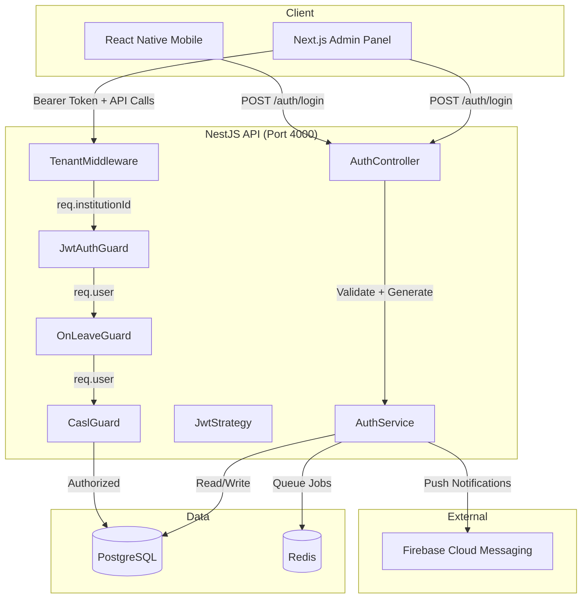
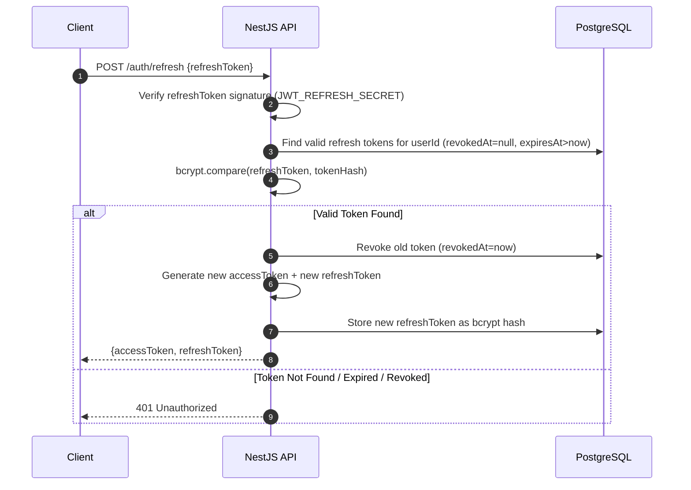
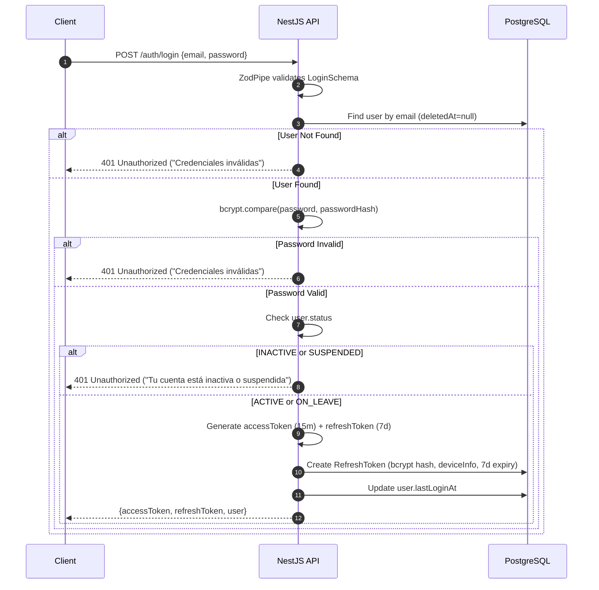
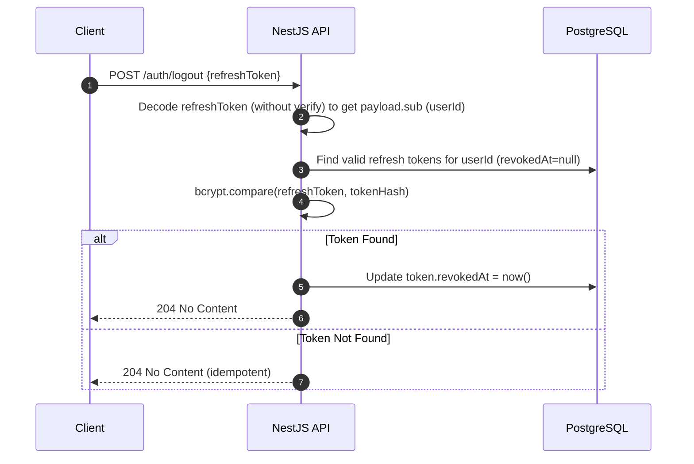
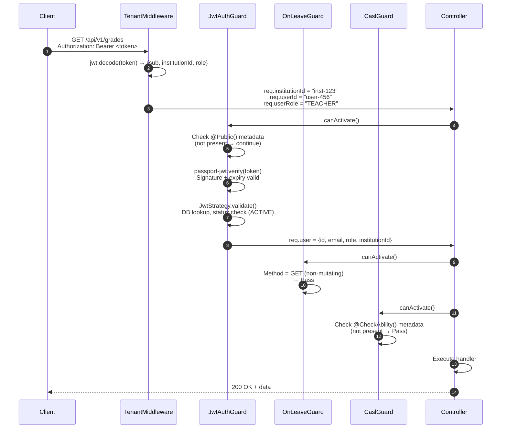
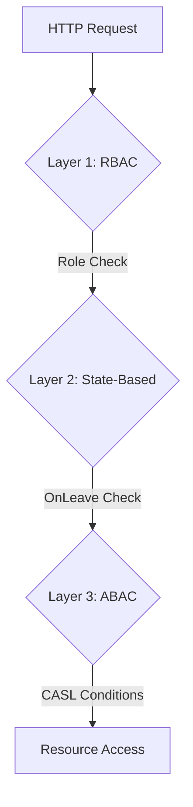
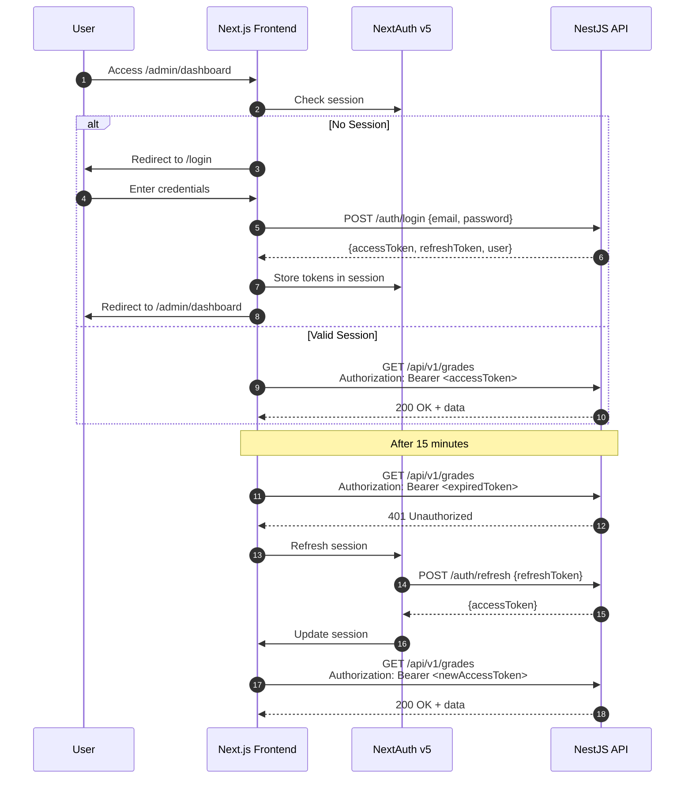

# EduSystem Authentication & Authorization Architecture

> **Version:** 2.1  
> **Last Updated:** 2026-05-14  
> **Classification:** Internal Technical Documentation  
> **Audience:** Senior Engineers, Security Auditors, DevOps, Frontend Developers, AI Coding Agents

---

## 1. Authentication Overview

EduSystem employs a **stateless JWT-based authentication model** with refresh token rotation. The architecture is designed for horizontal scalability: the API layer does not maintain server-side sessions, and all authentication state is carried in cryptographically signed tokens. Authorization is implemented through a defense-in-depth strategy combining **Role-Based Access Control (RBAC)**, **Attribute-Based Access Control (ABAC)** via CASL, and a **state-based guard** for operational safety (OnLeave).

**Key Design Decisions:**

| Decision | Rationale |
|---|---|
| JWT over Session Cookies | Stateless horizontal scaling; no session store required. Tokens carry tenant context natively. |
| Refresh Token Hashing | Prevents DB-read token theft. Even a full database compromise does not expose usable refresh tokens. |
| Dual-Token (Access + Refresh) | Short-lived access tokens (15m) limit blast radius; long-lived refresh tokens (7d) enable seamless UX without frequent re-authentication. |
| CASL + MongoAbility | Fine-grained, condition-based authorization with per-instance permission evaluation (e.g., "teacher can only edit their own course subjects"). |
| Role Hierarchy with Per-Level Roles | Users may hold different roles per educational level (`INICIAL`, `PRIMARIA`, `SECUNDARIA`); effective role is computed at runtime. |
| Tenant in JWT Payload | Eliminates subdomain-based multi-tenancy complexity; tenant context travels with every authenticated request. |

---

## 2. Authentication Architecture



**Authentication Surface:**

| Component | Type | Responsibility |
|---|---|---|
| `AuthController` | Controller | HTTP endpoints for login, refresh, logout |
| `AuthService` | Service | Password validation, token generation, refresh token lifecycle |
| `JwtStrategy` | Passport Strategy | Signature verification, DB user lookup, status validation |
| `JwtAuthGuard` | Global Guard | Metadata-based route protection (`@Public()` bypass) |
| `TenantMiddleware` | Express Middleware | JWT decode (no verify), tenant context injection |
| `OnLeaveGuard` | Global Guard | State-based mutation blocking for `ON_LEAVE` users |
| `ZodPipe` | Validation Pipe | Login/refresh token schema validation |

---

## 3. JWT Strategy

EduSystem uses the **Passport JWT strategy** (`passport-jwt`) with Bearer token extraction. The strategy is registered globally and executed by `JwtAuthGuard`.

**Strategy Configuration:**

```typescript
JwtStrategy extends PassportStrategy(Strategy) {
  constructor(private prisma: PrismaService, config: ConfigService) {
    super({
      jwtFromRequest: ExtractJwt.fromAuthHeaderAsBearerToken(),
      ignoreExpiration: false,
      secretOrKey: config.get('JWT_SECRET'),
    });
  }
}
```

**Why Passport JWT?**

- **Ecosystem Maturity:** Passport is the de facto standard for NestJS authentication; extensive community support and battle-tested implementations.
- **Bearer Token Extraction:** `ExtractJwt.fromAuthHeaderAsBearerToken()` handles `Authorization: Bearer <token>` parsing reliably.
- **Integration with NestJS Guards:** `AuthGuard('jwt')` provides a clean abstraction that works with `APP_GUARD` registration and `@Public()` metadata.

**Token Structure (Access Token):**

```json
{
  "sub": "user-uuid",
  "institutionId": "institution-uuid",
  "role": "ADMIN",
  "email": "admin@example.com",
  "iat": 1715700000,
  "exp": 1715700900
}
```

---

## 4. Access Token Lifecycle

| Phase | Detail |
|---|---|
| **Generation** | Issued on successful login or refresh. Signed with `JWT_SECRET` using `HS256`. |
| **Payload** | `sub` (userId), `institutionId`, `role`, `email`. |
| **Expiry** | 15 minutes (`JWT_EXPIRES_IN=15m`). |
| **Storage** | Client-side only (NextAuth session for web, secure storage for mobile). **Never stored server-side.** |
| **Usage** | Sent in `Authorization: Bearer <token>` header on every API request. |
| **Validation** | `JwtStrategy.verify()` checks signature and expiry; then `JwtStrategy.validate()` loads user from DB and checks `INACTIVE`/`SUSPENDED` status. |
| **Revocation** | Access tokens cannot be individually revoked (short expiry mitigates this). Mass revocation is achieved by changing `JWT_SECRET` (forces all clients to re-authenticate). |

**Why 15 minutes?**

- Limits the window of opportunity for token theft and replay attacks.
- Forces legitimate clients to use the refresh token rotation mechanism, maintaining an auditable token lifecycle.
- Balances security with user experience: 15 minutes is long enough for most admin workflows without frequent interruption.

---

## 5. Refresh Token Lifecycle

| Phase | Detail |
|---|---|
| **Generation** | Issued alongside access token on login. Signed with `JWT_REFRESH_SECRET` (distinct from `JWT_SECRET`). |
| **Payload** | `sub` (userId), `institutionId`, `role`, `email`. Same claims as access token but different signing key. |
| **Expiry** | 7 days (`JWT_REFRESH_EXPIRES_IN=7d`). |
| **Storage** | Server-side: stored as a **bcrypt hash** in the `RefreshToken` table with `expiresAt` and `revokedAt` fields. |
| **Rotation** | On refresh: a new access token + refresh token pair is generated. The old refresh token hash is marked `revokedAt = now()`. |
| **Revocation** | `POST /auth/logout` revokes the specific refresh token. `revokedAt` prevents replay. |
| **Cleanup** | Expired tokens are not automatically cleaned up (no cron job observed). Should be added for production. |

**Refresh Token Table Schema:**

```prisma
model RefreshToken {
  id         String    @id @default(uuid())
  userId     String    @map("user_id")
  tokenHash  String    @map("token_hash") @db.VarChar(512)
  deviceInfo Json?     @map("device_info")
  expiresAt  DateTime  @map("expires_at")
  revokedAt  DateTime? @map("revoked_at")
  createdAt  DateTime  @default(now()) @map("created_at")
}
```

---

## 6. Token Rotation & Revocation

**Rotation Flow:**



**Why Hash Refresh Tokens?**

- **Database Compromise Protection:** If an attacker gains read access to the database, they cannot use stored refresh tokens because only hashes are stored. The attacker would need both database access and the ability to intercept tokens in transit.
- **Replay Attack Mitigation:** When a token is revoked, the hash is marked with `revokedAt`. Even if the plaintext token is leaked later, the hash comparison will fail against the revoked record.
- **Multi-Device Support:** Each device gets its own refresh token hash. Revoking one does not affect others.

---

## 7. Login Flow



**Key Points:**

- `ON_LEAVE` users **can** log in but are blocked from mutations by `OnLeaveGuard`.
- `INACTIVE` and `SUSPENDED` users **cannot** log in at all.
- Identical error messages for "user not found" and "password invalid" prevent username enumeration attacks.
- `deviceInfo` (user-agent, IP) is stored for audit purposes but is not used for device binding.

---

## 8. Logout Flow



**Logout Characteristics:**

- **Token-Targeted:** Only the provided refresh token is revoked; other device sessions remain active.
- **Idempotent:** If the token is already revoked or invalid, the endpoint still returns `204`. This prevents information leakage about token validity.
- **No Server-Side Session Cleanup:** Access tokens are not tracked server-side. They remain valid until expiry (max 15 minutes after logout).

---

## 9. Password Security

| Control | Implementation |
|---|---|
| **Hashing Algorithm** | `bcryptjs` with cost factor 12 (2^12 iterations). |
| **Password Storage** | `passwordHash` stored in `User` table. Never plaintext. |
| **Change Password** | Requires current password verification (`bcrypt.compare`). Only self or ADMIN can change. |
| **Reset Password** | Not implemented. Admin creates users with a temporary password. |
| **Password Policy** | Minimum length enforced via Zod schema in DTOs. No complexity rules (letters, numbers, symbols) currently enforced. |
| **Brute Force Protection** | Not implemented. Should add `@nestjs/throttler` on `/auth/login` endpoints. |

---

## 10. Request Authentication Flow



**Execution Order:**

1. **TenantMiddleware** — Runs first (Express middleware). Fast JWT decode without verification. Populates `req.institutionId`, `req.userId`, `req.userRole`.
2. **JwtAuthGuard** — Runs second (`APP_GUARD`). Checks `@Public()` metadata. If not public, verifies JWT signature and expiry, then loads `req.user` from DB.
3. **OnLeaveGuard** — Runs third (`APP_GUARD`). For mutating methods (`POST`, `PUT`, `PATCH`, `DELETE`), checks if user status is `ON_LEAVE`.
4. **CaslGuard** — Runs fourth (when explicitly used via `@UseGuards(JwtAuthGuard, CaslGuard)` or if registered globally). Checks `@CheckAbility()` metadata against user's `AppAbility`.

---

## 11. Tenant Resolution Strategy

EduSystem resolves the tenant context from the **JWT payload** rather than from URL parameters, subdomains, or headers. This approach simplifies client implementation and eliminates CORS complexity.

**Tenant Injection Flow:**

```
Client Request → Authorization: Bearer <token>
    → TenantMiddleware: jwt.decode(token) → extract institutionId
    → req.institutionId = payload.institutionId
    → req.userId = payload.sub
    → req.userRole = payload.role
    → Next()
```

**Why Decode Without Verification?**

- `TenantMiddleware` runs **before** `JwtAuthGuard` as an Express middleware, not a NestJS guard. It does not have access to the same verification pipeline.
- Decoding without verification is **safe** because:
  - A malformed token simply leaves `req.institutionId` as `null`.
  - The subsequent `JwtAuthGuard` will reject the request with `401 Unauthorized`.
  - No business logic executes without passing through `JwtAuthGuard`.
- This design avoids duplicating JWT verification logic in the middleware while still providing early tenant context to the request pipeline.

**Tenant Scoping in Controllers:**

```typescript
@Get()
findAll(@InstitutionId() institutionId: string) {
  // institutionId comes from req.institutionId (injected by TenantMiddleware)
  return this.service.findAll(institutionId);
}
```

---

## 12. Authorization Model

EduSystem implements **three complementary authorization layers**:



| Layer | Mechanism | Scope | Example |
|---|---|---|---|
| **RBAC** | `Role` enum on `User` | Coarse-grained controller/route access | Only `ADMIN`/`DIRECTOR` can call `POST /users` |
| **ABAC** | CASL `MongoAbility` | Fine-grained resource and condition access | `TEACHER` can `UPDATE Grade` only where `institutionId == user.institutionId` |
| **State-Based** | `OnLeaveGuard` | Operational safety | `ON_LEAVE` users cannot perform `POST`/`PUT`/`PATCH`/`DELETE` regardless of role |

---

## 13. CASL ABAC Architecture

EduSystem uses **CASL** (`@casl/ability`) with `MongoAbility` for condition-based authorization. Permissions are evaluated at runtime based on the user's effective role and the target resource's attributes.

**Ability Factory (`casl-ability.factory.ts`):**

```typescript
async createForUser(user: RequestUser): Promise<AppAbility> {
  const { can, cannot, build } = new AbilityBuilder<AppAbility>(createMongoAbility);

  // Resolve effective role (highest across User.role + UserLevelRole entries)
  const levelRoles = await this.prisma.userLevelRole.findMany({
    where: { userId: user.id }, select: { role: true },
  });
  const allRoles = [user.role, ...levelRoles.map((lr) => lr.role)];
  const effectiveRole = getHighestRole(allRoles);

  switch (effectiveRole) {
    case 'SUPER_ADMIN':
      can(Action.Manage, 'all');
      break;
    case 'TEACHER':
      can(Action.Read, 'all', { institutionId: user.institutionId });
      can([Action.Create, Action.Update, Action.Delete], 'Grade', {
        institutionId: user.institutionId,
      });
      // ...
      break;
    // ... other roles
  }

  return build();
}
```

**Why CASL?**

- **Condition-Based Permissions:** CASL's `MongoAbility` supports MongoDB-style query conditions (`{ institutionId: user.institutionId }`), enabling fine-grained resource filtering without custom query logic in every controller.
- **Composable Rules:** `can()` and `cannot()` declarations compose naturally, making permission matrices readable and maintainable.
- **Frontend Parity:** CASL rules can be serialized and shared with the frontend (if needed) to enable client-side UI gating.
- **Standard Library:** CASL is the de facto standard for ABAC in Node.js; extensive documentation and community support.

**ABAC Subject Types:**

```typescript
type Subjects =
  | 'Institution' | 'User' | 'Student' | 'Course'
  | 'Subject' | 'Grade' | 'Attendance' | 'Announcement'
  | 'Convivencia' | 'Space' | 'SpaceReservation'
  | 'Sport' | 'SportGroup' | 'all';
```

---

## 14. Roles & Permissions

**Role Hierarchy:**

```
SUPER_ADMIN > ADMIN > DIRECTOR > SECRETARY > PRECEPTOR > TEACHER > GUARDIAN
```

**Effective Role Computation:**

A user may have multiple roles across educational levels (`INICIAL`, `PRIMARIA`, `SECUNDARIA`). The effective role for CASL is computed as:

```typescript
const allRoles = [user.role, ...userLevelRoles.map(lr => lr.role)];
const effectiveRole = getHighestRole(allRoles);
```

**Per-Role CASL Matrix (Simplified):**

| Role | Institution | User | Student | Course | Grade | Attendance | Announcement | Other |
|---|---|---|---|---|---|---|---|---|
| `SUPER_ADMIN` | Manage all | Manage all | Manage all | Manage all | Manage all | Manage all | Manage all | Manage all |
| `ADMIN`/`DIRECTOR` | Manage own | Manage own | Manage own | Manage own | Manage own | Manage own | Manage own | Manage own |
| `SECRETARY` | Read own | Read/Create own | Manage own | Manage own | Read own | Read own | Full (own only) | Manage Spaces, Sports |
| `PRECEPTOR` | Read own | Read own | Manage own | Read own | Read own | Manage own | Full (own only) | Manage Convivencias |
| `TEACHER` | — | Update self | Read own | Read own | CRUD own | Create/Update own | CRUD (own authorId) | Read Sports |
| `GUARDIAN` | — | — | Read own | Read own | Read own | Read own | Read own | Read all own |

**Permission Decorator Usage:**

```typescript
@CheckAbility({ action: Action.Read, subject: 'Grade' })
@UseGuards(JwtAuthGuard, CaslGuard)
@Get()
findAll(@InstitutionId() institutionId: string) {
  return this.service.findAll(institutionId);
}
```

---

## 15. Global Guards

Two guards are registered as **global `APP_GUARD`** providers, meaning they apply to **every route** unless explicitly bypassed.

| Guard | Registration | Bypass Mechanism | Execution Order |
|---|---|---|---|
| `JwtAuthGuard` | `AuthModule` providers: `{ provide: APP_GUARD, useClass: JwtAuthGuard }` | `@Public()` decorator on handler or class | Phase 2 (after TenantMiddleware) |
| `OnLeaveGuard` | `AppModule` providers: `{ provide: APP_GUARD, useClass: OnLeaveGuard }` | `@SkipLeaveCheck()` decorator; exempt paths (`/auth/*`, `/password`, `/leave`, `/restore`) | Phase 3 (after JwtAuthGuard) |

**Why Global Guards?**

- **Fail-Safe Default:** Every route requires authentication by default. Developers must explicitly opt-out with `@Public()`, reducing the risk of accidentally exposing endpoints.
- **Centralized Logic:** Authentication and state-based authorization rules live in one place, not duplicated across controllers.
- **Consistent Behavior:** All protected endpoints receive the same `req.user` shape, `TenantMiddleware` injection, and error handling.

---

## 16. OnLeaveGuard Behavior

`OnLeaveGuard` is a **state-based authorization guard** that blocks mutating operations for users with `ON_LEAVE` status.

**Behavior:**

- **Mutating Methods Blocked:** `POST`, `PUT`, `PATCH`, `DELETE` → `403 Forbidden` if `user.status === 'ON_LEAVE'`.
- **Read Methods Allowed:** `GET`, `HEAD`, `OPTIONS` → Always allowed (regardless of status).
- **Exempt Paths:** Auth routes (`/auth/*`), password changes, leave management (`/leave`, `/restore`).
- **Bypass Decorator:** `@SkipLeaveCheck()` on a handler bypasses the guard entirely.

**Why Read JWT Directly from Header?**

`OnLeaveGuard` reads the JWT directly from `req.headers.authorization` rather than using `req.user` (which is injected by `JwtAuthGuard`). This is a defensive design choice:

- `APP_GUARD` execution order is **not strictly guaranteed** by NestJS. If `OnLeaveGuard` executes before `JwtAuthGuard`, `req.user` would be `undefined`, causing a false negative (allowing the request).
- By independently decoding the JWT and querying the database, `OnLeaveGuard` is **self-contained** and does not depend on the execution order of other global guards.

**Leave Management Endpoints:**

| Endpoint | Allowed Roles | Description |
|---|---|---|
| `PATCH /users/:id/leave` | `ADMIN`, `DIRECTOR`, `SECRETARY` | Grants `ON_LEAVE` status |
| `PATCH /users/:id/restore` | `ADMIN`, `DIRECTOR`, `SECRETARY` | Revokes `ON_LEAVE`, returns to `ACTIVE` |

---

## 17. Public Routes Strategy

Public routes are declared using the `@Public()` decorator. This sets metadata that `JwtAuthGuard` checks before attempting JWT verification.

```typescript
@Public()
@Post('login')
async login(@Body() dto: LoginDto) {
  // No JWT required
}
```

**Public Endpoints:**

| Endpoint | Purpose |
|---|---|
| `POST /auth/login` | Authentication |
| `POST /auth/refresh` | Token refresh |
| `POST /institutions` | Onboarding (creates first institution + admin) |
| `POST /institutions/invitations/accept` | Invitation acceptance |

**Security Note:** `@Public()` only bypasses `JwtAuthGuard`. It does **not** bypass `OnLeaveGuard` or `CaslGuard`. If a public endpoint performs mutations, ensure it does not rely on `req.user` or implement its own authorization logic.

---

## 18. Frontend Authentication Flow

The frontend (Next.js) uses **NextAuth v5** (beta) for session management and **React Query** for data fetching.



---

## 19. NextAuth Integration

NextAuth v5 (beta) is configured as the frontend session provider with the following characteristics:

- **Session Strategy:** JWT (NextAuth handles its own JWT, separate from EduSystem's API JWT).
- **Backend Token Storage:** The EduSystem `accessToken` and `refreshToken` are stored in the NextAuth session callback and forwarded to the backend in API requests.
- **Session Refresh:** `refetchInterval={5 * 60}` (every 5 minutes) ensures the NextAuth session stays fresh.
- **Token Expiry Handling:** When the API returns `401`, the frontend triggers NextAuth's `update()` flow, which calls the backend refresh endpoint.

**Session Shape:**

```typescript
interface Session {
  user: {
    id: string;
    email: string;
    role: string;
    institutionId: string | null;
    status: string;        // ACTIVE | ON_LEAVE | INACTIVE | SUSPENDED
    leaveStartDate: string | null;
  };
  accessToken: string;
  refreshToken: string;
}
```

**Why NextAuth v5 Beta?**

- **Unified Auth Model:** NextAuth provides a consistent authentication abstraction across pages, API routes, and server components.
- **Session Callbacks:** `jwt` and `session` callbacks allow seamless integration with the backend token pair.
- **Future-Proof:** v5 introduces improvements in session handling and edge compatibility.
- **Risk:** Beta software may introduce breaking changes. Monitor NextAuth release notes for stable v5.

---

## 20. Session Management

| Aspect | Implementation |
|---|---|
| **Server-Side Sessions** | None. API is fully stateless. |
| **Client-Side Session** | NextAuth manages a session cookie containing the backend `accessToken` and `refreshToken`. |
| **Token Refresh** | Automatic via NextAuth `update()` when API returns `401`. |
| **Concurrent Sessions** | Supported. Multiple refresh tokens per user (one per device). |
| **Session Expiry** | Refresh token expires in 7 days. After that, the user must re-authenticate. |
| **Logout** | NextAuth clears the session cookie; backend revokes the refresh token. |
| **Cross-Tab Sync** | Handled by NextAuth's built-in broadcast channel (tabs share auth state). |

**On-Leave UI Gating:**

The frontend reads `session.user.status` to disable mutation UI elements before the request is sent:

```typescript
// use-is-on-leave.ts
export function useIsOnLeave(): boolean {
  const { data: session } = useAppSession();
  return session?.user?.status === 'ON_LEAVE';
}
```

This provides a better UX than waiting for the API to reject the request, but the backend guard is the **authoritative** enforcement point.

---

## 21. Security Best Practices

| Control | Status | Recommendation |
|---|---|---|
| **HTTPS Only** | Recommended | Enforce TLS in production; never transmit tokens over HTTP. |
| **CORS Whitelist** | Implemented | `ALLOWED_ORIGINS` env var restricts cross-origin requests. |
| **Token Expiry** | Implemented | 15m access / 7d refresh. |
| **Refresh Token Hashing** | Implemented | bcrypt hashes stored in DB. |
| **Token Rotation** | Implemented | New refresh token issued on every refresh; old one revoked. |
| **Password Hashing** | Implemented | bcrypt with cost factor 12. |
| **Rate Limiting** | **Not Implemented** | Add `@nestjs/throttler` on `/auth/login` and `/auth/refresh` to prevent brute-force attacks. |
| **Account Lockout** | **Not Implemented** | Consider temporary lockout after N failed login attempts. |
| **Device Binding** | **Not Implemented** | Currently, refresh tokens are not bound to device fingerprinting. Consider adding device verification for high-risk operations. |
| **MFA / 2FA** | **Not Implemented** | Recommend TOTP (e.g., `speakeasy`) for `ADMIN`/`SUPER_ADMIN` accounts. |
| **OAuth Integration** | **Not Implemented** | Consider Google/Microsoft OAuth for guardian-facing mobile app to reduce password management burden. |
| **Audit Logging** | Implemented | `AuditProcessor` logs all authentication events (login, logout, token refresh). |
| **Secure Headers** | Recommended | Add `helmet` middleware for `X-Content-Type-Options`, `X-Frame-Options`, `Strict-Transport-Security`. |

---

## 22. Common Failure Scenarios

| Scenario | Symptom | Cause | Resolution |
|---|---|---|---|
| **401 on every request** | Token rejected | Access token expired (15m) | Frontend should auto-refresh via NextAuth |
| **401 after refresh** | Refresh token rejected | Refresh token expired (7d) or revoked | User must re-authenticate (login page) |
| **403 on POST/PUT/PATCH/DELETE** | Mutation blocked | User status is `ON_LEAVE` | Contact admin to restore account |
| **403 on specific resource** | ABAC rejection | User lacks CASL permission for that action/subject | Review role assignment or CASL ability factory |
| **Cannot log in** | 401 "Credenciales inválidas" | Wrong password or user deleted (`deletedAt != null`) | Check email/password; verify user exists in DB |
| **Tenant data leakage** | Data from wrong institution | Missing `institutionId` filter in service query | Ensure `@InstitutionId()` decorator is used and service filters by tenant |
| **Role not updated after level role change** | Old permissions persist | `syncHighestRole()` not called after `UserLevelRole` mutation | Verify `addLevelRole()`/`removeLevelRole()` call `syncHighestRole()` |

---

## 23. Recommended Future Improvements

**Near-term (0-6 months):**

1. **Rate Limiting:** Add `@nestjs/throttler` to `/auth/login` (5 attempts / 15 minutes per IP) and `/auth/refresh` (100 requests / hour per user).
2. **Account Lockout:** Implement progressive delay or temporary lockout after 5 failed login attempts.
3. **Password Policy:** Enforce minimum complexity (8+ chars, 1 uppercase, 1 lowercase, 1 number) via Zod schema.
4. **Secure Headers:** Add `helmet` middleware to the NestJS API.
5. **Refresh Token Cleanup:** Add a cron job or background worker to delete expired+revoked refresh tokens older than 30 days.

**Mid-term (6-12 months):**

6. **Multi-Factor Authentication (MFA):** Implement TOTP for `ADMIN` and `SUPER_ADMIN` roles using `speakeasy` or a cloud MFA provider.
7. **OAuth Integration:** Add Google/Microsoft OAuth for the guardian mobile app to streamline onboarding.
8. **Device Fingerprinting:** Bind refresh tokens to device characteristics (user-agent hash + IP subnet) and warn users on new device login.
9. **Token Blacklist for Access Tokens:** Implement a Redis-backed blacklist for access tokens to enable instant revocation (beyond the 15-minute window).
10. **Security Audit Logging:** Expand `AuditProcessor` to log all authentication failures (failed login attempts, token verification failures, permission denials) with IP and user-agent.

**Long-term (12+ months):**

11. **Zero-Trust Architecture:** Evaluate moving to short-lived session certificates or mutual TLS (mTLS) for service-to-service communication.
12. **Identity Provider (IdP):** Consider integrating with an external IdP (Auth0, Okta, Keycloak) for centralized identity management across multiple EduSystem instances.
13. **Behavioral Analytics:** Implement anomaly detection for authentication patterns (unusual IP geolocation, time-of-day anomalies) to flag potential account compromise.

---

*Document generated for EduSystem v2.1. For questions or corrections, contact the architecture team.*
