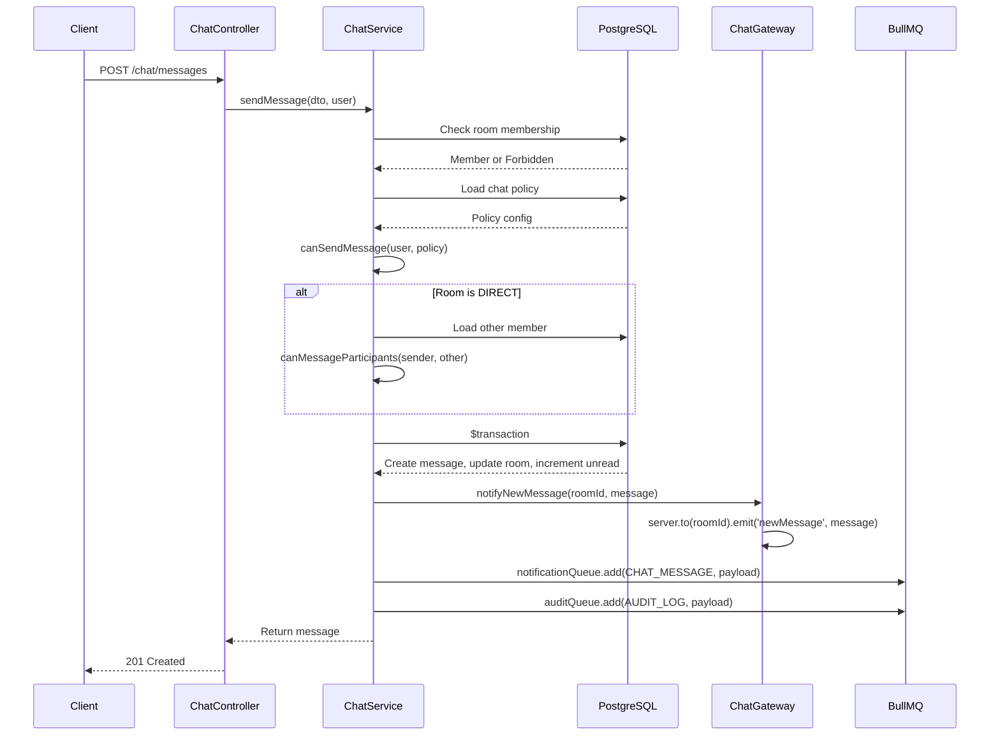
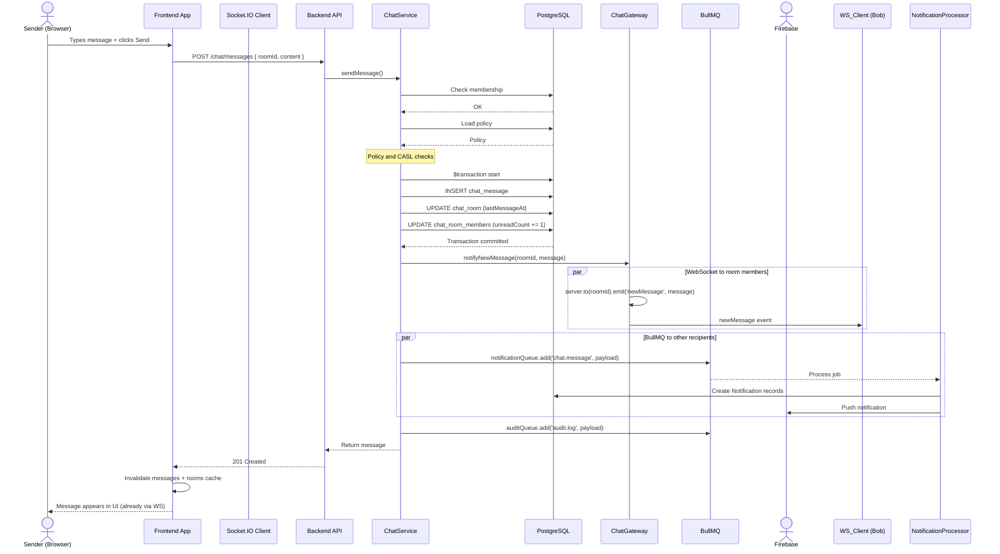

# EduSystem Chat Architecture

> **Version:** 1.0 | **Platform:** EduSystem SaaS Educational Management Platform | **Last updated:** 2026-05-21

---

## Table of Contents

1. [Chat Overview](#1-chat-overview)
2. [Data Model](#2-data-model)
3. [REST API Architecture](#3-rest-api-architecture)
4. [Service Layer](#4-service-layer)
5. [Chat Policy System](#5-chat-policy-system)
6. [WebSocket Layer](#6-websocket-layer)
7. [Presence System](#7-presence-system)
8. [WebSocket Rate Limiting](#8-websocket-rate-limiting)
9. [CASL Authorization](#9-casl-authorization)
10. [BullMQ Queue Integration](#10-bullmq-queue-integration)
11. [File Attachments](#11-file-attachments)
12. [Frontend Integration](#12-frontend-integration)
13. [End-to-End Message Flow](#13-end-to-end-message-flow)
14. [Multi-Tenancy Considerations](#14-multi-tenancy-considerations)
15. [Security Considerations](#15-security-considerations)
16. [Future Considerations](#16-future-considerations)

---

## 1. Chat Overview

### 1.1 What It Is

EduSystem's chat module provides **multi-tenant real-time messaging** between all user roles within an institution (ADMIN, DIRECTOR, SECRETARY, PRECEPTOR, TEACHER, GUARDIAN). It supports DIRECT (1:1) and GROUP conversations with rich presence, typing indicators, read receipts, file attachments, and push notifications.

### 1.2 Architecture Layers

```
┌─────────────────────────────────────────────────────┐
│                    Frontend                          │
│  ┌─────────────────────────────────────────────────┐│
│  │  React Query Hooks  │  Socket.IO Client          ││
│  └─────────────────────────────────────────────────┘│
└───────────────────────┬─────────────────────────────┘
                        │ HTTP REST        │ WebSocket
┌───────────────────────▼─────────────────────────────┐
│                    Backend (NestJS)                   │
│  ┌──────────────┐  ┌──────────────┐  ┌────────────┐│
│  │ ChatController│  │  ChatGateway  │ │ChatPresence││
│  │  (REST API)   │  │ (Socket.IO)   │ │  (Redis)   ││
│  └──────┬───────┘  └──────┬───────┘  └─────┬──────┘│
│         │                 │                 │       │
│  ┌──────▼─────────────────▼─────────────────▼──────┐│
│  │                ChatService                       ││
│  │  (business logic, policy checks, txn orchestration)│
│  └──────┬──────────────┬──────────────┬───────────┘│
│         │              │              │             │
│  ┌──────▼──┐   ┌───────▼───────┐  ┌──▼──────────┐  │
│  │ Prisma  │   │    BullMQ     │  │ Redis Io    │  │
│  │ Service │   │  Queues (notif│  │ Adapter     │  │
│  │         │   │  + audit)     │  │ (pub/sub)   │  │
│  └────┬────┘   └───────┬───────┘  └──────┬───────┘  │
└───────┼────────────────┼─────────────────┼──────────┘
        │                │                 │
┌───────▼────────────────▼─────────────────▼──────────┐
│  PostgreSQL         Redis 7              MinIO       │
│  (Prisma ORM)       (Queue + Presence   (Attachments)│
│                     + Socket Pub/Sub)                 │
└──────────────────────────────────────────────────────┘
```

### 1.3 Key Files

| File | Purpose |
|------|---------|
| `backend/src/modules/chat/chat.module.ts` | Module registration, DI providers |
| `backend/src/modules/chat/chat.controller.ts` | REST API endpoint definitions |
| `backend/src/modules/chat/chat.service.ts` | Business logic, Prisma queries, queue dispatch |
| `backend/src/modules/chat/chat.gateway.ts` | Socket.IO WebSocket event handlers |
| `backend/src/modules/chat/chat-presence.service.ts` | Redis-backed online presence |
| `backend/src/modules/chat/chat-policy.service.ts` | Role-to-role messaging policy CRUD |
| `backend/src/modules/chat/dto/chat.dto.ts` | Zod schemas for all DTOs |
| `backend/src/modules/chat/guards/ws-throttle.guard.ts` | In-memory WS rate limiter |
| `backend/src/modules/chat/decorators/throttle-ws.decorator.ts` | `@ThrottleWs()` decorator |
| `backend/src/common/adapters/redis-io.adapter.ts` | Redis pub/sub Socket.IO adapter |
| `backend/src/common/decorators/ws-user.decorator.ts` | `@WsUser()` param decorator |
| `backend/src/modules/casl/guards/casl-ws.guard.ts` | CASL authorization for WS |
| `backend/src/modules/casl/decorators/check-ability-ws.decorator.ts` | `@CheckAbilityWs()` decorator |
| `frontend/src/lib/api/chat.ts` | React Query hooks for chat API |

---

## 2. Data Model

### 2.1 Entity-Relationship Diagram

```mermaid
erDiagram
    ChatRoom ||--o{ ChatRoomMember : has
    ChatRoom ||--o{ ChatMessage : contains
    ChatRoom ||--o| InstitutionChatPolicy : governed-by
    ChatRoomMember }|--|| User : references
    ChatMessage }|--|| User : sent-by
    ChatMessage ||--o{ ChatMessageRead : read-by
    ChatMessageRead }|--|| User : references
    Institution ||--o| InstitutionChatPolicy : configures

    ChatRoom {
        uuid id PK
        string institutionId FK "tenant-scoped"
        enum type "DIRECT | GROUP"
        string name "nullable, for GROUP rooms"
        string courseId FK "nullable, for COURSE type"
        string directRoomHash UK "DM dedup key"
        datetime lastMessageAt
        datetime createdAt
    }

    ChatRoomMember {
        uuid id PK
        uuid roomId FK
        uuid userId FK
        datetime joinedAt
        int unreadCount
    }

    ChatMessage {
        uuid id PK
        uuid roomId FK
        uuid senderId FK
        string content "nullable"
        enum type "TEXT | FILE | IMAGE"
        string attachmentUrl "nullable"
        datetime sentAt
    }

    ChatMessageRead {
        uuid id PK
        uuid messageId FK
        uuid userId FK
        datetime readAt
    }

    InstitutionChatPolicy {
        uuid id PK
        uuid institutionId UK FK
        boolean guardiansCanMessageTeachers
        boolean guardiansCanMessageDirectors
        boolean guardiansCanMessageSecretariat
        boolean guardiansCanMessageAdmin
        boolean teachersCanMessageGuardians
        boolean teachersCanMessageOtherTeachers
        boolean teachersCanMessageStudents
        boolean studentsCanMessageTeachers
        boolean studentsCanMessageOtherStudents
        boolean studentsCanCreateRooms
        boolean requireModerationForNewRooms
        boolean allowAnonymousReporting
    }
```

### 2.2 Schema Definitions

#### `ChatRoom`

```prisma
model ChatRoom {
  id              String       @id @default(uuid())
  institutionId   String       @map("institution_id")
  type            ChatRoomType
  name            String?      @db.VarChar(100)
  courseId        String?      @map("course_id")
  directRoomHash  String?      @unique @map("direct_room_hash")
  lastMessageAt   DateTime?    @map("last_message_at")
  createdAt       DateTime     @default(now()) @map("created_at")

  institution Institution      @relation(fields: [institutionId], references: [id])
  course      Course?          @relation(fields: [courseId], references: [id])
  members     ChatRoomMember[]
  messages    ChatMessage[]

  @@index([institutionId])
  @@index([lastMessageAt])
  @@map("chat_rooms")
}
```

- **`directRoomHash`**: A deterministic hash `{institutionId}::{sortedUser1Id}::{sortedUser2Id}` that uniquely identifies a DIRECT 1:1 room between two users. Used for idempotent DM creation — if a DIRECT room already exists between the same two users, the existing room is returned instead of creating a duplicate.
- **`lastMessageAt`**: Denormalized timestamp updated on every message send to enable room list ordering by recent activity without a join.
- **`courseId`**: Optional FK to Course. Rooms can be associated with a course for course-specific group conversations.

#### `ChatRoomMember`

```prisma
model ChatRoomMember {
  id          String   @id @default(uuid())
  roomId      String   @map("room_id")
  userId      String   @map("user_id")
  joinedAt    DateTime @default(now()) @map("joined_at")
  unreadCount Int      @default(0) @map("unread_count")

  room ChatRoom @relation(fields: [roomId], references: [id])
  user User     @relation(fields: [userId], references: [id])

  @@unique([roomId, userId])
  @@index([userId])
  @@map("chat_room_members")
}
```

- `unreadCount` is a denormalized counter incremented on every new message (for non-sender members) and decremented on read. This avoids expensive COUNT queries on every room list load.

#### `ChatMessage`

```prisma
model ChatMessage {
  id            String      @id @default(uuid())
  roomId        String      @map("room_id")
  senderId      String      @map("sender_id")
  content       String?     @db.Text
  type          MessageType @default(TEXT)
  attachmentUrl String?     @map("attachment_url")
  sentAt        DateTime    @default(now()) @map("sent_at")

  room   ChatRoom          @relation(fields: [roomId], references: [id])
  sender User              @relation(fields: [senderId], references: [id])
  reads  ChatMessageRead[]

  @@index([roomId, sentAt])
  @@map("chat_messages")
}
```

#### `ChatMessageRead`

```prisma
model ChatMessageRead {
  id        String   @id @default(uuid())
  messageId String   @map("message_id")
  userId    String   @map("user_id")
  readAt    DateTime @default(now()) @map("read_at")

  message ChatMessage @relation(fields: [messageId], references: [id], onDelete: Cascade)
  user    User        @relation(fields: [userId], references: [id])

  @@unique([messageId, userId])
  @@index([userId])
  @@index([messageId])
  @@map("chat_message_reads")
}
```

- `onDelete: Cascade` ensures read receipts are cleaned up when a message is deleted.
- The composite unique constraint prevents duplicate read records.

#### `InstitutionChatPolicy`

```prisma
model InstitutionChatPolicy {
  id                                  String   @id @default(uuid())
  institutionId                       String   @unique @map("institution_id")

  guardiansCanMessageTeachers        Boolean  @default(true)  @map("guardians_can_message_teachers")
  guardiansCanMessageDirectors       Boolean  @default(true)  @map("guardians_can_message_directors")
  guardiansCanMessageSecretariat     Boolean  @default(true)  @map("guardians_can_message_secretariat")
  guardiansCanMessageAdmin           Boolean  @default(true)  @map("guardians_can_message_admin")

  teachersCanMessageGuardians        Boolean  @default(true)  @map("teachers_can_message_guardians")
  teachersCanMessageOtherTeachers    Boolean  @default(false) @map("teachers_can_message_other_teachers")
  teachersCanMessageStudents         Boolean  @default(false) @map("teachers_can_message_students")

  studentsCanMessageTeachers         Boolean  @default(false) @map("students_can_message_teachers")
  studentsCanMessageOtherStudents    Boolean  @default(false) @map("students_can_message_other_students")
  studentsCanCreateRooms             Boolean  @default(false) @map("students_can_create_rooms")
  requireModerationForNewRooms        Boolean  @default(false) @map("require_moderation_for_new_rooms")
  allowAnonymousReporting             Boolean  @default(false) @map("allow_anonymous_reporting")

  institution Institution @relation(fields: [institutionId], references: [id])

  @@map("institution_chat_policies")
}
```

### 2.3 Enums

```prisma
enum ChatRoomType { DIRECT  GROUP }
enum MessageType  { TEXT    FILE   IMAGE }

enum NotificationType {
  GRADE
  ATTENDANCE
  CHAT
  ANNOUNCEMENT
  SYSTEM
}
```

### 2.4 Key Indexes

| Table | Index | Purpose |
|-------|-------|---------|
| `chat_rooms` | `institutionId` | Tenant-scoped lookups |
| `chat_rooms` | `lastMessageAt` | Room list ordering |
| `chat_room_members` | `[roomId, userId]` (unique) | Membership dedup |
| `chat_room_members` | `userId` | Loading user's rooms |
| `chat_messages` | `[roomId, sentAt]` | Cursor-based message pagination |
| `chat_message_reads` | `[messageId, userId]` (unique) | Read receipt dedup |
| `chat_message_reads` | `userId` | Unread count queries |
| `chat_message_reads` | `messageId` | Read status per message |

---

## 3. REST API Architecture

### 3.1 Controller Pattern

`ChatController` follows the standard EduSystem **thin controller** pattern: route definitions, guard decorators, and DTO parsing via `ZodPipe` — all business logic is delegated to `ChatService`.

```typescript
@ApiTags('Chat')
@ApiBearerAuth('JWT')
@UseGuards(CaslGuard)
@Controller('chat')
export class ChatController {
  constructor(
    private readonly chatService: ChatService,
    private readonly chatPolicyService: ChatPolicyService,
    private readonly storageService: StorageService,
  ) {}
  // ... endpoints
}
```

### 3.2 Endpoint Reference

| Method | Path | Auth | CASL | Description |
|--------|------|------|------|-------------|
| `GET` | `/chat/rooms` | JWT | `Read ChatRoom` | List user's rooms (cursor-paginated) |
| `GET` | `/chat/rooms/unread` | JWT | `Read ChatRoom` | Get unread count per room |
| `GET` | `/chat/rooms/:id` | JWT | `Read ChatRoom` | Room details with members |
| `POST` | `/chat/rooms` | JWT | `Create ChatRoom` | Create DIRECT or GROUP room |
| `GET` | `/chat/rooms/:roomId/messages` | JWT | `Read ChatRoom` | Messages (cursor-paginated, newest first) |
| `POST` | `/chat/messages` | JWT | `Create ChatMessage` | Send a message |
| `POST` | `/chat/messages/read` | JWT | `Update ChatRoom` | Mark messages as read |
| `GET` | `/chat/messages/search` | JWT | `Read ChatRoom` | Full-text message search |
| `POST` | `/chat/attachments/upload` | JWT | `Create ChatMessage` | Upload file attachment |
| `GET` | `/chat/policy` | JWT | `Read Institution` | Get institution's chat policy |
| `PATCH` | `/chat/policy` | JWT | `Update Institution` | Update chat policy |

### 3.3 Pagination Strategy

All list endpoints use **cursor-based pagination** (not offset-based), which provides stable results under concurrent writes:

```typescript
// Room list — cursor is room ID (UUID), ordered by lastMessageAt desc
const rooms = await this.prisma.chatRoom.findMany({
  where: { id: { in: memberRoomIds }, institutionId },
  orderBy: { lastMessageAt: 'desc' },
  take: dto.limit + 1,              // Fetch one extra to detect hasMore
  cursor: dto.cursor ? { id: dto.cursor } : undefined,
});
const hasMore = rooms.length > dto.limit;
const results = hasMore ? rooms.slice(0, -1) : rooms;
const nextCursor = hasMore ? results[results.length - 1]?.id : undefined;

// Messages — cursor is sentAt ISO string, ordered by sentAt desc
const messages = await this.prisma.chatMessage.findMany({
  where: { roomId: dto.roomId, ...(dto.before ? { sentAt: { lt: new Date(dto.before) } } : {}) },
  orderBy: { sentAt: 'desc' },
  take: dto.limit + 1,
});
const results = hasMore ? messages.slice(0, -1) : messages.reverse(); // Reverse for chronological order
const nextCursor = hasMore ? results[results.length - 1]?.sentAt.toISOString() : undefined;
```

### 3.4 Query Parameters

| Endpoint | Params | Defaults |
|----------|--------|----------|
| `GET /chat/rooms` | `type` (DIRECT/GROUP/COURSE), `courseId`, `limit`, `cursor` | `limit=20` |
| `GET /chat/rooms/:roomId/messages` | `limit`, `before` (ISO datetime) | `limit=50` |
| `GET /chat/messages/search` | `q` (query), `limit`, `cursor` | `limit=20` |

### 3.5 HTTP Status Codes

| Code | Usage |
|------|-------|
| 200 | Successful GET, PATCH, POST /read |
| 201 | Successful POST (room created, message sent) |
| 400 | Zod validation error |
| 403 | Forbidden (CASL denial, policy restriction, room access denied) |
| 404 | Room or message not found |
| 409 | Room creation conflict (unique constraint) |

---

## 4. Service Layer

### 4.1 `ChatService` — Core Business Logic

`ChatService` is the heart of the chat module. It is `@Injectable()` and depends on:

- `PrismaService` — all database operations
- `@InjectQueue(QUEUES.NOTIFICATIONS)` — async push notifications
- `@InjectQueue(QUEUES.AUDIT)` — async audit logging
- `ChatGateway` — WebSocket broadcast (via `forwardRef` to avoid circular dependency)

### 4.2 Room Lifecycle

#### Room Creation

```mermaid
flowchart TD
    A[POST /chat/rooms] --> B{type === DIRECT?}
    B -->|Yes| C[Compute directRoomHash]
    C --> D[Check existing by hash]
    D -->|Exists| E[Return existing room]
    D -->|New| F[Check policy: canMessageParticipants]
    F -->|Allowed| G[Create room + members in 1 query]
    F -->|Denied| H[Throw ForbiddenException]

    B -->|No (GROUP)| I[Check policy: canCreateRoom]
    I -->|Allowed| G
    I -->|Denied| H

    G --> J[Dispatch audit.log job]
    J --> K[Return room with members]
```

```typescript
// DIRECT room dedup via sorted user IDs
const sortedIds = [user.id, otherUserId].sort();
const roomHash = `${institutionId}::${sortedIds[0]}::${sortedIds[1]}`;

const existing = await this.prisma.chatRoom.findFirst({
  where: { directRoomHash: roomHash },
  include: { members: { include: { user: ... } } },
});
if (existing) return existing;
```

#### Race Condition Handling

The `directRoomHash` has a `@@unique` constraint. If two concurrent requests create the same DIRECT room simultaneously, the second will hit a `P2002` Prisma error. The service catches this and retries with a `findFirst` lookup:

```typescript
try {
  // create room...
} catch (err) {
  if (err instanceof Prisma.PrismaClientKnownRequestError && err.code === 'P2002') {
    const existingOnConflict = await this.prisma.chatRoom.findFirst({
      where: { directRoomHash: roomHash },
      include: { members: { include: { user: ... } } },
    });
    if (existingOnConflict) return existingOnConflict;
  }
  throw err;
}
```

### 4.3 Message Sending

Message sending is the most complex operation in the chat service. It orchestrates:

1. **Membership verification** — sender must be a room member
2. **Policy check** — sender must be permitted to send messages (via `canSendMessage`)
3. **DIRECT-room policy re-validation** — verify cross-role messaging is permitted per institution policy
4. **Transactional write** — insert message + update `lastMessageAt` + increment `unreadCount` for other members
5. **WebSocket broadcast** — `ChatGateway.notifyNewMessage()` pushes to all room sockets
6. **BullMQ notification dispatch** — `chat.message` job for in-app notification + FCM push
7. **Audit log dispatch** — `audit.log` job for message creation event



### 4.4 Read Markers

Supports two modes:

**Single message read:**
```typescript
await this.prisma.$transaction(async (tx) => {
  await tx.chatMessageRead.upsert({
    where: { messageId_userId: { messageId, userId } },
    create: { messageId, userId },
    update: {},
  });
  await tx.chatRoomMember.update({
    where: { roomId_userId: ... },
    data: { unreadCount: { decrement: 1 } },
  });
});
```

**Bulk read all unread (when `messageId` is omitted):**
```typescript
await this.prisma.$transaction(async (tx) => {
  await tx.chatMessageRead.createMany({
    data: unreadMessages.map((m) => ({ messageId: m.id, userId })),
    skipDuplicates: true,
  });
  await tx.chatRoomMember.update({
    where: { roomId_userId: ... },
    data: { unreadCount: { decrement: unreadMessages.length } },
  });
});
```

Both paths broadcast `messagesRead` via WebSocket to all room members so read receipts update in real-time.

### 4.5 Unread Count

```typescript
async getUnreadCount(user: RequestUser, institutionId: string) {
  const memberships = await this.prisma.chatRoomMember.findMany({
    where: { userId: user.id, unreadCount: { gt: 0 } },
    select: { roomId: true, unreadCount: true },
  });
  return {
    total: memberships.reduce((sum, m) => sum + m.unreadCount, 0),
    rooms: memberships.map((m) => ({ roomId: m.roomId, unreadCount: m.unreadCount })),
  };
}
```

### 4.6 Message Search

```typescript
async searchMessages(query: string, user: RequestUser, ...) {
  const memberRooms = await this.prisma.chatRoomMember.findMany({
    where: { userId: user.id },
    select: { roomId: true },
  });
  const messages = await this.prisma.chatMessage.findMany({
    where: {
      roomId: { in: roomIds },
      content: { contains: query, mode: 'insensitive' },
      ...(cursor ? { sentAt: { lt: new Date(cursor) } } : {}),
    },
    include: { sender: ..., room: { select: { id: true, name: true } } },
    orderBy: { sentAt: 'desc' },
    take: limit + 1,
  });
}
```

Search is scoped to rooms the user is a member of — cross-room search is not permitted. Prisma's `contains` with `mode: 'insensitive'` provides basic full-text search without a dedicated search index.

---

## 5. Chat Policy System

### 5.1 Overview

Each institution has a policy (`InstitutionChatPolicy`) that controls which roles can initiate conversations with which other roles. This is an ABAC layer on top of CASL — even if a user has CASL permission to `Create ChatMessage`, the policy may deny messaging specific role targets.

### 5.2 Policy Defaults

```typescript
{
  guardiansCanMessageTeachers:      true,   // Guardians CAN message teachers
  guardiansCanMessageDirectors:     true,   // Guardians CAN message directors
  guardiansCanMessageSecretariat:    true,   // Guardians CAN message secretariat
  guardiansCanMessageAdmin:          true,   // Guardians CAN message admin
  teachersCanMessageGuardians:       true,   // Teachers CAN message guardians
  teachersCanMessageOtherTeachers:   false,  // Teachers CANNOT message other teachers
  teachersCanMessageStudents:        false,  // Teachers CANNOT message students
  studentsCanMessageTeachers:        false,  // Students CANNOT message teachers
  studentsCanMessageOtherStudents:   false,  // Students CANNOT message other students
  studentsCanCreateRooms:            false,  // Students CANNOT create rooms
}
```

### 5.3 Policy Enforcement Points

The policy is checked at two points:

1. **`canCreateRoom(user, policy)`** — Called at room creation. ADMIN/DIRECTOR/SECRETARY/PRECEPTOR/TEACHER always pass. GUARDIAN passes. Students (not yet implemented) check `studentsCanCreateRooms`.

2. **`canMessageParticipants(user, participantIds, institutionId, policy)`** — Called during DIRECT room creation and during message sending in DIRECT rooms. ADMIN/DIRECTOR/SECRETARY/PRECEPTOR always pass. TEACHER and GUARDIAN check the policy matrix against each participant's role.

```typescript
private async canMessageParticipants(user, participantIds, institutionId, policy): Promise<boolean> {
  if (['SUPER_ADMIN', 'ADMIN', 'DIRECTOR', 'SECRETARY', 'PRECEPTOR'].includes(user.role)) {
    return true; // Admin roles bypass
  }

  const participants = await this.prisma.user.findMany({
    where: { id: { in: participantIds } },
    select: { id: true, role: true },
  });

  for (const participant of participants) {
    if (user.role === 'GUARDIAN') {
      if (participant.role === 'TEACHER' && !policy.guardiansCanMessageTeachers) return false;
      if (participant.role === 'DIRECTOR' && !policy.guardiansCanMessageDirectors) return false;
      if (participant.role === 'SECRETARY' && !policy.guardiansCanMessageSecretariat) return false;
      if (participant.role === 'ADMIN' && !policy.guardiansCanMessageAdmin) return false;
    }
    if (user.role === 'TEACHER') {
      if (participant.role === 'GUARDIAN' && !policy.teachersCanMessageGuardians) return false;
      if (participant.role === 'TEACHER' && !policy.teachersCanMessageOtherTeachers) return false;
    }
  }
  return true;
}
```

### 5.4 Policy CRUD

- **GET `/chat/policy`** — Returns current policy via `upsert` (creates with defaults if none exists).
- **PATCH `/chat/policy`** — Partial update of any policy fields. Protected by `@CheckAbility({ action: Action.Update, subject: 'Institution' })` so only ADMIN/DIRECTOR can modify.

---

## 6. WebSocket Layer

### 6.1 Gateway Configuration

```typescript
@WebSocketGateway({
  namespace: '/chat',
})
export class ChatGateway implements OnGatewayConnection, OnGatewayDisconnect {
  @WebSocketServer()
  server: Server;
  // ...
}
```

The gateway operates on the `/chat` namespace, isolating chat traffic from any future WebSocket namespaces.

### 6.2 Authentication Flow

Authentication happens in `handleConnection` via JWT verification:

1. Extract token from `handshake.auth.token` or `handshake.headers.authorization`
2. Verify JWT signature using `JwtService` with `JWT_SECRET`
3. Look up user in database (checks status — INACTIVE/SUSPENDED users are rejected)
4. Attach `client.data.user` with full user object

```typescript
async handleConnection(client: Socket) {
  const token = client.handshake.auth?.token ||
    client.handshake.headers?.authorization?.replace('Bearer ', '');
  if (!token) { client.disconnect(); return; }

  const payload = this.jwtService.verify(token, { secret: this.configService.get('JWT_SECRET') });
  const user = await this.prisma.user.findUnique({
    where: { id: payload.sub },
    select: { id: true, email: true, role: true, institutionId: true, status: true, firstName: true, lastName: true },
  });
  if (!user || user.status === 'INACTIVE' || user.status === 'SUSPENDED') {
    client.disconnect(); return;
  }
  client.data.user = { ... };
  await this.chatPresenceService.userConnected(user.id, client.id);
  client.emit('connected', { userId: user.id });
}
```

### 6.3 Event Reference

#### Client → Server Events

| Event | Rate Limit | CASL | Description |
|-------|-----------|------|-------------|
| `joinRoom` | 10/60s | `Read ChatRoom` | Join a room, get member list + online status |
| `leaveRoom` | 10/60s | `Read ChatRoom` | Leave a room |
| `typing` | 1/500ms | `Read ChatRoom` | Broadcast typing indicator |
| `heartbeat` | 1/5s | None | Update presence TTL |
| `getOnlineUsers` | 10/60s | `Read ChatRoom` | Get online members in a room |

#### Server → Client Events

| Event | Payload | Trigger |
|-------|---------|---------|
| `newMessage` | `{ id, roomId, senderId, content, type, sentAt, sender }` | Message sent via REST API |
| `messagesRead` | `{ roomId, userId, messageIds }` | Read marker set via REST API |
| `invitedToRoom` | `{ roomId, user }` | Room created with the user as participant |
| `userOnline` | `{ userId }` | User joined a room |
| `userOffline` | `{ userId }` | User disconnected (last socket) |
| `userTyping` | `{ roomId, userId, userName, isTyping }` | Typing event received |
| `connected` | `{ userId }` | Successful authentication |
| `error` | `{ message }` | Validation or authorization failure |
| `throttled` | `{ handler, retryAfterMs }` | Rate limit exceeded |

### 6.4 Room Access Verification

Every event handler verifies that the user is a member of the target room via `verifyRoomAccess`:

```typescript
private async verifyRoomAccess(userId, roomId, institutionId): Promise<boolean> {
  const membership = await this.prisma.chatRoomMember.findFirst({
    where: { roomId, userId },
    include: institutionId ? { room: { select: { institutionId: true } } } : undefined,
  });
  if (!membership) return false;
  if (institutionId && membership.room.institutionId !== institutionId) return false;
  return true;
}
```

### 6.5 Status Enforcement

Users with `ON_LEAVE`, `INACTIVE`, or `SUSPENDED` status are blocked from all WebSocket actions:

```typescript
private readonly BLOCKED_STATUSES = new Set(['ON_LEAVE', 'INACTIVE', 'SUSPENDED']);

private checkUserStatus(client: Socket, user: AuthenticatedUser): boolean {
  if (this.BLOCKED_STATUSES.has(user.status)) {
    client.emit('error', { message: 'Tu cuenta no puede realizar esta acción' });
    return true;  // Block the action
  }
  return false;  // Allow
}
```

### 6.6 Redis Pub/Sub Adapter

For horizontal scaling (multiple API instances), Socket.IO uses the **Redis adapter**:

```typescript
// RedisIoAdapter
export class RedisIoAdapter extends IoAdapter {
  async connectToRedis(url: string): Promise<void> {
    const pubClient = createClient({ url });
    const subClient = pubClient.duplicate();
    await Promise.all([pubClient.connect(), subClient.connect()]);

    this.adapterConstructor = createAdapter(pubClient, subClient, {
      key: 'edusystem:chat',  // Redis key prefix
    });
  }

  createIOServer(port: number, options?: ServerOptions): any {
    const server = super.createIOServer(port, { ...options, cors: { ... } });
    server.adapter(this.adapterConstructor);
    return server;
  }
}
```

This ensures that when `server.to(roomId).emit('newMessage', message)` is called, the event is published via Redis and received by all Socket.IO instances that have clients in that room — regardless of which API instance the sending HTTP request hit.

**Bootstrap in `main.ts`:**

```typescript
const redisAdapter = new RedisIoAdapter(app);
await redisAdapter.connectToRedis(`redis://${redisHost}:${redisPort}`);
app.useWebSocketAdapter(redisAdapter);
```

### 6.7 CORS Configuration

WebSocket CORS is configured in `RedisIoAdapter`:

```typescript
const allowedOrigins = (process.env.ALLOWED_ORIGINS ?? 'http://localhost:3000')
  .split(',').map((o) => o.trim());
// Applied to Socket.IO server
```

---

## 7. Presence System

### 7.1 Architecture

`ChatPresenceService` uses Redis SETs to track which users are currently online. Each user has a SET of socket IDs (a user may have multiple browser tabs = multiple sockets):

```
Key:   chat:presence:{userId}
Value: Set of socket IDs
TTL:   300 seconds (5 minutes)
```

### 7.2 Operations

| Method | Redis Operation | Description |
|--------|----------------|-------------|
| `userConnected(userId, socketId)` | `SADD` + `EXPIRE` | Add socket to user's set, reset TTL |
| `userDisconnected(userId, socketId)` | `SREM` | Remove socket; if set empty, `DEL` it |
| `heartbeat(userId)` | `EXPIRE` (if key exists) | Reset TTL without adding a socket |
| `isOnline(userId)` | `SCARD` | Check if user has any active sockets |
| `getOnlineUsers(userIds[])` | Pipeline of `SCARD` | Batch check online status for many users |
| `getOnlineCount(memberIds[])` | Pipeline of `SCARD` | Count online members in a room |

### 7.3 Heartbeat Mechanism

The 5-minute TTL is refreshed by two mechanisms:

1. **Automatic**: Each new connection (`userConnected`) and disconnection (`userDisconnected` with remaining sockets) resets the TTL on the user's key.
2. **Heartbeat**: The client sends a `heartbeat` event every 30-60 seconds. This refreshes the TTL without modifying the socket set, keeping the user marked online as long as at least one socket is active.

### 7.4 Multi-Tab Support

The SET-based design naturally supports multiple tabs/devices:

```
User Alice opens Chat tab 1  → chat:presence:{aliceId} = {socket1}
User Alice opens Chat tab 2  → chat:presence:{aliceId} = {socket1, socket2}
User Alice closes Tab 1      → chat:presence:{aliceId} = {socket2}
User Alice closes Tab 2      → (key deleted, user marked offline)
```

### 7.5 Broadcast on Disconnect

When the last socket disconnects, the gateway broadcasts `userOffline` to the user's personal room:

```typescript
const stillOnline = await this.chatPresenceService.userDisconnected(user.id, client.id);
if (!stillOnline && this.server) {
  this.server.to(`user:${user.id}`).emit('userOffline', { userId: user.id });
}
```

---

## 8. WebSocket Rate Limiting

### 8.1 `WsThrottleGuard`

An in-memory rate limiter per socket connection + handler combination. Unlike HTTP rate limiters that use IP addresses, WS rate limiting uses socket IDs because WebSocket connections are long-lived and a single user may have multiple sockets.

```typescript
@Injectable()
export class WsThrottleGuard implements CanActivate {
  private readonly windows = new Map<string, { count: number; resetAt: number }>();

  canActivate(context: ExecutionContext): boolean {
    const config = this.reflector.get<WsThrottleConfig>(WS_THROTTLE_KEY, context.getHandler());
    if (!config) return true;

    const client = context.switchToWs().getClient<Socket>();
    const key = `${client.id}:${context.getHandler().name}`;
    const now = Date.now();

    let window = this.windows.get(key);
    if (!window || now > window.resetAt) {
      window = { count: 0, resetAt: now + config.windowMs };
      this.windows.set(key, window);
    }
    window.count++;
    if (window.count > config.limit) {
      client.emit('throttled', { handler: handlerName, retryAfterMs: window.resetAt - now });
      return false;
    }
    return true;
  }
}
```

### 8.2 `@ThrottleWs()` Decorator

```typescript
export const ThrottleWs = (limit: number, windowMs: number) =>
  SetMetadata(WS_THROTTLE_KEY, { limit, windowMs });
```

### 8.3 Limits by Event

| Event | Limit | Window | Rationale |
|-------|-------|--------|-----------|
| `joinRoom` / `leaveRoom` / `getOnlineUsers` | 10 | 60s | User-initiated, low frequency |
| `typing` | 1 | 500ms | High frequency, moderate rate prevents flooding |
| `heartbeat` | 1 | 5s | Periodic keepalive, low rate sufficient |

---

## 9. CASL Authorization

### 9.1 REST API (`CaslGuard` + `@CheckAbility`)

Standard HTTP CASL guards applied at the controller method level:

```typescript
@Post('rooms')
@CheckAbility({ action: Action.Create, subject: 'ChatRoom' })
createRoom(...)

@Post('messages')
@CheckAbility({ action: Action.Create, subject: 'ChatMessage' })
sendMessage(...)
```

### 9.2 WebSocket (`CaslWsGuard` + `@CheckAbilityWs`)

A WebSocket-specific CASL guard reads the user from `client.data.user` (set during `handleConnection`) and creates the ability via `AbilityFactory`:

```typescript
@Injectable()
export class CaslWsGuard implements CanActivate {
  async canActivate(context: ExecutionContext): Promise<boolean> {
    const client = context.switchToWs().getClient<Socket>();
    const user = client.data.user as RequestUser | undefined;
    if (!user) return false;

    const requirements = this.reflector.get<WsRequiredRule[]>(
      CHECK_ABILITY_WS_KEY, context.getHandler(),
    );
    if (!requirements || requirements.length === 0) return true;

    const ability = await this.abilityFactory.createForUser(user);
    return requirements.every(({ action, subject }) => ability.can(action, subject));
  }
}
```

Usage:

```typescript
@SubscribeMessage('joinRoom')
@UseGuards(CaslWsGuard)
@CheckAbilityWs({ action: Action.Read, subject: 'ChatRoom' })
async handleJoinRoom(...)
```

### 9.3 Permission Matrix by Role

| Role | ChatRoom | ChatMessage |
|------|----------|-------------|
| SUPER_ADMIN | Manage all (platform-wide) | Manage all |
| ADMIN/DIRECTOR | Manage (institution-scoped) | Manage (institution-scoped) |
| SECRETARY | Manage (institution-scoped) | Manage (institution-scoped) |
| PRECEPTOR | Manage (institution-scoped) | Manage (institution-scoped) |
| TEACHER | Read, Create | Read, Create |
| GUARDIAN | Create (read implied by `Read all, inst`) | Create (read implied by `Read all, inst`) |

---

## 10. BullMQ Queue Integration

### 10.1 Jobs Dispatched by Chat

| Job | Queue | When | Payload |
|-----|-------|------|---------|
| `chat.message` | `notifications` | After message sent | `{ roomId, messageId, senderId, senderName, content (truncated 100), recipientIds[], institutionId }` |
| `audit.log` | `audit-log` | After room created | `{ institutionId, userId, action: 'CREATE', resource: 'ChatRoom', resourceId, after }` |
| `audit.log` | `audit-log` | After message sent | `{ institutionId, userId, action: 'CREATE', resource: 'ChatMessage', resourceId, after }` |

### 10.2 Notification Processor Flow

The `NotificationProcessor.handleChatMessage()`:

1. **Load room** (for room name in notification title)
2. **Idempotency check** — query existing `Notification` records with matching `messageId` in `data` JSON for each recipient. Skip recipients already notified.
3. **Load pending recipients** — batch-load users (including `pushTokens`) in a single query to avoid N+1.
4. **For each pending recipient:**
   a. Create `Notification` record (type: `CHAT`, data: `{ roomId, messageId, senderId }`)
   b. Send FCM push notification (if user has active push tokens)

```typescript
@Process(JOBS.CHAT_MESSAGE)
async handleChatMessage(job: Job<ChatMessagePayload>) {
  // Idempotency guard
  const existingNotifications = await this.prisma.notification.findMany({
    where: { type: 'CHAT', data: { path: ['messageId'], equals: messageId }, userId: { in: recipientIds } },
  });
  const alreadyNotified = new Set(existingNotifications.map((n) => n.userId));
  const pendingRecipientIds = recipientIds.filter((id) => !alreadyNotified.has(id));
  if (pendingRecipientIds.length === 0) return; // Already processed

  // Batch-load recipients in one query
  const recipients = await this.prisma.user.findMany({
    where: { id: { in: pendingRecipientIds } },
    include: { pushTokens: { where: { isActive: true } } },
  });

  for (const user of recipients) {
    await this.prisma.notification.create({
      data: { userId: user.id, type: 'CHAT', title, body, data: { roomId, messageId, senderId } },
    });
    if (user.pushTokens.length > 0) {
      await this.fcm.sendToTokens(tokens, { title, body });
    }
  }
}
```

### 10.3 Retry Configuration

| Job | Attempts | Backoff |
|-----|----------|---------|
| `chat.message` | 3 | Exponential, 2s |
| `audit.log` | 5 | Exponential, 1s |

---

## 11. File Attachments

### 11.1 Upload Flow

1. Client sends multipart `POST /chat/attachments/upload` with the file
2. Server validates MIME type and size
3. Server generates a unique filename via `StorageService.generateFilename()`
4. File is uploaded to MinIO at path `chat/{institutionId}/{filename}`
5. Server returns a presigned URL for the file
6. Client uses the URL as `attachmentUrl` in the next message

### 11.2 Validation

```typescript
const allowedTypes = ['image/jpeg', 'image/png', 'image/gif', 'application/pdf'];
if (!allowedTypes.includes(file.mimetype)) {
  throw new BadRequestException('Tipo de archivo no permitido');
}
const maxSize = 10 * 1024 * 1024; // 10MB
if (file.size > maxSize) {
  throw new BadRequestException('El archivo excede el límite de 10MB');
}
```

### 11.3 Storage Path

```
chat/{institutionId}/{uuid}-{originalName}
```

- Tenant isolation is maintained via the `institutionId` path prefix
- UUID prefix prevents filename collisions
- No direct bucket access from the frontend — files are served through presigned URLs

---

## 12. Frontend Integration

### 12.1 React Query Hooks

All chat API interaction is encapsulated in `frontend/src/lib/api/chat.ts`:

| Hook | Type | Description | Stale Time |
|------|------|-------------|------------|
| `useChatRooms(params?)` | Query | List user's rooms | 30s |
| `useChatRoom(roomId)` | Query | Room details | 30s |
| `useChatMessages(roomId, params?)` | Query | Room messages | 10s |
| `useChatUnreadCount()` | Query | Unread counter | 20s |
| `useCreateChatRoom()` | Mutation | Create room | — |
| `useSendChatMessage()` | Mutation | Send message | — |
| `useMarkChatMessagesRead()` | Mutation | Mark read | — |

### 12.2 Cache Invalidation Strategy

```typescript
// After sending a message: invalidate messages + rooms
const useSendChatMessage = () => {
  const queryClient = useQueryClient();
  return useMutation({
    mutationFn: async (data) => api.post('/chat/messages', data),
    onSuccess: (_, variables) => {
      queryClient.invalidateQueries({ queryKey: ['chat', 'messages', variables.roomId] });
      queryClient.invalidateQueries({ queryKey: ['chat', 'rooms'] });
    },
  });
};

// After marking read: invalidate messages + unread count
const useMarkChatMessagesRead = () => {
  const queryClient = useQueryClient();
  return useMutation({
    mutationFn: async (data) => api.post('/chat/messages/read', data),
    onSuccess: (_, variables) => {
      queryClient.invalidateQueries({ queryKey: ['chat', 'messages', variables.roomId] });
      queryClient.invalidateQueries({ queryKey: ['chat', 'rooms', 'unread'] });
    },
  });
};
```

### 12.3 Socket.IO Client Integration (Future)

The frontend does not yet have dedicated chat UI pages (`frontend/src/app/**/chat` does not exist) or a Socket.IO client connection. When implemented, the Socket.IO client should:

1. Connect to `/chat` namespace with JWT token in `handshake.auth`
2. Listen for `connected` event to confirm authentication
3. Join rooms on room change (`joinRoom` event)
4. Listen for `newMessage`, `messagesRead`, `userOnline`, `userOffline`, `userTyping` events
5. Send `heartbeat` every 30 seconds to maintain presence
6. Send `typing` events on input changes (debounced, 500ms throttle)

---

## 13. End-to-End Message Flow



---

## 14. Multi-Tenancy Considerations

### 14.1 Tenant Scoping

All chat models are tenant-scoped via `institutionId`:

- `ChatRoom.institutionId` — every room belongs to exactly one institution
- Every query in `ChatService` and `ChatGateway` includes `where: { institutionId }` or checks that the room belongs to the user's institution via the `ChatRoomMember` -> `ChatRoom` relation

### 14.2 SUPER_ADMIN Behavior

`SUPER_ADMIN` users have `institutionId: null`. The room access check in `ChatGateway.verifyRoomAccess` handles this:

```typescript
if (!institutionId) {
  // SUPER_ADMIN: verify membership only (no institution check)
  const membership = await this.prisma.chatRoomMember.findFirst({
    where: { roomId, userId },
  });
  return !!membership;
}
```

### 14.3 Queue Tenant Isolation

All BullMQ job payloads include `institutionId`:

```typescript
await this.notificationQueue.add(JOBS.CHAT_MESSAGE, {
  roomId, messageId, senderId, senderName,
  content: dto.content.substring(0, 100),
  recipientIds, institutionId,  // Tenant context propagated
}, JOB_OPTIONS.DEFAULT);
```

### 14.4 File Storage Isolation

Attachment paths in MinIO include `institutionId`:

```
chat/{institutionId}/{uuid}-filename.pdf
```

---

## 15. Security Considerations

### 15.1 Threat Mitigation

| Threat | Mitigation |
|--------|-----------|
| **Unauthorized room access** | JWT verification on WS connect + `verifyRoomAccess` per event |
| **Cross-tenant data leak** | All queries scoped by `institutionId`; `verifyRoomAccess` checks room->institution match |
| **ON_LEAVE user sending messages** | Client-side `useIsOnLeave()` + server-side `checkUserStatus()` in every WS handler |
| **Message flooding** | `WsThrottleGuard` with per-event rate limits |
| **Token theft** | Short-lived JWT (15 min); signature verified on every WS connect |
| **File upload abuse** | MIME type validation (whitelist: JPEG/PNG/GIF/PDF); 10MB size limit |
| **Unauthorized role-to-role messaging** | `InstitutionChatPolicy` enforced at room creation and message send |

### 15.2 Guard Chain for WebSocket Events

Every WebSocket event handler passes through:

1. **Authentication** (implicit — `client.data.user` is set during `handleConnection`)
2. **Status check** (`checkUserStatus` — blocks ON_LEAVE, INACTIVE, SUSPENDED)
3. **Rate limiting** (`WsThrottleGuard` — per-socket, per-handler)
4. **CASL authorization** (`CaslWsGuard` — `@CheckAbilityWs`)
5. **Room access verification** (`verifyRoomAccess` — membership + institution match)

### 15.3 Idempotency

The `chat.message` job processor checks for existing notifications to prevent duplicate pushes:

```typescript
const existing = await this.prisma.notification.findMany({
  where: { type: 'CHAT', data: { path: ['messageId'], equals: messageId }, userId: { in: recipientIds } },
});
const alreadyNotified = new Set(existing.map((n) => n.userId));
const pendingRecipientIds = recipientIds.filter((id) => !alreadyNotified.has(id));
if (pendingRecipientIds.length === 0) return; // Already processed
```

---

## 16. Future Considerations

### 16.1 Frontend Chat UI

The frontend does not yet have chat pages under `src/app/**/chat`. Future implementation should include:

- A chat list sidebar showing rooms with last message previews and unread badges
- A chat view with message bubbles, typing indicators, and online status
- Attachment preview (image lightbox, PDF viewer)
- Message search interface

### 16.2 Student Role Support

The `Student` role is defined in the system but not yet fully integrated into chat policies. The `InstitutionChatPolicy` model includes student-related fields (`studentsCanMessageTeachers`, `studentsCanMessageOtherStudents`, `studentsCanCreateRooms`) but they are not actively enforced because student login and session management is not yet implemented.

### 16.3 Moderation Features

`requireModerationForNewRooms` and `allowAnonymousReporting` fields exist in the policy model but have no enforcement logic yet:

- **Moderation queue**: Rooms requiring moderation should be held in a pending state until an ADMIN/DIRECTOR approves them.
- **Anonymous reporting**: Users should be able to flag messages without revealing their identity.

### 16.4 Typing Indicator Optimization

The current typing indicator broadcasts to the entire room (`client.to(data.roomId).emit('userTyping', ...)`). For large rooms (e.g., course groups with 30+ users), this could generate significant traffic. Consider:

- Aggregating typing indicators server-side with a short debounce window
- Limiting `isTyping: true` broadcasts to 1 per 2 seconds per user

### 16.5 Presence Scaling

The in-memory `WsThrottleGuard` windows do not scale across instances. For horizontal scaling of the rate limiter, the throttle state should be migrated to Redis. However, at current scale the in-memory approach is sufficient since rate limits are generous and each user typically has 1-2 sockets.

### 16.6 Delete Messages

Message deletion is not implemented. Future support should include:

- Soft delete (nullify content, keep metadata)
- "Delete for everyone" vs "Delete for me"
- Cascade delete of read receipts

### 16.7 Group Room Management

Current group rooms are immutable after creation. Future features:

- Add/remove members
- Rename group
- Leave group (removes membership, room persists for other members)

### 16.8 Read Receipt Detail

The current read receipt tracks which messages are read but not the exact count of readers per message. Future enhancement:

- `ChatMessage.readCount` denormalized counter
- `ChatMessageRead` could include `readBy: User[]` for detailed receipts
