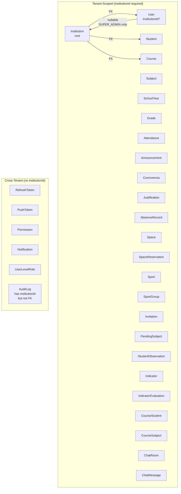
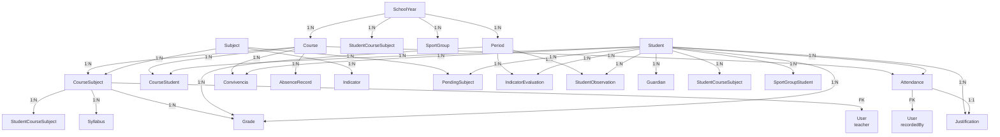
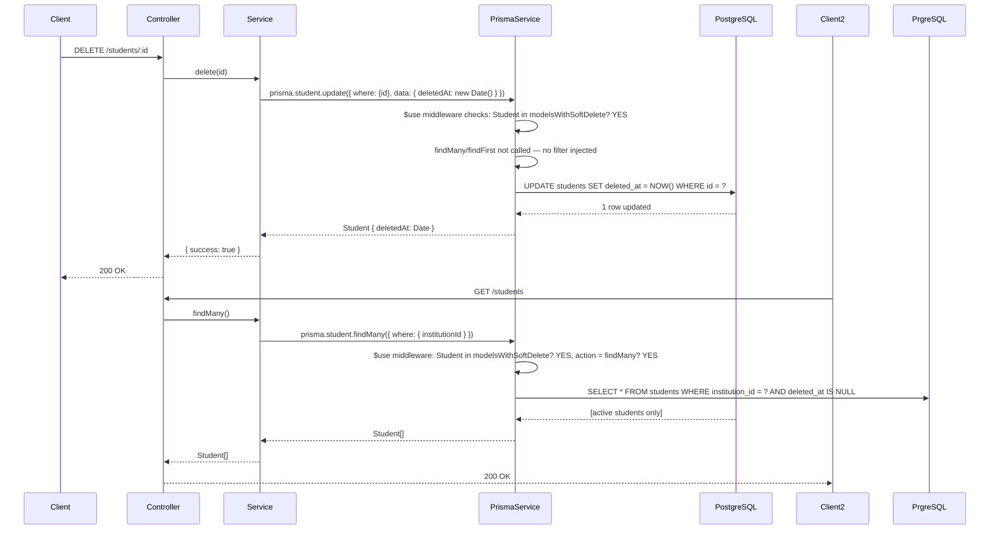
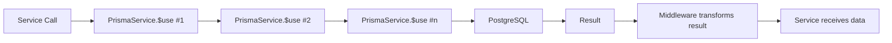

# EduSystem — Database Architecture

> **Version:** 2.1  
> **Last Updated:** 2026-05-14  
> **Classification:** Internal Technical Documentation  
> **Audience:** Backend Engineers, Database Architects, DevOps Engineers, AI Coding Agents, Future Maintainers, Scalability Planners

---

## 1. Database Overview

EduSystem uses **PostgreSQL 16** as the sole source of truth for all application state. The database stores 42 models across 14 enums, covering the full lifecycle of a multi-tenant educational institution: identity, academic structure, grades, attendance, communications, discipline, resource scheduling, and audit trails.

The schema is managed entirely via **Prisma ORM**, which provides type-safe database access, automatic query building, and migration tooling. Prisma generates a fully-typed TypeScript client from the schema, eliminating an entire class of runtime errors.

### Key Schema Statistics

| Metric | Value |
|---|---|
| Total models | 42 |
| Total enums | 14 |
| Tenant-scoped models | 26 |
| Soft-delete enabled models | 4 (`User`, `Student`, `Announcement`, `Institution`) |
| Models with `institutionId` FK | 26 |
| Cross-tenant models (no `institutionId`) | 6 (`RefreshToken`, `PushToken`, `Permission`, `AuditLog`*, `UserLevelRole`, `Notification`) |
| Unique constraints (tenant-scoped) | 12 |
| Partial unique indexes | 1 (SUPER_ADMIN email) |
| Junction tables | 14 |

*`AuditLog` has `institutionId` but is cross-user (records actions by any user across any institution).

---

## 2. Database Technology Stack

### PostgreSQL 16 — Why It Was Chosen

| Criterion | PostgreSQL | MySQL/MariaDB | SQLite |
|---|---|---|---|
| ACID compliance | Full (MVCC + WAL) | Full with InnoDB | Full (but file-based) |
| JSON/JSONB support | Excellent (indexable JSON) | Limited | None |
| Enums | Native (strongly typed) | Limited | None |
| Row-level security | Native (RLS) | Not supported | Not supported |
| COPY/FOREIGN KEY per DB | Yes | Yes | No FK |
| Window functions | Yes | Yes | Limited |
| CTEs (WITH RECURSIVE) | Yes | Yes | Limited |
| Maturity / ecosystem | 25+ years | Mature | Limited |
| Prisma support | Excellent (native) | Good | Good |
| EduSystem use case fit | **Optimal** | Acceptable | Insufficient |

PostgreSQL 16 was selected because:
- **JSONB** enables storing flexible metadata (`Institution.settings`, `AuditLog.before/after`) with the ability to index specific paths for fast queries.
- **Enums** provide compile-time safety for finite sets (Role, UserStatus, Level, GradeType, etc.) instead of relying on string validation.
- **RLS readiness**: The schema reserves `institutionId` on all tenant-scoped tables, enabling future Row-Level Security policies without schema changes.
- **Partial indexes**: Critical for the SUPER_ADMIN email uniqueness edge case (see Section 6).

### Prisma ORM — Why It Was Selected

| Criterion | Prisma | TypeORM | raw SQL / pg | Drizzle |
|---|---|---|---|---|
| Type safety | Full (generated client) | Partial (entities) | None | Full |
| Migration tooling | Yes (Prisma Migrate) | TypeORM Migrations | Manual | Yes |
| Query building | Yes (fluent) | Yes (QueryBuilder) | No | Yes |
| Soft-delete middleware | Custom ($use) | Global filter | Manual | Manual |
| Performance | Good (Prisma 5+) | Good | Best | Best |
| Learning curve | Low | Medium | N/A | Medium |
| N+1 prevention | `include` + `select` | Relations | Manual | Manual |
| IDE autocomplete | Full | Partial | None | Full |
| Team familiarity | High in NestJS ecosystem | High | N/A | Growing |

Prisma was chosen for its **developer experience**: the generated TypeScript client provides full autocomplete on every model, relation, and enum, dramatically reducing the risk of incorrect field names or wrong types in production queries. The migration system ensures schema changes are versioned alongside application code.

**Prisma limitations known and accepted:**
- `$use` middleware runs synchronously and adds overhead to every query (mitigated by targeting only `findMany`/`findFirst` on soft-delete models — 4 of 42 models).
- Connection pool is managed by Prisma; PgBouncer integration requires `connection_limit` tuning in the connection string.
- Bulk operations (`createMany`) lack fine-grained error handling per row (use individual creates in transactions for critical data).

---

## 3. Prisma ORM Architecture

### PrismaService Design

The `PrismaService` extends the generated `PrismaClient` and adds:

1. **Lifecycle hooks** (`OnModuleInit` / `OnModuleDestroy`): clean connection/disconnection with logging.
2. **Soft-delete middleware**: automatically injects `deletedAt: null` into all `findMany` and `findFirst` queries for models with soft delete.
3. **Slow-query logging** (development only): logs queries exceeding 500ms for performance debugging.
4. **Transaction helper** (`runTransaction<T>`): typed wrapper around `$transaction` for atomic multi-step operations.

```typescript
// src/prisma/prisma.service.ts
export class PrismaService
  extends PrismaClient
  implements OnModuleInit, OnModuleDestroy
{
  constructor() {
    super({
      log: process.env.NODE_ENV === 'development'
        ? [{ emit: 'event', level: 'query' }, { emit: 'stdout', level: 'warn' }]
        : [{ emit: 'stdout', level: 'warn' }],
    });
  }

  async onModuleInit() {
    await this.$connect();

    // Soft-delete middleware
    this.$use(async (params, next) => {
      const modelsWithSoftDelete = ['User', 'Student', 'Announcement', 'Institution'];
      if (
        params.model &&
        modelsWithSoftDelete.includes(params.model) &&
        (params.action === 'findMany' || params.action === 'findFirst')
      ) {
        params.args.where = { ...params.args.where, deletedAt: null };
      }
      return next(params);
    });
  }

  async runTransaction<T>(fn: (prisma: PrismaService) => Promise<T>): Promise<T> {
    return this.$transaction((tx) => fn(tx as unknown as PrismaService));
  }
}
```

### PrismaModule — Global Registration

```typescript
// src/prisma/prisma.module.ts
@Global()
@Module({
  providers: [PrismaService],
  exports: [PrismaService],
})
export class PrismaModule {}
```

Marking `PrismaModule` as `@Global()` eliminates import boilerplate across all 20+ feature modules. Every service can inject `PrismaService` without explicitly importing `PrismaModule`.

### Generated Client Location

```
backend/node_modules/.prisma/client/
  └── index.d.ts    ← Full TypeScript types for all models, enums, inputs, selections
```

On `prisma generate`, Prisma scans the schema and emits a typed client. This client is consumed by every service:

```typescript
import { PrismaService } from '../prisma/prisma.service';
import { Role, UserStatus } from '@prisma/client';

@Injectable()
export class UsersService {
  constructor(private readonly prisma: PrismaService) {}

  async findByEmail(email: string, institutionId: string) {
    return this.prisma.user.findUnique({
      where: { email_institutionId: { email, institutionId } },
    });
  }
}
```

---

## 4. Database Design Philosophy

### Core Principles

| Principle | Implementation | Rationale |
|---|---|---|
| **Multi-tenancy by convention** | Every tenant-scoped model has `institutionId String` FK | Applications can never accidentally query across tenants if they follow the convention. |
| **Unique constraints scoped by tenant** | `@@unique([institutionId, code])` on `Subject`, `@@unique([email, institutionId])` on `User` | Enables the same `code` or `email` across different institutions (no global uniqueness required). |
| **Soft delete as middleware** | `deletedAt: DateTime?` + PrismaService `$use` middleware | Services never manually add `deletedAt: null`; the middleware handles it transparently. |
| **Audit trail as async jobs** | `AuditLog` table + `AuditProcessor` (BullMQ worker) | Audit writes never block API responses; failures do not affect business logic. |
| **SUPER_ADMIN exception** | `User.institutionId` nullable + partial unique index | `SUPER_ADMIN` is a cross-tenant role that must exist without belonging to any institution. |
| **Hierarchical IDs** | `uuid()` for all primary keys | Avoids sequential ID enumeration attacks; enables merge across databases; no ID exhaustion. |
| **Avoid nullable primitives** | Use `String?` over `""`, `Int?` over `0` | Null represents "unknown/unset"; empty string represents "intentionally empty". |
| **Domain-driven model naming** | `CourseSubject` (many-to-many with attributes) vs `SubjectCourse` | Relationship name reflects the dominant query pattern: "get subjects for a course". |

### Schema Design Patterns

**Pattern 1 — Junction table with extra attributes:**
`CourseSubject` is not a simple many-to-many. It has `teacherId`, `hoursPerWeek`, and its own timestamps. This justifies a dedicated model rather than an implicit join table.

**Pattern 2 — Soft-delete as optional temporal marker:**
Only 4 models support soft delete (`User`, `Student`, `Announcement`, `Institution`). Others use hard delete or rely on foreign key cascades. This keeps the middleware lightweight.

**Pattern 3 — Denormalized audit for performance:**
`AuditLog` stores `institutionId` on every record (not just when `institutionId` is on the affected model). This enables cross-institution audit queries for SUPER_ADMIN without JOINs.

**Pattern 4 — Self-referential through relation:**
Models that participate in many-to-many relationships with attributes use explicit junction tables (`CourseStudent`, `Guardian`, `ChatRoomMember`). Plain `@relation` without junction tables are reserved for true ownership relations (e.g., `User` → `Institution`).

---

## 5. Core Domain Models

### Entity Relationship Overview

```mermaid
erDiagram
    Institution ||--o{ User : "has"
    Institution ||--o{ Student : "enrolls"
    Institution ||--o{ Course : "organizes"
    Institution ||--o{ Subject : "defines"
    Institution ||--o{ SchoolYear : "operates"
    Institution ||--o{ AuditLog : "records"
    Institution ||--o{ Announcement : "publishes"
    Institution ||--o{ Space : "owns"
    Institution ||--o{ Sport : "offers"
    Institution ||--o{ Convivencia : "tracks"
    Institution ||--o{ Justification : "reviews"

    User ||--o{ RefreshToken : "issues"
    User ||--o{ PushToken : "registers"
    User ||--o{ Notification : "receives"
    User ||--o{ Guardian : "links"
    User ||--o{ AuditLog : "performs"
    User ||--o{ CourseSubject : "teaches"
    User ||--o{ Convivencia : "authors"
    User ||--o{ SpaceReservation : "books"

    SchoolYear ||--o{ Course : "contains"
    SchoolYear ||--o{ Period : "divides"
    SchoolYear ||--o{ SportGroup : "manages"
    SchoolYear ||--o{ StudentCourseSubject : "assigns"

    Course ||--o{ CourseStudent : "matriculates"
    Course ||--o{ CourseSubject : "offers"
    Course ||--o{ Attendance : "tracks"
    Course ||--o{ Announcement : "receives"
    Course ||--o{ Convivencia : "involves"
    Course ||--o{ AbsenceRecord : "generates"

    CourseStudent ||--|| Student : "enrolls"
    CourseStudent ||--|| Course : "belongs"

    Subject ||--o{ CourseSubject : "assigned to"
    Subject ||--o{ Indicator : "defines"
    Subject ||--o{ PendingSubject : "pending"

    CourseSubject ||--|| Course : "in"
    CourseSubject ||--|| Subject : "for"
    CourseSubject ||--|| User : "taught by"
    CourseSubject ||--o{ Grade : "graded in"
    CourseSubject ||--o{ Syllabus : "planned for"
    CourseSubject ||--o{ StudentCourseSubject : "assigned to"

    Student ||--o{ Grade : "receives"
    Student ||--o{ Attendance : "marked in"
    Student ||--o{ Guardian : "linked to"
    Student ||--o{ Convivencia : "subject of"
    Student ||--o{ Justification : "requests"
    Student ||--o{ PendingSubject : "has"
    Student ||--o{ IndicatorEvaluation : "evaluated on"
    Student ||--o{ SportGroupStudent : "participates in"

    Period ||--o{ Grade : "contains"
    Period ||--o{ IndicatorEvaluation : "evaluates"
    Period ||--o{ StudentObservation : "observes"
    Period ||--o{ Syllabus : "covers"

    Attendance ||--|| Justification : "may be"

    AuditLog }o--|| User : "performed by"
    AuditLog }o--|| Institution : "within"

    Space ||--o{ SpaceReservation : "booked for"
    SpaceReservation ||--|| User : "reserved by"

    Sport ||--o{ SportGroup : "forms"
    SportGroup ||--o{ SportGroupTeacher : "led by"
    SportGroup ||--o{ SportGroupStudent : "joined by"
    SportGroup ||--o{ Attendance : "tracks"
```



### Core Entities Summary

| Entity | Purpose | Tenant-Scoped | Soft Delete | Key Relations |
|---|---|---|---|---|
| `Institution` | Root tenant entity | — | Yes | users, students, courses, settings |
| `User` | Identity + roles | Yes | Yes | institution, refreshTokens, pushTokens, teacherSubjects, guardians |
| `RefreshToken` | JWT refresh token storage (bcrypt hashed) | No | No | user |
| `PushToken` | FCM/FCM device tokens | No | No | user |
| `UserLevelRole` | Per-level role assignments | No | No | user |
| `Permission` | ABAC permissions (CASL) | No | No | — |
| `SchoolYear` | Academic year (e.g., 2026) | Yes | No | institution, courses, periods, indicators |
| `Course` | Class/grade (e.g., "3ro A") | Yes | No | institution, schoolYear, courseStudents, courseSubjects |
| `Subject` | Academic subject (e.g., "Matemáticas") | Yes | No | institution, courseSubjects, indicators |
| `CourseSubject` | Teacher + subject assignment to a course | Yes | No | course, subject, teacher, grades, syllabuses |
| `Student` | Enrolled student | Yes | Yes | institution, courseStudents, grades, attendances, guardians |
| `CourseStudent` | Enrollment record | Yes | No | course, student |
| `Guardian` | Parent/student relationship | Yes | No | user (guardian), student |
| `Period` | Academic period (trimester, bimestre) | Yes | No | schoolYear, grades, observations |
| `Grade` | Academic grade/evaluation | Yes | No | student, courseSubject, period |
| `Attendance` | Daily attendance record | Yes | No | student, course, recordedBy, justification |
| `Justification` | Absence justification (1:1 with Attendance) | Yes | No | attendance, student, institution, reviewer |
| `Announcement` | Institutional communication | Yes | Yes | institution, author, course |
| `Notification` | In-app notification | No | No | user |
| `AuditLog` | Action audit trail | Yes | No | institution, user |
| `Syllabus` | Course subject temario per period | Yes | No | courseSubject, period |
| `Indicator` | Curriculum indicator definition | Yes | No | subject, schoolYear |
| `IndicatorEvaluation` | Student evaluated on indicator | Yes | No | indicator, student, period |
| `StudentObservation` | Per-period teacher observation | Yes | No | student, period, course, author |
| `PendingSubject` | Failed subjects (materias pendientes) | Yes | No | student, subject, institution, schoolYear |
| `StudentCourseSubject` | Subject assignment per student/year | Yes | No | student, courseSubject, schoolYear, type |
| `Convivencia` | Discipline/conduct record | Yes | No | institution, student, course, author |
| `AbsenceRecord` | Auto-generated threshold breach record | Yes | No | student, course, institution |
| `Space` | Physical room/resource | Yes | No | institution, reservations |
| `SpaceReservation` | Booking for a space | Yes | No | institution, space, user |
| `Sport` | Sport catalog | Yes | No | institution, groups |
| `SportGroup` | Sport group per year | Yes | No | institution, sport, schoolYear, teachers, students |
| `Invitation` | Onboarding invitation token | Yes | No | institution |
| `ChatRoom` | Chat room | Yes | No | institution, course |
| `ChatRoomMember` | User membership in chat room | Yes | No | room, user |
| `ChatMessage` | Chat message | Yes | No | room, sender |

---

## 6. Tenant-Aware Data Modeling

### institutionId Placement Strategy



### Why institutionId Exists on Tenant-Scoped Tables

Every table that represents data owned by an institution carries `institutionId String @map("institution_id")`. This enables:

1. **Query isolation**: All Prisma queries in services filter by `institutionId` extracted from the JWT. A bug in a service that omits the filter won't cause cross-tenant data leakage if the database-level unique constraints catch it.
2. **Unique constraints scoped by tenant**: The same `code` (e.g., "MAT" for Mathematics) can exist in two different institutions without conflict.
3. **Referential integrity**: Foreign keys from `Course` → `Institution`, `Student` → `Institution`, etc., prevent orphan records.
4. **Multi-tenant statistics**: `Institution` model has stats derived from counting users, students, courses — all filtered by `institutionId`.

### SUPER_ADMIN Exception — Why It Works

`User.institutionId` is **nullable** (`String?`). This is intentional: `SUPER_ADMIN` is a cross-tenant role used by the platform operator to manage all institutions. A `SUPER_ADMIN` user has no institution affiliation.

To allow the same email address as both a `SUPER_ADMIN` (no institution) and a normal user (with institution), the schema uses a **two-layer uniqueness strategy**:

1. **Prisma schema** (`schema.prisma`):
   ```prisma
   @@unique([email, institutionId])  // Enforces: email + institutionId must be unique
   ```
   This means: `admin@edusystem.com + institutionId=X` must be unique, and `admin@edusystem.com + institutionId=Y` must be unique, but `admin@edusystem.com + NULL` is not covered.

2. **PostgreSQL partial unique index** (`prisma/init.sql`):
   ```sql
   CREATE UNIQUE INDEX users_email_unique_super_admin
     ON users (email)
     WHERE institution_id IS NULL;
   ```
   This enforces that there is only one `SUPER_ADMIN` user per email across all institutions (where `institutionId IS NULL`).

Together, these two constraints enable:
- `admin@edusystem.com` as `SUPER_ADMIN` (institutionId = NULL)
- `admin@sanmartin.edu.ar` as `ADMIN` (institutionId = institution-A)
- `admin@otro.edu.ar` as `ADMIN` (institutionId = institution-B)

All three can coexist. The partial index guarantees that no two `SUPER_ADMIN` records share the same email.

### Tenant-Scoped Unique Constraints

| Model | Constraint | Rationale |
|---|---|---|
| `User` | `@@unique([email, institutionId])` | Same email across institutions; one email per institution |
| `Student` | `@@unique([institutionId, documentNumber])` | DNI/DNI unique per institution (Argentine regulations) |
| `Subject` | `@@unique([institutionId, code])` | Subject code unique per institution |
| `SchoolYear` | `@@unique([institutionId, year])` | Only one active year per institution |
| `CourseSubject` | `@@unique([courseId, subjectId])` | A subject taught once per course |
| `CourseStudent` | `@@unique([courseId, studentId])` | A student enrolled once per course |
| `Guardian` | `@@unique([userId, studentId])` | A parent linked once to a child |
| `ChatRoomMember` | `@@unique([roomId, userId])` | A user joins a room once |
| `SportGroupTeacher` | `@@id([sportGroupId, userId])` | A teacher assigned once to a group |
| `SportGroupStudent` | `@@id([sportGroupId, studentId])` | A student assigned once to a group |
| `Grade` | `@@unique([studentId, courseSubjectId, periodId, type, date])` | One grade per type per date per subject per student |
| `StudentCourseSubject` | `@@unique([studentId, courseSubjectId, schoolYearId])` | One assignment per subject per student per year |
| `PendingSubject` | `@@unique([studentId, subjectId, schoolYearId])` | One pending record per subject per year |
| `IndicatorEvaluation` | `@@unique([indicatorId, studentId, periodId])` | One evaluation per indicator per period per student |
| `StudentObservation` | `@@unique([studentId, periodId, courseId])` | One observation per course per period |
| `Justification` | `@unique attendanceId` | 1:1 relationship with Attendance |
| `Invitation` | `@unique token` | Token used once to accept invitation |
| `Subject` | `@@unique([institutionId, code])` | Code unique per institution |
| `UserLevelRole` | `@@unique([userId, level, role])` | One role per level per user |

---

## 7. Relationship Strategy

### Relationship Types and When to Use Each

| Pattern | Implementation | When to Use | EduSystem Examples |
|---|---|---|---|
| **One-to-Many (owner)** | Foreign key on child + `@relation` | Parent owns children; cascade delete | `Institution → users`, `Course → courseStudents` |
| **One-to-Many (attribute)** | Foreign key + extra columns on join table | The join has business data (teacher, hoursPerWeek) | `CourseSubject` (teacherId, hoursPerWeek on the join) |
| **Many-to-Many (simple)** | Junction table with `@@id` | Pure M:N without attributes | `SportGroupTeacher`, `SportGroupStudent` |
| **Many-to-Many (unique constraint)** | Junction table with `@@unique` | M:N where a record can only exist once | `Guardian`, `ChatRoomMember` |
| **One-to-One** | `@unique` on FK column | Exactly one associated record | `Justification.attendanceId @unique`, `ChatRoomMember` room+user |
| **Self-referential** | `fieldId String?` + `@relation("Name", fields: [fieldId])` | Hierarchical data | Not currently used (reserved for future course prerequisites) |

### Why CourseSubject Is a Full Model (Not Just @relation)

`CourseSubject` exists as a first-class model rather than a simple many-to-many join between `Course` and `Subject` because it carries **business attributes**:

- `teacherId`: who teaches this subject in this course
- `hoursPerWeek`: weekly load for scheduling
- `createdAt`: audit when the assignment was made

Treating it as a simple `@relation` would lose this information and require denormalization or separate tables.

### Cascade Delete Strategy

| Relation | Delete Behavior | Rationale |
|---|---|---|
| `User → RefreshToken, PushToken` | `onDelete: Cascade` | Tokens are meaningless without the user. |
| `User → Notification` | `onDelete: Cascade` | Notifications reference a specific user. |
| `User → UserLevelRole` | `onDelete: Cascade` | Level roles are user-specific. |
| `Student → CourseStudent` | `onDelete: Cascade` | Enrollment is meaningless without the student. |
| `Institution → all child tables` | `onDelete: Cascade` on most, `onDelete: Restrict` on some | Deleting an institution cascades to all related data (users, students, courses). Exceptions: `AuditLog` (retained for compliance). |
| `Course → CourseStudent` | `onDelete: Cascade` | Enrollment deleted when course is deleted. |
| `Justification → Attendance` | `@relation("AttendanceJustification")` | Justification exists only as a 1:1 extension of Attendance. |
| `Justification.reviewer` | Optional `@relation` | Reviewer (User) is nullable; the user may be deactivated. |

### Relationship Diagram — Academic Core



---

## 8. Soft Delete Architecture

### Soft Delete Flow



### Which Models Have Soft Delete

| Model | Soft Delete | Rationale |
|---|---|---|
| `Institution` | Yes | Can be suspended/reactivated; data must be preserved. |
| `User` | Yes | Can be deactivated; preserving record for audit and historical references. |
| `Student` | Yes | Can be transferred or graduated; preserve academic history. |
| `Announcement` | Yes | Can be unpublished; preserving for audit. |
| **All other models** | No | Use `onDelete: Cascade` or `onDelete: Restrict`; hard delete where appropriate. |

### Middleware Implementation Notes

The soft-delete middleware only injects the `deletedAt: null` filter for `findMany` and `findFirst`. It does **not** affect:
- `findUnique`: expects the caller to specify the exact ID; deleting a record makes it unreachable via this endpoint (desired).
- `create`: no filter needed.
- `update` / `upsert`: no filter needed.
- `delete`: performs hard delete when `delete()` is called directly. This is intentional for cases where hard delete is required (e.g., test data cleanup, import rollback).

### Hard Delete vs Soft Delete

| Operation | Method | Use Case |
|---|---|---|
| Soft delete | `prisma.model.update({ data: { deletedAt: new Date() } })` | User deactivation, student transfer, announcement unpublish |
| Hard delete | `prisma.model.delete({ where: { id } })` | Test data, import errors, truly unwanted records |
| Hard delete (cascade) | `prisma.model.deleteMany()` | Cleanup in seed script (ordered by dependency) |

### Soft Delete Implications for Queries

Services that use `$select` to override the default include behavior must be aware that the middleware adds `deletedAt: null` to the WHERE clause. This means:

```typescript
// This query will ONLY return active students (middleware adds deletedAt: null)
const students = await this.prisma.student.findMany({
  where: { institutionId },
  select: { id: true, firstName: true },  // No mention of deletedAt — middleware handles it
});

// To include soft-deleted records (e.g., for reporting), services must use raw SQL or
// access the table with explicit WHERE clause that overrides the middleware:
const allStudents = await this.prisma.$queryRaw`
  SELECT id, first_name FROM students
  WHERE institution_id = ${institutionId}
  -- deletedAt filter is NOT applied via $queryRaw
`;
```

---

## 9. Audit Logging Strategy

### Audit Log Model

```prisma
model AuditLog {
  id            String      @id @default(uuid())
  institutionId String      @map("institution_id")
  userId        String      @map("user_id")
  action        AuditAction // CREATE, UPDATE, DELETE, LOGIN, LOGOUT, EXPORT
  resource      String      @db.VarChar(50)  // "Grade", "Attendance", "User", etc.
  resourceId    String      @map("resource_id")
  before        Json?       // previous state (UPDATE/DELETE)
  after         Json?       // new state (CREATE/UPDATE)
  ipAddress     String?     @map("ip_address") @db.VarChar(45)
  userAgent     String?     @map("user_agent") @db.VarChar(500)
  createdAt     DateTime    @default(now()) @map("created_at")

  institution Institution @relation(fields: [institutionId], references: [id])
  user        User        @relation(fields: [userId], references: [id])

  @@index([institutionId, createdAt])
  @@index([userId])
  @@index([resource, resourceId])
}
```

### Why Async (BullMQ) Instead of Synchronous

| Approach | Pros | Cons |
|---|---|---|
| **Synchronous** (INSERT in service) | Simple, transactional with the business operation | Blocks API response; slow operations (JSON serialization of large objects) delay HTTP responses |
| **Async via BullMQ** (AuditProcessor worker) | Non-blocking API; worker can batch inserts; retry on failure | Small risk of losing audit record if Redis fails before job is processed |
| **PostgreSQL trigger** | DB-level enforcement; no application code dependency | DB coupling; harder to test; can't enrich with application context (e.g., request IP) |

The **async via BullMQ** approach was chosen for EduSystem because:
- Audit log write is never on the critical path of user-facing operations.
- The `before`/`after` JSON snapshot of a `Grade` update (serializing related objects) can be slow; blocking the HTTP response for this is unnecessary.
- The Worker has access to the full application context (user, institution, request metadata) via Prisma.
- BullMQ provides built-in retry (5 attempts, exponential backoff) and dead-letter queue.

### Audit Log Flow

```
1. Service executes business logic (e.g., update grade score)
2. Service calls AuditQueueService.log({ action, resource, resourceId, before, after })
3. BullMQ Producer enqueues 'audit.log' job to Redis
4. Worker (AuditProcessor) dequeues job
5. AuditProcessor serializes before/after as JSON
6. AuditProcessor writes to AuditLog table
7. On failure: BullMQ retries 5 times with exponential backoff
```

### What Gets Audited

| Action | Triggered By | Before/After |
|---|---|---|
| `CREATE` | Any insert on a major entity | `null` / new record |
| `UPDATE` | Any update on a major entity | old record / new record |
| `DELETE` | Any hard delete | old record / `null` |
| `LOGIN` | Successful authentication | `null` / `{ ip, userAgent }` |
| `LOGOUT` | Logout endpoint | `{ sessionInfo }` / `null` |
| `EXPORT` | CSV/PDF report generation | `null` / `{ resource, filters }` |

### Data Retention

Audit logs are retained for **1 year** in the `AuditLog` table. After 1 year, a scheduled job (or manual `pg_dump` retention policy) purges records older than 365 days.

For compliance requirements beyond 1 year, the `pg_dump` backup archives preserve audit data indefinitely.

---

## 10. Authentication Data Model

### Auth Entities Relationship

```mermaid
erDiagram
    User ||--o{ RefreshToken : "issues"
    User ||--o{ PushToken : "registers"
    User {
        string id PK
        string institutionId FK nullable
        string email
        string passwordHash
        Role role
        UserStatus status
        string firstName
        string lastName
        datetime lastLoginAt
        datetime leaveStartDate
        datetime deletedAt
    }

    RefreshToken {
        string id PK
        string userId FK
        string tokenHash
        json deviceInfo
        datetime expiresAt
        datetime revokedAt
        datetime createdAt
    }

    PushToken {
        string id PK
        string userId FK
        string token
        Platform platform
        boolean isActive
        datetime createdAt
    }
```

### Password Hash Storage

`User.passwordHash` stores the output of `bcryptjs.hash(password, 12)`. The `12` is the cost factor — balancing security against login latency. At 12 rounds, a single bcrypt hash takes ~250ms on modern hardware, which is acceptable for login requests.

**Why bcrypt and not scrypt/argon2?**
- bcrypt is widely supported across languages and frameworks.
- EduSystem's threat model does not require the memory-hard properties of scrypt/argon2.
- NextAuth.js supports bcrypt natively.

### Refresh Token Storage

```typescript
// Login: store bcrypt hash of refresh token
const tokenHash = await bcrypt.hash(refreshToken, 10);
await prisma.refreshToken.create({
  data: {
    userId,
    tokenHash,
    deviceInfo: { userAgent, ip },
    expiresAt: addDays(new Date(), 7),
  },
});
```

**Why store a hash rather than the plaintext token?**

1. If the database is compromised (SQL injection or backup exposure), an attacker with `tokenHash` cannot immediately use it — they would need to crack the bcrypt hash.
2. Enables `logout` to revoke a token: `UPDATE refresh_tokens SET revoked_at = NOW() WHERE tokenHash = hash`. The original token is never stored.
3. Multi-device support: a user can have multiple active refresh tokens (one per device). Revoking one doesn't log out other devices.

**Token expiration:** 7 days by default. After expiration, the token is invalid; the user must log in again.

### lastLoginAt Tracking

`User.lastLoginAt` is updated synchronously on every successful login:

```typescript
await this.prisma.user.update({
  where: { id: userId },
  data: { lastLoginAt: new Date() },
});
```

This is not used for authentication (JWT handles that) but for:
- Displaying "Last login: 2 hours ago" in admin user detail views.
- Detecting stale accounts (inactive for 6+ months) for periodic review.

---

## 11. Authorization Data Model

### Role Hierarchy

PostgreSQL enum `Role` defines the hierarchy:

```
SUPER_ADMIN > ADMIN > DIRECTOR > SECRETARY > PRECEPTOR > TEACHER > GUARDIAN
```

The hierarchy determines **effective role** when a user has multiple roles via `UserLevelRole`.

### UserLevelRole — Per-Level Role Assignment

```prisma
model UserLevelRole {
  id        String   @id @default(uuid())
  userId    String   @map("user_id")
  level     Level    // INICIAL | PRIMARIA | SECUNDARIA
  role      Role     // TEACHER | PRECEPTOR | etc.
  createdAt DateTime @default(now()) @map("created_at")

  user User @relation(fields: [userId], references: [id], onDelete: Cascade)

  @@unique([userId, level, role])
  @@index([userId])
}
```

**Use case:** A user who is a `TEACHER` in `PRIMARIA` and a `PRECEPTOR` in `SECUNDARIA`. Their effective role is computed as the highest between `User.role` and all `UserLevelRole.roles` via `getHighestRole()`.

### Permission — ABAC Conditions

```prisma
model Permission {
  id        String  @id @default(uuid())
  role      Role
  action    String  @db.VarChar(50)   // CREATE, READ, UPDATE, DELETE, EXPORT
  resource  String  @db.VarChar(50)   // Grade, Attendance, Course, Student
  condition Json?   // e.g., { "teacherId": "{{userId}}" }
  @@unique([role, action, resource])
}
```

The `condition` field stores a CASL-compatible JSON object. Example:

```json
{ "teacherId": "{{userId}}" }
```

This means: a `TEACHER` can only `READ` and `UPDATE` grades where `courseSubject.teacherId == user.id`. The `{{userId}}` placeholder is resolved at query time from the JWT payload.

### CASL Integration

The `Permission` table is the **database-backed source of truth** for CASL abilities. On login, the user's abilities are loaded from both:
1. The static `Permission` table (role-based).
2. The `UserLevelRole` table (level-specific overrides).

The `AbilityFactory` in `src/common/casl/ability.factory.ts` combines these to produce the final `Ability` object used by `@CheckPolicies()` guards.

---

## 12. Academic Domain Modeling

### SchoolYear → Course → Subject → CourseSubject Hierarchy

The academic structure follows a strict hierarchy:

```
Institution
  └── SchoolYear (e.g., 2026)
        ├── Period (e.g., "Primer Trimestre")
        ├── Course (e.g., "3ro A")
        │     ├── CourseStudent (enrollment)
        │     └── CourseSubject (subjects taught in this course)
        │           ├── Grade (evaluations)
        │           └── Syllabus (temario per period)
        ├── Indicator (curriculum indicators)
        └── SportGroup (sports teams)
```

### Grade Model — Unique Constraint Design

The `Grade` unique constraint:

```prisma
@@unique([studentId, courseSubjectId, periodId, type, date])
```

This enforces: **one grade per type per date per subject per student**.

Why include `date` in the unique constraint?
- A teacher can record multiple `EXAM` grades for the same student in the same subject in the same period — but they must be on different dates.
- The unique constraint prevents accidental double-entry while supporting the upsert pattern (`create` OR `update` if exists).

### Attendance Model — Dual Mode

`Attendance` records two types of attendance:

1. **Course attendance** (normal classes): `sportGroupId = null`
2. **Sport attendance** (sports groups): `sportGroupId` is set

This is why the unique constraint includes `sportGroupId`:

```prisma
@@unique([studentId, courseId, date, sportGroupId])
```

When `sportGroupId` is `null`, the constraint operates on the null value — effectively making it a per-student-per-course-per-date constraint. When set, it adds the sports group dimension.

### StudentCourseSubject — Recurse and Exempt

This model handles two academic edge cases:

| Type | Description | Use Case |
|---|---|---|
| `REGULAR` | Standard subject enrollment | Most students in most subjects |
| `RECURSE` | Student repeating a subject from a previous year | "Mateo recursa Matemáticas de 3ro A" |
| `EXEMPT` | Student is not required to take this subject | Director exempts a student from a subject due to scheduling constraints |

The `type` field determines how grades are computed and displayed in reports. A `RECURSE` subject is displayed differently in the boletin than a `REGULAR` one.

### PendingSubject — materias pendientes

A separate model from `Grade` for tracking failed subjects (materias pendientes). Stores intensification scores across the special calendar (march → august → november → december → february) with a state machine for progression.

**Schema:**

```prisma
enum PendingSubjectStatus {
  ENROLLED       // Inscripto en intensificación
  COMPLETED      // Acreditó la materia (finalizado con éxito)
  NOT_COMPLETED  // No acreditó (cursó pero no aprobó)
}

model PendingSubject {
  id              String                @id @default(uuid())
  studentId       String                @map("student_id")
  subjectId       String                @map("subject_id")
  institutionId   String                @map("institution_id")
  schoolYearId    String                @map("school_year_id")
  initialSabers   String?               @map("initial_sabers")
  march           String?               // AA | CCA | CSA
  august          String?               // AA | CCA | CSA
  november        String?               // AA | CCA | CSA
  december        String?               // AA | CCA | CSA
  february        String?               // AA | CCA | CSA
  finalScore      String?               @map("final_score")     // Textual — "APROBADO", etc.
  closingSabers   String?               @map("closing_sabers")
  closingGradeId  String?               @map("closing_grade_id")
  status          PendingSubjectStatus  @default(ENROLLED) @map("status")
  createdAt       DateTime              @default(now()) @map("created_at")
  updatedAt       DateTime              @updatedAt @map("updated_at")

  student      Student      @relation(fields: [studentId], references: [id])
  subject      Subject      @relation(fields: [subjectId], references: [id])
  institution  Institution  @relation(fields: [institutionId], references: [id])
  schoolYear   SchoolYear   @relation(fields: [schoolYearId], references: [id])
  closingGrade ClosingGrade? @relation(fields: [closingGradeId], references: [id])

  @@index([studentId])
  @@index([schoolYearId])
  @@unique([closingGradeId])
  @@unique([studentId, subjectId, schoolYearId])
  @@map("pending_subjects")
}
```

**Differences from `Grade`:**

| Aspect | Grade | PendingSubject |
|--------|-------|----------------|
| Calendar | Período escolar standard (trimestres) | Calendario especial: March, August, November, December, February |
| Score type | Numérico (0-10) | Textual: AA (Acreditación Automática), CCA (Cursada para Completar Aprendizajes), CSA (Cursado Sin Aprobar) |
| State machine | Sin estado — registro puntual | ENROLLED → COMPLETED / NOT_COMPLETED |
| Subject scope | Materia regular del curso | Materia previa de cualquier año anterior |
| Relationship | — | Opcional: 1:1 con ClosingGrade (cierre de acta) |

> **See also:** [`docs/modules/pending-subjects.md`](./modules/pending-subjects.md) — full module documentation (states, edition rules, security, API).

---

## 13. Queue & Worker Related Models

### BullMQ Queues (In-Memory in Redis)

BullMQ uses Redis for queue state, not PostgreSQL. The queues are:

| Queue | Redis Key Pattern | Purpose |
|---|---|---|
| `notifications` | `bull:notifications` | FCM push, in-app notifications |
| `audit-log` | `bull:audit-log` | AuditLog persistence |
| `grade-processing` | `bull:grade-processing` | Grade average recalculation |
| `pdf-generation` | `bull:pdf-generation` | PDF report generation |

Redis stores job metadata, retry state, and dead-letter information. **No PostgreSQL tables are used for queue management.**

### Notification Model — Persisted in DB

While BullMQ manages the job queue in Redis, the **notification records** are persisted in PostgreSQL:

```prisma
model Notification {
  id     String           @id @default(uuid())
  userId String           @map("user_id")
  type   NotificationType // GRADE | ATTENDANCE | CHAT | ANNOUNCEMENT | SYSTEM
  title  String           @db.VarChar(200)
  body   String
  data   Json?            // { gradeId, courseId, etc. } for deep linking
  isRead Boolean          @default(false) @map("is_read")
  sentAt DateTime         @default(now()) @map("sent_at")

  user User @relation(fields: [userId], references: [id])

  @@index([userId, isRead])
}
```

**Flow:**
1. `NotificationProcessor` receives the job from Redis.
2. Sends FCM push via Firebase Admin SDK.
3. Persists the notification record to `Notification` table.
4. Frontend polls `GET /notifications?isRead=false` every 30 seconds.

### AbsenceRecord — Threshold-Based Auto-Generation

When a student's absence count exceeds the threshold configured in `Institution.settings.absenceThresholds`, an `AbsenceRecord` is auto-generated:

```prisma
model AbsenceRecord {
  id            String   @id @default(uuid())
  studentId     String   @map("student_id")
  courseId      String   @map("course_id")
  institutionId String   @map("institution_id")
  absenceCount  Int      @map("absence_count")
  threshold     Int      // e.g., 10 — the threshold that triggered this record
  generatedAt   DateTime @default(now()) @map("generated_at")
  sentToParent  Boolean  @default(false) @map("sent_to_parent")
  sentAt        DateTime? @map("sent_at")
  readAt        DateTime? @map("read_at")
}
```

The `absenceCount` is the **total** absences at the time of generation, not just those in the period. This enables the report to show "the student has 12 absences (threshold: 10)".

---

## 14. Naming Conventions

### Prisma Schema Conventions

| Convention | Example | Rationale |
|---|---|---|
| Model name | `CamelCase`, singular | `Student`, not `students` or `StudentModel` |
| Field name | `camelCase` | `firstName`, `lastName`, not `first_name` |
| Enum value | `SCREAMING_SNAKE_CASE` | `SUPER_ADMIN`, `ACTIVE`, `INICIAL` |
| Relation field | `PascalCase` | `CourseStudent`, `SportGroupTeacher` |
| Map name | `snake_case` | `@map("institution_id")`, `@map("created_at")` |
| Index name | `snake_case` (auto) | Prisma generates `Course_institutionId_idx` |
| ID field | `@id @default(uuid())` | Always UUID, never auto-increment |
| Timestamps | `createdAt`, `updatedAt` | Auto-handled by `@default(now())` and `@updatedAt` |
| Soft delete | `deletedAt DateTime?` | Nullable timestamp |
| JSON fields | `data Json?` | Flexible metadata storage |

### Enum Summary

| Enum | Values | Usage |
|---|---|---|
| `Role` | SUPER_ADMIN, ADMIN, DIRECTOR, SECRETARY, PRECEPTOR, TEACHER, GUARDIAN | User roles + permission system |
| `UserStatus` | ACTIVE, INACTIVE, SUSPENDED, ON_LEAVE | User account state |
| `Level` | INICIAL, PRIMARIA, SECUNDARIA | Educational levels (K-12) |
| `EnrollmentStatus` | ACTIVE, GRADUATED, TRANSFERRED, SUSPENDED | Student enrollment state |
| `AttendanceStatus` | PRESENT, ABSENT, LATE, JUSTIFIED | Daily attendance |
| `GradeType` | EXAM, ASSIGNMENT, ORAL, PROJECT, PARTICIPATION | Type of evaluation |
| `AnnouncementScope` | INSTITUTION, COURSE | Communication scope |
| `ChatRoomType` | DIRECT, GROUP | Chat room type |
| `MessageType` | TEXT, FILE, IMAGE | Chat message type |
| `NotificationType` | GRADE, ATTENDANCE, CHAT, ANNOUNCEMENT, SYSTEM | Notification categories |
| `Platform` | IOS, ANDROID, WEB | Push notification platforms |
| `PeriodType` | BIMESTRE, TRIMESTRE, SEMESTRE, ANUAL | Academic period types |
| `Relationship` | PADRE, MADRE, TUTOR, ABUELO, HERMANO, OTRO | Guardian relationships |
| `PlanType` | FREE, STARTER, PRO, ENTERPRISE | Institution subscription plans |
| `InstitutionStatus` | ACTIVE, SUSPENDED, TRIAL | Institution state |
| `AuditAction` | CREATE, UPDATE, DELETE, LOGIN, LOGOUT, EXPORT | Audit log actions |
| `ReservationStatus` | PENDING, CONFIRMED, CANCELLED | Space reservation state |
| `StudentSubjectType` | REGULAR, RECURSE, EXEMPT | Subject enrollment type |

---

## 15. ID Strategy

### UUID vs CUID

All primary keys use `@id @default(uuid())`. **UUID v4 was chosen over CUID for:**

| Criterion | UUID v4 | CUID |
|---|---|---|
| Global uniqueness | Guaranteed across databases | Collision risk if merging institutions |
| Enumeration attack | Not possible (128-bit randomness) | Sequential — easier to guess |
| Database support | Native in PostgreSQL | Not native — generated in application |
| Sort order | No inherent order | Implicit sort order (time-based prefix) |
| Length | 36 chars | 25 chars |
| Standard | RFC 4122 | Custom (no RFC) |
| Merge scenarios | Safer for multi-source data | Acceptable for single-source |

**Rationale for EduSystem:** When institutions are migrated or merged, or when data is exported/imported between instances, UUIDs prevent ID collisions that would occur with sequential IDs.

### Why Space Uses cuid()

`Space.id` uses `@id @default(cuid())` (the only exception). This is a historical artifact from an earlier schema design. In a future migration, this should be standardized to `uuid()` for consistency.

---

## 16. Timestamp Strategy

### createdAt / updatedAt / deletedAt Convention

| Field | Prisma | PostgreSQL Type | When Set |
|---|---|---|---|
| `createdAt` | `@default(now())` + `@map("created_at")` | `timestamp with time zone` | On insert |
| `updatedAt` | `@updatedAt` + `@map("updated_at")` | `timestamp with time zone` | On every update |
| `deletedAt` | `DateTime?` + `@map("deleted_at")` | `timestamp with time zone` | On soft delete (set to now) |

### Timezone Handling — Argentina UTC-3

All dates in the database are stored as **UTC** timestamps (`timestamp with time zone` in PostgreSQL). The application layer converts to Argentina time (UTC-3) for display.

**Critical convention:** When creating dates from user input (e.g., "2026-03-01"), use:

```typescript
// Argentine date → UTC timestamp (12:00 noon UTC = 00:00 ART)
// This avoids timezone drift on DST transitions
new Date(Date.UTC(year, month - 1, day, 12, 0, 0))
```

This pattern is documented in `CLAUDE.md` and enforced via ESLint rules.

### Why not use `date` (date only) for everything?

Some fields use `@db.Date` (e.g., `birthDate`, `startDate`, `endDate`) for date-only values where time-of-day is irrelevant. But for most timestamps (attendance dates, grade dates, audit timestamps), `timestamp with time zone` is used because:
- DST transitions can cause date boundary confusion.
- Sorting and filtering by timestamp is more precise.
- The frontend converts to local date for display.

---

## 17. Indexing Strategy

### Critical Indexes

| Model | Index | Type | Purpose |
|---|---|---|---|
| `User` | `[email]` | B-tree | Fast login lookup |
| `User` | `[institutionId]` | B-tree | Tenant-scoped user queries |
| `User` | `[role]` | B-tree | Role-based filtering |
| `User` | `[email, institutionId]` | Unique | Login + tenant isolation |
| `RefreshToken` | `[tokenHash]` | B-tree | Logout / revocation by token |
| `Student` | `[institutionId]` | B-tree | Tenant-scoped student list |
| `Student` | `[institutionId, documentNumber]` | Unique | Student lookup by DNI |
| `Course` | `[institutionId]` | B-tree | Courses for an institution |
| `Course` | `[schoolYearId]` | B-tree | Courses for a year |
| `CourseSubject` | `[teacherId]` | B-tree | **ABAC: teacher's subjects** |
| `CourseSubject` | `[courseId, subjectId]` | Unique | Prevent duplicate assignments |
| `SchoolYear` | `[institutionId, year]` | Unique | Active year lookup |
| `Grade` | `[studentId]` | B-tree | Grades for a student |
| `Grade` | `[periodId]` | B-tree | Grades in a period |
| `Grade` | `[courseSubjectId]` | B-tree | Grades in a course subject |
| `Grade` | `[studentId, courseSubjectId, periodId, type, date]` | Unique | Upsert constraint |
| `Attendance` | `[date]` | B-tree | Daily attendance queries |
| `Attendance` | `[studentId]` | B-tree | Attendance history for a student |
| `Attendance` | `[studentId, courseId, date, sportGroupId]` | Unique | Upsert constraint |
| `Guardian` | `[studentId]` | B-tree | ABAC: parent's children |
| `AuditLog` | `[institutionId, createdAt]` | B-tree | Tenant audit history |
| `AuditLog` | `[userId]` | B-tree | User action history |
| `AuditLog` | `[resource, resourceId]` | B-tree | Resource audit trail |
| `Notification` | `[userId, isRead]` | B-tree | Unread notifications |
| `ChatMessage` | `[roomId, sentAt]` | B-tree | Chat history with pagination |
| `Invitation` | `[token]` | Unique | Invitation acceptance |
| `Invitation` | `[email]` | B-tree | Email-based invitation lookup |
| `IndicatorEvaluation` | `[indicatorId, studentId, periodId]` | Unique | Upsert constraint |
| `StudentObservation` | `[studentId, periodId, courseId]` | Unique | Upsert constraint |
| `Justification` | `[attendanceId]` | Unique | 1:1 with Attendance |
| `Space` | `[institutionId]` | B-tree | Spaces for an institution |
| `Institution` | `[domain]` | B-tree | Domain-based institution lookup |
| `Institution` | `[status]` | B-tree | Trial/active institutions |

### Partial Index

```sql
-- SUPER_ADMIN email uniqueness (institutionId IS NULL)
CREATE UNIQUE INDEX users_email_unique_super_admin
  ON users (email)
  WHERE institution_id IS NULL;
```

### Index Creation Method

Indexes defined in the Prisma schema with `@@index` are created via `prisma migrate dev`. The `init.sql` file is reserved for indexes that Prisma **cannot generate** (like partial indexes).

### Future Index Recommendations

| Query Pattern | Recommended Index | Estimated Size |
|---|---|---|
| `Attendance` filtered by `courseId + date range` | `([courseId, date])` | Large (thousands per course per year) |
| `Grade` filtered by `courseSubjectId + date range` | `([courseSubjectId, date])` | Large |
| `AuditLog` filtered by `createdAt` for cleanup | `([createdAt])` WHERE `createdAt < NOW() - INTERVAL '1 year'` | Growing |
| `Student` full-text search on name | `GIN` on `firstName || ' ' || lastName` | Medium |

---

## 18. Query Optimization Considerations

### N+1 Query Prevention

Prisma's `include` is powerful but can produce N+1 queries if used naively. EduSystem uses two strategies:

**Strategy 1 — Nested select (recommended):**

```typescript
// Instead of:
const grades = await this.prisma.grade.findMany({
  where: { studentId },
  include: {
    student: true,        // N+1: one extra query per grade
    courseSubject: true,  // N+1: one extra query per grade
    period: true,         // N+1: one extra query per grade
  },
});

// Use:
const grades = await this.prisma.grade.findMany({
  where: { studentId },
  select: {
    id: true,
    score: true,
    type: true,
    date: true,
    student: { select: { id: true, firstName: true, lastName: true } },
    courseSubject: {
      select: {
        id: true,
        subject: { select: { id: true, name: true, color: true } },
        course: { select: { id: true, name: true } },
      },
    },
    period: { select: { id: true, name: true, order: true } },
  },
});
```

This generates a single optimized SQL query with JOINs, not 4N queries.

**Strategy 2 — `$transaction` for multiple related reads:**

```typescript
await this.prisma.$transaction(async (tx) => {
  const student = await tx.student.findUnique({ where: { id: studentId } });
  const grades = await tx.grade.findMany({ where: { studentId } });
  const attendance = await tx.attendance.findMany({ where: { studentId } });
  return { student, grades, attendance };
});
```

Prisma coalesces the queries in a transaction efficiently.

### Slow Query Patterns to Avoid

| Pattern | Problem | Solution |
|---|---|---|
| `include` on large collections | Generates large JOINs or many subqueries | Use `select` with specific fields |
| `findMany` without `take` | Can return thousands of rows, causing memory pressure | Add pagination (`take`, `skip`) |
| `in: [...]` with large arrays | IN clause with >1000 items is slow | Batch into chunks of 500 |
| Missing `institutionId` in WHERE | Cross-tenant leak or missing index usage | Always include `institutionId` filter |
| `select` with nested `include` | Confuses Prisma query planner | Prefer flat `select` with nested `select` |
| `orderBy` on non-indexed columns | Full table scan for sorting | Add indexes on frequently sorted columns |

### Query Timeout

In production, set a query timeout to prevent runaway queries:

```typescript
// In DATABASE_URL connection string
postgresql://...?connect_timeout=10&statement_timeout=30000
// 30 second timeout for individual queries
```

---

## 19. Transaction Strategy

### When to Use Transactions

| Scenario | Transaction? | Pattern |
|---|---|---|
| Grade bulk upsert | Yes | `$transaction` with batching |
| Student enrollment | Yes | `$transaction` creating `CourseStudent` + `StudentCourseSubject` |
| Attendance bulk record | Yes | `$transaction` creating multiple `Attendance` records |
| User creation + level roles | Yes | `$transaction` creating `User` + multiple `UserLevelRole` |
| Single grade upsert | No | Simple `upsert` — no multi-step atomicity needed |
| Announcement publish | No | Single `update` — no related records |
| Notification creation | No | Single `create` — no related records |
| Audit log write | No | Async via BullMQ — not in same transaction as business logic |

### runTransaction Helper

```typescript
// prisma.service.ts
async runTransaction<T>(
  fn: (prisma: PrismaService) => Promise<T>,
): Promise<T> {
  return this.$transaction((tx) => fn(tx as unknown as PrismaService));
}

// Usage in a service
const result = await this.prisma.runTransaction(async (tx) => {
  const enrollment = await tx.courseStudent.create({ data: { courseId, studentId } });
  const subjectAssignments = await tx.studentCourseSubject.createMany({
    data: subjectIds.map((subjectId) => ({
      studentId,
      courseSubjectId: subjectId,
      schoolYearId,
      type: 'REGULAR',
      createdById,
    })),
  });
  return { enrollment, subjectAssignments };
});
```

### Read Committed Isolation

Prisma uses PostgreSQL's default isolation level (`READ COMMITTED`). This is sufficient for EduSystem's use cases. For operations requiring `SERIALIZABLE` isolation (e.g., concurrent grade upserts), the unique constraint on `Grade` acts as a pessimistic lock — the second concurrent upsert will fail with a constraint violation, which is caught and retried.

---

## 20. Data Consistency Considerations

### Unique Constraint Enforcement

PostgreSQL enforces unique constraints at the database level. Even if application code has a bug, the constraint prevents:

- Two users with the same email in the same institution
- Two enrollments of the same student in the same course
- Two grades with the same unique key

When a constraint violation occurs, Prisma throws `PrismaClientKnownRequestError` with code `P2002`. Services map this to a user-friendly `409 Conflict` response.

### Missing Constraint Handling

The `Justification.attendanceId` uses `@unique` to enforce the 1:1 relationship. This means:
- One `Attendance` can have only one `Justification`.
- Creating a second justification for the same attendance throws `P2002`.
- Deleting a justification leaves the `Attendance` intact (1:0 relationship).

### Cascade Delete Risks

`Institution` has `onDelete: Cascade` for most child relations. Deleting an institution will:
- Delete all its users (but `User` is soft-delete — actually marks `deletedAt`)
- Delete all students (soft-delete)
- Delete all courses, subjects, school years
- Delete all grades, attendances, announcements

**Caution:** Bulk cascades can be slow on large institutions. Consider using `onDelete: Restrict` for `AuditLog` if audit retention is required after institution deletion.

### JSON Data Integrity

`Institution.settings`, `AuditLog.before/after`, `PushToken.deviceInfo`, `Notification.data` are all `Json?` columns. No schema validation is applied at the database level — the application is responsible for validating JSON structure.

For critical JSON fields (e.g., `Institution.settings`), consider adding a `CHECK` constraint:

```sql
ALTER TABLE institutions
ADD CONSTRAINT settings_valid_json
CHECK (jsonb_typeof(settings) = 'object' OR settings IS NULL);
```

---

## 21. Prisma Middleware Architecture

### Middleware Stack (Applied in Order)



### Current Middleware Implementation

**Soft-delete middleware** (the only active middleware):

```typescript
this.$use(async (params, next) => {
  const modelsWithSoftDelete = ['User', 'Student', 'Announcement', 'Institution'];
  if (
    params.model &&
    modelsWithSoftDelete.includes(params.model) &&
    (params.action === 'findMany' || params.action === 'findFirst')
  ) {
    params.args.where = {
      ...params.args.where,
      deletedAt: null,
    };
  }
  return next(params);
});
```

### Middleware Limitations

1. **Cannot modify results**: The middleware only modifies `params.args` (input). To transform output, a separate middleware or a service-level helper is needed.
2. **Performance overhead**: The `$use` hook is invoked for every Prisma operation. Adding complex logic here degrades all queries.
3. **Action detection**: `params.action` is a string enum (`findMany`, `findUnique`, `create`, `update`, etc.). Use exact matching — substring matching is error-prone.

### Adding New Middleware

To add a new middleware (e.g., tenant isolation enforcement), add it as a second `$use` call:

```typescript
// Tenant isolation middleware (example — currently handled in services)
this.$use(async (params, next) => {
  // Only inject institutionId for models that need it
  const tenantScopedModels = ['Student', 'Course', 'Grade', ...];
  if (tenantScopedModels.includes(params.model)) {
    // Inject institutionId from request context (requires async context)
    // Note: This is currently handled at the service layer, not middleware
  }
  return next(params);
});
```

**Note:** Tenant isolation is currently handled at the **service layer** (services explicitly include `institutionId` in all queries), not via middleware. This was a deliberate decision to keep the middleware lightweight and the service logic explicit.

---

## 22. Migration Strategy

### Migration Workflow

```bash
# Development: create migration
docker exec -it edusystem-api npx prisma migrate dev --name add_new_field

# Staging/Production: deploy migration (non-interactive)
docker exec -it edusystem-api npx prisma migrate deploy
```

### Migration Guidelines

| Guideline | Reason |
|---|---|
| Never modify existing migration files | Prisma tracks migration state in `_prisma_migrations` table. Modifying files breaks state tracking. |
| Always create new migration for schema changes | Each change gets its own migration file, enabling rollback. |
| Test migrations on a copy of production data | Large table alterations (add column with NOT NULL + default) can lock tables. |
| Use `prisma migrate deploy`, not `migrate dev` in CI/CD | `migrate dev` is interactive and requires user input. |
| Add indexes in separate migrations | Large index builds on live tables can cause write stalls. |
| Avoid `ALTER TABLE` that requires table rewrite in peak hours | Adding a column with a default on a large table rewrites the table. |

### Dangerous Operations Checklist

| Operation | Risk | Mitigation |
|---|---|---|
| Adding `NOT NULL` column without default | Locks table; fails if column has existing rows | Add column as nullable first, backfill, then add NOT NULL |
| Dropping a column | Data loss | Always create a migration to back up data first |
| Renaming a column | Breaks application code | Add new column, migrate data, remove old column in steps |
| Adding unique constraint on large table | May lock table | Create index concurrently: `CREATE UNIQUE INDEX CONCURRENTLY` |
| Dropping an index | Query performance regression | Test query plans before dropping |

### Migration Example — Adding a New Soft-Delete Model

```prisma
// In schema.prisma
model NewModel {
  // ...
  deletedAt DateTime? @map("deleted_at")
}
```

```bash
# Run migration
npx prisma migrate dev --name add_new_model

# Update PrismaService middleware
const modelsWithSoftDelete = [
  'User',
  'Student',
  'Announcement',
  'Institution',
  'NewModel',  // Add here
];
```

---

## 23. Seed Strategy

### Seed Purpose and Design

The seed script (`prisma/seed.ts`) creates a realistic scenario for development and testing:

```
Institution: "Colegio San Martín" (PRO, ACTIVE)
├── Admin: Carlos Rodríguez
├── Preceptor: Diego Ramírez
├── Teachers: María García (Math), Juan López (Language), Ana Martínez (Science), Pedro Silva (PE)
├── Guardians: Roberto Pérez (father of Valentina + Tomás), Laura González (mother of Sofía), etc.
├── School Year: 2026 (active)
│   ├── Periods: 3 trimesters
│   ├── Courses: "3ro A" (grade 3, level SECUNDARIA), "4to B" (grade 4, level SECUNDARIA)
│   ├── Subjects: Mathematics, Language, Science, Physical Education
│   └── CourseSubjects: 8 (4 subjects × 2 courses, assigned to teachers)
├── Students: 6 enrolled students
│   ├── CourseStudents: 6 enrollment records
│   ├── Guardians: 4 parent accounts linked to students
│   └── StudentCourseSubject: 3 (Mateo recurses Math 3ro A; Emma recurses Language 3ro A; Mateo exempt from Science 4to B)
├── Grades: 19 grade entries (exam, assignment, oral, project types)
├── Attendances: 65 attendance records (normal + sports attendance)
├── Spaces: 3 (Gimnasio, Sala de Reuniones, Laboratorio)
├── Space Reservations: 3 (2 confirmed, 1 pending)
├── Sports: 2 (Fútbol, Vóley)
├── Sport Groups: 2 (Fútbol A with Tomás/Mateo/Santiago; Vóley with Valentina/Sofía/Emma)
└── Announcements: 3 (institution-wide + course-specific)
```

### Seed Ordering (Deletion)

The seed deletes data in **dependency order** (reverse topological sort):

```
Tier 1: Junction/pivot tables (sportGroupStudent, sportGroupTeacher, chatRoomMember, userLevelRole)
Tier 2: Leaf tables (justification, absenceRecord, attendance, grade, studentObservation, studentCourseSubject, pendingSubject, syllabus, convivencia, guardian, courseStudent, courseSubject, indicator, spaceReservation, chatMessage, announcement, notification, pushToken, refreshToken, auditLog)
Tier 3: Core tables (sportGroup, sport, space, period, course, student, subject, schoolYear, chatRoom, invitation, user)
Tier 4: Root table (institution)
```

This ordering respects foreign key constraints and prevents orphaned records.

### Running the Seed

```bash
# Via Prisma CLI
docker exec -it edusystem-api npx prisma db seed

# Via npm script
docker exec -it edusystem-api npm run prisma:seed
```

The seed runs automatically in CI/CD for development environments only.

---

## 24. Performance Considerations

### Query Performance by Operation

| Operation | Expected Performance | Bottleneck Risk |
|---|---|---|
| Login (`findUnique` by email) | <10ms | Index on `email` |
| Student list (institution-scoped) | 50-200ms (100 students) | `institutionId` index |
| Grade upsert | <50ms | Unique constraint check |
| Bulk attendance (100 students) | 500-2000ms | Transaction with 100 inserts |
| Grade history (1 student, 3 years) | 100-500ms | Composite index on `studentId, date` |
| Attendance report (1 course, 1 month) | 200-1000ms | Index on `courseId + date` |
| PDF report generation | 2000-5000ms | Puppeteer (CPU-bound, runs in Worker) |
| Audit log query (institution, 30 days) | 100-500ms | `([institutionId, createdAt])` index |

### Connection Pool Configuration

| Environment | `connection_limit` | `pool_timeout` | `idle_timeout` |
|---|---|---|---|
| Development | Default (10) | Default (10s) | Default (30s) |
| Production (1 API) | 20 | 10s | 30s |
| Production (3 API replicas) | 5 per replica | 10s | 30s |

Total connections with 3 API replicas: 15 (well within PostgreSQL `max_connections=200`).

### Query Plan Analysis

In development, use `EXPLAIN ANALYZE` to verify index usage:

```sql
EXPLAIN (ANALYZE, BUFFERS, FORMAT JSON)
SELECT * FROM grades
WHERE student_id = 'uuid' AND period_id = 'uuid';
```

Prisma logs slow queries (>500ms) in development via the `query` event listener in `PrismaService`.

### Estimated Table Sizes at Scale

| Table | 100 Institutions | 1,000 Institutions |
|---|---|---|
| `users` | ~10,000 | ~100,000 |
| `students` | ~50,000 | ~500,000 |
| `grades` | ~500,000 | ~5,000,000 |
| `attendances` | ~1,000,000 | ~10,000,000 |
| `audit_logs` | ~500,000 | ~5,000,000 |

---

## 25. Security Considerations

### SQL Injection Prevention

Prisma uses **parameterized queries** exclusively. Raw SQL is only used in `seed.ts` and `$queryRaw` with template literal parameters (which are automatically parameterized):

```typescript
// Safe: parameterized by Prisma
const students = await this.prisma.student.findMany({
  where: { institutionId, firstName: { contains: search } },
});

// Safe: template literal parameters are parameterized
const result = await this.prisma.$queryRaw`
  SELECT * FROM students
  WHERE institution_id = ${institutionId}
  AND first_name ILIKE ${'%' + search + '%'}
`;
```

**Never use string interpolation in `$queryRaw` strings.**

### Row-Level Security (Future)

The schema is designed to support PostgreSQL Row-Level Security (RLS) in the future. Each tenant-scoped table has `institutionId`, which is the natural RLS predicate column.

```sql
-- Future RLS policy example
CREATE POLICY tenant_isolation ON students
  USING (institution_id = current_setting('app.current_institution_id')::text);
```

To enable RLS without application changes, set `app.current_institution_id` at the beginning of each PostgreSQL session (via connection middleware or `SET LOCAL` in a transaction).

### Sensitive Data Handling

| Data | Storage | Access |
|---|---|---|
| `passwordHash` | bcrypt (12 rounds) | API never returns; select explicitly excluded |
| `RefreshToken.tokenHash` | bcrypt | API never returns; used only for verification |
| `JWT_SECRET` | Env var, never in DB | Injected at runtime via Zod validation |
| `Institution.settings` | JSONB | Validated at API layer (Zod schema) |
| `AuditLog.before/after` | JSONB | PII excluded from snapshots |
| Student `medicalNotes` | Plain text | Accessible only to authorized roles (PRECEPTOR+) |

### Permission Model Security

The `Permission` table defines ABAC conditions. The `condition` JSON is evaluated at query time in `AbilityFactory`. JSON deserialization of untrusted condition data is handled by Prisma (typed as `Json?`), not raw JSON.parse.

---

## 26. Backup & Recovery Considerations

### Backup Architecture

```mermaid
flowchart LR
    subgraph Source
        PG[(PostgreSQL<br/>16)]
    end

    subgraph Backup Pipeline
        WAL[(WAL<br/>Archive] --> PITR[PITR Backup<br/>Continuous]
        FULL[pg_dump<br/>Daily 02:00] --> S3[(S3 Compatible<br/>MinIO / AWS S3)]
        PITR --> S3
    end

    subgraph Retention
        S3 --> RET1[30 days<br/>pg_dump]
        S3 --> RET2[7 days<br/>WAL]
        S3 --> RET3[1 year<br/>AuditLogs]
    end
```

### Backup Types

| Type | Frequency | Retention | RPO | RTO |
|---|---|---|---|---|
| pg_dump (full) | Daily at 02:00 ART | 30 days | 24 hours | 1-2 hours |
| WAL archiving | Continuous | 7 days | 0 minutes | 15-30 minutes |
| AuditLogs (via pg_dump) | Daily | 1 year | 24 hours | 1-2 hours |

### Recovery Procedures

**Point-in-time recovery (PITR):**
```bash
# 1. Stop application
docker-compose stop api worker

# 2. Restore to specific timestamp
docker exec edusystem-db pg_ctl stop -m fast
rm -rf /var/lib/postgresql/data/*
tar -xzf /backups/base_backup.tar.gz
pg_ctl start
psql -c "SELECT pg_wal_replay_resume()"

# 3. Verify
curl http://localhost:4000/api/v1/health
```

**Logical restore (pg_dump):**
```bash
docker exec -it edusystem-db pg_restore -U postgres -d edusystem -c /backups/daily_20260514.dump
```

### Backup Verification

| Frequency | Test |
|---|---|
| Monthly | Restore to isolated PostgreSQL instance; verify row counts and relationships |
| Monthly | Verify MinIO backup integrity: `mc stat edusystem/pg_backups/daily_*.dump` |
| Quarterly | Full DR drill: restore infrastructure from backup |

---

## 27. Future Scalability Recommendations

### Near-term (0-12 months)

**Index partitioning for `AuditLog`:**

```sql
-- Partition by month for efficient pruning and queries
CREATE TABLE audit_logs (
  id            UUID DEFAULT gen_random_uuid(),
  institution_id UUID NOT NULL,
  user_id       UUID NOT NULL,
  action        VARCHAR(20) NOT NULL,
  resource      VARCHAR(50) NOT NULL,
  resource_id   UUID NOT NULL,
  before        JSONB,
  after         JSONB,
  ip_address    VARCHAR(45),
  user_agent    VARCHAR(500),
  created_at    TIMESTAMPTZ DEFAULT NOW(),
  PRIMARY KEY (id, created_at)
) PARTITION BY RANGE (created_at);

CREATE TABLE audit_logs_2026_01 PARTITION OF audit_logs
  FOR VALUES FROM ('2026-01-01') TO ('2026-02-01');
```

**Benefits:** Efficient time-range queries, fast partition pruning for cleanup (`DROP TABLE audit_logs_2024_*`), parallel query execution across partitions.

**Read replica for reporting:**

```yaml
# docker-compose.prod.yml
postgres-replica:
  image: postgres:16-alpine
  command: >
    postgres
    -c hot_standby=on
    -c shared_buffers=256MB
  volumes:
    - postgres_replica_data:/var/lib/postgresql/data
  environment:
    POSTGRES_PASSWORD: ${POSTGRES_PASSWORD}
  depends_on:
    postgres:
      condition: service_healthy
```

Route heavy read queries (report generation, analytics) to the replica. API still writes to the primary.

### Mid-term (12-24 months)

**Sharding by `institutionId`:**

When institutions grow beyond ~500 and write throughput becomes a bottleneck, consider **logical sharding** by `institutionId`:

- Shard 1: Institutions A-E
- Shard 2: Institutions F-L
- Shard 3: Institutions M-R
- Shard 4: Institutions S-Z

Each shard is a separate PostgreSQL instance. A routing layer (or application-level) directs queries to the correct shard based on `institutionId`.

**Tradeoffs:**
- Cross-institution queries (SUPER_ADMIN reports) require fan-out to all shards.
- Joins across shards are not possible.
- Migration complexity increases significantly.

### Long-term (24+ months)

**Columnar storage for analytics:**

For cross-institution analytics (anonymized, aggregated), consider Materialize or a columnar extension (`pg_analytics`) for OLAP queries:

```sql
-- Aggregate student performance across institutions (anonymized)
SELECT
  level,
  AVG(score) as avg_score,
  COUNT(DISTINCT student_id) as student_count
FROM grades
WHERE created_at >= NOW() - INTERVAL '1 year'
GROUP BY level;
```

This would run on a separate read replica with columnar storage, not on the primary OLTP database.

---

*Document generated for EduSystem v2.1. For questions or corrections, contact the platform engineering team.*