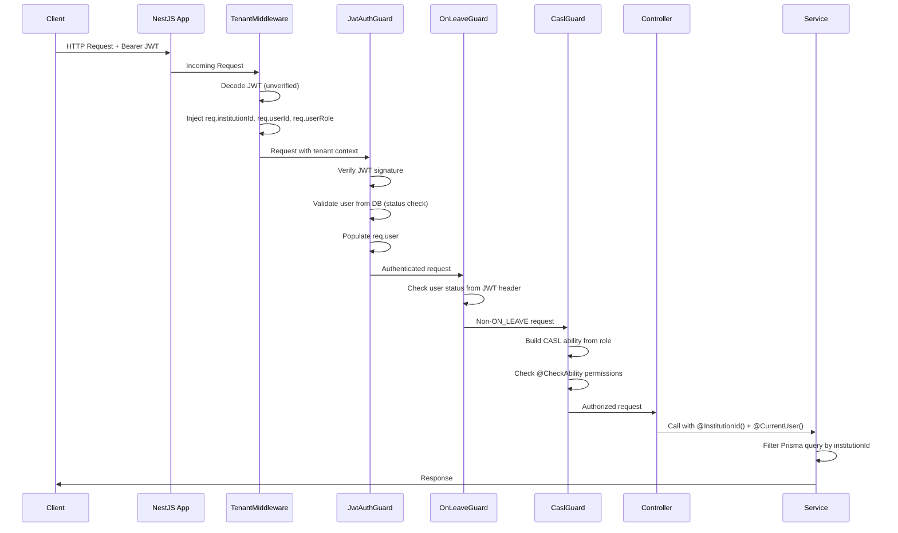
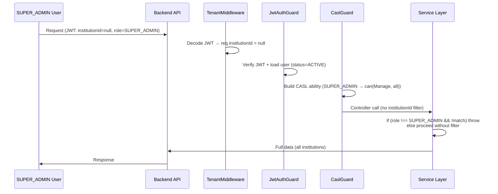
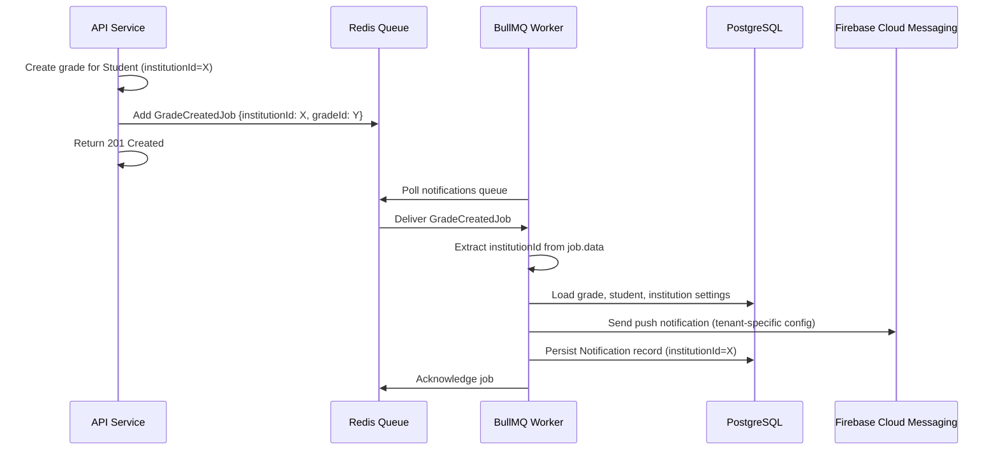
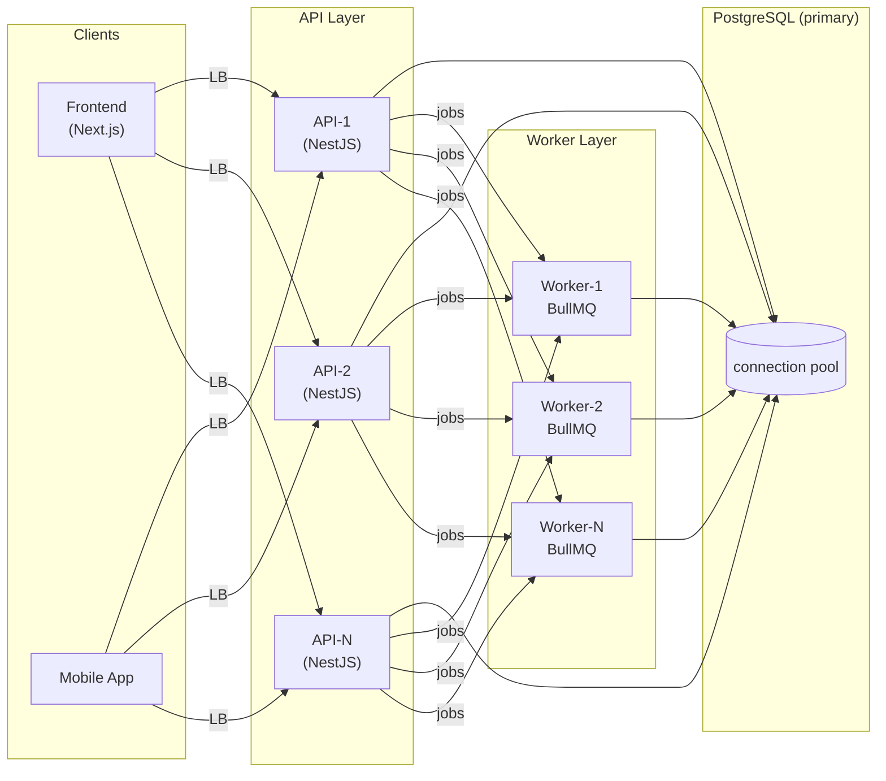

# EduSystem Multi-Tenancy Architecture

> **Version**: 1.0 | **Platform**: EduSystem SaaS Educational Management Platform | **Last updated**: 2026-05-14

---

## Table of Contents

1. [Multi-Tenancy Overview](#1-multi-tenancy-overview)
2. [Tenant Isolation Strategy](#2-tenant-isolation-strategy)
3. [Shared Database Architecture](#3-shared-database-architecture)
4. [Tenant Identification Flow](#4-tenant-identification-flow)
5. [JWT Tenant Propagation](#5-jwt-tenant-propagation)
6. [TenantMiddleware Architecture](#6-tenantmiddleware-architecture)
7. [Request Context Propagation](#7-request-context-propagation)
8. [Tenant-Aware Querying](#8-tenant-aware-querying)
9. [Service Layer Isolation](#9-service-layer-isolation)
10. [Authorization & Tenant Boundaries](#10-authorization--tenant-boundaries)
11. [CASL Integration](#11-casl-integration)
12. [SUPER_ADMIN Behavior](#12-super_admin-behavior)
13. [Tenant-Aware Background Jobs](#13-tenant-aware-background-jobs)
14. [Queue Isolation Considerations](#14-queue-isolation-considerations)
15. [File Storage Isolation](#15-file-storage-isolation)
16. [Soft Delete & Tenant Isolation](#16-soft-delete--tenant-isolation)
17. [Security Considerations](#17-security-considerations)
18. [Common Multi-Tenancy Risks](#18-common-multi-tenancy-risks)
19. [Scalability Considerations](#19-scalability-considerations)
20. [Operational Considerations](#20-operational-considerations)
21. [Testing Strategy](#21-testing-strategy)
22. [Future Multi-Tenant Evolution](#22-future-multi-tenant-evolution)
23. [Architectural Tradeoffs](#23-architectural-tradeoffs)

---

## 1. Multi-Tenancy Overview

### 1.1 Architecture Model

EduSystem implements a **shared-database, shared-schema** multi-tenant architecture. Every tenant (institution) shares the same PostgreSQL database and the same Prisma schema, with isolation enforced at the application layer through the `institutionId` field — a UUID that appears as a foreign key on every tenant-scoped model.

This model is the natural evolution of a product that started as a single-tenant application and grew into a SaaS platform serving multiple educational institutions simultaneously. It balances operational simplicity against the need for strict tenant boundaries, with the application layer serving as the enforcement point rather than the database.

### 1.2 Design Rationale

The shared-database approach was chosen over three alternatives:

| Model | Isolation | Operational Cost | Complexity | EduSystem Decision |
|-------|-----------|-----------------|-----------|-------------------|
| **Shared database, shared schema** | Application layer | Low | Medium | **Chosen** |
| Shared database, separate schemas | Schema level | Medium | Medium | Rejected — adds migration complexity |
| Separate databases per tenant | Database level | High | High | Rejected — operational burden at scale |
| Separate database instances | Instance level | Very high | Very high | Rejected — infeasible for most SaaS |

The shared-database model is appropriate for EduSystem's current scale because:

- **Operational simplicity**: A single database instance to monitor, backup, and tune.
- **Cross-tenant reporting**: SUPER_ADMIN can run analytics across all institutions without federated queries.
- **Atomic cross-tenant operations**: Audit logs and notification jobs can reference any tenant without distributed transaction complexity.
- **Cost efficiency**: All tenants share the same database resources, which is cost-effective at the current volume.

### 1.3 Tenant Definition

A **tenant** in EduSystem is an `Institution` entity. Each institution represents a school with its own staff, students, curriculum structure, and configuration. The institution is the billing unit, the configuration boundary, and the access-control scope.

```prisma
model Institution {
  id       String             @id @default(uuid())
  name     String             @db.VarChar(200)
  domain   String?            @unique @db.VarChar(100)
  plan     PlanType           @default(FREE)
  status   InstitutionStatus @default(TRIAL)
  settings Json?

  users           User[]
  students        Student[]
  courses         Course[]
  announcements   Announcement[]
  convivencias    Convivencia[]
  invitations     Invitation[]
  absenceRecords  AbsenceRecord[]
}
```

### 1.4 Tenant Hierarchy

EduSystem's multi-tenancy operates on top of a role hierarchy that spans both the platform level (`SUPER_ADMIN`) and the tenant level (all other roles):

```typescript
const ROLE_HIERARCHY = ['SUPER_ADMIN', 'ADMIN', 'DIRECTOR', 'SECRETARY', 'PRECEPTOR', 'TEACHER', 'GUARDIAN'] as const;
```

- **Platform level**: `SUPER_ADMIN` operates globally, with no `institutionId` and access to all tenants.
- **Tenant level**: Every other role (`ADMIN` through `GUARDIAN`) is scoped to exactly one institution.

---

## 2. Tenant Isolation Strategy

### 2.1 Enforcement Layers

Tenant isolation in EduSystem is enforced at three layers working in concert:

| Layer | Mechanism | Scope |
|-------|-----------|-------|
| **Layer 1: Application Service Layer** | Every Prisma query includes `where: { institutionId }` | Enforced on all tenant-scoped queries |
| **Layer 2: Authorization Guard (CASL)** | `can(Action.Manage, 'all', { institutionId })` | ABAC rules scoped by tenant context |
| **Layer 3: Database Constraints** | Unique constraints on `[field, institutionId]` pairs | Foreign keys + partial unique indexes |

This defense-in-depth approach ensures that even if one layer is bypassed, the others provide containment.

### 2.2 Isolation by Entity Type

Not all entities in the schema are tenant-scoped. The system distinguishes between three categories:

| Category | Entities | Isolation Mechanism |
|----------|----------|--------------------|
| **Tenant-scoped** | User, Student, Course, Grade, Attendance, Announcement, Convivencia, Justification, Subject, CourseSubject, SchoolYear, Period, Indicator, Syllabus, AbsenceRecord, Invitation, Space | `institutionId` FK + service-layer filtering |
| **Platform-global** | RefreshToken, PushToken, Permission | Linked to User (cascade on delete) |
| **Soft-delete protected** | Institution, User, Student, Announcement | `deletedAt` + Prisma middleware |

### 2.3 Unique Constraints Per Tenant

Every entity that needs uniqueness within a tenant enforces it via a compound unique constraint:

| Entity | Constraint |
|--------|------------|
| User | `@@unique([email, institutionId])` — same email allowed in different tenants |
| Student | `@@unique([institutionId, documentNumber])` |
| Subject | `@@unique([institutionId, code])` |
| Course | `@@unique([institutionId, name, schoolYearId])` |
| SchoolYear | `@@unique([institutionId, year])` |
| Announcement | `@@unique([institutionId, title, schoolYearId])` |
| UserLevelRole | `@@unique([userId, level, role])` |

---

## 3. Shared Database Architecture

### 3.1 Prisma Schema Strategy

The shared-database model maps directly into Prisma's schema design. Every tenant-scoped model includes an `institutionId` field that references the parent `Institution` and is indexed for query performance:

```prisma
model Student {
  id               String    @id @default(uuid())
  institutionId    String    @map("institution_id")
  documentNumber   String    @map("document_number") @db.VarChar(20)
  firstName        String    @map("first_name") @db.VarChar(100)
  lastName         String    @map("last_name") @db.VarChar(100)
  deletedAt        DateTime? @map("deleted_at")

  institution  Institution  @relation(fields: [institutionId], references: [id])
  enrollments  Enrollment[]
  grades       Grade[]
  attendances  Attendance[]
  convivencias Convivencia[]

  @@index([institutionId])
  @@unique([institutionId, documentNumber])
  @@map("students")
}
```

### 3.2 Database Indexing Strategy

Indexes are created strategically to support tenant-scoped queries:

```sql
-- Primary tenant filter index (most queries start here)
CREATE INDEX "students_institutionId_idx" ON "students"("institution_id");

-- Compound index for filtered queries with ordering
CREATE INDEX "announcements_institutionId_createdAt_idx" ON "announcements"("institution_id", "created_at");

-- Partial unique index for SUPER_ADMIN email uniqueness
CREATE UNIQUE INDEX "users_email_partial_super_admin"
  ON "users"("email")
  WHERE "institution_id" IS NULL;
```

The partial unique index on `User.email` for SUPER_ADMIN is a critical constraint: it ensures that at most one SUPER_ADMIN account exists per email across the platform, while allowing any email to be reused across different tenant institutions.

### 3.3 Database Connection Pooling

All API instances and worker instances share the same PostgreSQL connection pool managed by Prisma's built-in connection pooler:

| Setting | Value | Notes |
|---------|-------|-------|
| **Max connections** | 10 (via `?connection_limit=10` in `DATABASE_URL`) | Shared across all API + worker instances |
| **Pool timeout** | 30 seconds | Default Prisma behavior |
| **Connection lifetime** | 30 minutes | Connections recycled to prevent staleness |
| **Worker isolation** | Same pool | Workers share connections with API |

---

## 4. Tenant Identification Flow

### 4.1 Request Lifecycle

Every incoming HTTP request traverses a well-defined sequence of layers that extract, validate, and propagate tenant context:



### 4.2 Two-Phase JWT Processing

EduSystem uses a deliberate two-phase approach for JWT handling that separates **decoding** (reading the payload without verification) from **verification** (cryptographic validation):

**Phase 1 — TenantMiddleware (decode only):**
Runs before authentication guards. Calls `jwtService.decode()` to read the raw payload and extracts tenant context directly from the token — **without** verifying the signature. This is necessary because:
1. `@InstitutionId()` decorator needs `req.institutionId` before controllers execute
2. `OnLeaveGuard` needs to block based on user status before full authentication
3. Some middleware-level logic (e.g., logging, rate limiting by tenant) benefits from early tenant identification

```typescript
// common/middleware/tenant.middleware.ts
const payload = this.jwtService.decode<JwtPayload>(token);
if (payload) {
  req['institutionId'] = payload.institutionId ?? null;
  req['userId'] = payload.sub;
  req['userRole'] = payload.role;
  req['userEmail'] = payload.email;
}
```

**Phase 2 — JwtAuthGuard (verify):**
Standard Passport JWT verification. Loads the user from the database and validates account status (`INACTIVE` and `SUSPENDED` are rejected):

```typescript
// auth/strategies/jwt.strategy.ts
async validate(payload: JwtPayload): Promise<RequestUser> {
  const user = await this.prisma.user.findFirst({
    where: { id: payload.sub, deletedAt: null },
    select: { id, email, role, status, institutionId },
  });
  if (user.status === 'INACTIVE' || user.status === 'SUSPENDED') {
    throw new UnauthorizedException('Tu cuenta está inactiva o suspendida');
  }
  return { id: user.id, email: user.email, role: user.role, institutionId: user.institutionId };
}
```

### 4.3 Public Endpoint Handling

Endpoints marked with `@Public()` skip the authentication chain. `TenantMiddleware` still processes them (decoding any present JWT for logging purposes), but `JwtAuthGuard` does not enforce authentication:

```typescript
// common/decorators/public.decorator.ts
export const Public = () => SetMetadata(IS_PUBLIC_KEY, true);

// auth/guards/jwt-auth.guard.ts — checks metadata before verifying
if (this.reflector.getAllAndOverride<boolean>(IS_PUBLIC_KEY, [context.getHandler(), context.getClass()])) {
  return true; // Allow through without authentication
}
```

Public endpoints include login, password reset, invitation acceptance, and health checks.

---

## 5. JWT Tenant Propagation

### 5.1 JWT Payload Structure

Tenant context is embedded in the JWT at login time and carried with every request:

```typescript
interface JwtPayload {
  sub: string;                       // userId (UUID)
  institutionId: string | null;      // null only for SUPER_ADMIN
  role: Role;                        // highest effective role
  email: string;
  status: UserStatus;                // ACTIVE | INACTIVE | SUSPENDED | ON_LEAVE
  leaveStartDate: string | null;    // ISO date, present when ON_LEAVE
  iat: number;
  exp: number;
}
```

### 5.2 Token Generation

```typescript
// auth/auth.service.ts — login method
const payload: JwtPayload = {
  sub: user.id,
  institutionId: user.institutionId,
  role: user.role,
  email: user.email,
};
const accessToken = this.jwtService.sign(payload);
```

The `institutionId` is set at token generation time based on the authenticated user's `institutionId` from the database. If a user's `institutionId` changes, their new token reflects the new institution. Existing tokens retain the old `institutionId` until they expire. Token TTL (15 minutes) makes this acceptable.

### 5.3 Refresh Token Flow

Refresh tokens are stored in the database (`RefreshToken` model) and linked to the user. A refresh grants a new access token with the same `institutionId` from the stored user record:

```typescript
// auth/auth.service.ts — refresh endpoint
const user = await this.prisma.user.findFirst({
  where: { id: refreshToken.userId, deletedAt: null },
});
const payload: JwtPayload = {
  sub: user.id,
  institutionId: user.institutionId,
  role: user.role,
  email: user.email,
  status: user.status,
  leaveStartDate: user.leaveStartDate?.toISOString() ?? null,
};
return { accessToken: this.jwtService.sign(payload), ... };
```

### 5.4 Frontend Token Handling

```typescript
// frontend/src/lib/auth.ts — NextAuth callbacks
callbacks: {
  async jwt({ token, user }) {
    if (user) Object.assign(token, user);
    return token;
  },
  async session({ session, token }) {
    session.user.id = token.id as string;
    session.user.role = token.role as string;
    session.user.institutionId = token.institutionId as string | null;
    session.user.status = token.status as string;
    session.user.leaveStartDate = token.leaveStartDate as string | null;
    session.accessToken = token.accessToken as string;
    return session;
  },
}
```

The frontend stores `institutionId` in the NextAuth session, accessible to all client components via `useSession()`. The axios interceptor adds the JWT to every request:

```typescript
// frontend/src/lib/api.ts
api.interceptors.request.use(async (config) => {
  const session = await getCachedSession();
  if (session?.accessToken) {
    config.headers.Authorization = `Bearer ${session.accessToken}`;
  }
  // Block mutations if ON_LEAVE
  const status = (session?.user as any)?.status;
  if (status === 'ON_LEAVE' && MUTATING_METHODS.includes(config.method ?? '')) {
    toast.error('Tu cuenta está en licencia...');
    const controller = new AbortController();
    controller.abort();
    config.signal = controller.signal;
  }
  return config;
});
```

---

## 6. TenantMiddleware Architecture

### 6.1 Middleware Implementation

`TenantMiddleware` is a NestJS middleware registered globally in `AppModule`. It intercepts every incoming request before guards or controllers execute:

```typescript
// common/middleware/tenant.middleware.ts
@Injectable()
export class TenantMiddleware implements NestMiddleware {
  constructor(private readonly jwtService: JwtService) {}

  use(req: Request, res: Response, next: NextFunction) {
    const authHeader = req.headers.authorization;
    const token = authHeader?.startsWith('Bearer ') ? authHeader.slice(7) : null;

    if (token) {
      const payload = this.jwtService.decode<JwtPayload>(token);
      if (payload) {
        req['institutionId'] = payload.institutionId ?? null;
        req['userId'] = payload.sub;
        req['userRole'] = payload.role;
        req['userEmail'] = payload.email;
      }
    }

    next();
  }
}
```

### 6.2 Registration

```typescript
// app.module.ts
export class AppModule implements NestModule {
  configure(consumer: MiddlewareConsumer) {
    consumer.apply(TenantMiddleware).forRoutes('*');
  }
}
```

Applied to all routes (`'*'`) for consistent tenant context on every request.

### 6.3 Failure Modes

The middleware is designed to be tolerant of missing or malformed tokens:

| Scenario | Result |
|----------|--------|
| No `Authorization` header | All request fields remain `undefined` |
| Malformed JWT | `decode()` returns `null`, fields remain `null` |
| Valid JWT with null `institutionId` | `req['institutionId']` set to `null` (SUPER_ADMIN) |
| Expired JWT | `decode()` succeeds (reads payload), `verify()` in `JwtAuthGuard` fails |

This graceful degradation means the middleware never blocks requests — it populates context when possible and leaves it empty otherwise. Authentication guards will reject unauthenticated requests downstream.

---

## 7. Request Context Propagation

### 7.1 Decorator Chain

Tenant context flows from the request object to controllers and services via three complementary decorators:

| Decorator | Source | Return Type |
|-----------|--------|-------------|
| `@InstitutionId()` | `req['institutionId']` | `string \| null` |
| `@CurrentUser()` | `req['user']` | `RequestUser` |
| `@Public()` | Metadata flag | `boolean` (guard bypass) |

```typescript
// common/decorators/institution-id.decorator.ts
export const InstitutionId = createParamDecorator(
  (_data: unknown, ctx: ExecutionContext): string => {
    const request = ctx.switchToHttp().getRequest();
    return request['institutionId'];
  },
);

// common/decorators/current-user.decorator.ts
export interface RequestUser {
  id: string;
  institutionId: string | null;
  email: string;
  role: Role;
  status: UserStatus;
  leaveStartDate: string | null;
}
```

### 7.2 Controller Usage Pattern

```typescript
@Controller('students')
@UseGuards(CaslGuard)
export class StudentsController {
  @Get()
  @CheckAbility({ action: Action.Read, subject: Student })
  findAll(@InstitutionId() institutionId: string) {
    return this.studentsService.findAll(institutionId);
  }

  @Post()
  @CheckAbility({ action: Action.Create, subject: Student })
  create(
    @Body() dto: CreateStudentDto,
    @InstitutionId() institutionId: string,
    @CurrentUser() user: RequestUser,
  ) {
    return this.studentsService.create(dto, user, institutionId);
  }
}
```

### 7.3 Service-to-Service Propagation

When a service calls another service, it passes `institutionId` explicitly — there is no thread-local or request-scoped injectable for tenant context:

```typescript
// Inside grades.service.ts
const courseSubject = await this.prisma.courseSubject.findFirst({
  where: { id: dto.courseSubjectId, course: { institutionId } },
});
// If courseSubject exists and belongs to the institution, the query is safe
```

---

## 8. Tenant-Aware Querying

### 8.1 Standard Query Pattern

Every service method that retrieves tenant data filters by `institutionId`:

```typescript
// students.service.ts
async findAll(institutionId: string, params?: FindAllQueryDto) {
  return this.prisma.student.findMany({
    where: {
      institutionId,
      deletedAt: null,
      ...(params.search && {
        OR: [
          { firstName: { contains: params.search, mode: 'insensitive' } },
          { lastName: { contains: params.search, mode: 'insensitive' } },
          { documentNumber: { contains: params.search, mode: 'insensitive' } },
        ],
      }),
    },
    include: { enrollments: { include: { course: true } } },
    orderBy: { lastName: 'asc' },
  });
}
```

### 8.2 Cross-Entity Validation Queries

Before creating or updating data that references another entity, services validate that the referenced entity belongs to the same tenant:

```typescript
// grades.service.ts — validate courseSubject belongs to institution
async create(dto: CreateGradeDto, user: RequestUser, institutionId: string) {
  const courseSubject = await this.prisma.courseSubject.findFirst({
    where: { id: dto.courseSubjectId, course: { institutionId } },
  });
  if (!courseSubject) {
    throw new BadRequestException('La materia no existe o no pertenece a la institución');
  }
}
```

This pattern prevents cross-tenant reference attacks where a malicious actor supplies a `courseSubjectId` from a different institution.

### 8.3 Role-Based Query Modification

Some services modify the query filter based on the caller's role:

```typescript
// grades.service.ts
async findAll(query: FindGradesDto, user: RequestUser, institutionId: string) {
  const where: Prisma.GradeWhereInput = { institutionId, deletedAt: null };

  if (user.role === 'GUARDIAN') {
    const childrenIds = await this.getGuardianChildrenIds(user.id, institutionId);
    where.studentId = { in: childrenIds };
  }

  if (user.role === 'TEACHER') {
    const courseSubjects = await this.prisma.courseSubject.findMany({
      where: { teacherId: user.id },
      select: { id: true },
    });
    where.courseSubjectId = { in: courseSubjects.map((cs) => cs.id) };
  }

  return this.prisma.grade.findMany({ where, ... });
}
```

---

## 9. Service Layer Isolation

### 9.1 Isolation Enforcement Pattern

All tenant-scoped services follow a consistent pattern: `institutionId` is the first-class argument that scopes every database operation:

```typescript
// courses.service.ts
async findAll(institutionId: string, schoolYearId?: string) {
  return this.prisma.course.findMany({
    where: { institutionId, ...(schoolYearId && { schoolYearId }) },
  });
}

async findOne(id: string, user: RequestUser) {
  if (user.role !== 'SUPER_ADMIN') {
    const course = await this.prisma.course.findFirst({
      where: { id, institutionId: user.institutionId },
    });
    if (!course) throw new NotFoundException();
    return course;
  }
  return this.prisma.course.findUnique({ where: { id } });
}
```

### 9.2 Read Operations Matrix

| Service | Tenant Filter | Additional Filters |
|---------|---------------|-------------------|
| `StudentsService.findAll()` | `institutionId` | `deletedAt`, search |
| `StudentsService.findOne()` | `institutionId` | `deletedAt` |
| `CoursesService.findAll()` | `institutionId` | `schoolYearId` |
| `GradesService.findAll()` | `institutionId` | `studentId` (GUARDIAN), role-based |
| `AttendanceService.findAll()` | `institutionId` | `date`, `courseId` |
| `ConvivenciasService.findAll()` | `institutionId` | `deletedAt` |
| `AnnouncementsService.findAll()` | `institutionId` | `schoolYearId`, status |
| `PendingSubjectsService.getIntensificationConfig()` | `institutionId` | settings → pendingSubjects |

### 9.3 Write Operations Matrix

| Service | Validation | Tenant Enforcement |
|---------|-----------|-------------------|
| `StudentsService.create()` | Document uniqueness per institution | `institutionId` from params |
| `CoursesService.create()` | Name uniqueness per institution + year | `institutionId` from params |
| `GradesService.create()` | courseSubject belongs to institution | Join check on `course.institutionId` |
| `AttendanceService.create()` | course belongs to institution | Join check on `course.institutionId` |
| `AnnouncementsService.create()` | Title uniqueness per institution + year | `institutionId` from params |
| `PendingSubjectsService.validateEnabled()` | Config enabled per institution | `institutionId` from params |
| `PendingSubjectsService.validatePeriodEdition()` | Active period + previous period per config | `institutionId` from params + entity match |

---

## 10. Authorization & Tenant Boundaries

### 10.1 Authorization Model

EduSystem's authorization model layers two mechanisms:

1. **Authentication** (`JwtAuthGuard`) — Verifies the requester's identity and tenant membership
2. **Authorization** (`CaslGuard` + `CheckAbility`) — Verifies the requester has permission for the requested action on the requested resource

Tenant boundaries are enforced at both layers: `JwtAuthGuard` rejects unauthenticated requests; `CaslGuard` enforces role-based permissions scoped by tenant context.

### 10.2 Global Guards Configuration

```typescript
// auth/auth.module.ts
providers: [
  { provide: APP_GUARD, useClass: JwtAuthGuard },
]

// app.module.ts
providers: [
  { provide: APP_GUARD, useClass: OnLeaveGuard },
]
```

`JwtAuthGuard` runs first (global, from the auth module). `OnLeaveGuard` runs after (global, from the app module). `CaslGuard` runs per-controller via `@UseGuards(CaslGuard)`.

### 10.3 OnLeaveGuard Behavior

`OnLeaveGuard` reads the JWT directly from the header — it does **not** depend on `request.user` being populated:

```typescript
// common/guards/on-leave.guard.ts
const token = req.headers.authorization?.slice(7);
const payload = this.jwtService.decode<JwtPayload>(token);
if (payload?.status === 'ON_LEAVE' && MUTATING_METHODS.includes(req.method)) {
  throw new ForbiddenException('Tu cuenta está en licencia y no puede realizar modificaciones');
}
```

Exempted paths (no blocking even for ON_LEAVE users):
- `/auth/*` — login endpoints
- `/users/*/password` — password change
- `/users/*/leave` — license management
- `/users/*/restore` — license revocation

---

## 11. CASL Integration

### 11.1 Subject Registry

CASL subjects registered in the factory:

```typescript
// casl/casl-ability.factory.ts
export type AppSubjects =
  'Institution' | 'User' | 'Student' | 'Course' |
  'Grade' | 'Attendance' | 'Announcement' | 'Convivencia' |
  'PendingSubject' | 'all';
```

`PendingSubject` was added to support fine-grained ABAC: TEACHER can create/read/update (no delete) while SECRETARY/PRECEPTOR can only read. GUARDIAN inherits access via `can(Read, 'all')`.

Only entities that need fine-grained ABAC permissions are registered. Administrative entities (Subject, CourseSubject, SchoolYear, etc.) are protected through service-layer role checks rather than CASL.

### 11.2 Role Permission Matrix

| Role | Institution | User | Student | Course | Grade | Attendance | Announcement | Convivencia | PendingSubject |
|------|-------------|------|---------|--------|-------|------------|--------------|-------------|----------------|
| `SUPER_ADMIN` | Manage (all) | Manage (all) | Manage (all) | Manage (all) | Manage (all) | Manage (all) | Manage (all) | Manage (all) | Manage (all) |
| `ADMIN` | Read | Manage | Manage | Manage | Manage | Manage | Manage | Manage | Manage |
| `DIRECTOR` | Read | Manage | Manage | Manage | Manage | Manage | Manage | Manage | Manage |
| `SECRETARY` | — | Read (TEACHER/PRECEPTOR) | Manage | Manage | Read | Read | Manage | Read | Read |
| `PRECEPTOR` | — | — | Read | Read | — | Manage | — | Manage | Read |
| `TEACHER` | — | — | Read | Read | Manage (own) | Manage (own) | — | Read | Create, Read, Update |
| `GUARDIAN` | — | — | Read (own children) | — | Read (own children) | Read (own children) | Read | Read (own children) | — (hereda `Read all`) |

### 11.3 Effective Role Resolution

CASL resolves the **effective role** by comparing the base role with all level-based roles (`UserLevelRole`), returning the highest role in the hierarchy:

```typescript
// casl/casl-ability.factory.ts
const levelRoles = await this.prisma.userLevelRole.findMany({
  where: { userId: user.id },
  select: { role: true },
});
const allRoles = [user.role, ...levelRoles.map((lr) => lr.role)];
const effectiveRole = getHighestRole(allRoles);
```

This means a user can have different effective roles per educational level:

| User | INICIAL | PRIMARIA | SECUNDARIA | Effective |
|------|---------|----------|------------|-----------|
| Ana Martinez | TEACHER | — | TEACHER | TEACHER |
| Juan Lopez | — | PRECEPTOR | PRECEPTOR | PRECEPTOR |
| Maria Garcia | — | DIRECTOR | TEACHER | DIRECTOR (highest) |

### 11.4 CASL Guard Integration

```typescript
@Controller('announcements')
@UseGuards(CaslGuard)
export class AnnouncementsController {
  @Post()
  @CheckAbility({ action: Action.Create, subject: 'Announcement' })
  create(@Body() dto: CreateAnnouncementDto, @InstitutionId() institutionId: string) {
    return this.announcementsService.create(dto, institutionId);
  }

  @Get()
  @CheckAbility({ action: Action.Read, subject: 'Announcement' })
  findAll(@InstitutionId() institutionId: string) {
    return this.announcementsService.findAll(institutionId);
  }
}
```

---

## 12. SUPER_ADMIN Behavior

### 12.1 Identity

`SUPER_ADMIN` is a platform-level role with no `institutionId` (`institutionId = null`). There is no `UserLevelRole` for `SUPER_ADMIN` — it is always the base role.

```prisma
model User {
  id            String     @id @default(uuid())
  institutionId String?    @map("institution_id")  // null for SUPER_ADMIN only
  role          Role       @default(TEACHER)
  email         String     @db.VarChar(255)
  deletedAt     DateTime?
  @@unique([email, institutionId])
}
```

A `SUPER_ADMIN` can exist alongside users of the same email in different institutions because the unique constraint is compound: `@@unique([email, institutionId])`. A partial unique index enforces global email uniqueness for SUPER_ADMIN accounts only.

### 12.2 Bypass Mechanism

`SUPER_ADMIN` bypasses tenant isolation at two levels:

**Service layer:**
```typescript
if (user.role !== 'SUPER_ADMIN' && user.institutionId !== id) {
  throw new ForbiddenException();
}
// SUPER_ADMIN skips institutionId filter entirely
```

**CASL layer:**
```typescript
case 'SUPER_ADMIN': {
  can(Action.Manage, 'all');  // Full access to all subjects + all tenants
  break;
}
```

### 12.3 SUPER_ADMIN Access Flow



### 12.4 Tenant-Blind vs. Tenant-Aware

| Operation | SUPER_ADMIN Behavior |
|-----------|---------------------|
| List all institutions | Returns all (no `institutionId` filter) |
| Manage any institution's users | No `institutionId` filter |
| Create/edit any institution's data | Full access |
| Manage global settings | Full access |

`SUPER_ADMIN` is **tenant-aware** for cross-institution queries (can read/write any tenant by passing the target `institutionId`) but **tenant-blind** for global queries (defaults to no filtering when querying all institutions).

---

## 13. Tenant-Aware Background Jobs

### 13.1 Job Data Structure

Every background job carries `institutionId` explicitly in its data payload, ensuring worker processors have tenant context without needing to decode the original JWT:

```typescript
// grades/grades.service.ts
await this.notificationQueue.add(
  JOBS.GRADE_CREATED,
  {
    gradeId: grade.id,
    studentId: dto.studentId,
    institutionId,  // Explicit tenant context
  },
  JOB_OPTIONS.DEFAULT,
);

await this.auditQueue.add(
  JOBS.AUDIT_LOG,
  {
    institutionId,  // Explicit tenant context
    userId: user.id,
    action: 'CREATE',
    resource: 'Grade',
    resourceId: grade.id,
    after: grade,
  },
  JOB_OPTIONS.CRITICAL,
);
```

### 13.2 Job Payload Examples

| Job | Tenant Data Fields | Processing Context |
|-----|-------------------|-------------------|
| `GradeCreatedJob` | `institutionId`, `gradeId`, `studentId` | Send push notification to guardians |
| `GradeUpdatedJob` | `institutionId`, `gradeId`, `studentId` | Send push notification to guardians |
| `AbsenceRecordCreatedJob` | `institutionId`, `studentId`, `courseId` | Generate absence record + notify |
| `AuditLogJob` | `institutionId`, `userId`, `action`, `resource` | Persist audit entry with tenant context |
| `PdfGenerationJob` | `institutionId`, `studentId`, `reportType` | Generate PDF with tenant branding |

### 13.3 Worker Tenant Propagation



Workers never decode a JWT — they receive tenant context as structured data alongside every job. This means workers can process jobs from any tenant without session context.

---

## 14. Queue Isolation Considerations

### 14.1 Shared Queue Infrastructure

All tenants share the same Redis instance and the same BullMQ queues:

| Queue | Purpose | Isolation |
|-------|---------|-----------|
| `notifications` | Push notifications | `institutionId` in job data |
| `audit-log` | Audit trail persistence | `institutionId` in job data |
| `grade-processing` | Grade processing pipeline | `institutionId` in job data |
| `pdf-generation` | PDF report generation | `institutionId` in job data |

### 14.2 Shared Infrastructure Implications

- **No queue-level tenant isolation** — all jobs from all tenants share the same queues
- **Tenant isolation at the job data level** — each job carries `institutionId`
- **Workers are stateless** — each job contains sufficient context to process independently
- **Retry preserves tenant context** — failed jobs are retried with the same `institutionId`

```typescript
JOB_OPTIONS.DEFAULT   = { attempts: 3, backoff: { type: 'exponential', delay: 2000 } };
JOB_OPTIONS.CRITICAL  = { attempts: 5, backoff: { type: 'exponential', delay: 1000 } };
JOB_OPTIONS.LOW_PRIORITY = { attempts: 2, backoff: { type: 'fixed', delay: 5000 } };
```

### 14.3 Noisy Neighbor Mitigation

Shared queues mean shared rate limits. Mitigations:

- **Worker horizontal scaling**: Scale workers independently to increase throughput
- **Queue priorities**: Consider BullMQ priority queues (0-9) for critical vs. bulk operations
- **Per-tenant throttling** (future): Track job creation rate per `institutionId` and throttle excess producers

---

## 15. File Storage Isolation

### 15.1 MinIO Bucket Strategy

File storage is organized by folder within a shared bucket rather than by separate buckets per tenant:

```typescript
// storage/storage.service.ts
async uploadFile(folder: string, filename: string, buffer: Buffer, mimetype: string): Promise<string> {
  const objectName = `${folder}/${filename}`;
  await this.client.putObject(
    this.bucket,
    objectName,
    buffer,
    buffer.length,
    { 'Content-Type': mimetype },
  );
  return objectName;
}
```

| Folder | Content | Naming |
|--------|---------|--------|
| `logos/` | Institution logos | `uuid.png`, `uuid.svg` |
| `avatars/` | User profile photos | `uuid.jpg`, `uuid.png` |

### 15.2 Access Control via Presigned URLs

Files are not served directly by the backend. Instead, the API generates time-limited presigned URLs that grant access for a specific operation:

```typescript
async getPresignedUrl(objectName: string, operation: 'read' | 'write'): Promise<string> {
  return await this.client.presignedGetObject(this.bucket, objectName, 3600);
}
```

This approach means:
- The backend controls access — MinIO is never exposed publicly
- Each URL is scoped to a single object and expires automatically
- No tenant-specific bucket configuration needed

### 15.3 Future Isolation Enhancement

Consider implementing folder-per-tenant as the platform grows:

```
edusystem/
├── institution-uuid-1/
│   ├── logos/
│   ├── avatars/
│   └── reports/
├── institution-uuid-2/
│   ├── logos/
│   ├── avatars/
│   └── reports/
```

This provides an additional isolation layer at the storage level, preventing accidental cross-tenant access even if the application layer has a bug. Not currently implemented due to added operational complexity.

---

## 16. Soft Delete & Tenant Isolation

### 16.1 Soft Delete Models

Four models support soft delete (`deletedAt: DateTime?`):

| Model | Deletion Trigger | Cascade Behavior |
|-------|-----------------|-----------------|
| `Institution` | SUPER_ADMIN only | Cascade to all tenant entities |
| `User` | ADMIN/DIRECTOR/SECRETARY | Does not cascade |
| `Student` | ADMIN/DIRECTOR/SECRETARY | Does not cascade |
| `Announcement` | ADMIN/DIRECTOR/SECRETARY | Does not cascade |

The Prisma middleware automatically appends `deletedAt: null` to every query on soft-delete models:

```typescript
// prisma/prisma.service.ts — $use middleware
prismaClient.$use(async (params, next) => {
  const SOFT_DELETE_MODELS = ['Institution', 'User', 'Student', 'Announcement'];
  if (SOFT_DELETE_MODELS.includes(params.model) && params.action === 'findFirst') {
    params.args.where = { ...params.args.where, deletedAt: null };
  }
});
```

### 16.2 Tenant + Soft Delete Interaction

When an institution is soft-deleted (`Institution.deletedAt` set), every subsequent query on that institution's entities returns no results — even though the data still exists in the database. This provides a "pause" mechanism without physically deleting data. The `SUPER_ADMIN` can restore a soft-deleted institution by setting `deletedAt = null`.

### 16.3 User-Level Soft Delete

When a user is soft-deleted:
- They can no longer log in (`deletedAt` check in `JwtStrategy`)
- Their `RefreshToken` and `PushToken` records are cascade-deleted
- Their data (name, email) remains in the database for audit trail purposes
- Role-based access is effectively revoked

---

## 17. Security Considerations

### 17.1 Tenant Isolation Threats

| Threat | Mitigation |
|--------|-----------|
| **Tenant ID injection** | `institutionId` comes from JWT, not request body/params |
| **Cross-tenant data access via manipulated IDs** | Service validates entity belongs to `institutionId` before write |
| **Privilege escalation** | CASL enforces role-based permissions at controller level |
| **SUPER_ADMIN impersonation** | Cannot be achieved through API — SUPER_ADMIN is set in DB only |
| **JWT replay attack** | Short TTL (15 min) + refresh token rotation |
| **Cross-tenant notification spam** | `institutionId` validated in notification processor |
| **File access between tenants** | Presigned URLs scoped to specific objects; backend controls access |

### 17.2 JWT Security

| Property | Value | Notes |
|----------|-------|-------|
| **Algorithm** | HS256 (symmetric) | Secret shared between API and workers |
| **Access token TTL** | 15 minutes | Short window limits replay exposure |
| **Refresh token TTL** | 7 days | Token rotation on every refresh |
| **Refresh token storage** | HttpOnly cookie | Not accessible via JavaScript |
| **Token rotation** | Enabled | Old refresh token invalidated on use |

### 17.3 Database Security

| Property | Implementation |
|----------|---------------|
| **Connection encryption** | TLS (`sslmode=require` in `DATABASE_URL`) |
| **Query parameterization** | Prisma's parameterized queries (prevents SQL injection) |
| **Query logging** | Slow queries (>1 second) logged with tenant context |
| **SUPER_ADMIN email uniqueness** | Partial unique index on `users.email` where `institution_id IS NULL` |
| **Password hashing** | bcrypt, cost factor 12 |

### 17.4 Compliance Considerations

| Concern | EduSystem Approach |
|---------|-------------------|
| **Data isolation** | Application-layer enforcement (service filtering) |
| **Audit trail** | AuditLog entries with `institutionId` on all write operations |
| **Data residency** | All data in single PostgreSQL instance (Argentina timezone) |
| **Tenant deletion** | Soft delete preserves data; hard delete by SUPER_ADMIN only |
| **User deletion** | Soft delete + cascade of tokens |
| **Notification logs** | Notification records persisted with `institutionId` in DB |
| **Password storage** | bcrypt, cost factor 12 |

---

## 18. Common Multi-Tenancy Risks

### 18.1 Tenant Leak Prevention

A **tenant leak** occurs when data from one institution is inadvertently exposed to another. EduSystem mitigates this through multiple layers:

| Risk | Scenario | Mitigation |
|------|---------|-----------|
| **Missing `institutionId` filter** | Query returns cross-tenant data | `institutionId` is mandatory parameter; Prisma `$use` middleware not implemented for all models |
| **JOIN missing tenant filter** | `createGrade` with `courseSubjectId` from different tenant | Service validates via JOIN: `courseSubject.course.institutionId === institutionId` |
| **SUPER_ADMIN bypass exposing data** | SUPER_ADMIN accessing unintended tenant | Bypass is explicit: `if (role !== SUPER_ADMIN && !match) throw` — not "return everything" |
| **Cached queries leaking tenant data** | Future caching without `institutionId` in key | Future cache keys must include `institutionId` |
| **Background job failing to propagate context** | Worker processing wrong tenant's job | All jobs typed with `institutionId` as required field; job data is sole source of truth |
| **Bulk operation without tenant filter** | Bulk import ignoring `institutionId` | Bulk import service receives `institutionId` at method level, applies to all rows |

### 18.2 Data Corruption Risks

| Risk | Scenario | Mitigation |
|------|---------|-----------|
| **Cross-tenant reference** | `createGrade` with `courseSubjectId` from different tenant | Join validation: `courseSubject.course.institutionId === institutionId` |
| **Orphaned records** | `institutionId` set to non-existent institution | FK constraint on `institutionId` field |
| **Role privilege escalation** | Admin promoting self to SUPER_ADMIN | Only SUPER_ADMIN can set `SUPER_ADMIN` role |
| **Bulk operation without tenant filter** | Bulk grade import without verifying `institutionId` | `institutionId` at method level, applied to all rows |

### 18.3 Operational Risks

| Risk | Impact | Mitigation |
|------|--------|-----------|
| **Noisy neighbor (queue)** | One tenant generates excessive jobs | Worker horizontal scaling + future per-tenant throttling |
| **Noisy neighbor (DB)** | One tenant runs expensive queries | Connection pooling + slow-query logging |
| **Tenant data bloat** | Growing institutions slow shared DB | Per-tenant archiving + PostgreSQL partitioning |
| **Missed `deletedAt` filter** | Soft-deleted entity still returned | Prisma middleware enforces filter on 4 models |

---

## 19. Scalability Considerations

### 19.1 Horizontal Scaling

EduSystem's architecture supports horizontal scaling at the API and worker layers:



- **API instances**: Stateless, share session via JWT, share DB connection pool. Scale behind a load balancer.
- **Worker instances**: Stateless, process jobs from shared queues. Scale by adding more worker processes.
- **Database**: Single primary. Reads can be offloaded to replicas when read-heavy workloads emerge.

### 19.2 Database Scaling Path

| Strategy | Current | Future Trigger |
|----------|---------|---------------|
| **Connection pooling** | Prisma built-in pooler | PgBouncer for >50 connections |
| **Read replicas** | Not implemented | >1,000 RPS on read endpoints |
| **Table partitioning** | Not implemented | >500 GB total DB size |
| **Per-tenant archiving** | Not implemented | Institutions with >10,000 students |

### 19.3 When to Migrate to Isolated Databases

| Metric | Shared DB Threshold | Recommendation |
|--------|--------------------|----------------|
| **Institutions** | >500 active | Evaluate tenant isolation |
| **Total students** | >100,000 | Consider read replicas |
| **Concurrent API requests** | >1,000 RPS | Consider API horizontal scaling + caching |
| **DB size** | >500 GB | Consider archiving + partitioning |
| **Noisy neighbor impact** | Measurable latency degradation | Consider per-tenant connection limits |

Migration path from shared database to isolated databases:
1. Data export per tenant
2. Provision isolated database per tenant
3. Update application to route queries to tenant-specific connection
4. Implement cross-tenant reporting via federated queries or data warehouse

---

## 20. Operational Considerations

### 20.1 Tenant Observability

Each log entry should include `institutionId` when available, enabling cross-tenant log filtering:

```typescript
// Logging with tenant context
this.logger.log(`Grade created: ${grade.id}`, req['institutionId']);
```

Recommended structured log fields:
```json
{
  "level": "info",
  "message": "Grade upserted",
  "userId": "uuid",
  "institutionId": "uuid",
  "action": "CREATE",
  "duration_ms": 45
}
```

### 20.2 Monitoring Per Tenant

| Metric | Purpose | Alert Threshold |
|--------|---------|----------------|
| **DB queries per institution** | Detect unusual activity | >10× baseline |
| **Queue job backlog** | Detect processing delays | >100 pending jobs |
| **Failed job rate** | Detect systematic failures | >5% failure rate |
| **Slow query count** | Detect expensive tenant queries | >10 slow queries/hour |
| **ON_LEAVE users** | License management | >2 concurrent ON_LEAVE |

### 20.3 Backup and Restore

| Operation | Strategy | RPO |
|-----------|---------|-----|
| **Full backup** | pg_dump of entire shared database | Daily |
| **Point-in-time recovery** | PostgreSQL WAL archiving | 15-minute WAL intervals |
| **Tenant-specific restore** | Not currently supported | Would require full DB restore |

A tenant-specific restore is not possible because all tenants share a single database. Full database restore would overwrite all tenants. This is a trade-off of the shared-database model.

### 20.4 Tenant Lifecycle Management

| Event | Automated Action | Manual Action |
|-------|----------------|--------------|
| **Trial expiration** | Alert SUPER_ADMIN 7 days before | SUPER_ADMIN converts to paid plan |
| **ON_LEAVE license grant** | User status → ON_LEAVE | ADMIN/DIRECTOR/SECRETARY approval |
| **ON_LEAVE license revoke** | User status → ACTIVE | ADMIN/DIRECTOR/SECRETARY approval |
| **Institution soft delete** | All queries return empty | SUPER_ADMIN restore |
| **Institution hard delete** | — | SUPER_ADMIN only |

---

## 21. Testing Strategy

### 21.1 Tenant Isolation in Tests

Test files must simulate multi-tenant scenarios using factory patterns that create data within a specific tenant context:

```typescript
describe('StudentsService', () => {
  const tenantA = { id: 'uuid-a', name: 'Institution A' };
  const tenantB = { id: 'uuid-b', name: 'Institution B' };

  beforeEach(async () => {
    await prismaService.institution.create({ data: tenantA });
    await prismaService.institution.create({ data: tenantB });
  });

  it('should only return students for the requesting tenant', async () => {
    await prismaService.student.create({ data: { ...student1, institutionId: tenantA.id } });
    await prismaService.student.create({ data: { ...student2, institutionId: tenantB.id } });

    const result = await service.findAll(tenantA.id);
    expect(result.every(s => s.institutionId === tenantA.id)).toBe(true);
    expect(result.length).toBe(1);
  });

  it('should reject cross-tenant courseSubject reference', async () => {
    const crossTenantCourseSubjectId = tenantBCourseSubject.id;
    await expect(
      service.create({ courseSubjectId: crossTenantCourseSubjectId, ... }, tenantA.id)
    ).rejects.toThrow(BadRequestException);
  });
});
```

### 21.2 Test Categories

| Category | Coverage Target |
|----------|----------------|
| **Service unit tests** | Every service method tested with multiple tenants |
| **Cross-tenant attack tests** | Attempt to access/modify resources from different tenant |
| **SUPER_ADMIN bypass tests** | Verify SUPER_ADMIN can access any tenant's data |
| **Role-filter tests** | Verify GUARDIAN sees only own children, TEACHER sees only own subjects |
| **Queue job tests** | Verify `institutionId` is present and correct in all job data |
| **Soft delete tests** | Verify soft-deleted tenant's data is inaccessible |
| **E2E tests** | Authenticated requests per tenant; assert no cross-tenant data leakage |

### 21.3 Fixture Factory Pattern

```typescript
const createStudentFixture = (institutionId: string, overrides?: Partial<Student>) => ({
  id: faker.string.uuid(),
  institutionId,  // Mandatory — no default allowed
  firstName: faker.person.firstName(),
  lastName: faker.person.lastName(),
  documentNumber: faker.string.numeric(8),
  ...overrides,
});
```

The factory enforces `institutionId` as a mandatory parameter, preventing accidental cross-tenant data creation in tests.

---

## 22. Future Multi-Tenant Evolution

### 22.1 Near-Term Enhancements

| Enhancement | Description | Priority |
|------------|-------------|---------|
| **Per-tenant rate limiting** | Track request/job rate per `institutionId` in Redis | Medium |
| **Per-tenant caching** | Add Redis cache with `institutionId` in key prefix | Medium |
| **Row-Level Security (RLS)** | PostgreSQL RLS as defense-in-depth layer | Medium |
| **Cross-tenant analytics** | SUPER_ADMIN dashboard with aggregated metrics | Low |
| **Tenant resource quotas** | Limits on students, users, storage per plan tier | Medium |

### 22.2 Row-Level Security (RLS) as Defense-in-Depth

PostgreSQL RLS can serve as an additional isolation layer, preventing accidental data leaks even if the application layer has bugs:

```sql
-- Enable RLS on shared tenant tables
ALTER TABLE "students" ENABLE ROW LEVEL SECURITY;

-- Policy: users can only see rows matching their institution context
CREATE POLICY tenant_isolation ON "students"
  USING (institution_id = current_setting('app.institution_id', true));

-- Application sets tenant context before each connection
SET app.institution_id = 'uuid-of-current-tenant';
```

Prisma does not natively support RLS. Implementation would require running queries with a Prisma connection that has `SET app.institution_id = X`, which adds connection count per tenant.

### 22.3 Migration Phases

```
Phase 1: Shared DB + RLS (defense-in-depth, no schema change)
    ↓
Phase 2: Separate schemas per tenant (same DB instance, different search_path)
    ↓
Phase 3: Separate database instances per tenant (full isolation, highest cost)
```

### 22.4 Tenant-Level Feature Flags

```typescript
// Institution.settings
{
  "features": {
    "convivencias": true,
    "syllabus": true,
    "pdfReports": true,
    "mobileApp": false,
    "analytics": false
  }
}
```

Feature flags enable progressive rollout, A/B testing, and plan-tier restrictions without code deployment.

---

## 23. Architectural Tradeoffs

### 23.1 Shared-Database Tradeoffs

| Tradeoff | Acceptable Because |
|----------|--------------------|
| **Single point of failure** | PostgreSQL primary-standby with WAL archiving provides reliable recovery. All tenants affected equally. |
| **No tenant-specific DB restore** | DR plan accepts full DB restore. Use case does not require per-tenant point-in-time recovery. |
| **Shared connection pool saturation** | Current scale (<100 concurrent connections) is well within PostgreSQL limits. |
| **Tenant noise impact** | All tenants share DB resources. Monitoring + future throttling mitigate noisy neighbor risk. |

### 23.2 Application-Layer Isolation Tradeoffs

| Tradeoff | Acceptable Because |
|----------|--------------------|
| **No hardware-level isolation** | Multiple enforcement layers (service + CASL + DB constraints) reduce risk. Code review and automated testing provide additional confidence. |
| **Prisma middleware overhead** | `$use` middleware adds a function call per Prisma operation. Overhead is negligible (<1ms). Soft-delete models are limited to 4 entities. |
| **Async audit log** | Audit entries persisted via BullMQ (at-least-once delivery). In extreme failure scenarios (Redis + worker both crash), a small number of entries could be lost. Acceptable for most cases. |
| **No RLS** | PostgreSQL RLS is not enforced — application is the only isolation layer. Consider adding RLS as a future defense-in-depth measure. |

### 23.3 CASL Tradeoffs

| Tradeoff | Acceptable Because |
|----------|--------------------|
| **`SUPER_ADMIN` manages all** | `can(Action.Manage, 'all')` grants unlimited access. Appropriate for platform administrators. |
| **`all` subject in CASL** | Granting `Manage` on `all` bypasses per-subject CASL checks. Appropriate for platform-level roles. |
| **`UserLevelRole` complexity** | Multi-role-per-level feature adds complexity to role resolution. Benefit (granular permissions per educational level) justifies the cost. |
| **No resource-level CASL policies** | CASL checks action + subject, not specific entity instance. Entity-level authorization handled at service layer with `institutionId` checks. |

### 23.4 Queue Worker Tradeoffs

| Tradeoff | Acceptable Because |
|----------|--------------------|
| **Shared Redis** | All tenants share the same Redis instance. Redis AOF + replica provides redundancy. |
| **No per-tenant queue priority** | No priority differentiation between tenants. Future BullMQ priority queues can address this. |
| **Workers stateless** | Workers have no session context. All tenant context passed explicitly in job data. By design, requires discipline in job data schema. |

---

## Appendix A: Tenant-Aware Entity Reference

| Entity | `institutionId` | Soft Delete | Unique Constraint | CASL Subject |
|--------|----------------|-------------|-------------------|-------------|
| `Institution` | — (root) | Yes | `domain` | Yes |
| `User` | Yes (nullable) | Yes | `[email, institutionId]` | Yes |
| `Student` | Yes | Yes | `[institutionId, documentNumber]` | Yes |
| `Course` | Yes | No | `[institutionId, name, schoolYearId]` | Yes |
| `Grade` | Yes | No | `[studentId, courseSubjectId, periodId, type, date]` | Yes |
| `Attendance` | Yes | No | `[studentId, courseSubjectId, date]` | Yes |
| `Announcement` | Yes | Yes | `[institutionId, title, schoolYearId]` | Yes |
| `Convivencia` | Yes | No | — | Yes |
| `Subject` | Yes | No | `[institutionId, code]` | No |
| `CourseSubject` | Yes (via Course) | No | — | No |
| `SchoolYear` | Yes | No | `[institutionId, year]` | No |
| `Period` | Yes | No | — | No |
| `Enrollment` | Yes (via Course/Student) | No | `[studentId, courseId]` | No |
| `Indicator` | Yes | No | `[subjectId, schoolYearId, grade]` | No |
| `Syllabus` | Yes | No | — | No |
| `Justification` | Yes | No | `[attendanceId]` | No |
| `AbsenceRecord` | Yes | No | — | No |
| `Invitation` | Yes | No | `[token]` | No |
| `Space` | Yes | No | `[institutionId, name]` | No |
| `PendingSubject` | Yes | No | `[studentId, subjectId, schoolYearId]` | Yes · [docs](./modules/pending-subjects.md) |
| `AuditLog` | Yes | No | — | No |
| `Notification` | Yes | No | — | No |
| `RefreshToken` | No (user-scoped) | No | `[token]` | No |
| `PushToken` | No (user-scoped) | No | — | No |
| `UserLevelRole` | No (user-scoped) | No | `[userId, level, role]` | No |

## Appendix B: Tenant Propagation Responsibility Map

| Component | Responsibility | Mechanism |
|-----------|---------------|-----------|
| `TenantMiddleware` | Extract tenant from JWT | `jwtService.decode()`, inject `req.institutionId` |
| `JwtAuthGuard` | Verify identity + load user | Passport JWT strategy, DB status check |
| `OnLeaveGuard` | Block mutations for ON_LEAVE | Decode JWT from header, check `status` field |
| `CaslGuard` | Enforce ABAC permissions | Build ability from role, check `@CheckAbility` |
| `@InstitutionId()` | Provide tenant to controller | Read `req.institutionId` |
| `@CurrentUser()` | Provide user to controller | Read `req.user` |
| Controller | Pass tenant to service | Call service methods with `institutionId` |
| Service | Enforce isolation at query level | Every Prisma query includes `where: { institutionId }` |
| Notification processors | Resolve recipients per tenant | Load users by `institutionId` from job data |
| Audit processors | Tag records per tenant | `institutionId` from job data |
| PDF generators | Apply tenant branding | `institutionId` from job data |
| `SUPER_ADMIN` | Bypass isolation | Explicit role checks + CASL `can(Manage, all)` |

## Appendix C: Glossary

| Term | Definition |
|------|------------|
| **Tenant** | An `Institution` entity representing a school in the platform |
| **Tenant leak** | A bug that exposes data from one institution to another |
| **Tenant isolation** | The guarantee that one institution cannot access another's data |
| **SUPER_ADMIN** | Platform-level role with no `institutionId`, full cross-tenant access |
| **UserLevelRole** | Per-educational-level role assignment (`INICIAL`, `PRIMARIA`, `SECUNDARIA`) |
| **Effective role** | The highest role in the hierarchy across all level-based roles |
| **TenantMiddleware** | NestJS middleware that extracts tenant context from JWT before authentication |
| **Soft delete** | Marking a record as deleted by setting `deletedAt` rather than physically removing it |
| **RBAC** | Role-Based Access Control — permission model using static roles |
| **ABAC** | Attribute-Based Access Control — CASL's permission model using subjects and actions |
| **Noisy neighbor** | A tenant whose heavy usage degrades shared infrastructure for other tenants |
| **RLS** | Row-Level Security — PostgreSQL feature for database-level tenant isolation |