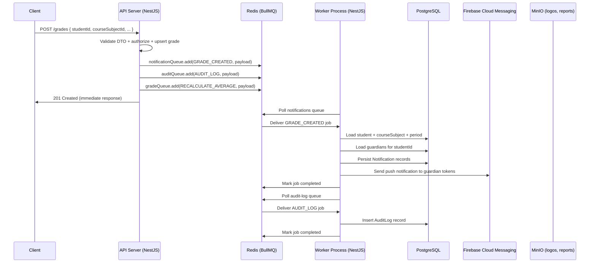
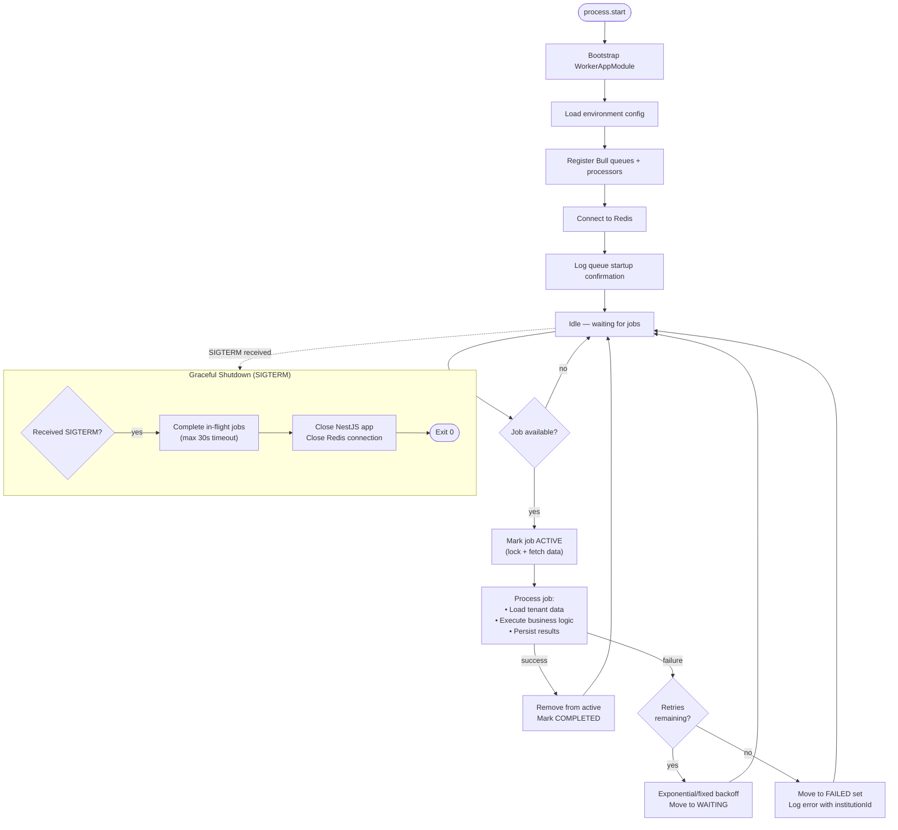
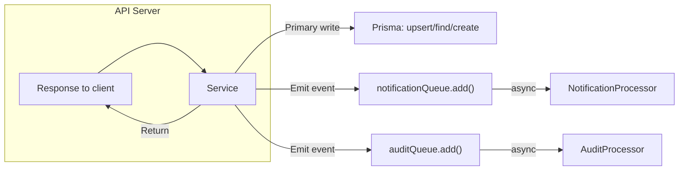
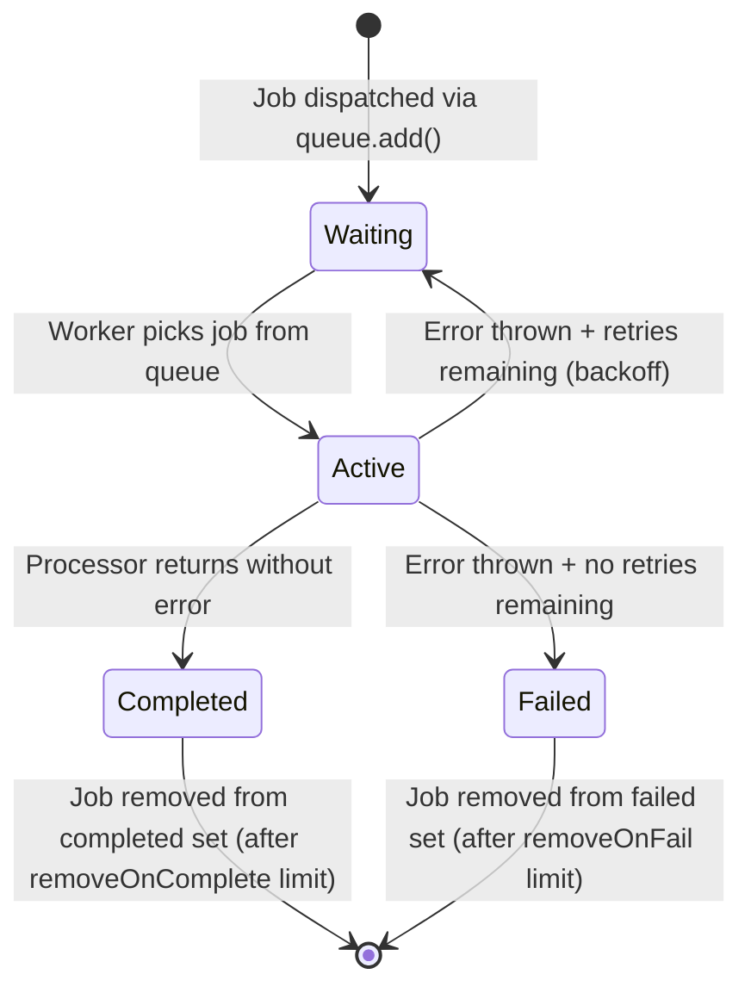
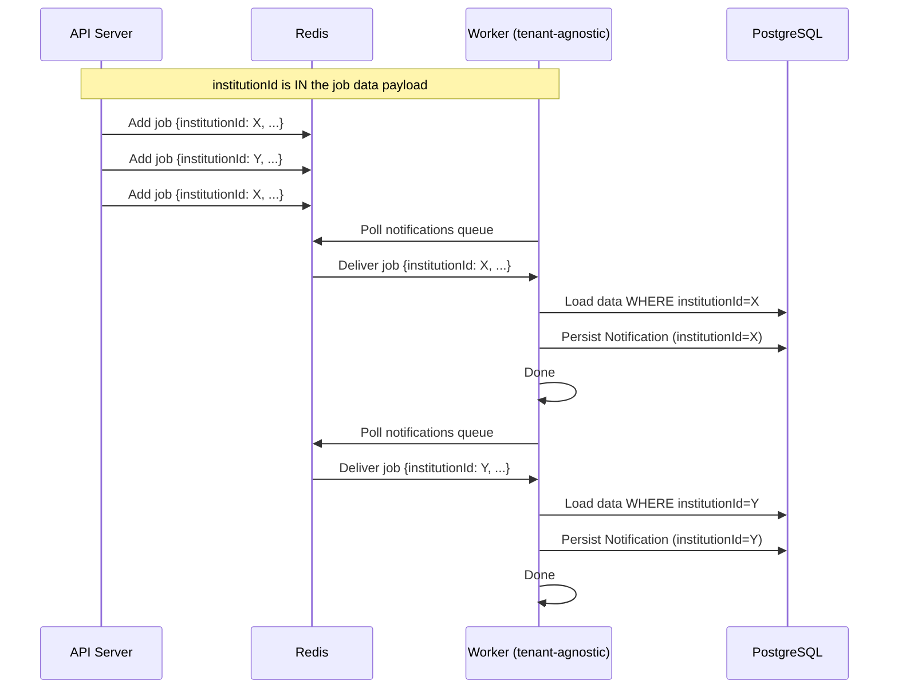

# EduSystem Background Processing Architecture

> **Version**: 1.0 | **Platform**: EduSystem SaaS Educational Management Platform | **Last updated**: 2026-05-14

---

## Table of Contents

1. [Background Processing Overview](#1-background-processing-overview)
2. [BullMQ Architecture](#2-bullmq-architecture)
3. [Queue Topology](#3-queue-topology)
4. [Worker Runtime Architecture](#4-worker-runtime-architecture)
5. [WorkerAppModule Design](#5-workerappmodule-design)
6. [Queue Registration Strategy](#6-queue-registration-strategy)
7. [Redis Integration](#7-redis-integration)
8. [Notification Processing Flow](#8-notification-processing-flow)
9. [Audit Processing Flow](#9-audit-processing-flow)
10. [Grade Processing Flow](#10-grade-processing-flow)
11. [Event-Driven Workflows](#11-event-driven-workflows)
12. [Job Lifecycle](#12-job-lifecycle)
13. [Retry Strategy](#13-retry-strategy)
14. [Failure Handling](#14-failure-handling)
15. [Dead Letter Queue Considerations](#15-dead-letter-queue-considerations)
16. [Idempotency Considerations](#16-idempotency-considerations)
17. [Tenant-Aware Job Processing](#17-tenant-aware-job-processing)
18. [Queue Scalability](#18-queue-scalability)
19. [Horizontal Worker Scaling](#19-horizontal-worker-scaling)
20. [Concurrency Strategy](#20-concurrency-strategy)
21. [Performance Considerations](#21-performance-considerations)
22. [Monitoring & Observability](#22-monitoring--observability)
23. [Logging Strategy](#23-logging-strategy)
24. [Operational Considerations](#24-operational-considerations)
25. [Security Considerations](#25-security-considerations)
26. [Future Evolution Recommendations](#26-future-evolution-recommendations)

---

## 1. Background Processing Overview

### 1.1 Design Rationale

EduSystem offloads non-latency-critical operations to background workers to keep API response times low and predictable. Every time a teacher records a grade, a parent records an absence, or a director publishes an announcement, a set of async tasks must execute — sending push notifications, persisting audit logs, recalculating averages, generating PDFs — tasks that do not need to block the HTTP response.

Without background processing, these operations would either:

- **Block synchronously**: Degrade API response times for every client
- **Be omitted**: Skip notifications or audit logs under load
- **Time out**: Bulk operations (PDF generation with Puppeteer) would exceed request timeouts

### 1.2 Operations That Run in Background

| Operation | Trigger | Why Background |
|-----------|---------|---------------|
| Push notifications (grades) | Grade create/update | FCM is external, non-deterministic latency |
| Push notifications (attendance) | Attendance marked ABSENT | FCM is external, non-deterministic latency |
| Push notifications (announcements) | Announcement publish | Batch notify all course guardians |
| Audit log persistence | Every write operation | Must not block the request; async is acceptable |
| Grade average recalculation | Grade create/update | Non-critical computation; can be deferred |
| PDF report generation | Report download request | Puppeteer has 30+ second startup; must not block |

### 1.3 Dual-Mode Architecture

The backend supports two runtime modes controlled by the `APP_MODE` environment variable:

| Mode | Command | Purpose |
|------|---------|---------|
| `api` | `npm run start:dev` | HTTP API server with controllers, guards, middleware |
| `worker` | `APP_MODE=worker npm run start:dev` | Isolated process for BullMQ job processing only |

This separation ensures that worker crashes do not affect API availability and vice versa. Workers and API instances share the same codebase and Prisma schema but load different NestJS module sets.

---

## 2. BullMQ Architecture

### 2.1 Why BullMQ

BullMQ was chosen over alternative background processing solutions for the following reasons:

| Criterion | BullMQ | Alternative |
|-----------|--------|------------|
| **Redis-native** | First-class Redis support | Kafka: requires ZooKeeper; RabbitMQ: separate infra |
| **NestJS integration** | `@nestjs/bull` first-party module | Kafka: requires custom wrapper |
| **Job persistence** | Redis AOF for durability | RabbitMQ: durable queues; Kafka: persistent logs |
| **Retry semantics** | Built-in exponential/fixed backoff | Kafka: manual consumer group logic |
| **Delayed jobs** | Native support via `delay` option | Kafka: produce with timestamp header |
| **Priority queues** | Native support (0-9) | Kafka: separate partitions per priority |
| **Operational footprint** | Single Redis instance (already used for sessions) | Kafka: 3+ broker minimum; RabbitMQ: Erlang runtime |
| **TypeScript support** | Full typing via `@nestjs/bull` | Kafka: kafka-js partial; RabbitMQ: amqplibtodolist |

The single-tenant nature of EduSystem's current scale makes BullMQ a pragmatic choice. Kafka would be the correct choice at 10× or 100× scale where job throughput exceeds 10,000 jobs/minute and per-tenant isolation requirements are stricter.

### 2.2 BullMQ Components

```
┌──────────────────────────────────────────────────────────┐
│                        Redis                              │
│  ┌────────────────────────────────────────────────────┐  │
│  │  BullMQ Metadata (Sorted Sets + Hashes)             │  │
│  │  • Job state: waiting, active, completed, failed     │  │
│  │  • Job data payloads                                 │  │
│  │  • Retry counts and timestamps                      │  │
│  └────────────────────────────────────────────────────┘  │
│  ┌────────────────────────────────────────────────────┐  │
│  │  AOF Persistence Log                               │  │
│  │  Append-only file for crash recovery                │  │
│  └────────────────────────────────────────────────────┘  │
└──────────────────────────────────────────────────────────┘
           │                           │
           │                           │
    ┌──────▼───────┐           ┌──────▼───────┐
    │   API Mode    │           │  Worker Mode │
    │ (Producer)    │           │ (Consumer)  │
    └───────────────┘           └──────────────┘
```

- **Jobs** are stored as Redis hashes (serialized JSON in the `data` field)
- **Queues** are Redis sorted sets keyed by score (= scheduled timestamp)
- **Job state transitions** are tracked in Redis sorted sets: `waiting`, `active`, `completed`, `failed`
- **AOF persistence** ensures jobs survive Redis restarts (fsync every second)

### 2.3 BullMQ vs. Kafka Tradeoff Summary

| Aspect | BullMQ (Current) | Kafka (Future) |
|--------|-----------------|----------------|
| **Setup complexity** | Low (uses existing Redis) | High (3+ brokers, ZooKeeper KRaft) |
| **Message retention** | Until job completes/fails (configurable) | Configurable retention period |
| **Exactly-once semantics** | At-least-once (with idempotency) | Exactly-once via transactional outbox |
| **Scaling model** | Vertical (more workers on same queue) | Horizontal (partitions per topic) |
| **Replaying events** | Limited (BullMQ keeps recent history) | Full event replay from retention window |
| **Monitoring** | BullBoard UI | Kafka UI / CMAF |
| **Best for** | Job queues (discrete tasks) | Event streaming (high-throughput pipelines) |

---

## 3. Queue Topology

### 3.1 Queue Definitions

```typescript
// queues/queue.constants.ts
export const QUEUES = {
  NOTIFICATIONS:  'notifications',
  AUDIT:          'audit-log',
  GRADES:         'grade-processing',
  PDF:            'pdf-generation',
} as const;

export const JOBS = {
  GRADE_CREATED:          'grade.created',
  ATTENDANCE_RECORDED:    'attendance.recorded',
  ANNOUNCEMENT_PUBLISHED: 'announcement.published',
  AUDIT_LOG:              'audit.log',
  RECALCULATE_AVERAGE:    'grade.recalculate-average',
  GENERATE_REPORT:        'pdf.generate-report',
} as const;
```

### 3.2 Queue Purpose Matrix

| Queue | Purpose | Consumer | Isolation |
|-------|---------|----------|-----------|
| `notifications` | FCM push + in-app notifications for grades, attendance, announcements | `NotificationProcessor` | `institutionId` in job data |
| `audit-log` | Persistent audit trail for all write operations | `AuditProcessor` | `institutionId` in job data |
| `grade-processing` | Grade average recalculation | `GradeProcessor` | `studentId` in job data |
| `pdf-generation` | PDF report generation (defined but not yet wired) | — | Not implemented |

### 3.3 Job Data Schemas

```typescript
// Grade created notification
interface GradeCreatedPayload {
  gradeId:       string;
  studentId:     string;
  institutionId: string;
}

// Attendance recorded (ABSENT only)
interface AttendanceRecordedPayload {
  studentId:    string;
  courseId:     string;
  date:          string;
  status:        'PRESENT' | 'ABSENT' | 'JUSTIFIED';
  institutionId: string;
}

// Announcement published
interface AnnouncementPublishedPayload {
  announcementId: string;
  institutionId:  string;
}

// Audit log entry
interface AuditLogPayload {
  institutionId: string;
  userId:        string;
  action:        'CREATE' | 'UPDATE' | 'DELETE' | 'LOGIN' | 'LOGOUT' | 'EXPORT';
  resource:      string;
  resourceId:    string;
  before?:       object;
  after?:        object;
  ipAddress?:    string;
  userAgent?:    string;
}

// Grade average recalculation
interface RecalculateAveragePayload {
  studentId: string;
  periodId:  string;
}

// PDF report generation
interface PdfGeneratePayload {
  institutionId: string;
  studentIds:    string[];
  reportType:    string;
  options?:      Record<string, unknown>;
}
```

---

## 4. Worker Runtime Architecture

### 4.1 API → Queue → Worker Flow



### 4.2 Worker Runtime Lifecycle



### 4.3 Graceful Shutdown

```typescript
// main.ts — worker mode
if (mode === 'worker') {
  const app = await NestFactory.create(WorkerAppModule, { bufferLogs: true });
  await app.init();
  logger.log('Worker BullMQ iniciado');

  process.on('SIGTERM', async () => {
    logger.log('Worker deteniendo...');
    await app.close();  // BullMQ drains active jobs before exiting
  });
  return;
}
```

BullMQ automatically prevents new jobs from being assigned to this worker during shutdown and waits for in-flight jobs to complete (up to a configurable timeout, default 30 seconds).

---

## 5. WorkerAppModule Design

### 5.1 Module vs. App Module

`WorkerAppModule` is a stripped-down NestJS module that excludes all HTTP-related components:

| Module | API Mode | Worker Mode | Reason Excluded |
|--------|----------|-------------|-----------------|
| `AppConfigModule` | Yes | Yes | Environment config is shared |
| `PrismaModule` | Yes | Yes | Database access is shared |
| `QueuesModule` | Yes | Yes | Queue definitions |
| `WorkersModule` | No | Yes | Processors only needed in worker |
| `NotificationsModule` | Yes | Yes | FCM service |
| `AuthModule` | Yes | No | No HTTP authentication in workers |
| `HealthModule` | Yes | No | No HTTP health endpoint in workers |
| All Feature Modules | Yes | No | No API controllers or guards |

### 5.2 Module Definition

```typescript
// worker-app.module.ts
@Module({
  imports: [
    AppConfigModule,
    PrismaModule,
    QueuesModule,
    WorkersModule,
    NotificationsModule,
  ],
})
export class WorkerAppModule {}
```

### 5.3 WorkersModule

```typescript
// queues/workers.module.ts
@Module({
  imports: [
    BullModule.registerQueue(
      { name: QUEUES.NOTIFICATIONS },
      { name: QUEUES.AUDIT },
      { name: QUEUES.GRADES },
    ),
  ],
  providers: [
    NotificationProcessor,
    AuditProcessor,
    GradeProcessor,
    FcmService,
  ],
})
export class WorkersModule {}
```

### 5.4 Why This Separation Exists

| Reason | Explanation |
|--------|-------------|
| **Memory footprint** | Workers load only the modules they need, reducing memory usage per instance |
| **Startup time** | Worker starts faster (skips all HTTP controller initialization) |
| **Security surface** | Workers don't expose any HTTP endpoints |
| **Crash isolation** | A worker crash doesn't affect API availability |
| **Independent scaling** | Workers can be scaled horizontally without coupling to API pods |
| **Shared codebase** | Both modes use the same Prisma schema, services, and business logic |

---

## 6. Queue Registration Strategy

### 6.1 Global BullMQ Configuration

```typescript
// queues/queues.module.ts
BullModule.forRootAsync({
  inject: [ConfigService],
  useFactory: (config: ConfigService<EnvConfig>) => ({
    redis: {
      host:     config.get('REDIS_HOST'),
      port:     config.get('REDIS_PORT'),
      password: config.get('REDIS_PASSWORD') || undefined,
    },
    defaultJobOptions: {
      attempts: 3,
      backoff: { type: 'exponential', delay: 2000 },
      removeOnComplete: 100,
      removeOnFail: 200,
    },
  }),
}),
```

### 6.2 Environment-Driven Configuration

Queue names are defined as constants but can be overridden via environment variables:

```typescript
// env.schema.ts
BULL_QUEUE_NOTIFICATIONS: z.string().default('notifications'),
BULL_QUEUE_AUDIT:         z.string().default('audit-log'),
BULL_QUEUE_GRADES:         z.string().default('grade-processing'),
BULL_QUEUE_PDF:            z.string().default('pdf-generation'),
```

This enables:
- Different queue names per environment (dev/staging/prod)
- Queue name migration without code changes
- Parallel queues during deployments

### 6.3 Job Dispatching Pattern

Services inject queues via `@InjectQueue()` decorator and dispatch jobs with typed payloads:

```typescript
constructor(
  @InjectQueue(QUEUES.NOTIFICATIONS) private readonly notificationQueue: Queue,
  @InjectQueue(QUEUES.AUDIT)         private readonly auditQueue: Queue,
  @InjectQueue(QUEUES.GRADES)        private readonly gradeQueue: Queue,
) {}

async create(dto: CreateGradeDto, user: RequestUser, institutionId: string) {
  const grade = await this.prisma.grade.upsert({ ... });

  await Promise.all([
    this.notificationQueue.add(JOBS.GRADE_CREATED, {
      gradeId: grade.id, studentId: dto.studentId, institutionId,
    }, JOB_OPTIONS.DEFAULT),

    this.auditQueue.add(JOBS.AUDIT_LOG, {
      institutionId, userId: user.id, action: 'CREATE',
      resource: 'Grade', resourceId: grade.id, after: grade,
    }, JOB_OPTIONS.CRITICAL),

    this.gradeQueue.add(JOBS.RECALCULATE_AVERAGE, {
      studentId: dto.studentId, periodId: dto.periodId,
    }, JOB_OPTIONS.DEFAULT),
  ]);

  return grade;
}
```

---

## 7. Redis Integration

### 7.1 Redis Configuration

```yaml
# docker-compose.yml
redis:
  image: redis:7-alpine
  command: >
    redis-server
    --appendonly yes          # AOF persistence
    --appendfsync everysec    # Persist every 1 second
    --maxmemory 256mb         # 256 MB limit
    --maxmemory-policy noeviction
  ports:
    - '${REDIS_PORT:-6379}:6379'
  volumes:
    - redis_data:/data
  healthcheck:
    test: ['CMD', 'redis-cli', 'ping']
    interval: 10s
    timeout: 5s
    retries: 5
```

### 7.2 Persistence Strategy

BullMQ stores all job metadata in Redis. Without AOF, a Redis restart would lose all pending jobs. With `appendonly yes`, Redis writes every operation to an append-only file, enabling recovery:

| Setting | Value | Purpose |
|---------|-------|---------|
| `appendonly` | `yes` | Enable AOF persistence |
| `appendfsync` | `everysec` | fsync every 1 second (balances durability vs. performance) |
| `maxmemory` | `256mb` | Prevent unbounded Redis growth |
| `maxmemory-policy` | `noeviction` | Reject writes when memory limit reached (safer than LRU eviction for job data) |

**Recovery scenario**: Redis restarts with AOF. On restart, Redis replays the AOF log and recovers all job state. Workers resume polling immediately.

### 7.3 Key Space Management

BullMQ uses the following Redis key patterns:

```
bull:notifications:{jobId}        # Job hash (data, progress, attempts)
bull:notifications:wait          # Sorted set of pending jobs
bull:notifications:active        # Sorted set of currently processing jobs
bull:notifications:completed     # Sorted set of completed jobs (up to removeOnComplete limit)
bull:notifications:failed        # Sorted set of failed jobs (up to removeOnFail limit)
bull:audit-log:*                  # Same pattern
bull:grade-processing:*          # Same pattern
bull:pdf-generation:*            # Same pattern
```

Each queue maintains its own set of keys. The `removeOnComplete` and `removeOnFail` settings limit the size of these sets.

### 7.4 Memory Sizing

With `maxmemory 256mb` and AOF enabled:

| Data Type | Estimated Size | Notes |
|-----------|---------------|-------|
| Job data (small) | ~500 bytes/job | grade.created, audit.log |
| Job data (medium) | ~5 KB/job | PDF generation with HTML content |
| Completed job history | Up to 500 jobs × ~1 KB | `removeOnComplete: 500` for CRITICAL |
| Failed job history | Up to 1000 jobs × ~1 KB | `removeOnFail: 1000` for CRITICAL |
| Queue metadata | ~50 KB per queue | Wait/active sets |
| **Total at capacity** | ~2-5 MB active + history | Well within 256 MB limit |

At current scale (hundreds of jobs/day), Redis memory is not a constraint. If the system scales to thousands of jobs/hour, consider:
- Increasing `maxmemory` to 512 MB or 1 GB
- Enabling `appendfsync: everysec` (already set)
- Adding a Redis replica for read operations

---

## 8. Notification Processing Flow

### 8.1 NotificationProcessor

The `NotificationProcessor` handles all notification-related jobs via `@Process()` decorators:

```typescript
// queues/processors/notification.processor.ts
@Processor(QUEUES.NOTIFICATIONS)
export class NotificationProcessor {
  @Process(JOBS.GRADE_CREATED)
  async handleGradeCreated(job: Job<GradeCreatedPayload>) {
    const { gradeId, studentId, institutionId } = job.data;

    const grade = await this.prisma.grade.findUnique({
      where: { id: gradeId },
      include: { student: true, courseSubject: { include: { subject: true } }, period: true },
    });

    const guardians = await this.prisma.user.findMany({
      where: {
        studentGuardians: { some: { studentId } },
        status: 'ACTIVE',
        deletedAt: null,
      },
    });

    await this.notificationService.notify({
      userIds: guardians.map(g => g.id),
      type: 'GRADE',
      title: `Nueva calificación en ${grade?.courseSubject.subject.name}`,
      body: `${grade?.student.firstName} получил(а) ${grade?.value} en ${grade?.courseSubject.subject.name}`,
      data: { gradeId, studentId, institutionId },
    });
  }
}
```

### 8.2 Notification Flow by Job Type

| Job | Trigger | Recipients | Payload |
|-----|---------|-----------|---------|
| `grade.created` | Grade upsert | Student guardians | `gradeId`, `studentId`, `institutionId` |
| `attendance.recorded` | Attendance marked ABSENT | Student guardians | `studentId`, `courseId`, `date`, `status`, `institutionId` |
| `announcement.published` | Announcement publish | All guardians of all enrolled students | `announcementId`, `institutionId` |

### 8.3 FCM Integration

```typescript
// notifications/fcm.service.ts
async sendToTokens(tokens: string[], payload: PushPayload): Promise<void> {
  if (this.isDryRun) {
    this.logger.debug(`[DRY-RUN] Push to ${tokens.length} tokens...`);
    return;
  }

  const message: admin.messaging.MultulticastMessage = {
    tokens,
    notification: { title: payload.title, body: payload.body },
    data: payload.data ? Object.fromEntries(...) : undefined,
    android: { priority: 'high' },
    apns:    { payload: { aps: { sound: 'default' } } },
  };

  const response = await admin.messaging(this.app!).sendEachForMulticast(message);

  if (response.failureCount > 0) {
    await this.deactivateInvalidTokens(failedTokens);
  }
}
```

**Dry-run mode**: If FCM credentials are not configured (`FCM_PROJECT_ID` not set), the service logs but does not send pushes. This enables development without Firebase credentials.

### 8.4 NotificationQueueService

`NotificationQueueService` provides synchronous notification dispatch (used by absence records and convivencias):

```typescript
// notifications/notification-queue.service.ts
async notify(params: NotifyParams): Promise<void> {
  await this.prisma.notification.createMany({
    data: params.userIds.map((userId) => ({
      userId, type: params.type, title: params.title, body: params.body, data: params.data,
    })),
    skipDuplicates: true,
  });

  const pushTokens = await this.prisma.pushToken.findMany({
    where: { userId: { in: params.userIds }, isActive: true },
    select: { token: true },
  });

  if (tokens.length > 0) {
    await this.fcm.sendToTokens(tokens, { title: params.title, body: params.body, data: params.data });
  }
}
```

This service is injected directly into services that need synchronous notification (absence records, convivencias), while notification-type jobs go through BullMQ.

### 8.5 Recipient Resolution

```typescript
async getRecipientsForStudent(params: {
  studentId: string;
  courseId:  string;
  institutionId: string;
}): Promise<string[]> {
  const [directivos, preceptores, guardians] = await Promise.all([
    this.getDirectivosIds(params.institutionId),
    this.getPreceptoresIdsByCourse(params.courseId),
    this.getGuardiansIds(params.studentId),
  ]);
  return [...new Set([...directivos, ...preceptores, ...guardians])];
}
```

All unique recipients (directivos, preceptores, guardians) are deduplicated via a `Set` before sending. This prevents duplicate notifications when a student has multiple guardians who are also preceptors.

---

## 9. Audit Processing Flow

### 9.1 AuditProcessor

```typescript
@Processor(QUEUES.AUDIT)
export class AuditProcessor {
  @Process(JOBS.AUDIT_LOG)
  async handleAuditLog(job: Job<AuditLogPayload>) {
    const { institutionId, userId, action, resource, resourceId, before, after, ipAddress, userAgent } = job.data;

    const auditLog = await this.prisma.auditLog.create({
      data: {
        institutionId,
        userId,
        action,
        resource,
        resourceId,
        before,
        after,
        ipAddress,
        userAgent,
      },
    });

    return auditLog;
  }
}
```

### 9.2 Audit Log Persistence

```prisma
model AuditLog {
  id            String      @id @default(uuid())
  institutionId String      @map("institution_id")
  userId        String      @map("user_id")
  action        AuditAction
  resource      String      @db.VarChar(50)
  resourceId    String      @map("resource_id")
  before        Json?
  after         Json?
  ipAddress     String?     @map("ip_address")
  userAgent     String?     @map("user_agent")
  createdAt     DateTime    @default(now()) @map("created_at")

  @@index([institutionId, createdAt])
  @@index([userId])
  @@index([resource, resourceId])
}
```

### 9.3 Audit Dispatch Points

| Operation | Action | Before/After |
|-----------|--------|-------------|
| Grade create | `CREATE` | `after` only |
| Grade update | `UPDATE` | both |
| Student create | `CREATE` | `after` only |
| Attendance bulk | `CREATE` (batch) | `after` only |
| Announcement publish | `UPDATE` | both |
| Login | `LOGIN` | N/A |
| Logout | `LOGOUT` | N/A |
| CSV export | `EXPORT` | N/A |

All audit jobs use `JOB_OPTIONS.CRITICAL` (5 attempts, exponential backoff, 1000 failed job history).

---

## 10. Grade Processing Flow

### 10.1 GradeProcessor

```typescript
@Processor(QUEUES.GRADES)
export class GradeProcessor {
  @Process(JOBS.RECALCULATE_AVERAGE)
  async handleRecalculateAverage(job: Job<RecalculateAveragePayload>) {
    const { studentId, periodId } = job.data;

    const grades = await this.prisma.grade.findMany({
      where: { studentId, periodId, deletedAt: null },
    });

    if (grades.length === 0) {
      this.logger.debug(`No grades found for student ${studentId}, period ${periodId}`);
      return;
    }

    const average = grades.reduce((sum, g) => sum + Number(g.value), 0) / grades.length;
    const rounded = Math.round(average * 100) / 100;

    this.logger.log(`Student ${studentId} average for period ${periodId}: ${rounded}`);
    return { studentId, periodId, average: rounded, count: grades.length };
  }
}
```

### 10.2 Average Calculation Logic

The processor calculates a simple arithmetic mean across all grades in the period. Future iterations should weight by course type or apply institution-specific grading policies.

### 10.3 Result Handling

Currently, the result is logged but not persisted. A future `GradeAverage` model could store these calculated averages:

```prisma
model GradeAverage {
  studentId String @map("student_id")
  periodId  String @map("period_id")
  value     Float
  updatedAt DateTime @default(now()) @map("updated_at")

  @@unique([studentId, periodId])
}
```

---

## 11. Event-Driven Workflows

### 11.1 Event Trigger Pattern

Event-driven workflows are implemented by emitting BullMQ jobs from services after the primary operation completes:



This is **choreography** (services emit events) rather than **orchestration** (a central coordinator dispatches). Choreography is simpler and appropriate for EduSystem's current scope.

### 11.2 Workflow Chain: Grade Creation

```
POST /grades → Grade upserted in DB
    │
    ├──► notificationQueue.add(grade.created) ──► NotificationProcessor
    │                                                       │
    │                                              ┌─────────┴─────────┐
    │                                              │ Load student      │
    │                                              │ Load guardians    │
    │                                              │ Persist notifs    │
    │                                              │ Send FCM push     │
    │                                              └───────────────────┘
    │
    ├──► auditQueue.add(audit.log) ─────────────► AuditProcessor
    │                                               │
    │                                    Persist AuditLog record
    │
    └──► gradeQueue.add(recalculate-average) ──► GradeProcessor
                                                        │
                                               Calculate + log average
```

### 11.3 Workflow Chain: Announcement Publish

```
POST /announcements/:id/publish → Update announcement in DB
    │
    └──► notificationQueue.add(announcement.published) ──► NotificationProcessor
                                                                     │
                                                            ┌─────────┴──────────┐
                                                            │ Load announcement  │
                                                            │ + course + students│
                                                            │ Deduplicate guardians
                                                            │ Persist + push     │
                                                            └────────────────────┘
```

### 11.4 Workflow Chain: Absence Threshold

```
POST /attendance/bulk → Bulk attendance created
    │
    └──► Check thresholds per student per course
              │
              └──► If threshold exceeded and no record exists:
                   │
                   ├──► Create AbsenceRecord (idempotent)
                   │
                   └──► NotificationQueueService.notify() (sync)
                            │
                            ├──► Directivos + preceptores + guardians
                            └──► Persist + FCM push
```

Absence notifications bypass the BullMQ queue and use `NotificationQueueService` directly because the threshold check occurs synchronously within the request flow (after attendance bulk create).

---

## 12. Job Lifecycle

### 12.1 Queue Processing Lifecycle



### 12.2 Job State Machine

| State | Description | Redis Key |
|-------|-------------|-----------|
| `waiting` | Job queued, not yet picked up | `bull:queue:wait` (sorted set) |
| `delayed` | Job scheduled for future (backoff) | `bull:queue:delayed` (sorted set, score = timestamp) |
| `active` | Worker is processing the job | `bull:queue:active` (sorted set) |
| `completed` | Processed successfully | `bull:queue:completed` (sorted set, up to `removeOnComplete`) |
| `failed` | Exhausted all retries | `bull:queue:failed` (sorted set, up to `removeOnFail`) |

### 12.3 Job Data Lifecycle

| Phase | Data Available |
|-------|---------------|
| **Dispatch** (API) | Full payload serializable to JSON — `gradeId`, `institutionId`, etc. |
| **Queue** (Redis) | Redis stores serialized JSON in job hash |
| **Processing** (Worker) | Worker deserializes JSON into typed `Job<T>` |
| **Completion** (Redis) | Job removed from active, added to completed set |

A job's data is preserved in the completed/failed sets until the configured limit is reached.

---

## 13. Retry Strategy

### 13.1 Job Options Configuration

```typescript
export const JOB_OPTIONS = {
  DEFAULT: {
    attempts: 3,
    backoff: { type: 'exponential', delay: 2000 },
    removeOnComplete: 100,
    removeOnFail: 200,
  },
  CRITICAL: {
    attempts: 5,
    backoff: { type: 'exponential', delay: 1000 },
    removeOnComplete: 500,
    removeOnFail: 1000,
  },
  LOW_PRIORITY: {
    attempts: 2,
    backoff: { type: 'fixed', delay: 5000 },
    removeOnComplete: 50,
    removeOnFail: 100,
    priority: 10,
  },
} as const;
```

### 13.2 Retry Strategy Matrix

| Strategy | Jobs | Attempts | Backoff | Use Case |
|----------|------|----------|---------|---------|
| `DEFAULT` | Notifications (grade, attendance, announcement) | 3 | Exponential (2s, 4s, 8s) | Standard async operations |
| `CRITICAL` | Audit logs | 5 | Exponential (1s, 2s, 4s, 8s, 16s) | Audit persistence, must not lose |
| `LOW_PRIORITY` | PDF generation (when wired) | 2 | Fixed (5s, 5s) | Bulk operations, best-effort |

### 13.3 Retry Timing

| Attempt | DEFAULT (exp, 2s base) | CRITICAL (exp, 1s base) | LOW (fixed, 5s) |
|---------|------------------------|-------------------------|-----------------|
| 1 | 2s | 1s | 5s |
| 2 | 4s | 2s | 5s |
| 3 | 8s | 4s | — (exhausted) |
| 4 | — | 8s | — |
| 5 | — | 16s | — |

Total time to exhaustion: DEFAULT ~14s, CRITICAL ~31s, LOW_PRIORITY ~10s.

### 13.4 Why Exponential Backoff

Exponential backoff is used for DEFAULT and CRITICAL jobs because:
- **Transitive failures**: External services (FCM, database under load) often recover after a brief delay
- **DoS prevention**: Retrying too aggressively against a downstream service could worsen its health
- **Backpressure**: Workers naturally spread retry load over time during high-failure periods

Fixed backoff for LOW_PRIORITY jobs (PDF generation) is acceptable because:
- PDF generation is not latency-sensitive
- Fixed intervals are simpler to reason about for non-critical operations

---

## 14. Failure Handling

### 14.1 Processor Error Pattern

```typescript
@Process(JOBS.GRADE_CREATED)
async handleGradeCreated(job: Job<GradeCreatedPayload>) {
  try {
    const { gradeId, studentId, institutionId } = job.data;
    const grade = await this.prisma.grade.findUnique({ where: { id: gradeId }, ... });

    if (!grade) {
      this.logger.error(`Grade ${gradeId} not found — skipping`);
      return;  // Not a retriable error — grade was deleted
    }

    // ... process
  } catch (err) {
    this.logger.error(`Error procesando grade.created: ${gradeId}`, err);
    throw err;  // Re-throw to trigger BullMQ retry
  }
}
```

**Non-retriable errors** (grade not found, invalid payload): return without throwing. **Retriable errors** (database timeout, FCM rate limit): re-throw to trigger retry.

### 14.2 Failure Logging

Every failure should include tenant context for debugging:

```typescript
this.logger.error(
  `Failed to send notification [institutionId=${institutionId}] [jobId=${job.id}] [attempt=${job.attemptsMade}]`,
  err instanceof Error ? err.stack : String(err),
);
```

### 14.3 Failure Handling Matrix

| Error Type | Example | Handling | Retry |
|-----------|---------|---------|-------|
| **Transient (database)** | Connection timeout, deadlock | Log + re-throw | Yes (up to limit) |
| **Transient (FCM)** | Rate limit, temporary unavailability | Log + re-throw | Yes |
| **Non-transient (business)** | Grade deleted before processing | Log + return (no re-throw) | No |
| **Non-transient (payload)** | Malformed job data | Log + return (no re-throw) | No |
| **Permanent (infra)** | Redis connection lost | Worker crashes, restart recovers | BullMQ reassigns job |
| **Permanent (code bug)** | NullPointerException, TypeError | Log + re-throw | Yes (up to limit) |

---

## 15. Dead Letter Queue Considerations

### 15.1 Current DLQ Approach

EduSystem does not currently implement a dedicated Dead Letter Queue (DLQ). Failed jobs accumulate in the `failed` sorted set up to the `removeOnFail` limit:

| Strategy | `removeOnFail` | Failed History Size |
|----------|---------------|---------------------|
| `DEFAULT` | 200 | ~200 jobs × ~1 KB = ~200 KB |
| `CRITICAL` | 1000 | ~1000 jobs × ~1 KB = ~1 MB |
| `LOW_PRIORITY` | 100 | ~100 jobs × ~1 KB = ~100 KB |

Once the limit is reached, the oldest failed jobs are permanently removed from Redis. This is an acceptable trade-off for DEFAULT and LOW_PRIORITY jobs but a potential data loss risk for CRITICAL (audit) jobs.

### 15.2 Recommended DLQ Implementation

Consider implementing a DLQ processor that moves permanently failed CRITICAL jobs to PostgreSQL:

```typescript
// queues/processors/dlq.processor.ts
@Processor(QUEUES.DLQ)
export class DeadLetterProcessor {
  @Process()
  async handleFailedJob(job: Job) {
    await this.prisma.failedJob.create({
      data: {
        queueName: job.queue.name,
        jobId: job.id,
        name: job.name,
        data: job.data,
        attemptsMade: job.attemptsMade,
        failedReason: job.failedReason,
        institutionId: job.data.institutionId ?? null,
      },
    });
  }
}
```

**Trigger**: Use BullMQ's `failed` event or schedule a daily cron job to migrate.

### 15.3 DLQ Event Listeners

```typescript
// In workers.module.ts
BullModule.on('global:failed', async (job) => {
  if (job.attemptsMade >= (job.opts.attempts ?? 3)) {
    await dlqService.persistFailedJob(job);
  }
});
```

---

## 16. Idempotency Considerations

### 16.1 Why Idempotency Matters

In distributed systems, at-least-once delivery means a job may be delivered more than once. This can happen because:

- **Retry**: A job fails, is retried, and succeeds — but the original attempt also succeeds
- **Worker crash**: A job is marked active, worker crashes before acknowledging, BullMQ reassigns it
- **Timeout**: Job times out from BullMQ's perspective, but actually succeeded

Idempotent processors ensure that processing the same job twice produces the same result as processing it once.

### 16.2 Idempotency Patterns in EduSystem

| Pattern | Location | Mechanism |
|---------|----------|-----------|
| **Notification deduplication** | `NotificationQueueService.notify()` | `createMany({ skipDuplicates: true })` |
| **Grade upsert** | `grades.service.ts` | Unique constraint: `@@unique([studentId, courseSubjectId, periodId, type, date])` |
| **Absence record** | `justifications.service.ts` | Check `findFirst` before `create` |
| **Push token deduplication** | `fcm.service.ts` | Deactivate invalid tokens after FCM response |

### 16.3 NotificationProcessor Idempotency

```typescript
@Process(JOBS.GRADE_CREATED)
async handleGradeCreated(job: Job<GradeCreatedPayload>) {
  const existing = await this.prisma.notification.findFirst({
    where: { data: { path: ['gradeId'], equals: job.data.gradeId }, type: 'GRADE' },
  });

  if (existing) {
    this.logger.debug(`Notifications already sent for grade ${job.data.gradeId}`);
    return;  // Idempotent — skip duplicate processing
  }

  // ... send notifications
}
```

### 16.4 Idempotency Key Pattern

For stronger guarantees, use an idempotency key in the job data:

```typescript
interface IdempotentPayload {
  idempotencyKey: string;  // e.g., `grade:${gradeId}:notification`
  institutionId: string;
  userId: string;
}

@Process(JOBS.GRADE_CREATED)
async handleGradeCreated(job: Job<IdempotentPayload>) {
  const lockKey = `lock:${job.data.idempotencyKey}`;
  const acquired = await redis.set(lockKey, '1', 'EX', 3600, 'NX');

  if (!acquired) return;  // Another worker already processing

  try {
    // ... process
  } finally {
    // await redis.del(lockKey);
  }
}
```

This distributed lock pattern (using Redis `SET NX`) prevents concurrent processing of the same idempotency key across multiple worker instances.

### 16.5 Exactly-Once vs. At-Least-Once

| Semantics | Guarantee | Implementation Cost | EduSystem Decision |
|-----------|-----------|--------------------|-------------------|
| **Exactly-once** | Job processed exactly once, even on retries | Requires 2PC or transactional outbox | Not implemented |
| **At-least-once** | Job processed at least once, may be duplicated | Idempotency checks in processors | **Implemented** |
| **At-most-once** | Job processed at most once (no retries) | No retry mechanism | Not suitable for critical ops |

EduSystem uses **at-least-once** with idempotency. This is the standard production pattern for job queues. "Exactly-once" requires distributed transactions (e.g., transactional outbox pattern) which significantly increase complexity.

---

## 17. Tenant-Aware Job Processing

### 17.1 Tenant Propagation Pattern

Every job data payload includes `institutionId` explicitly. Workers have no JWT and no session — the job data is the only source of tenant context:

```typescript
notificationQueue.add(JOBS.GRADE_CREATED, { gradeId, studentId, institutionId });
auditQueue.add(JOBS.AUDIT_LOG, { institutionId, userId, action, resource, ... });
```

### 17.2 Tenant-Aware Background Processing



Workers are completely stateless and tenant-agnostic. Each job carries its own tenant context. The same worker instance can process jobs from any tenant.

### 17.3 Tenant Context in Logging

```typescript
this.logger.log(
  `[institutionId=${job.data.institutionId}] Notification sent to ${count} users`,
);
```

Structured logging with `institutionId` enables filtering all logs by tenant for debugging.

### 17.4 Tenant Scoping in Queries

Processors scope database queries to the tenant context from the job:

```typescript
const guardians = await this.prisma.user.findMany({
  where: {
    studentGuardians: { some: { studentId: job.data.studentId } },
    status: 'ACTIVE',
    deletedAt: null,
  },
});
```

Institution scoping happens via the student's `institutionId` (enforced via FK).

---

## 18. Queue Scalability

### 18.1 Scalability Model

BullMQ queues scale horizontally by adding more worker instances. All workers poll the same Redis instance:

```
┌─────────────┐
│   Redis     │
│  (shared)   │
└──────┬──────┘
       │
   ┌───┴───┬───────────┐
   │       │           │
┌──▼──┐ ┌──▼──┐ ┌──────▼──┐
│W-1  │ │W-2  │ │W-N      │
│     │ │     │ │         │
└──┬──┘ └──┬──┘ └───┬────┘
   │       │         │
   └───┬───┴─────────┘
       │
   Workers compete for jobs
   (first to poll + claim wins)
```

Workers compete for jobs using Redis' atomic `LPOP`/`BRPOP` primitives. BullMQ uses `RPUSH`/`LPOP` to ensure exactly one worker picks up each job.

### 18.2 Per-Queue Scalability

| Queue | Current Load | Scaling Trigger | Action |
|-------|-------------|----------------|--------|
| `notifications` | ~100 jobs/hour | >500 jobs/hour sustained | Add 1 worker instance |
| `audit-log` | ~500 jobs/hour | >2,000 jobs/hour | Add 1 worker instance |
| `grade-processing` | ~50 jobs/hour | >500 jobs/hour | Add 1 worker instance |
| `pdf-generation` | ~20 jobs/hour | >200 jobs/hour | Add 1 worker instance |

### 18.3 Queue Priority

BullMQ supports priority queues (0-9). Consider assigning priority by operation type:

| Priority | Operations |
|----------|-----------|
| 0 (highest) | Notifications (time-sensitive) |
| 1 | Audit logs (critical, must persist) |
| 5 | Grade recalculation (background) |
| 10 (lowest) | PDF generation (bulk, best-effort) |

---

## 19. Horizontal Worker Scaling

### 19.1 Docker Compose Scaling

```bash
docker compose up --scale worker=5
```

Workers are stateless and can be scaled to any number of parallel instances sharing the same Redis connection.

### 19.2 Kubernetes Deployment

```yaml
# k8s/worker-deployment.yaml
apiVersion: apps/v1
kind: Deployment
metadata:
  name: edusystem-worker
spec:
  replicas: 3
  template:
    spec:
      containers:
        - name: worker
          env:
            - name: APP_MODE
              value: "worker"
            - name: REDIS_HOST
              value: "redis"
          resources:
            requests: { memory: "256Mi", cpu: "250m" }
            limits:   { memory: "512Mi", cpu: "500m" }
```

### 19.3 Scaling Considerations

| Aspect | Consideration |
|--------|---------------|
| **Connection pool** | All workers share Prisma connection pool. Each worker adds ~5 connections. Tune `connection_limit` accordingly. |
| **Redis connections** | Each worker opens multiple Redis connections (one per queue + control). Monitor Redis `maxclients`. |
| **CPU** | Workers are I/O-bound (database + FCM). CPU requests can be modest. |
| **Memory** | Workers load Prisma + BullMQ. ~256 MB is sufficient for most workloads. |
| **Load balancing** | Workers compete for jobs automatically via Redis atomic operations. No LB needed. |

### 19.4 Recommended Scaling Configuration

| Metric | Threshold | Action |
|--------|-----------|--------|
| Queue depth > 100 | Sustained for >5 minutes | Add 1 worker instance |
| Job processing latency > 5s | p95 > 5s | Add 1 worker instance |
| Worker CPU > 80% | Sustained > 10 minutes | Increase worker size or count |
| Redis memory > 80% | `maxmemory` usage | Increase Redis memory or trim history |

---

## 20. Concurrency Strategy

### 20.1 Concurrency Configuration

BullMQ processes jobs concurrently by default — a worker can process multiple jobs simultaneously:

```typescript
BullModule.registerQueue({
  name: QUEUES.NOTIFICATIONS,
  // Default concurrency: number of CPU cores * 2
});
```

### 20.2 Processor Concurrency Settings

```typescript
@Processor(QUEUES.NOTIFICATIONS, {
  concurrency: 5,  // Process 5 jobs simultaneously
})
export class NotificationProcessor {
  @Process(JOBS.GRADE_CREATED)
  async handleGradeCreated(job: Job<GradeCreatedPayload>) { ... }
}
```

### 20.3 Concurrency Recommendations

| Queue | Recommended Concurrency | Reason |
|-------|------------------------|--------|
| `notifications` | 5-10 | FCM calls are async I/O; can handle many concurrent |
| `audit-log` | 10-20 | Simple DB insert; very fast |
| `grade-processing` | 3-5 | Database aggregation queries |
| `pdf-generation` | 1-2 | Puppeteer is CPU + memory intensive |

### 20.4 Concurrency vs. Parallelism

BullMQ concurrency is **preemptive parallelism** — jobs are interleaved at I/O wait points:

| Mode | Jobs Simultaneous | CPU Cores Used |
|------|-----------------|---------------|
| **BullMQ concurrency (5)** | 5 jobs interleaved | 1 core (preemptive) |
| **Process cluster (4 processes)** | 4 true parallel | 4 cores |
| **Worker horizontal scaling (4 instances)** | 4× worker concurrency | 4 cores total |

For CPU-bound workloads (PDF generation), consider running multiple worker processes:

```bash
node worker.js --instances 4
```

---

## 21. Performance Considerations

### 21.1 Job Processing Performance

| Metric | Target | Alert Threshold |
|--------|--------|-----------------|
| Job processing time (p95) | <2 seconds | >5 seconds |
| Job processing time (p99) | <5 seconds | >10 seconds |
| Queue depth | <50 jobs | >200 jobs |
| Worker CPU | <70% | >90% |
| Redis memory | <80% of maxmemory | >90% |

### 21.2 Database Performance

Workers share the same PostgreSQL connection pool as the API. At high throughput:

- **N+1 queries**: Processors loading related entities in a loop should batch queries using `Prisma.include` or `Promise.all`
- **Connection exhaustion**: Workers add connections to the shared pool. Monitor total connections
- **Slow queries**: PrismaService logs queries >1 second. Add indexes on `institutionId` columns (already indexed)

### 21.3 Redis Performance

BullMQ key operations:
- **Enqueue**: `ZADD bull:queue:wait` — O(log N)
- **Poll**: `BLPOP bull:queue:wait 0` — O(1) blocking
- **Complete**: `ZREM bull:queue:active + ZADD bull:queue:completed` — O(log N)

Monitor Redis `info` for `used_memory_human`, `connected_clients`, `keyspace_hits/misses`.

### 21.4 FCM Performance

FCM `sendEachForMulticast` sends to up to 500 tokens per call. For announcements with many guardians:

```typescript
const BATCH_SIZE = 500;
for (let i = 0; i < tokens.length; i += BATCH_SIZE) {
  const batch = tokens.slice(i, i + BATCH_SIZE);
  promises.push(this.fcm.sendToTokens(batch, payload));
}
await Promise.all(promises);
```

---

## 22. Monitoring & Observability

### 22.1 Key Metrics to Monitor

| Category | Metric | Source | Alert |
|----------|--------|--------|-------|
| **Queue depth** | `bull:{queue}:waiting` count | Redis or BullMQ API | >100 sustained |
| **Failed jobs** | `bull:{queue}:failed` count | BullMQ API | >10 in 1 hour |
| **Processing time** | Job duration (p95/p99) | Custom instrumentation | >5s p95 |
| **Worker health** | Active worker count | Docker/K8s health check | <1 worker |
| **Redis health** | Redis `PING` response | Redis healthcheck | Connection failed |
| **Job backlog age** | Oldest waiting job age | BullMQ API | >10 minutes |
| **Retry rate** | Retries / total jobs | BullMQ API | >20% retry rate |
| **DLQ depth** | Failed jobs not yet processed | PostgreSQL DLQ table | >50 |

### 22.2 BullBoard Dashboard

Consider deploying BullBoard for queue monitoring:

```typescript
BullBoardModule.forRoot([{
  queue: notificationQueue,
  name: QUEUES.NOTIFICATIONS,
}]);
```

Accessible at `/admin/queues` for SUPER_ADMIN to inspect job state, retry failed jobs, and view processing history.

### 22.3 Recommended Monitoring Stack

| Tool | Purpose | Integration |
|------|---------|-------------|
| **BullBoard** | Queue inspection UI | NestJS BullBoard module |
| **Redis INFO** | Redis metrics | Prometheus `redis_exporter` |
| **Prometheus** | Time-series metrics | Custom client metrics |
| **Grafana** | Dashboards + alerts | Prometheus data source |
| **Sentry** | Error tracking | `@sentry/nestjs` in workers |
| **Docker healthcheck** | Container restart | `docker healthcheck` directive |

### 22.4 Alerting Rules

```yaml
# Prometheus alerting rules
groups:
  - name: edusystem-workers
    rules:
      - alert: WorkerDown
        expr: up{job="edusystem-worker"} == 0
        for: 2m
        annotations:
          summary: "No worker instances running"

      - alert: NotificationQueueBacklog
        expr: bull_notification_queue_waiting_count > 100
        for: 5m
        annotations:
          summary: "Notification queue backlog growing"

      - alert: HighRetryRate
        expr: rate(bull_job_retries_total[5m]) / rate(bull_jobs_total[5m]) > 0.2
        for: 10m
        annotations:
          summary: "Job retry rate above 20%"
```

---

## 23. Logging Strategy

### 23.1 Structured Logging

All log entries should include structured context for filtering and querying:

```typescript
// Good: structured log with context
this.logger.log({
  msg: 'Notification sent',
  institutionId: job.data.institutionId,
  jobId: job.id,
  jobName: job.name,
  recipients: guardians.length,
  duration_ms: Date.now() - start,
});

// Avoid: unstructured string log
this.logger.log(`Sent notification for grade ${gradeId}`);
```

### 23.2 Log Levels by Event Type

| Level | Use Case | Example |
|-------|----------|---------|
| `debug` | Dry-run FCM, non-critical path details | `[DRY-RUN] Skipping FCM push` |
| `info` | Job started/completed, normal flow | `Job ${jobId} completed in ${duration}ms` |
| `warn` | Non-critical failures, degraded mode | `Push token invalid, deactivating` |
| `error` | Failures that triggered retry | `Grade ${gradeId} not found, skipping` |

### 23.3 Tenant-Filtered Logging

```typescript
const logger = this.logger.child({ institutionId: job.data.institutionId });
logger.info('Processing job', { jobId: job.id, attempt: job.attemptsMade });
```

All logs should be filterable by `institutionId` for per-tenant debugging.

### 23.4 Distributed Tracing

For deep debugging across API → Queue → Worker → DB → FCM, consider adding distributed tracing:

```typescript
const jobData = {
  ...payload,
  traceId: req.headers['x-trace-id'] ?? uuid(),
};

await notificationQueue.add(JOBS.GRADE_CREATED, jobData);

// In processor: extract and propagate
this.logger.log({
  msg: 'Processing job',
  traceId: job.data.traceId,
  institutionId: job.data.institutionId,
});
```

---

## 24. Operational Considerations

### 24.1 Deployment Strategy

Workers are deployed alongside the API in Docker Compose:

```yaml
# docker-compose.yml
worker:
  build:
    context: ./backend
    dockerfile: Dockerfile
  environment:
    APP_MODE: worker
  depends_on:
    postgres:
      condition: service_healthy
    redis:
      condition: service_healthy
```

Workers use the same Dockerfile as the API — `APP_MODE` determines the runtime behavior.

### 24.2 Deployment Checklist

| Step | Action | Verification |
|------|--------|-------------|
| 1 | Deploy new API image | `docker compose up -d api` |
| 2 | Verify API health | `curl http://localhost:4000/api/v1/health` |
| 3 | Deploy new worker image | `docker compose up -d worker` |
| 4 | Verify worker logs | `docker compose logs worker \| grep "Worker BullMQ iniciado"` |
| 5 | Check queue depth | BullBoard `/admin/queues` |
| 6 | Monitor first 5 minutes | Processing rate, error rate |

### 24.3 Redis Failover

If Redis becomes unavailable:
1. Workers log `Error: Redis connection lost`
2. BullMQ retries connection with exponential backoff
3. Jobs in `active` state are reassigned after `lockDuration` (30 seconds default)
4. Once Redis reconnects, workers resume polling

**No job loss** (with AOF persistence) as long as Redis restarts within `lockDuration`.

### 24.4 Database Failover

Workers use the same PostgreSQL instance as the API. On connection loss:
1. Worker logs `Error: Prisma connection lost`
2. BullMQ does not move jobs to failed — they remain in `active`
3. After `lockDuration`, jobs are reassigned and retried
4. Workers reconnect automatically via Prisma's built-in reconnection logic

### 24.5 Zero-Downtime Worker Deployment

Rolling worker deployments:
1. Deploy new worker instance
2. New worker starts polling alongside existing workers
3. Old worker receives SIGTERM → drains in-flight jobs → exits
4. New worker takes over job processing
5. No job loss or downtime

---

## 25. Security Considerations

### 25.1 Worker Process Security

| Concern | Mitigation |
|---------|-----------|
| **No HTTP endpoints** | Workers load no HTTP server, reducing attack surface |
| **Same JWT secret** | Workers share the JWT secret with the API |
| **Database credentials** | Workers use the same `DATABASE_URL` as the API |
| **Redis authentication** | `REDIS_PASSWORD` can be set; workers authenticate with the same credential |
| **FCM credentials** | Workers use the same FCM service account |

### 25.2 Job Data Security

| Concern | Mitigation |
|---------|-----------|
| **Sensitive data in job payloads** | Avoid storing PII in job data; pass IDs only |
| **Job data in Redis** | Redis AOF + `noeviction` keeps data in memory; consider Redis TLS if network is untrusted |
| **Job data in logs** | Never log full job data payloads; log only IDs and tenant context |
| **Presigned URLs in job data** | URLs expire quickly (1 hour); safe to include in job payloads |

### 25.3 Input Validation in Processors

Processors should validate job data before processing:

```typescript
@Process(JOBS.GRADE_CREATED)
async handleGradeCreated(job: Job<GradeCreatedPayload>) {
  if (!job.data.gradeId || !job.data.studentId || !job.data.institutionId) {
    this.logger.error('Invalid job payload — missing required fields', job.data);
    return;  // Non-retriable
  }

  if (!isUUID(job.data.gradeId)) {
    this.logger.error(`Invalid gradeId format: ${job.data.gradeId}`);
    return;  // Non-retriable
  }

  // ... process
}
```

### 25.4 Rate Limiting

FCM has rate limits (~600 notifications/minute per project). Workers should:
- Batch tokens into groups of 500 (FCM's multicast limit)
- Implement rate limiting if processing >1,000 notifications/minute
- Use Redis to track FCM send rate per `institutionId` if multi-tenant FCM quotas are needed

---

## 26. Future Evolution Recommendations

### 26.1 Near-Term Enhancements

| Enhancement | Description | Impact |
|-------------|-------------|--------|
| **PDF processor** | Wire `pdf-generation` queue + create `PdfProcessor` | Offload Puppeteer from API requests |
| **Absence processor** | Extract absence threshold checks to BullMQ | Prevent synchronous threshold logic in attendance bulk |
| **Concurrency tuning** | Configure per-queue concurrency in processors | Optimize throughput vs. resource usage |
| **DLQ processor** | Implement dead letter queue for failed CRITICAL jobs | Prevent audit log loss |
| **Priority queues** | Assign priorities to job types | Improve responsiveness for critical notifications |

### 26.2 Mid-Term: Kafka Migration

At higher scale (>10,000 jobs/hour), consider migrating from BullMQ to Apache Kafka:

**Trigger criteria:**
- Job throughput >10,000/minute sustained
- Need for event replay (new consumer types want historical events)
- Per-tenant isolation requirements become strict (separate partitions per tenant)
- Need for exactly-once semantics with transactional outbox

**Migration approach:**
1. Run Kafka alongside BullMQ (dual-write during transition)
2. Migrate one queue at a time (audit → notifications → grades)
3. Validate throughput, latency, and reliability
4. Decommission BullMQ queues once Kafka is stable

**Kafka topic design for EduSystem:**
```
edusystem-grade-events       → grade.created, grade.updated
edusystem-attendance-events  → attendance.recorded
edusystem-announcement-events → announcement.published
edusystem-audit-events       → audit.log
edusystem-report-events      → pdf.generate-report
```

Each topic partitioned by `institutionId` for per-tenant parallelism.

### 26.3 Event Sourcing Consideration

A future evolution could move from event-driven **jobs** to event-driven **streams**:

- Every database write emits an event to Kafka
- Processors consume events and update read models (denormalized projections)
- Audit logs become a natural byproduct of the event stream
- No need for explicit audit job dispatching in every service

Example Kafka event schema:
```json
{
  "eventId": "uuid",
  "eventType": "GRADE_CREATED",
  "institutionId": "uuid",
  "userId": "uuid",
  "timestamp": "2026-05-14T10:00:00Z",
  "payload": { "gradeId": "uuid", "studentId": "uuid", "value": 8.5 }
}
```

### 26.4 Idempotency Key Standardization

Establish a standard `IdempotencyKey` pattern across all job types:

```typescript
interface BaseJobPayload {
  idempotencyKey: string;   // Unique per job: "{entity}:{entityId}:{action}"
  institutionId: string;    // Always required
  userId: string;           // Always required
  traceId?: string;         // For distributed tracing
  timestamp: string;        // ISO 8601
}
```

Enforces consistent idempotency guarantees across all processors.

### 26.5 Worker Observability Dashboard

Recommended Grafana dashboard panels for worker monitoring:

| Panel | Query | Purpose |
|-------|-------|---------|
| Queue depth over time | `bull_queue_waiting_count{queue="notifications"}` | Detect backlogs |
| Jobs completed per minute | `rate(bull_jobs_completed_total[1m])` | Throughput rate |
| Jobs failed per minute | `rate(bull_jobs_failed_total[1m])` | Error rate |
| Average job duration | `histogram_quantile(0.95, bull_job_duration_seconds)` | Latency |
| Active workers | `up{job="edusystem-worker"}` | Worker count |
| Worker CPU usage | `rate(container_cpu_usage_seconds_total{container="worker"}[5m])` | Resource usage |

---

## Appendix A: Queue Reference

| Queue | Job Types | Consumer | Default Retry | Concurrency | Priority |
|-------|----------|----------|-------------|-------------|---------|
| `notifications` | `grade.created`, `attendance.recorded`, `announcement.published` | `NotificationProcessor` | DEFAULT (3×, exp 2s) | 5 | 0 |
| `audit-log` | `audit.log` | `AuditProcessor` | CRITICAL (5×, exp 1s) | 10 | 1 |
| `grade-processing` | `grade.recalculate-average` | `GradeProcessor` | DEFAULT (3×, exp 2s) | 3 | 5 |
| `pdf-generation` | `pdf.generate-report` | — (not implemented) | LOW (2×, fixed 5s) | 1 | 10 |

## Appendix B: Processor Reference

| Processor | Queue | Jobs Handled | Idempotent | Tenant-Aware |
|-----------|------|-------------|-----------|-------------|
| `NotificationProcessor` | `notifications` | 3 | Partial (createMany skipDuplicates) | Yes |
| `AuditProcessor` | `audit-log` | 1 | Yes (unique insert per job) | Yes |
| `GradeProcessor` | `grade-processing` | 1 | N/A (calculation) | Partial (via studentId) |
| `PdfProcessor` | `pdf-generation` | 1 | Not implemented | Not implemented |

## Appendix C: Job Data Schema Summary

| Job | Required Fields | Optional Fields | Idempotency Key Suggestion |
|-----|----------------|-----------------|--------------------------|
| `grade.created` | `gradeId`, `studentId`, `institutionId` | — | `grade:{gradeId}:notification` |
| `attendance.recorded` | `studentId`, `courseId`, `date`, `status`, `institutionId` | — | `attendance:{studentId}:{date}:notification` |
| `announcement.published` | `announcementId`, `institutionId` | — | `announcement:{announcementId}:notification` |
| `audit.log` | `institutionId`, `userId`, `action`, `resource`, `resourceId` | `before`, `after`, `ipAddress`, `userAgent` | `audit:{resource}:{resourceId}:{action}` |
| `grade.recalculate-average` | `studentId`, `periodId` | — | — (non-critical) |
| `pdf.generate-report` | `institutionId`, `studentIds`, `reportType` | `options` | — (not implemented) |